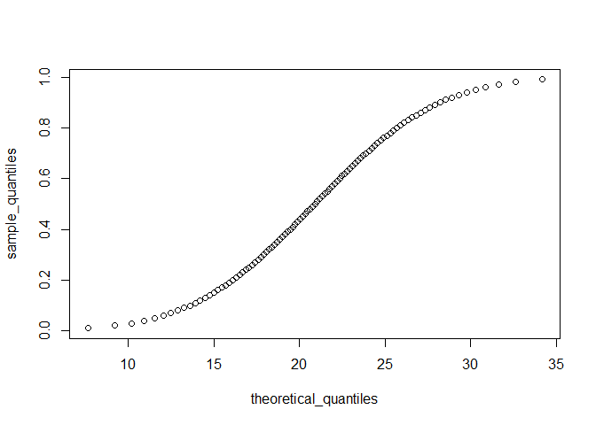

------------------------------------------------------------------------

title: “Data Analytics in R - Assignment 1” author: “Don Smith” output:
github_document

------------------------------------------------------------------------

# Part 1: Questions 1 and 2: ACT scores

#### The ACT is a standardized college admissions test used in the United States. The four multi-part questions in this assessment all involve simulating some ACT test scores and answering probability questions about them.

#### For the three year period 2016-2018, ACT standardized test scores were approximately normally distributed with a mean of 20.9 and standard deviation of 5.7. (Real ACT scores are integers between 1 and 36, but we will ignore this detail and use continuous values instead.)

#### First we’ll simulate an ACT test score dataset and answer some questions about it.

#### Set the seed to 16, then use rnorm() to generate a normal distribution of 10000 tests with a mean of 20.9 and standard deviation of 5.7. Save these values as act_scores. You’ll be using this dataset throughout these four multi-part questions.

``` r
set.seed(16)
act_scores <- rnorm(10000, 20.9, 5.7)
```

## Question 1a

#### What is the mean of act_scores?

``` r
mean(act_scores)
```

    ## [1] 20.84012

## Question 1b

#### What is the standard deviation of act_scores?

``` r
sd(act_scores)
```

    ## [1] 5.675237

## Question 1c

#### A perfect score is 36 or greater (the maximum reported score is 36).

#### In act_scores, how many perfect scores are there out of 10,000 simulated tests?

``` r
length(act_scores[act_scores >= 36])
```

    ## [1] 41

## Question 1d

#### In act_scores, what is the probability of an ACT score greater than 30?

``` r
sum(act_scores > 30)/length(act_scores)
```

    ## [1] 0.0527

## Question 1e

#### In act_scores, what is the probability of an ACT score less than or equal to 10?

``` r
mean(act_scores <= 10)
```

    ## [1] 0.0282

## Question 2

#### Set x equal to the sequence of integers 1 to 36. Use dnorm to determine the value of the probability density function over x given a mean of 20.9 and standard deviation of 5.7; save the result as f_x. Plot x against f_x.

``` r
x = seq(1:36)

f_x <- dnorm(x, 20.9, 5.7)
plot (x, f_x)
```

<!-- -->

# Part 2: Questions 3 and 4: ACT scores

#### In this 3-part question, you will convert raw ACT scores to Z-scores and answer some questions about them.

#### Convert act_scores to Z-scores. Recall from Data Visualization (the second course in this series) that to standardize values (convert values into Z-scores, that is, values distributed with a mean of 0 and standard deviation of 1), you must subtract the mean and then divide by the standard deviation. Use the mean and standard deviation of act_scores, not the original values used to generate random test scores.

``` r
z_scores <- (act_scores-mean(act_scores))/sd(act_scores)
mean(z_scores > 2)
```

    ## [1] 0.0233

## Question 3b

#### What ACT score value corresponds to 2 standard deviations above the mean (Z = 2)?

``` r
mean(act_scores) + (2*sd(act_scores))
```

    ## [1] 32.1906

## Question 3c

#### A Z-score of 2 corresponds roughly to the 97.5th percentile.

#### Use qnorm() to determine the 97.5th percentile of normally distributed data with the mean and standard deviation observed in act_scores.

#### What is the 97.5th percentile of act_scores?

``` r
qnorm(.975, mean(act_scores), sd(act_scores))
```

    ## [1] 31.96338

#### In this 4-part question, you will write a function to create a CDF for ACT scores.

## Question 4a

#### What is the minimum integer score such that the probability of that score or lower is at least .95? Write a function that takes a value and produces the probability of an ACT score less than or equal to that value (the CDF). Apply this function to the range 1 to 36.

``` r
cdf <- sapply(1:36, function (x){
  mean(act_scores <= x)
})
min(which(cdf >= .95))
```

    ## [1] 31

## Question 4b

#### Use qnorm() to determine the expected 95th percentile, the value for which the probability of receiving that score or lower is 0.95, given a mean score of 20.9 and standard deviation of 5.7.

#### What is the expected 95th percentile of ACT scores?

``` r
qnorm(0.95, 20.9, 5.7)
```

    ## [1] 30.27567

## Question 4c

#### We can use quantile() to determine sample quantiles from the data.

#### Make a vector containing the quantiles for p \<- seq(0.01, 0.99, 0.01), the 1st through 99th percentiles of the act_scores data. Save these as sample_quantiles.

#### In what percentile is a score of 26?

#### (Your answer should be an integer (i.e. 60), not a percent or fraction. Note that a score between the 98th and 99th percentile should be considered the 98th percentile, for example, and that quantile numbers are used as names for the vector sample_quantiles.)

``` r
sample_quantiles <- seq(0.01, 0.99, 0.01)
quantile(act_scores, sample_quantiles)
```

    ##        1%        2%        3%        4%        5%        6%        7%        8% 
    ##  7.605486  9.082775 10.144680 10.939440 11.484863 11.946022 12.433043 12.888911 
    ##        9%       10%       11%       12%       13%       14%       15%       16% 
    ## 13.287754 13.604941 13.895066 14.198617 14.466640 14.713599 14.982739 15.249470 
    ##       17%       18%       19%       20%       21%       22%       23%       24% 
    ## 15.478532 15.729987 15.941210 16.121997 16.320999 16.524470 16.675801 16.892451 
    ##       25%       26%       27%       28%       29%       30%       31%       32% 
    ## 17.075199 17.243622 17.408227 17.601734 17.766148 17.927655 18.072476 18.229732 
    ##       33%       34%       35%       36%       37%       38%       39%       40% 
    ## 18.349311 18.528077 18.675421 18.804975 18.946037 19.096910 19.253351 19.383482 
    ##       41%       42%       43%       44%       45%       46%       47%       48% 
    ## 19.530808 19.664857 19.798331 19.948629 20.092783 20.243253 20.372475 20.512308 
    ##       49%       50%       51%       52%       53%       54%       55%       56% 
    ## 20.660699 20.799459 20.927337 21.081092 21.234593 21.384291 21.538140 21.662325 
    ##       57%       58%       59%       60%       61%       62%       63%       64% 
    ## 21.828803 21.997679 22.134444 22.276074 22.432175 22.563421 22.713592 22.854859 
    ##       65%       66%       67%       68%       69%       70%       71%       72% 
    ## 23.004697 23.162456 23.328438 23.499639 23.664398 23.812226 23.984391 24.109988 
    ##       73%       74%       75%       76%       77%       78%       79%       80% 
    ## 24.297049 24.481218 24.684994 24.890737 25.060321 25.235280 25.415344 25.600346 
    ##       81%       82%       83%       84%       85%       86%       87%       88% 
    ## 25.808931 25.992660 26.210946 26.422927 26.696414 26.931452 27.237508 27.503935 
    ##       89%       90%       91%       92%       93%       94%       95%       96% 
    ## 27.814940 28.102339 28.431910 28.866617 29.221679 29.608051 30.179905 30.683910 
    ##       97%       98%       99% 
    ## 31.429286 32.561884 34.006562

## Question 4d

#### Make a corresponding set of theoretical quantiles using qnorm() over the interval p \<- seq(0.01, 0.99, 0.01) with mean 20.9 and standard deviation 5.7. Save these as theoretical_quantiles. Make a QQ-plot graphing sample_quantiles on the y-axis versus theoretical_quantiles on the x-axis.

``` r
theoretical_quantiles <- qnorm(sample_quantiles, 20.9, 5.7)
qqplot(y=sample_quantiles, x=theoretical_quantiles)
```

<!-- -->
