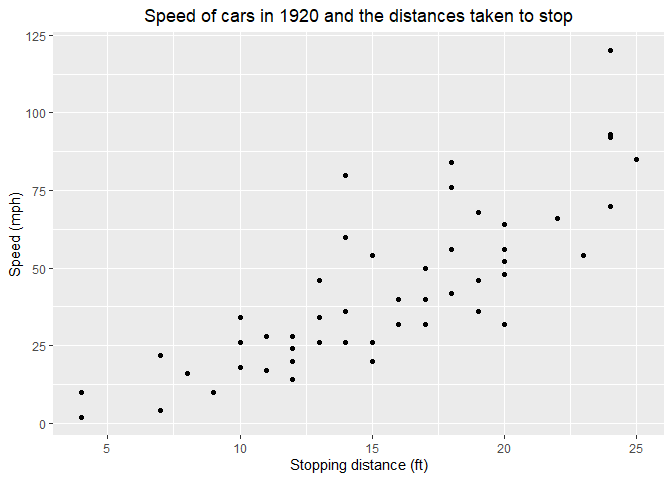
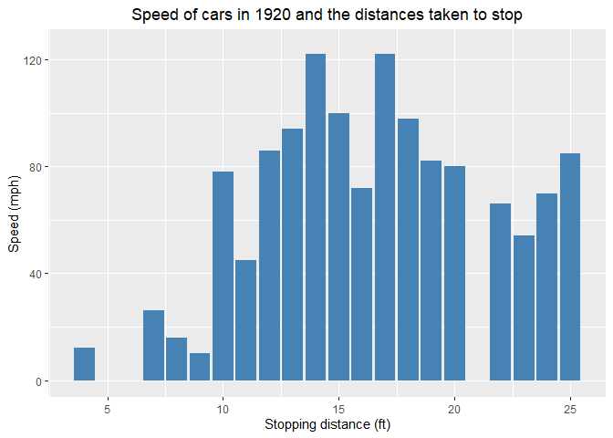
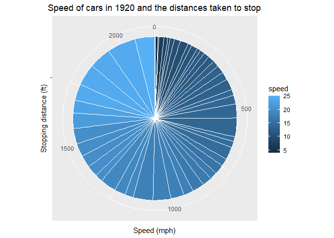

------------------------------------------------------------------------

title: “Data Analytics in R - Assignment 10” author: “Don Smith” output:
github_document

------------------------------------------------------------------------

### Question 1: Read in the cars dataset, which is included in base R. Include any packages you need to do your analysis.

``` r
data(cars)
```

### Question 2: Review the first 6 rows of the dataset.

``` r
head(cars)
```

    ##   speed dist
    ## 1     4    2
    ## 2     4   10
    ## 3     7    4
    ## 4     7   22
    ## 5     8   16
    ## 6     9   10

### Question 3: Use the str() function to review the data.

``` r
str(cars)
```

    ## 'data.frame':    50 obs. of  2 variables:
    ##  $ speed: num  4 4 7 7 8 9 10 10 10 11 ...
    ##  $ dist : num  2 10 4 22 16 10 18 26 34 17 ...

### Question 4: Plot the data distribution using ggplot2 and geom_point().

``` r
# Libraries
library(ggplot2)
library(hrbrthemes)
```

    ## NOTE: Either Arial Narrow or Roboto Condensed fonts are required to use these themes.

    ##       Please use hrbrthemes::import_roboto_condensed() to install Roboto Condensed and

    ##       if Arial Narrow is not on your system, please see https://bit.ly/arialnarrow

``` r
# Line graph
ggplot(cars, aes(x=speed, y=dist)) +
    geom_point() + ggtitle("Speed of cars in 1920 and the distances taken to stop")+labs(y="Speed (mph)", x = "Stopping distance (ft)") + theme(plot.title = element_text(hjust = 0.5)) 
```

<!-- -->

### Question 5: Plot a bar graph using the data.

``` r
# Bar graph
ggplot(cars, aes(x=speed, y=dist)) + geom_bar(stat="identity", fill="steelblue") + ggtitle("Speed of cars in 1920 and the distances taken to stop")+labs(y="Speed (mph)", x = "Stopping distance (ft)") + theme(plot.title = element_text(hjust = 0.5)) +   ylim(0, 125) 
```

    ## Warning: Removed 11 rows containing missing values (`geom_bar()`).

<!-- -->

### Question 6: Plot a pie graph using the data.

``` r
# Pie graph
ggplot(cars, aes(x="", y=dist, fill=speed)) + geom_bar(width = 1, stat = "identity", color = "white") + coord_polar("y", start=0) + ggtitle("Speed of cars in 1920 and the distances taken to stop")+ labs(y="Speed (mph)", x = "Stopping distance (ft)") + theme(plot.title = element_text(hjust = 0.5))
```

<!-- -->
