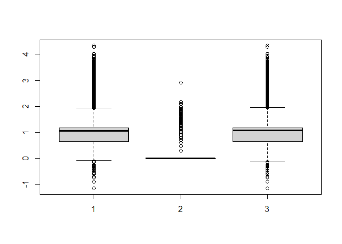

------------------------------------------------------------------------

title: “Data Analytics in R - Assignment 11” author: “Don Smith” output:
github_document

------------------------------------------------------------------------

### Question 1: Read in the ities.csv datafile as a dataframe object, df.

``` r
# Reading in the ities.csv data file

df <- read.csv("C:\\Users\\Owner\\Documents\\GitHub\\r\\class assignments\\Data Analytics in R\\Assignment 11\\data\\ities.csv")
```

### Question 2: Display the number of rows and columns in the dataset using an appropriate R function. Below the output, identify which numbers from the output correspond to the number of rows and columns.

``` r
head(df) # Prints the the first 6 rows of all columns in the dataset   
```

    ##        Date OperationType    CashierName                    LineItem Department
    ## 1 7/18/2016          SALE Wallace Kuiper Salmon and Wheat Bran Salad    Entrees
    ## 2 7/18/2016          SALE Wallace Kuiper              Fountain Drink   Beverage
    ## 3 7/18/2016          SALE Wallace Kuiper       Beef and Squash Kabob     Kabobs
    ## 4 7/18/2016          SALE Wallace Kuiper Salmon and Wheat Bran Salad      Salad
    ## 5 7/18/2016          SALE Wallace Kuiper Salmon and Wheat Bran Salad      Salad
    ## 6 7/18/2016          SALE Wallace Kuiper  Beef and Broccoli Stir Fry    general
    ##                      Category RegisterName StoreNumber TransactionNumber
    ## 1 Salmon and Wheat Bran Salad        RT149  AZ23501305     002XIIC146121
    ## 2                    Fountain        RT149  AZ23501289     002XIIC146121
    ## 3                        Beef        RT149  AZ23501367     00PG9FL135736
    ## 4                     general        RT149  AZ23501633      00Z3B4R37335
    ## 5                     general        RT149  AZ23501633      00Z3B4R37335
    ## 6                     general        RT149  AZ23501640      006LUOW47310
    ##   CustomerCode Price Quantity TotalDue
    ## 1  CWM11331L8O 66.22        1    66.22
    ## 2  CWM11331L8O  2.88        1     2.88
    ## 3  CWM11331L8O 12.02        2    24.04
    ## 4  CWM11331L8O 18.43        1    18.43
    ## 5  CWM11331L8O 18.43        1    18.43
    ## 6  CWM11331L8O 15.04        1    15.04

``` r
dim(df) # Prints out the number of rows (observations) and columns (variables)
```

    ## [1] 438151     13

##### This dataframe has 438,151 rows and 13 columns.

### Question 3: Display the structure of the dataframe, df. Below the output, briefly summarize one or two main points about the dataframe structure.

``` r
summary(df)     # Prints a summary of all columns in the dataset
```

    ##      Date           OperationType      CashierName          LineItem        
    ##  Length:438151      Length:438151      Length:438151      Length:438151     
    ##  Class :character   Class :character   Class :character   Class :character  
    ##  Mode  :character   Mode  :character   Mode  :character   Mode  :character  
    ##                                                                             
    ##                                                                             
    ##                                                                             
    ##                                                                             
    ##   Department          Category         RegisterName       StoreNumber       
    ##  Length:438151      Length:438151      Length:438151      Length:438151     
    ##  Class :character   Class :character   Class :character   Class :character  
    ##  Mode  :character   Mode  :character   Mode  :character   Mode  :character  
    ##                                                                             
    ##                                                                             
    ##                                                                             
    ##                                                                             
    ##  TransactionNumber  CustomerCode           Price             Quantity      
    ##  Length:438151      Length:438151      Min.   :-5740.51   Min.   :  1.000  
    ##  Class :character   Class :character   1st Qu.:    4.50   1st Qu.:  1.000  
    ##  Mode  :character   Mode  :character   Median :   11.29   Median :  1.000  
    ##                                        Mean   :   14.36   Mean   :  1.177  
    ##                                        3rd Qu.:   14.68   3rd Qu.:  1.000  
    ##                                        Max.   :21449.97   Max.   :815.000  
    ##                                        NA's   :12                          
    ##     TotalDue       
    ##  Min.   :-5740.51  
    ##  1st Qu.:    4.50  
    ##  Median :   11.80  
    ##  Mean   :   15.26  
    ##  3rd Qu.:   15.04  
    ##  Max.   :21449.97  
    ##  NA's   :12

##### 10 of the columns consist of observations of characters, while the 3 remaining columns contain observations of numerics. The summary stats of Price and TotalDue look very similar to one another, with several variables being identical to one another.

### Question 4: What is the unit of observation in the dataset? Display at least one calculation in the code chunk below. Below the calculation(s), briefly explain how the output of your calculation(s) supports your conclusion.

``` r
# Counting the number os unique observation in each column
repr <- data.frame(df$Date, df$OperationType, df$CashierName, df$LineItem, df$Department, df$Category, df$RegisterName, df$StoreNumber, df$TransactionNumber, df$CustomerCode, df$Price, df$Quantity, df$TotalDue)
for (x in repr) {
  print(length(unique(x)))
  
}
```

    ## [1] 1021
    ## [1] 2
    ## [1] 56
    ## [1] 68
    ## [1] 9
    ## [1] 21
    ## [1] 12
    ## [1] 70
    ## [1] 161058
    ## [1] 9110
    ## [1] 4481
    ## [1] 60
    ## [1] 4865

##### The variables you select as the units of operation depend entirely on what you intend to use the data given the business problem. However, we can discuss general ways to determine which variables are best suited to be units of operation.

##### After reviewing the data set, I was able to determine the number of unique entries in the dataset. It makes sense that transaction number has the highest number of unique entries since every time a customer makes a purchase it creates a unique and separate transaction. Customer code is high as well, but not as high as transaction number. This makes sense given that it’s lower than transaction number, since each customer (who is associated with a corresponding customer code) can make multiple separate transactions. Because of the high number of unique observations, these variables would not be useful for aggregating observations in the data or otherwise determining the relationship between other variables in the dataset.

##### Therefore, both variables are a good example why having a variable with a high number of observations marks a variable as a poor contender for being the unit of observation. Similarly, having a very low number of unique entries (for example, operation type) also disqualifies a variable.

##### The unit of operation therefore must have a relatively small number of unique elements, but not so small as to make the variable meaningless in its ubiquity.

##### Consequently, I argue that the following variables are good general contenders for units of operation:

##### - LineItem: 68

##### - Department: 9

##### - Category: 21

##### - StoreNumber: 70

##### - CashierName: 56

``` r
# Dataframe of units of operation
df2 <- df[,c('LineItem',
'Department',
'Category',
'StoreNumber',
'CashierName')]

head(df2)
```

    ##                      LineItem Department                    Category
    ## 1 Salmon and Wheat Bran Salad    Entrees Salmon and Wheat Bran Salad
    ## 2              Fountain Drink   Beverage                    Fountain
    ## 3       Beef and Squash Kabob     Kabobs                        Beef
    ## 4 Salmon and Wheat Bran Salad      Salad                     general
    ## 5 Salmon and Wheat Bran Salad      Salad                     general
    ## 6  Beef and Broccoli Stir Fry    general                     general
    ##   StoreNumber    CashierName
    ## 1  AZ23501305 Wallace Kuiper
    ## 2  AZ23501289 Wallace Kuiper
    ## 3  AZ23501367 Wallace Kuiper
    ## 4  AZ23501633 Wallace Kuiper
    ## 5  AZ23501633 Wallace Kuiper
    ## 6  AZ23501640 Wallace Kuiper

### Question 5: If we were to consider each transaction as the unit of observation, comment on whether the provided data is in a tidy format. (No code is needed)

#### The data would not be tidy, as one of the first rules for a tidy dataset is “Column headers are variable names, not values.” If the data were organized in this way, we would have to pivot the non-variable columns into a single column, essentially converting each column entry into a row entry.

### Question 6: Display the summaries of the Price, Quantity and TotalDue columns. Below the output, provide a brief interpretation of the output.

``` r
# Dataframe of units of operation
df3 <- df[,c('Price', 'TotalDue', 'Quantity')]

head(df3)
```

    ##   Price TotalDue Quantity
    ## 1 66.22    66.22        1
    ## 2  2.88     2.88        1
    ## 3 12.02    24.04        2
    ## 4 18.43    18.43        1
    ## 5 18.43    18.43        1
    ## 6 15.04    15.04        1

``` r
summary(data.frame(df3$Price, df3$Quantity, df3$TotalDue)) #Printing the min, max, 1st and 3rd quartile, median, mean and missing values for the three columns
```

    ##    df3.Price         df3.Quantity      df3.TotalDue     
    ##  Min.   :-5740.51   Min.   :  1.000   Min.   :-5740.51  
    ##  1st Qu.:    4.50   1st Qu.:  1.000   1st Qu.:    4.50  
    ##  Median :   11.29   Median :  1.000   Median :   11.80  
    ##  Mean   :   14.36   Mean   :  1.177   Mean   :   15.26  
    ##  3rd Qu.:   14.68   3rd Qu.:  1.000   3rd Qu.:   15.04  
    ##  Max.   :21449.97   Max.   :815.000   Max.   :21449.97  
    ##  NA's   :12                           NA's   :12

##### Price and TotalDue have identical values for min, max and 1st quartile. They also have the exact same amount of NAs. Price and TotalDue are highly correlated since they both deal with similar (financial) components of a transaction. The mean and median for both variables is skewed to the right, signifying that the max value is pulling both variable’s mean value higher. It could also signify that there are a greater proportion of high values in these two columns which is pulling the mean value up. For Quantity, the min, 1st and 3rd quartile and the mean are either 1 or very close to 1. (The mean is likely pulled closed to 1.2 due to the max amount of 815). This shows that most transactions are single item purchases by customers, which is not good for a grocery store.

### Question 7: Display the boxplots of the log values for the Price, Quantity and Total Due columns. Below the output, provide a brief interpretation of the output.

``` r
#Printing boxplot of Price, Quantity and TotalDue columns, using log10 to compress the data by contouring the variables between 1 and 3 on the x-axis, and -1 and 4 on the y-axis.

boxplot(c(log10(df3$Price)), (log10(df3$Quantity)), (log10(df3$TotalDue))) 
```

    ## Warning in boxplot(c(log10(df3$Price)), (log10(df3$Quantity)),
    ## (log10(df3$TotalDue))): NaNs produced

    ## Warning in boxplot.default(c(log10(df3$Price)), (log10(df3$Quantity)),
    ## (log10(df3$TotalDue))): NaNs produced

<!-- -->

##### The interquartile range and median are almost identical for the Price and TotalDue variables, showing the data disbursal is very similar. As stated previously, these two variables are therefore highly correlated with one another. Many of the observations for these two variables appear to be outside the third quartile, and can thus be considered outliers. The interquartile range for Quantity is non-existent, which makes sense given its 1st and 3rd quartiles both equal 1 (Interquartile range: 1-1=0).
