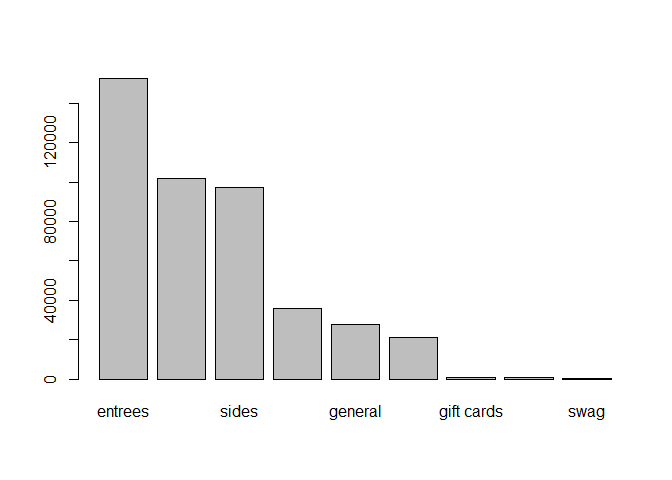

------------------------------------------------------------------------

title: “Data Analytics in R - Assignment 12” author: “Don Smith” output:
github_document

------------------------------------------------------------------------

### Question 1: Read in the ities.csv datafile as a dataframe object, df.

``` r
# Reading in the ities.csv data file

df <- read.csv("C:\\Users\\Owner\\Documents\\GitHub\\r\\class assignments\\Data Analytics in R\\Assignment 12\\data\\ities.csv")
```

### Question 2: Display the number of rows and columns in the dataset using an appropriate R function. Below the output, identify which numbers from the output correspond to the number of rows and columns.

``` r
head(df) # Prints the the first 6 rows of all columns in the dataset   
```

    ##        Date OperationType    CashierName                    LineItem Department
    ## 1 7/18/2016          SALE Wallace Kuiper Salmon and Wheat Bran Salad    Entrees
    ## 2 7/18/2016          SALE Wallace Kuiper              Fountain Drink   Beverage
    ## 3 7/18/2016          SALE Wallace Kuiper       Beef and Squash Kabob     Kabobs
    ## 4 7/18/2016          SALE Wallace Kuiper Salmon and Wheat Bran Salad      Salad
    ## 5 7/18/2016          SALE Wallace Kuiper Salmon and Wheat Bran Salad      Salad
    ## 6 7/18/2016          SALE Wallace Kuiper  Beef and Broccoli Stir Fry    general
    ##                      Category RegisterName StoreNumber TransactionNumber
    ## 1 Salmon and Wheat Bran Salad        RT149  AZ23501305     002XIIC146121
    ## 2                    Fountain        RT149  AZ23501289     002XIIC146121
    ## 3                        Beef        RT149  AZ23501367     00PG9FL135736
    ## 4                     general        RT149  AZ23501633      00Z3B4R37335
    ## 5                     general        RT149  AZ23501633      00Z3B4R37335
    ## 6                     general        RT149  AZ23501640      006LUOW47310
    ##   CustomerCode Price Quantity TotalDue
    ## 1  CWM11331L8O 66.22        1    66.22
    ## 2  CWM11331L8O  2.88        1     2.88
    ## 3  CWM11331L8O 12.02        2    24.04
    ## 4  CWM11331L8O 18.43        1    18.43
    ## 5  CWM11331L8O 18.43        1    18.43
    ## 6  CWM11331L8O 15.04        1    15.04

``` r
# Prints out the number of rows (observations) and columns (variables)
paste0('The number of rows in this data set is ', nrow(df))
```

    ## [1] "The number of rows in this data set is 438151"

``` r
paste0('The number of columns in this data set is ', ncol(df))
```

    ## [1] "The number of columns in this data set is 13"

### Question 3: Display the structure of the dataframe, df. Below the output, briefly summarize one or two main points about the dataframe structure.

``` r
str(df)     # Prints structure of dataset
```

    ## 'data.frame':    438151 obs. of  13 variables:
    ##  $ Date             : chr  "7/18/2016" "7/18/2016" "7/18/2016" "7/18/2016" ...
    ##  $ OperationType    : chr  "SALE" "SALE" "SALE" "SALE" ...
    ##  $ CashierName      : chr  "Wallace Kuiper" "Wallace Kuiper" "Wallace Kuiper" "Wallace Kuiper" ...
    ##  $ LineItem         : chr  "Salmon and Wheat Bran Salad" "Fountain Drink" "Beef and Squash Kabob" "Salmon and Wheat Bran Salad" ...
    ##  $ Department       : chr  "Entrees" "Beverage" "Kabobs" "Salad" ...
    ##  $ Category         : chr  "Salmon and Wheat Bran Salad" "Fountain" "Beef" "general" ...
    ##  $ RegisterName     : chr  "RT149" "RT149" "RT149" "RT149" ...
    ##  $ StoreNumber      : chr  "AZ23501305" "AZ23501289" "AZ23501367" "AZ23501633" ...
    ##  $ TransactionNumber: chr  "002XIIC146121" "002XIIC146121" "00PG9FL135736" "00Z3B4R37335" ...
    ##  $ CustomerCode     : chr  "CWM11331L8O" "CWM11331L8O" "CWM11331L8O" "CWM11331L8O" ...
    ##  $ Price            : num  66.22 2.88 12.02 18.43 18.43 ...
    ##  $ Quantity         : int  1 1 2 1 1 1 1 1 1 1 ...
    ##  $ TotalDue         : num  66.22 2.88 24.04 18.43 18.43 ...

##### The majority of columns are chars, with only 3 columns being either numerics (2) or integers (1). The date column interestingly consists of chars and not a date/time data type. It makes sense most of the columns are chars as many consist of either names of people or items, or various tracking numbers consisting of numbers and letters–entries which have a mix of chars and numerics logically must default to chars, whether this mix is located in separate entries in a data frame/vector/list or in a single entry.

### Question 4: Display a summary of the columns in df. Below the output, comment on columns for which the data type does not seem correct, the format to which they should be changed, and why that change would be helpful.

``` r
summary(df)     # Prints a summary of all columns in the dataset
```

    ##      Date           OperationType      CashierName          LineItem        
    ##  Length:438151      Length:438151      Length:438151      Length:438151     
    ##  Class :character   Class :character   Class :character   Class :character  
    ##  Mode  :character   Mode  :character   Mode  :character   Mode  :character  
    ##                                                                             
    ##                                                                             
    ##                                                                             
    ##                                                                             
    ##   Department          Category         RegisterName       StoreNumber       
    ##  Length:438151      Length:438151      Length:438151      Length:438151     
    ##  Class :character   Class :character   Class :character   Class :character  
    ##  Mode  :character   Mode  :character   Mode  :character   Mode  :character  
    ##                                                                             
    ##                                                                             
    ##                                                                             
    ##                                                                             
    ##  TransactionNumber  CustomerCode           Price             Quantity      
    ##  Length:438151      Length:438151      Min.   :-5740.51   Min.   :  1.000  
    ##  Class :character   Class :character   1st Qu.:    4.50   1st Qu.:  1.000  
    ##  Mode  :character   Mode  :character   Median :   11.29   Median :  1.000  
    ##                                        Mean   :   14.36   Mean   :  1.177  
    ##                                        3rd Qu.:   14.68   3rd Qu.:  1.000  
    ##                                        Max.   :21449.97   Max.   :815.000  
    ##                                        NA's   :12                          
    ##     TotalDue       
    ##  Min.   :-5740.51  
    ##  1st Qu.:    4.50  
    ##  Median :   11.80  
    ##  Mean   :   15.26  
    ##  3rd Qu.:   15.04  
    ##  Max.   :21449.97  
    ##  NA's   :12

##### The Date column could be a date data type like POSIXlt instead of a char. RegisterName, StoreNumber, TransactionNumber and CustomerCode could be converted to factors instead of chars so that we can run calcualtions on and graph/aggregate the entires.

### Question 5: Convert the values in Department and LineItem columns to lower cases and save them as Department_lower and LineItem_lower.

``` r
# Installed stringr package to convert necessary columns into all lowercase letters.
library(stringr)

df$Department_lower <- str_to_lower(df$Department)
df$LineItem_lower <- str_to_lower(df$LineItem)

head(df) # To confirm new columns have been added to data set
```

    ##        Date OperationType    CashierName                    LineItem Department
    ## 1 7/18/2016          SALE Wallace Kuiper Salmon and Wheat Bran Salad    Entrees
    ## 2 7/18/2016          SALE Wallace Kuiper              Fountain Drink   Beverage
    ## 3 7/18/2016          SALE Wallace Kuiper       Beef and Squash Kabob     Kabobs
    ## 4 7/18/2016          SALE Wallace Kuiper Salmon and Wheat Bran Salad      Salad
    ## 5 7/18/2016          SALE Wallace Kuiper Salmon and Wheat Bran Salad      Salad
    ## 6 7/18/2016          SALE Wallace Kuiper  Beef and Broccoli Stir Fry    general
    ##                      Category RegisterName StoreNumber TransactionNumber
    ## 1 Salmon and Wheat Bran Salad        RT149  AZ23501305     002XIIC146121
    ## 2                    Fountain        RT149  AZ23501289     002XIIC146121
    ## 3                        Beef        RT149  AZ23501367     00PG9FL135736
    ## 4                     general        RT149  AZ23501633      00Z3B4R37335
    ## 5                     general        RT149  AZ23501633      00Z3B4R37335
    ## 6                     general        RT149  AZ23501640      006LUOW47310
    ##   CustomerCode Price Quantity TotalDue Department_lower
    ## 1  CWM11331L8O 66.22        1    66.22          entrees
    ## 2  CWM11331L8O  2.88        1     2.88         beverage
    ## 3  CWM11331L8O 12.02        2    24.04           kabobs
    ## 4  CWM11331L8O 18.43        1    18.43            salad
    ## 5  CWM11331L8O 18.43        1    18.43            salad
    ## 6  CWM11331L8O 15.04        1    15.04          general
    ##                LineItem_lower
    ## 1 salmon and wheat bran salad
    ## 2              fountain drink
    ## 3       beef and squash kabob
    ## 4 salmon and wheat bran salad
    ## 5 salmon and wheat bran salad
    ## 6  beef and broccoli stir fry

### Question 6: Use the plot function on Department_lower. You will get an error. Below the output, describe the reason for the error. After running the code chunk to see the error, comment out the code chunk so that you can knit the document to a .html file.

``` r
# Plotted the Department_lower column. It throws an error because the observations in the data set are chars and not factors. 

# plot(df$Department)
```

##### R cannot plot strings (chars) as they do not have a numerical quality that would allow the computer to process, organize and plot them on a graph. The strings would first have to be converted to factors, a process whereby the string is assigned a numerical value “under the hood”, where the original string value is still visible for human consumption. A good example of this would be the categorical data, e.g. male and female. If these two values were to be converted to factors, more than likely one would be assigned a value of 1, and the other 2, which would allow us to run caluclations, aggregate data, run summary statistics, etc.

### Question 7: Convert the datatype of Department_lower to a factor type (do not create new column, just convert it in place).

``` r
# Converted this column to a factor

df$Department_lower <- as.factor(df$Department_lower)

str(df$Department_lower) # To confirm all rows in column have been converted to factor data type
```

    ##  Factor w/ 9 levels "beverage","catering",..: 3 1 6 7 7 4 6 3 3 1 ...

### Question 8: Use the plot function on the Department_lower column to display a plot of that column from most frequent on the left to least frequent on the right. Below the output, comment on the department that occurs most frequently, as well as the one that occurs least frequently.

``` r
# Installed forcats package to order data by frequency before plotting.

library(forcats)
ss <- forcats::fct_infreq(df$Department_lower)
plot(ss)
```

<!-- -->

##### From the graph, we can see that entrees show up the most while swag shows up the least.
