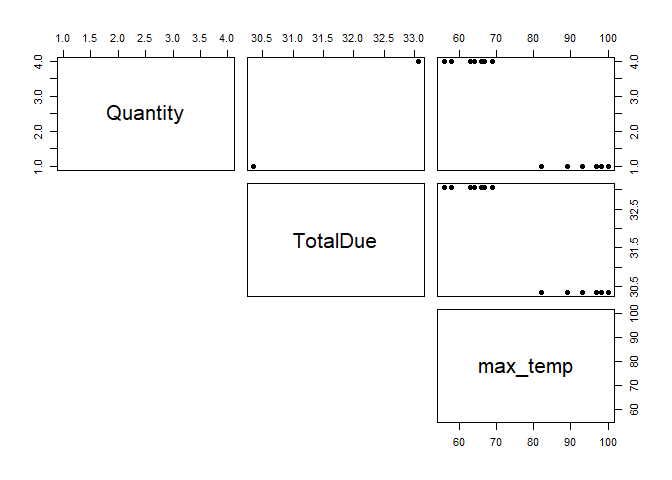

------------------------------------------------------------------------

title: “Data Analytics in R - Assignment 13” author: “Don Smith” output:
github_document

------------------------------------------------------------------------

### Question 1: Read in the ities.csv and max_temp.csv as dataframe objects df and df_weather_weekly, respectively.

``` r
# Reading in the ities.csv and max_temp.csv data file

df <- read.csv("C:\\Users\\Owner\\Documents\\GitHub\\r\\class assignments\\Data Analytics in R\\Assignment 13\\data\\ities.csv")

df_weather_weekly <- read.csv("C:\\Users\\Owner\\Documents\\GitHub\\r\\class assignments\\Data Analytics in R\\Assignment 13\\data\\max_temp.csv")
```

### Question 2: Display the number of rows and columns in df and df_weather_weekly, respectively, using an appropriate R function.

``` r
head(df) # Prints the the first 6 rows of all columns in the dataset   
```

    ##        Date OperationType    CashierName                    LineItem Department
    ## 1 7/18/2016          SALE Wallace Kuiper Salmon and Wheat Bran Salad    Entrees
    ## 2 7/18/2016          SALE Wallace Kuiper              Fountain Drink   Beverage
    ## 3 7/18/2016          SALE Wallace Kuiper       Beef and Squash Kabob     Kabobs
    ## 4 7/18/2016          SALE Wallace Kuiper Salmon and Wheat Bran Salad      Salad
    ## 5 7/18/2016          SALE Wallace Kuiper Salmon and Wheat Bran Salad      Salad
    ## 6 7/18/2016          SALE Wallace Kuiper  Beef and Broccoli Stir Fry    general
    ##                      Category RegisterName StoreNumber TransactionNumber
    ## 1 Salmon and Wheat Bran Salad        RT149  AZ23501305     002XIIC146121
    ## 2                    Fountain        RT149  AZ23501289     002XIIC146121
    ## 3                        Beef        RT149  AZ23501367     00PG9FL135736
    ## 4                     general        RT149  AZ23501633      00Z3B4R37335
    ## 5                     general        RT149  AZ23501633      00Z3B4R37335
    ## 6                     general        RT149  AZ23501640      006LUOW47310
    ##   CustomerCode Price Quantity TotalDue
    ## 1  CWM11331L8O 66.22        1    66.22
    ## 2  CWM11331L8O  2.88        1     2.88
    ## 3  CWM11331L8O 12.02        2    24.04
    ## 4  CWM11331L8O 18.43        1    18.43
    ## 5  CWM11331L8O 18.43        1    18.43
    ## 6  CWM11331L8O 15.04        1    15.04

``` r
head(df_weather_weekly) # Prints the the first 6 rows of all columns in the dataset  
```

    ##   Week Monday Tuesday Wednesday Thursday Friday Saturday Sunday WeekStarting
    ## 1    1  46.94   44.96     41.00    44.96  59.00    57.02  57.02     1/3/2016
    ## 2    2  48.92   46.04     46.04    46.94  51.08    42.08  48.92    1/10/2016
    ## 3    3  48.02   51.98     53.06    55.04  50.00    51.08  50.00    1/17/2016
    ## 4    4  33.98   41.00     51.08    46.94  55.94    51.08  35.96    1/24/2016
    ## 5    5  51.08   60.08     57.92    51.08  41.00    48.02  51.98    1/31/2016
    ## 6    6  55.94   51.98     53.96    59.00  53.96    57.92  55.04     2/7/2016

``` r
# Prints out the number of rows (observations) and columns (variables)
paste0('The number of rows in df is ', nrow(df))
```

    ## [1] "The number of rows in df is 438151"

``` r
paste0('The number of columns in df is ', ncol(df))
```

    ## [1] "The number of columns in df is 13"

``` r
paste0('The number of rows in df_weather_weekly is ', nrow(df_weather_weekly))
```

    ## [1] "The number of rows in df_weather_weekly is 52"

``` r
paste0('The number of columns in df_weather_weekly is ', ncol(df_weather_weekly))
```

    ## [1] "The number of columns in df_weather_weekly is 9"

### Question 3: Display the structures of the dataframes, df and df_weather_weekly. Below the output, comment on the appropriateness of the datatypes for the columns.

``` r
str(df)     # Prints structure of dataset
```

    ## 'data.frame':    438151 obs. of  13 variables:
    ##  $ Date             : chr  "7/18/2016" "7/18/2016" "7/18/2016" "7/18/2016" ...
    ##  $ OperationType    : chr  "SALE" "SALE" "SALE" "SALE" ...
    ##  $ CashierName      : chr  "Wallace Kuiper" "Wallace Kuiper" "Wallace Kuiper" "Wallace Kuiper" ...
    ##  $ LineItem         : chr  "Salmon and Wheat Bran Salad" "Fountain Drink" "Beef and Squash Kabob" "Salmon and Wheat Bran Salad" ...
    ##  $ Department       : chr  "Entrees" "Beverage" "Kabobs" "Salad" ...
    ##  $ Category         : chr  "Salmon and Wheat Bran Salad" "Fountain" "Beef" "general" ...
    ##  $ RegisterName     : chr  "RT149" "RT149" "RT149" "RT149" ...
    ##  $ StoreNumber      : chr  "AZ23501305" "AZ23501289" "AZ23501367" "AZ23501633" ...
    ##  $ TransactionNumber: chr  "002XIIC146121" "002XIIC146121" "00PG9FL135736" "00Z3B4R37335" ...
    ##  $ CustomerCode     : chr  "CWM11331L8O" "CWM11331L8O" "CWM11331L8O" "CWM11331L8O" ...
    ##  $ Price            : num  66.22 2.88 12.02 18.43 18.43 ...
    ##  $ Quantity         : int  1 1 2 1 1 1 1 1 1 1 ...
    ##  $ TotalDue         : num  66.22 2.88 24.04 18.43 18.43 ...

``` r
str(df_weather_weekly)     # Prints structure of dataset
```

    ## 'data.frame':    52 obs. of  9 variables:
    ##  $ Week        : int  1 2 3 4 5 6 7 8 9 10 ...
    ##  $ Monday      : num  46.9 48.9 48 34 51.1 ...
    ##  $ Tuesday     : num  45 46 52 41 60.1 ...
    ##  $ Wednesday   : num  41 46 53.1 51.1 57.9 ...
    ##  $ Thursday    : num  45 46.9 55 46.9 51.1 ...
    ##  $ Friday      : num  59 51.1 50 55.9 41 ...
    ##  $ Saturday    : num  57 42.1 51.1 51.1 48 ...
    ##  $ Sunday      : num  57 48.9 50 36 52 ...
    ##  $ WeekStarting: chr  "1/3/2016" "1/10/2016" "1/17/2016" "1/24/2016" ...

##### For df, the majority of columns are chars, with only 3 columns being either numerics (2) or integers (1). The date column interestingly consists of chars and not a date/time data type. It makes sense most of the columns are chars as many consist of either names of people or items, or various tracking numbers consisting of numbers and letters–entries which have a mix of chars and numerics logically must default to chars, whether this mix is located in separate entries in a data frame/vector/list or in a single entry.

##### For df_weather_weekly, the majority of the columns are numerics since they contain the daily temp data. The week column contains integers which essentially mirror the row index, and should be filtered out to emilinate redundancy. As with df, the date column consists of chars and should be converted to a date/time format.

### Question 4: Display summaries of the columns in the dataframes, df and df_weather_weekly.

``` r
summary(df)     # Prints a summary of all columns in the dataset
```

    ##      Date           OperationType      CashierName          LineItem        
    ##  Length:438151      Length:438151      Length:438151      Length:438151     
    ##  Class :character   Class :character   Class :character   Class :character  
    ##  Mode  :character   Mode  :character   Mode  :character   Mode  :character  
    ##                                                                             
    ##                                                                             
    ##                                                                             
    ##                                                                             
    ##   Department          Category         RegisterName       StoreNumber       
    ##  Length:438151      Length:438151      Length:438151      Length:438151     
    ##  Class :character   Class :character   Class :character   Class :character  
    ##  Mode  :character   Mode  :character   Mode  :character   Mode  :character  
    ##                                                                             
    ##                                                                             
    ##                                                                             
    ##                                                                             
    ##  TransactionNumber  CustomerCode           Price             Quantity      
    ##  Length:438151      Length:438151      Min.   :-5740.51   Min.   :  1.000  
    ##  Class :character   Class :character   1st Qu.:    4.50   1st Qu.:  1.000  
    ##  Mode  :character   Mode  :character   Median :   11.29   Median :  1.000  
    ##                                        Mean   :   14.36   Mean   :  1.177  
    ##                                        3rd Qu.:   14.68   3rd Qu.:  1.000  
    ##                                        Max.   :21449.97   Max.   :815.000  
    ##                                        NA's   :12                          
    ##     TotalDue       
    ##  Min.   :-5740.51  
    ##  1st Qu.:    4.50  
    ##  Median :   11.80  
    ##  Mean   :   15.26  
    ##  3rd Qu.:   15.04  
    ##  Max.   :21449.97  
    ##  NA's   :12

``` r
summary(df_weather_weekly)     # Prints a summary of all columns in the dataset
```

    ##       Week           Monday          Tuesday         Wednesday     
    ##  Min.   : 1.00   Min.   : 33.98   Min.   : 28.94   Min.   : 30.92  
    ##  1st Qu.:13.75   1st Qu.: 48.92   1st Qu.: 50.00   1st Qu.: 51.98  
    ##  Median :26.50   Median : 67.46   Median : 68.00   Median : 65.93  
    ##  Mean   :26.50   Mean   : 68.29   Mean   : 68.12   Mean   : 69.19  
    ##  3rd Qu.:39.25   3rd Qu.: 88.30   3rd Qu.: 87.58   3rd Qu.: 89.28  
    ##  Max.   :52.00   Max.   :100.94   Max.   :100.94   Max.   :102.02  
    ##     Thursday          Friday          Saturday          Sunday      
    ##  Min.   : 30.92   Min.   : 33.08   Min.   : 28.94   Min.   : 33.98  
    ##  1st Qu.: 50.54   1st Qu.: 55.45   1st Qu.: 53.96   1st Qu.: 51.98  
    ##  Median : 67.01   Median : 65.03   Median : 68.54   Median : 70.52  
    ##  Mean   : 69.41   Mean   : 70.68   Mean   : 70.58   Mean   : 69.25  
    ##  3rd Qu.: 89.56   3rd Qu.: 91.27   3rd Qu.: 89.56   3rd Qu.: 89.96  
    ##  Max.   :100.94   Max.   :104.00   Max.   :102.02   Max.   :102.92  
    ##  WeekStarting      
    ##  Length:52         
    ##  Class :character  
    ##  Mode  :character  
    ##                    
    ##                    
    ## 

##### We can see that both the Price and TotalDue columns have 12 NA’s. These will be dealt with below.

### Question 5: Display the missing values, if any, in df. You can choose to remove or input the missing values and defend that choice in 1-2 sentences for each column with missing values.

``` r
# Display sum of missing values in all columns
colSums(is.na(df))
```

    ##              Date     OperationType       CashierName          LineItem 
    ##                 0                 0                 0                 0 
    ##        Department          Category      RegisterName       StoreNumber 
    ##                 0                 0                 0                 0 
    ## TransactionNumber      CustomerCode             Price          Quantity 
    ##                 0                 0                12                 0 
    ##          TotalDue 
    ##                12

##### There are 12 observations missing from the Price and TotalDue columns. Since this is only 0.002% (12/438151) of total obervations, I believe it is safe to delete these 12 rows and will do so.

``` r
# Load necessary packages 
library(magrittr)
library(lubridate)
```

    ## 
    ## Attaching package: 'lubridate'

    ## The following objects are masked from 'package:base':
    ## 
    ##     date, intersect, setdiff, union

``` r
library(dplyr)
```

    ## 
    ## Attaching package: 'dplyr'

    ## The following objects are masked from 'package:stats':
    ## 
    ##     filter, lag

    ## The following objects are masked from 'package:base':
    ## 
    ##     intersect, setdiff, setequal, union

``` r
# Removes NAs from date set using the filter() funtion 
dfnew <- df %>% filter(!is.na(Price & TotalDue))

# Again display sum of missing values in all columns to confirm NAs have been removed
colSums(is.na(dfnew))
```

    ##              Date     OperationType       CashierName          LineItem 
    ##                 0                 0                 0                 0 
    ##        Department          Category      RegisterName       StoreNumber 
    ##                 0                 0                 0                 0 
    ## TransactionNumber      CustomerCode             Price          Quantity 
    ##                 0                 0                 0                 0 
    ##          TotalDue 
    ##                 0

##### Using the filter() function I removed the NAs in the Price and TotalDue columns.

### Question 6: Create a new dataset df_daily by aggregating the dataframe df at the daily level. The dataframe df_daily must have the columns Quantity and TotalDue from df summarized at the daily level. In one to two sentences, defend the choice of the summary measure (sum, mean, or other) used to aggregate the values in each column.

``` r
# Aggregate data at the daily level to sum up Quantity and TotalDue columns
df_daily <- dfnew %>% mutate(
  Time = mdy(Date))%>% group_by(Time) %>%
  summarise(Quantity = sum(Quantity)
                , TotalDue = sum(TotalDue)) %>%
  ungroup() 

head(df_daily)
```

    ## # A tibble: 6 × 3
    ##   Time       Quantity TotalDue
    ##   <date>        <int>    <dbl>
    ## 1 2014-01-04      593    6748.
    ## 2 2014-01-06      345    7456.
    ## 3 2014-01-07      410    5473.
    ## 4 2014-01-08      413    4129.
    ## 5 2014-01-09      420    5568.
    ## 6 2014-01-10      656    6931.

##### Using the %\>%, I added new column “Time” to the data set which contains the dates included in the “Date” column converted to the date datatype. I grouped by time, so that when my chosen aggregate function (sum()) was used, it would sum Quantity and TotalDue by date. I chose the sum() function as my summary metric because I felt the total quantity of items sold (Quanity) and the total of the product of price per unit and quantity sold (TotalDue) would be the most useful information to conduct a comparative profitability analysis of both columns against the date. I also experimented with the mean() function but found that the distribution was the same, with the only change being the y-axis range.

### Question 7: Convert the dataframe df_weather_weekly from wide to long such that names of the seven columns (Monday:Sunday) are in a new column day and the values from those seven columns (Monday:Sunday) are in a new column max_temp. The name of the long dataframe will be df_weather_daily.

``` r
# Load necessary packages 
library(tidyr)
```

    ## 
    ## Attaching package: 'tidyr'

    ## The following object is masked from 'package:magrittr':
    ## 
    ##     extract

``` r
# Convert the dataset from wide to long; also create new column "Time" with converted date values from the "WeekStarting" column
df_weather_daily <- df_weather_weekly %>% mutate(
  Time = mdy(WeekStarting))  %>% pivot_longer(cols = Monday:Sunday, names_to = 'dayofweek', values_to = "max_temp") %>% select("Time", "dayofweek", "max_temp") 

head(df_weather_daily)
```

    ## # A tibble: 6 × 3
    ##   Time       dayofweek max_temp
    ##   <date>     <chr>        <dbl>
    ## 1 2016-01-03 Monday        46.9
    ## 2 2016-01-03 Tuesday       45.0
    ## 3 2016-01-03 Wednesday     41  
    ## 4 2016-01-03 Thursday      45.0
    ## 5 2016-01-03 Friday        59  
    ## 6 2016-01-03 Saturday      57.0

### Question 8: Merge/join the dataframes df_daily and df_weather_daily into one dataframe df_final such that only the rows that are in both df_daily and df_weather_daily are in df_final.

``` r
# Used inner_join() to merge dataset and include only the values that both datasets have in common

df_final <- df_weather_daily %>% inner_join(df_daily, by="Time")
df_final
```

    ## # A tibble: 14 × 5
    ##    Time       dayofweek max_temp Quantity TotalDue
    ##    <date>     <chr>        <dbl>    <int>    <dbl>
    ##  1 2016-03-13 Monday        66.0        4     33.1
    ##  2 2016-03-13 Tuesday       69.1        4     33.1
    ##  3 2016-03-13 Wednesday     66.9        4     33.1
    ##  4 2016-03-13 Thursday      55.9        4     33.1
    ##  5 2016-03-13 Friday        63.0        4     33.1
    ##  6 2016-03-13 Saturday      57.9        4     33.1
    ##  7 2016-03-13 Sunday        64.0        4     33.1
    ##  8 2016-07-03 Monday        98.1        1     30.4
    ##  9 2016-07-03 Tuesday       97.0        1     30.4
    ## 10 2016-07-03 Wednesday     97.0        1     30.4
    ## 11 2016-07-03 Thursday     100.         1     30.4
    ## 12 2016-07-03 Friday        93.0        1     30.4
    ## 13 2016-07-03 Saturday      82.0        1     30.4
    ## 14 2016-07-03 Sunday        89.1        1     30.4

### Question 9: Display a pairplot for three columns from df_final: Quantity, TotalDue, and Max_Temp. Below the output, interpret the scatter plots that are in the pairpot.

``` r
# Pair plot
plot(df_final[,c("Quantity", "TotalDue", "max_temp")], pch = 19, lower.panel=NULL)
```

<!-- -->

##### For Quantity, when compared with max_temp, we can see that more items are purchased when temperatures are cooler than when they are hotter. For TotalDue, when compared with max_temp, similarly we can see that more items are sold when it is cooler vs. when it’s hotter. From the scatter plot, we can gather that business is better in the cooler parts of the year. Using this information, the store could develop various strategies to drive foot traffic and increase sales during warmer months, including having a special summer sale or offering free ice cream for the first 100 people who enter the store.
