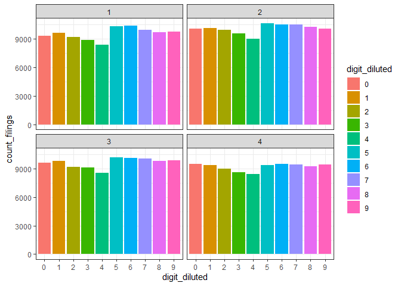
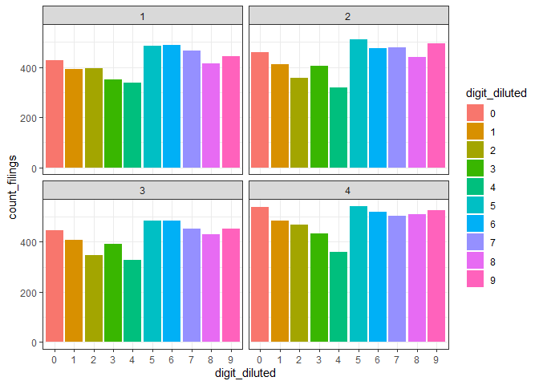
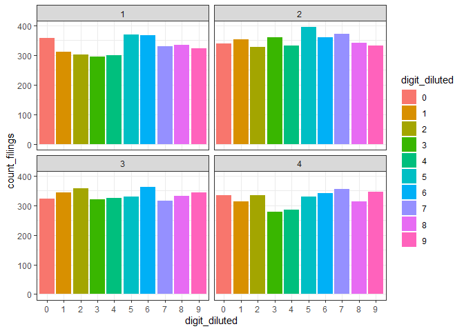

------------------------------------------------------------------------

title: “Data Analytics in R - Assignment 14” author: “Don Smith” output:
github_document

------------------------------------------------------------------------

### Question 1: Create three graphs using the EPS dataset which show:

##### 1.EPS dilution aggregated by quarter for all years

##### 2.EPS dilution aggregated by quarter for 1998

##### 3.EPS dilution aggregated by quarter for 2019

``` r
library(tidyverse)
```

    ## ── Attaching packages ─────────────────────────────────────── tidyverse 1.3.2 ──
    ## ✔ ggplot2 3.4.0     ✔ purrr   1.0.1
    ## ✔ tibble  3.1.8     ✔ dplyr   1.1.0
    ## ✔ tidyr   1.3.0     ✔ stringr 1.5.0
    ## ✔ readr   2.1.3     ✔ forcats 1.0.0
    ## ── Conflicts ────────────────────────────────────────── tidyverse_conflicts() ──
    ## ✖ dplyr::filter() masks stats::filter()
    ## ✖ dplyr::lag()    masks stats::lag()

``` r
library(ggplot2)

df <- read_rds('C:\\Users\\Owner\\Documents\\GitHub\\r\\class assignments\\Data Analytics in R\\Assignment 14\\data\\EPS rounding_after class.rds')
head(df)
```

    ## # A tibble: 6 × 10
    ##   tic   conm     fyearq  fqtr curcdq ibadjq xidoq cshfdq EPS_diluted_c…¹ digit…²
    ##   <chr> <chr>     <dbl> <dbl> <chr>   <dbl> <dbl>  <dbl>           <dbl> <chr>  
    ## 1 AIR   AAR CORP   1998     3 USD     10.3      0   28.0           36.8  7      
    ## 2 AIR   AAR CORP   1998     4 USD     11.7      0   27.7           42.4  3      
    ## 3 AIR   AAR CORP   1999     1 USD     10.8      0   27.8           38.9  9      
    ## 4 AIR   AAR CORP   1999     2 USD     10.9      0   27.5           39.7  6      
    ## 5 AIR   AAR CORP   1999     3 USD     11.0      0   27.3           40.2  1      
    ## 6 AIR   AAR CORP   1999     4 USD      2.47     0   27.1            9.11 1      
    ## # … with abbreviated variable names ¹​EPS_diluted_cents, ²​digit_diluted

``` r
#By quarter
fe2 <- df %>% group_by(fqtr, digit_diluted) %>% summarize(count_filings = n())
```

    ## `summarise()` has grouped output by 'fqtr'. You can override using the
    ## `.groups` argument.

``` r
fe2 %>% ggplot(aes(x=digit_diluted, y=count_filings))+ geom_col(aes(fill=digit_diluted)) + facet_wrap(vars(as_factor(fqtr))) + theme_bw()
```

<!-- -->

``` r
#EPS Digit Frequency Bar Chart by Quarter of the Year for 1998
fe3 <- df  %>% filter(fyearq == 1998) %>% group_by(fqtr, digit_diluted, fyearq) %>% summarize(count_filings = n(), .groups = 'drop')
fe3 %>% ggplot(aes(x=digit_diluted, y=count_filings))+ geom_col(aes(fill=digit_diluted)) + facet_wrap(vars(as_factor(fqtr))) + theme_bw()
```

<!-- -->

``` r
#EPS Digit Frequency Bar Chart by Quarter of the Year for 2019
fe4 <- df  %>% filter(fyearq == 2019) %>% group_by(fqtr, digit_diluted, fyearq) %>% summarize(count_filings = n(), .groups = 'drop')
fe4 %>% ggplot(aes(x=digit_diluted, y=count_filings))+ geom_col(aes(fill=digit_diluted)) + facet_wrap(vars(as_factor(fqtr))) + theme_bw()
```

<!-- -->

### Question 2: Filter the 10 companies that are the worst offenders (i.e., overuse EPS dilution).

``` r
# 3a. 10 Worst Offenders
de <- df %>% mutate(is_4 = if_else(digit_diluted == 4, 1, 0), is_5 = if_else(digit_diluted == 5, 1, 0))  %>% group_by(tic, conm) %>% summarize(count_4s = sum(is_4), count_5s = sum(is_5), percent_4s = count_4s/length(is_4), percent_5s = count_5s/length(is_5), count_filings =n(), .groups = 'drop') %>% filter(count_filings > 56, percent_4s < 0.0118, percent_5s > .11)
de
```

    ## # A tibble: 10 × 7
    ##    tic   conm                       count_4s count_5s percent_4s perce…¹ count…²
    ##    <chr> <chr>                         <dbl>    <dbl>      <dbl>   <dbl>   <int>
    ##  1 ABAX  ABAXIS INC                        0       11     0        0.162      68
    ##  2 FEIM  FREQUENCY ELECTRONICS INC         0        9     0        0.155      58
    ##  3 FNLC  FIRST BANCORP INC/ME              1       13     0.0115   0.149      87
    ##  4 FULT  FULTON FINANCIAL CORP             1       13     0.0111   0.144      90
    ##  5 FWRD  FORWARD AIR CORP                  1       18     0.0116   0.209      86
    ##  6 HCSG  HEALTHCARE SERVICES GROUP         1       37     0.0118   0.435      85
    ##  7 MCRL  MICREL INC                        0        9     0        0.148      61
    ##  8 NUS   NU SKIN ENTERPRISES  -CL A        1       14     0.0112   0.157      89
    ##  9 TILE  INTERFACE INC                     0       19     0        0.292      65
    ## 10 TTEK  TETRA TECH INC                    1       14     0.0116   0.163      86
    ## # … with abbreviated variable names ¹​percent_5s, ²​count_filings
