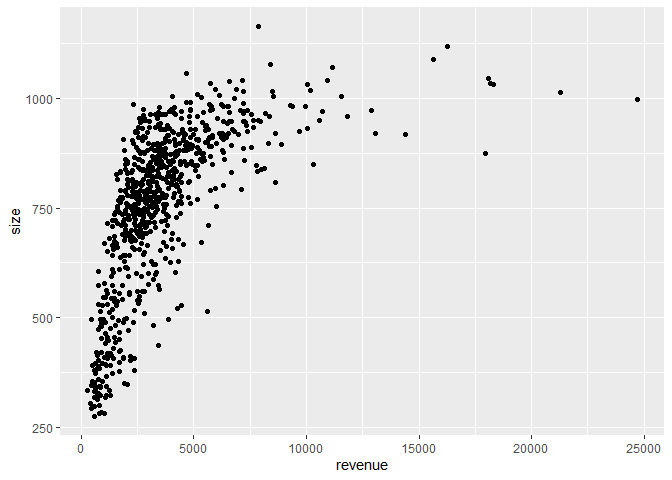
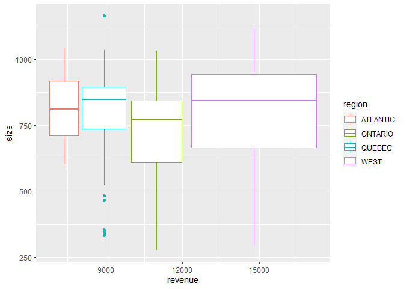
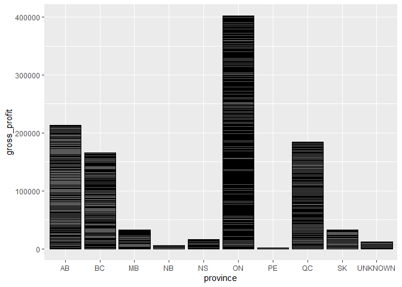

------------------------------------------------------------------------

title: “Data Analytics in R - Assignment 16” author: “Don Smith” output:
github_document

------------------------------------------------------------------------

### Question 1. Import the `store_3HE.csv` as dataframe df. Learn about the data from the data description file.

``` r
df <- read.csv("C:\\Users\\Owner\\Documents\\GitHub\\r\\class assignments\\Data Analytics in R\\Assignment 16\\data\\store_3HE.csv")
```

### Question 2. Analyze the dataset using the `str()`, `summary()`, `head()`, `tail()`, `slice_sample()`, `unique()`, and `n_distinct()` functions.

``` r
library(dplyr)
```

    ## 
    ## Attaching package: 'dplyr'

    ## The following objects are masked from 'package:stats':
    ## 
    ##     filter, lag

    ## The following objects are masked from 'package:base':
    ## 
    ##     intersect, setdiff, setequal, union

``` r
str(df)
```

    ## 'data.frame':    771 obs. of  20 variables:
    ##  $ store                  : int  105 117 122 123 182 183 186 194 227 233 ...
    ##  $ city                   : chr  "BROCKVILLE" "BURLINGTON" "BURLINGTON" "BURLINGTON" ...
    ##  $ region                 : chr  "ONTARIO" "ONTARIO" "ONTARIO" "ONTARIO" ...
    ##  $ province               : chr  "ON" "ON" "ON" "ON" ...
    ##  $ size                   : int  496 875 691 763 784 NA 966 710 973 967 ...
    ##  $ revenue                : chr  "984.7" "2629.32" "2786.73" "2834.49" ...
    ##  $ units                  : num  470 1131 1229 1258 1950 ...
    ##  $ cost                   : num  591 1622 1709 1720 2486 ...
    ##  $ gross_profit           : num  394 1008 1077 1115 1633 ...
    ##  $ promo_units            : num  210 401 450 477 665 ...
    ##  $ energy_units           : num  72.1 192.8 240.5 194.2 199.7 ...
    ##  $ regularBars_units      : num  38.6 75 93.7 99.4 175.5 ...
    ##  $ gum_units              : num  29.3 55.9 64.3 73.2 145.8 ...
    ##  $ bagpegCandy_units      : num  13.4 42.1 29.9 54.1 68.1 ...
    ##  $ isotonics_units        : num  20.7 87.6 105.7 118.2 109.3 ...
    ##  $ singleServePotato_units: num  18.6 36.4 48 39.7 85.7 ...
    ##  $ takeHomePotato_units   : num  7.71 33.46 19.9 22.1 42.33 ...
    ##  $ kingBars_units         : num  17.9 47.4 45.2 45.3 79.8 ...
    ##  $ flatWater_units        : num  56.5 98.4 130.3 132.8 204.1 ...
    ##  $ psd591Ml_units         : num  39.7 38.7 47.3 39.9 50.3 ...

``` r
summary(df)
```

    ##      store           city              region            province        
    ##  Min.   :  105   Length:771         Length:771         Length:771        
    ##  1st Qu.: 6226   Class :character   Class :character   Class :character  
    ##  Median :34438   Mode  :character   Mode  :character   Mode  :character  
    ##  Mean   :34226                                                           
    ##  3rd Qu.:59663                                                           
    ##  Max.   :98788                                                           
    ##                                                                          
    ##       size          revenue              units              cost         
    ##  Min.   : 276.0   Length:771         Min.   :  42.65   Min.   :   41.12  
    ##  1st Qu.: 671.8   Class :character   1st Qu.: 911.85   1st Qu.: 1229.12  
    ##  Median : 792.5   Mode  :character   Median :1351.25   Median : 1843.41  
    ##  Mean   : 755.5                      Mean   :1559.78   Mean   : 2180.51  
    ##  3rd Qu.: 893.0                      3rd Qu.:1941.60   3rd Qu.: 2689.76  
    ##  Max.   :1163.0                      Max.   :9715.83   Max.   :14228.89  
    ##  NA's   :15                                                              
    ##   gross_profit       promo_units      energy_units    regularBars_units
    ##  Min.   :   36.36   Min.   :  17.5   Min.   :   4.1   Min.   :  5.10   
    ##  1st Qu.:  771.74   1st Qu.: 344.4   1st Qu.: 142.7   1st Qu.: 75.67   
    ##  Median : 1150.93   Median : 499.3   Median : 215.6   Median :110.65   
    ##  Mean   : 1388.03   Mean   : 567.0   Mean   : 253.0   Mean   :123.95   
    ##  3rd Qu.: 1702.92   3rd Qu.: 730.5   3rd Qu.: 317.1   3rd Qu.:154.84   
    ##  Max.   :10457.82   Max.   :3116.5   Max.   :1576.3   Max.   :681.56   
    ##                                                                        
    ##    gum_units      bagpegCandy_units isotonics_units  singleServePotato_units
    ##  Min.   :  1.88   Min.   :  0.00    Min.   :  3.98   Min.   :  1.75         
    ##  1st Qu.: 53.49   1st Qu.: 24.43    1st Qu.: 57.79   1st Qu.: 29.51         
    ##  Median : 77.88   Median : 41.65    Median : 84.48   Median : 44.92         
    ##  Mean   : 85.53   Mean   : 50.33    Mean   : 98.76   Mean   : 56.34         
    ##  3rd Qu.:110.11   3rd Qu.: 63.72    3rd Qu.:124.16   3rd Qu.: 67.84         
    ##  Max.   :318.69   Max.   :381.96    Max.   :562.46   Max.   :439.06         
    ##                                                                             
    ##  takeHomePotato_units kingBars_units   flatWater_units   psd591Ml_units  
    ##  Min.   :  0.00       Min.   :  0.00   Min.   :  11.96   Min.   :  0.00  
    ##  1st Qu.: 15.69       1st Qu.: 33.89   1st Qu.:  82.33   1st Qu.: 31.28  
    ##  Median : 28.85       Median : 49.87   Median : 128.98   Median : 48.25  
    ##  Mean   : 38.05       Mean   : 58.68   Mean   : 158.03   Mean   : 60.57  
    ##  3rd Qu.: 49.31       3rd Qu.: 73.33   3rd Qu.: 190.32   3rd Qu.: 74.95  
    ##  Max.   :360.19       Max.   :471.19   Max.   :1424.27   Max.   :390.38  
    ## 

``` r
head(df)
```

    ##   store       city  region province size revenue   units    cost gross_profit
    ## 1   105 BROCKVILLE ONTARIO       ON  496   984.7  470.46  590.73       393.97
    ## 2   117 BURLINGTON ONTARIO       ON  875 2629.32 1131.38 1621.58      1007.74
    ## 3   122 BURLINGTON ONTARIO       ON  691 2786.73 1229.46 1709.45      1077.27
    ## 4   123 BURLINGTON ONTARIO       ON  763 2834.49 1257.63 1719.61      1114.88
    ## 5   182  DON MILLS ONTARIO       ON  784 4118.36 1949.50 2485.83      1632.53
    ## 6   183  DON MILLS ONTARIO       ON   NA  374.83  186.54  227.36       147.47
    ##   promo_units energy_units regularBars_units gum_units bagpegCandy_units
    ## 1      210.23        72.13             38.63     29.29             13.38
    ## 2      401.46       192.77             75.04     55.85             42.15
    ## 3      450.04       240.48             93.73     64.27             29.85
    ## 4      476.83       194.21             99.44     73.25             54.15
    ## 5      664.71       199.73            175.48    145.81             68.06
    ## 6       79.23        34.23             17.06     11.71              3.73
    ##   isotonics_units singleServePotato_units takeHomePotato_units kingBars_units
    ## 1           20.69                   18.60                 7.71          17.87
    ## 2           87.62                   36.44                33.46          47.44
    ## 3          105.65                   47.96                19.90          45.21
    ## 4          118.19                   39.67                22.10          45.33
    ## 5          109.35                   85.71                42.33          79.81
    ## 6            9.29                    8.48                 0.00          11.88
    ##   flatWater_units psd591Ml_units
    ## 1           56.54          39.71
    ## 2           98.42          38.73
    ## 3          130.27          47.31
    ## 4          132.77          39.87
    ## 5          204.06          50.29
    ## 6           25.31           2.69

``` r
tail(df)
```

    ##     store        city region province size revenue   units    cost gross_profit
    ## 766 94285     UNKNOWN QUEBEC  UNKNOWN  343 1121.61  534.63  678.85       442.75
    ## 767 95198       SOOKE   WEST       BC  707 2910.59 1305.92 1777.54      1133.05
    ## 768 95342 MAPLE RIDGE   WEST       BC  711 1786.36  789.38 1088.62       697.74
    ## 769 95849   VANCOUVER   WEST       BC  444 1497.23  703.52  902.25       594.97
    ## 770 97250    WINNIPEG   WEST       MB  723 2093.18  928.54 1325.07       768.11
    ## 771 98788   VANCOUVER   WEST       BC  885 3753.52 1644.13 2245.66      1507.87
    ##     promo_units energy_units regularBars_units gum_units bagpegCandy_units
    ## 766      168.93        90.44             43.00     40.19              0.74
    ## 767      401.46       151.17            122.63     51.46             51.12
    ## 768      352.19       130.87             70.83     46.50             22.69
    ## 769      256.42        81.98             66.71     29.29             18.42
    ## 770      438.96       113.96             72.38     38.17             31.48
    ## 771      451.71       207.17            118.27     86.92             52.98
    ##     isotonics_units singleServePotato_units takeHomePotato_units kingBars_units
    ## 766           34.22                   22.07                 3.15          32.93
    ## 767           85.21                   46.25                30.15          74.52
    ## 768           52.69                   19.02                14.58          22.52
    ## 769           72.29                   24.83                 7.60          26.60
    ## 770           68.37                   30.00                27.44          38.67
    ## 771          105.87                   68.38                38.83          47.79
    ##     flatWater_units psd591Ml_units
    ## 766           49.00          18.00
    ## 767          110.79          43.27
    ## 768           73.54          32.15
    ## 769           86.15          24.88
    ## 770           93.10          59.35
    ## 771          195.31          37.75

``` r
slice_sample(df)
```

    ##   store       city  region province size revenue  units    cost gross_profit
    ## 1 43023 BURLINGTON ONTARIO       ON  684 1983.73 886.73 1213.08       770.65
    ##   promo_units energy_units regularBars_units gum_units bagpegCandy_units
    ## 1       349.4       172.17             79.38     60.31             21.52
    ##   isotonics_units singleServePotato_units takeHomePotato_units kingBars_units
    ## 1           77.52                   29.56                12.75          36.48
    ##   flatWater_units psd591Ml_units
    ## 1           77.25          27.69

``` r
unique(df)
```

    ##     store                     city   region province size  revenue   units
    ## 1     105               BROCKVILLE  ONTARIO       ON  496    984.7  470.46
    ## 2     117               BURLINGTON  ONTARIO       ON  875  2629.32 1131.38
    ## 3     122               BURLINGTON  ONTARIO       ON  691  2786.73 1229.46
    ## 4     123               BURLINGTON  ONTARIO       ON  763  2834.49 1257.63
    ## 5     182                DON MILLS  ONTARIO       ON  784  4118.36 1949.50
    ## 6     183                DON MILLS  ONTARIO       ON   NA   374.83  186.54
    ## 7     186               NORTH YORK  ONTARIO       ON  966  8195.26 3695.46
    ## 8     194               NORTH YORK  ONTARIO       ON  710  1981.46  954.29
    ## 9     227                ETOBICOKE  ONTARIO       ON  973  4841.67 2185.02
    ## 10    233                ETOBICOKE  ONTARIO       ON  967  5435.45 2473.71
    ## 11    236                ETOBICOKE  ONTARIO       ON 1001   5340.2 2355.35
    ## 12    248               GEORGETOWN  ONTARIO       ON  736  2575.96 1144.69
    ## 13    259                  GORMLEY  ONTARIO       ON  778  2361.24 1050.83
    ## 14    272                   GUELPH  ONTARIO       ON  949   2711.2 1138.62
    ## 15    282                 HAMILTON  ONTARIO       ON  833  1724.54  759.17
    ## 16    291             STONEY CREEK  ONTARIO       ON  952  2821.96 1238.08
    ## 17    333                   KANATA  ONTARIO       ON  318    565.3  270.65
    ## 18    358                KITCHENER  ONTARIO       ON  836  5075.03 2179.21
    ## 19    367                KITCHENER  ONTARIO       ON  496   465.46  202.67
    ## 20    396                   LONDON  ONTARIO       ON  796  2314.78 1024.58
    ## 21    398                   LONDON  ONTARIO       ON  609  1372.67  625.35
    ## 22    399                   LONDON  ONTARIO       ON  948  3046.68 1365.31
    ## 23    402                   LONDON  ONTARIO       ON  656  2368.65 1061.88
    ## 24    409                   LONDON  ONTARIO       ON  734  3210.86 1437.67
    ## 25    414                   LONDON  ONTARIO       ON  542  1821.12  834.17
    ## 26    438               UNIONVILLE  ONTARIO       ON  768  1676.88  766.96
    ## 27    445              SCARBOROUGH  ONTARIO       ON  501  1372.87  638.50
    ## 28    446                   MILTON  ONTARIO       ON  789  1956.49  874.04
    ## 29    448                   MILTON  ONTARIO       ON  969  4430.77 1945.56
    ## 30    451              MISSISSAUGA  ONTARIO       ON  881  4350.28 1980.52
    ## 31    452              MISSISSAUGA  ONTARIO       ON  884  4766.71 2183.13
    ## 32    453              MISSISSAUGA  ONTARIO       ON  560   2478.8 1102.69
    ## 33    454              MISSISSAUGA  ONTARIO       ON  887  2441.33 1080.56
    ## 34    457              MISSISSAUGA  ONTARIO       ON  379  2367.62 1273.35
    ## 35    460              MISSISSAUGA  ONTARIO       ON  728  2742.16 1236.58
    ## 36    466              MISSISSAUGA  ONTARIO       ON  843  3797.34 1678.33
    ## 37    474              MISSISSAUGA  ONTARIO       ON  413  1344.45  652.62
    ## 38    475              MISSISSAUGA  ONTARIO       ON  763  2549.04 1130.87
    ## 39    479              MISSISSAUGA  ONTARIO       ON  759   3628.8 1654.98
    ## 40    480              MISSISSAUGA  ONTARIO       ON  967  4081.75 1780.35
    ## 41    481              MISSISSAUGA  ONTARIO       ON  793  3472.04 1582.44
    ## 42    496                   NEPEAN  ONTARIO       ON  905  4153.75 1804.31
    ## 43    501                NEWMARKET  ONTARIO       ON  931  2733.71 1181.71
    ## 44    539                  ORLEANS  ONTARIO       ON  841  3002.95 1351.46
    ## 45    555                   OTTAWA  ONTARIO       ON  882  6264.74 2730.42
    ## 46    558                   NEPEAN  ONTARIO       ON  815  3756.79 1659.90
    ## 47    561                   OTTAWA  ONTARIO       ON  450   1143.8  583.98
    ## 48    562                   NEPEAN  ONTARIO       ON  776   4465.6 1969.90
    ## 49    568                   NEPEAN  ONTARIO       ON  765  4422.01 2005.44
    ## 50    574                   OTTAWA  ONTARIO       ON  429  1445.91  726.10
    ## 51    575                   OTTAWA  ONTARIO       ON  426  1750.95  849.29
    ## 52    583               GLOUCESTER  ONTARIO       ON  941  3438.12 1550.25
    ## 53    616                PICKERING  ONTARIO       ON  808  3815.41 1708.06
    ## 54    619                PICKERING  ONTARIO       ON  479   870.27  413.54
    ## 55    632                PORT HOPE  ONTARIO       ON  962  3275.36 1404.85
    ## 56    650                ETOBICOKE  ONTARIO       ON  897  3370.91 1665.83
    ## 57    651                ETOBICOKE  ONTARIO       ON  744   2707.1 1263.54
    ## 58    655            RICHMOND HILL  ONTARIO       ON  758  2342.59 1020.90
    ## 59    676              SCARBOROUGH  ONTARIO       ON  803  2629.48 1166.10
    ## 60    682              SCARBOROUGH  ONTARIO       ON  801  2411.33 1123.21
    ## 61    683              SCARBOROUGH  ONTARIO       ON  727  2030.77  964.63
    ## 62    687              SCARBOROUGH  ONTARIO       ON  751  3143.61 1469.69
    ## 63    699              SCARBOROUGH  ONTARIO       ON  742  2928.75 1405.44
    ## 64    732           ST. CATHARINES  ONTARIO       ON  814  1621.05  740.21
    ## 65    733           ST. CATHARINES  ONTARIO       ON  489  1072.88  521.85
    ## 66    735           ST. CATHARINES  ONTARIO       ON  979  3463.98 1494.12
    ## 67    741                ST THOMAS  ONTARIO       ON  702  1955.13  904.25
    ## 68    769                  SUDBURY  ONTARIO       ON  304    429.1  188.21
    ## 69    784                THORNHILL  ONTARIO       ON  791  3006.44 1334.13
    ## 70    787                  VAUGHAN  ONTARIO       ON  786  2487.65 1117.38
    ## 71    813                  TORONTO  ONTARIO       ON  906  5101.63 2304.33
    ## 72    822                  TORONTO  ONTARIO       ON  757  2383.49 1090.04
    ## 73    823                  TORONTO  ONTARIO       ON  791  5752.27 2552.25
    ## 74    829                  TORONTO  ONTARIO       ON  788  4369.24 1978.52
    ## 75    830               NORTH YORK  ONTARIO       ON  517  2353.05 1107.08
    ## 76    834                  TORONTO  ONTARIO       ON  698  2403.59 1116.08
    ## 77    857                  TORONTO  ONTARIO       ON  712  2731.58 1244.67
    ## 78    872                  CONCORD  ONTARIO       ON  937  3483.55 1563.00
    ## 79    911               NORTH YORK  ONTARIO       ON  746  2560.12 1234.17
    ## 80    914               NORTH YORK  ONTARIO       ON  668  2671.68 1245.06
    ## 81    920                   WHITBY  ONTARIO       ON  740  1697.61  789.02
    ## 82    928                  WIARTON  ONTARIO       ON  391    499.7  220.62
    ## 83    935               NORTH YORK  ONTARIO       ON  892  3386.34 1533.27
    ## 84    937               NORTH YORK  ONTARIO       ON  806  2433.02 1116.04
    ## 85    941                  WINDSOR  ONTARIO       ON  806   2575.7 1125.44
    ## 86    959               WOODBRIDGE  ONTARIO       ON 1009  5166.15 2280.62
    ## 87    960               WOODBRIDGE  ONTARIO       ON  754  3029.19 1371.40
    ## 88    962                ETOBICOKE  ONTARIO       ON  455  1465.31  757.47
    ## 89    973                  UNKNOWN   QUEBEC  UNKNOWN  482  1518.72  682.83
    ## 90    987                     AJAX  ONTARIO       ON  933   2527.1 1158.83
    ## 91    996                 OAKVILLE  ONTARIO       ON  399  1685.91  800.44
    ## 92   1004               GLOUCESTER  ONTARIO       ON  649  2802.87 1254.06
    ## 93   1308                 TECUMSEH  ONTARIO       ON  693  2899.17 1242.29
    ## 94   1312            RICHMOND HILL  ONTARIO       ON  739  1517.45  697.96
    ## 95   1315                 BRAMPTON  ONTARIO       ON  736  3039.26 1428.73
    ## 96   1326               BURLINGTON  ONTARIO       ON  869  3575.92 1580.94
    ## 97   1327                   LONDON  ONTARIO       ON  680  2330.93 1042.12
    ## 98   1328                   LONDON  ONTARIO       ON  798   2391.3 1069.71
    ## 99   1334                   WHITBY  ONTARIO       ON  720  1884.76  852.44
    ## 100  1404              SCARBOROUGH  ONTARIO       ON  867  4192.14 1855.48
    ## 101  1405              SCARBOROUGH  ONTARIO       ON  789  1744.63  809.25
    ## 102  1427                   ARTHUR  ONTARIO       ON  651  1154.33  539.98
    ## 103  1429                   AURORA  ONTARIO       ON  838  1974.43  848.87
    ## 104  1446                   BARRIE  ONTARIO       ON  944  5398.27 2361.63
    ## 105  1455                   NEPEAN  ONTARIO       ON  420   661.91  327.12
    ## 106  1470                   BOLTON  ONTARIO       ON  787  2747.26 1207.56
    ## 107  1480                 BRAMPTON  ONTARIO       ON  748  2790.29 1291.37
    ## 108  1487                 BRAMPTON  ONTARIO       ON  898  4162.08 1814.67
    ## 109  1616                   LONDON  ONTARIO       ON  816  2041.14  911.00
    ## 110  2505                  CALGARY     WEST       AB  360   778.29  359.37
    ## 111  2512            FORT ST. JOHN     WEST       BC  539  2596.13 1051.29
    ## 112  2519                  QUESNEL     WEST       BC  917  4337.47 1805.85
    ## 113  2538                 EDMONTON     WEST       AB  800  4207.49 1853.52
    ## 114  2542     ROCKY MOUNTAIN HOUSE     WEST       AB  843  3472.78 1368.21
    ## 115  2548                    CHASE     WEST       BC  804  4226.55 1806.25
    ## 116  2552                  CALGARY     WEST       AB  880  3327.09 1439.48
    ## 117  2556              MAPLE RIDGE     WEST       BC  744  2946.56 1286.69
    ## 118  2557           PORT COQUITLAM     WEST       BC  548  2568.45 1148.25
    ## 119  2560                 WINFIELD     WEST       BC  627  1925.63  807.02
    ## 120  2562                 EDMONTON     WEST       AB  934  7647.52 3142.98
    ## 121  2563                   SURREY     WEST       BC  402  2188.04 1057.25
    ## 122  2566                 KAMLOOPS     WEST       BC  718  3012.13 1302.08
    ## 123  2587                VANCOUVER     WEST       BC  965     7211 3158.29
    ## 124  2591                  CALGARY     WEST       AB 1038  6590.32 2724.58
    ## 125  2618                  KELOWNA     WEST       BC 1021  6889.42 2935.04
    ## 126  2619                   REGINA     WEST       SK  982  6329.98 2644.83
    ## 127  2627               ABBOTSFORD     WEST       BC  498   1989.7  902.96
    ## 128  2631                  MISSION     WEST       BC  928  3760.47 1635.52
    ## 129  2634           WEST VANCOUVER     WEST       BC  543  1350.13  629.40
    ## 130  2639                 WINNIPEG     WEST       MB  733  2341.55 1049.50
    ## 131  2640                 VICTORIA     WEST       BC  606   745.87  339.56
    ## 132  2644                SASKATOON     WEST       SK  803   4021.9 1713.90
    ## 133  2652               ST. ALBERT     WEST       AB  655   2578.6 1142.62
    ## 134  2665                  CALGARY     WEST       AB  860   5291.2 2242.35
    ## 135  2667              NANOOSE BAY     WEST       BC 1003 11568.82 4997.85
    ## 136  2669                 EDMONTON     WEST       AB  944  7289.77 3119.83
    ## 137  2671            WILLIAMS LAKE     WEST       BC  656  1428.12  636.12
    ## 138  2684               SALMON ARM     WEST       BC  715  1585.36  664.90
    ## 139  2695                  CALGARY     WEST       AB  514  5592.71 2408.40
    ## 140  2698                 KAMLOOPS     WEST       BC  982  5781.89 2474.60
    ## 141  2711                  CALGARY     WEST       AB 1078   8385.6 3479.12
    ## 142  2714                 EDMONTON     WEST       AB  411  2203.74  959.23
    ## 143  2718                  LANGLEY     WEST       BC  603  3352.27 1519.46
    ## 144  2742                 EDMONTON     WEST       AB  595  2101.58  902.90
    ## 145  2743              LAKE LOUISE     WEST       AB 1041 10915.15 4308.08
    ## 146  2751                 WINNIPEG     WEST       MB  643  2744.41 1226.54
    ## 147  2758                  BURNABY     WEST       BC  578  1035.53  468.90
    ## 148  2780            FORT ST. JOHN     WEST       BC  875 17960.16 6605.33
    ## 149  2795                 WINNIPEG     WEST       MB  680  1268.08  577.29
    ## 150  2807                 RICHMOND     WEST       BC  792  2925.26 1330.63
    ## 151  2813                  CALGARY     WEST       AB  472   759.85  342.67
    ## 152  2817                  UNKNOWN   QUEBEC  UNKNOWN  346   469.49  232.82
    ## 153  2818                 VICTORIA     WEST       BC  722   1502.2  696.38
    ## 154  2820                  UNKNOWN   QUEBEC  UNKNOWN  885     3124 1386.83
    ## 155  2842                  CALGARY     WEST       AB  495   841.29  396.56
    ## 156  2845            PRINCE GEORGE     WEST       BC  659  1622.54  726.38
    ## 157  2846                   SURREY     WEST       BC  961  3421.09 1518.73
    ## 158  2857                   LADNER     WEST       BC  418   1151.5  522.67
    ## 159  2860                   JASPER     WEST       AB  576  2985.94 1221.96
    ## 160  2879                  KELOWNA     WEST       BC 1070 11155.07 4638.19
    ## 161  2880              GRAND FORKS     WEST       BC  826   4434.7 1911.63
    ## 162  2889                VANCOUVER     WEST       BC  536   1472.4  657.04
    ## 163  2892               LOGAN LAKE     WEST       BC  764  3432.97 1484.58
    ## 164  3751               GLOUCESTER  ONTARIO       ON  673  2231.44 1011.08
    ## 165  3827                   OTTAWA  ONTARIO       ON  653  3531.26 1596.85
    ## 166  3872               GLOUCESTER  ONTARIO       ON  762  1724.75  793.69
    ## 167  3885                   OTTAWA  ONTARIO       ON  627  4324.85 2016.69
    ## 168  3919                   OTTAWA  ONTARIO       ON  299      798  402.08
    ## 169  3964                   KANATA  ONTARIO       ON   NA    506.3  252.37
    ## 170  4325                 WESTBANK     WEST       BC  850  4945.12 2084.45
    ## 171  4732      NIAGARA-ON-THE-LAKE  ONTARIO       ON  675  2414.66 1069.71
    ## 172  4774              BOWMANVILLE  ONTARIO       ON  447  1194.52  575.79
    ## 173  4787                   OSHAWA  ONTARIO       ON   NA   393.47  205.75
    ## 174  4866                 COURTICE  ONTARIO       ON  561  1116.24  534.02
    ## 175  4879                   WHITBY  ONTARIO       ON  276   575.43  288.85
    ## 176  4987            ST CATHARINES  ONTARIO       ON  539  2480.71 1132.37
    ## 177  5021            ST CATHARINES  ONTARIO       ON   NA   286.97  161.19
    ## 178  5034            ST CATHARINES  ONTARIO       ON  390  1287.95  599.92
    ## 179  5100                  WELLAND  ONTARIO       ON  747  1610.89  719.77
    ## 180  5184                  MARKHAM  ONTARIO       ON  641  1392.85  651.38
    ## 181  5205                  ORILLIA  ONTARIO       ON  821  3966.84 1789.83
    ## 182  5289                   AURORA  ONTARIO       ON   NA   624.83  306.85
    ## 183  5326                   BARRIE  ONTARIO       ON  529  1169.81  553.17
    ## 184  5368                   BARRIE  ONTARIO       ON  555  1711.72  785.70
    ## 185  5434              MISSISSAUGA  ONTARIO       ON  496  3873.35 1877.83
    ## 186  5463              MISSISSAUGA  ONTARIO       ON  334   297.19  166.90
    ## 187  5539              MISSISSAUGA  ONTARIO       ON  482  3226.82 1484.58
    ## 188  5618              MISSISSAUGA  ONTARIO       ON  683   2717.8 1227.06
    ## 189  5621              MISSISSAUGA  ONTARIO       ON  695  2585.97 1159.67
    ## 190  5805               BURLINGTON  ONTARIO       ON  565     3458 1616.96
    ## 191  5834               BURLINGTON  ONTARIO       ON   NA   441.37  229.98
    ## 192  5850               BURLINGTON  ONTARIO       ON  284   902.09  454.50
    ## 193  6178              SCARBOROUGH  ONTARIO       ON   NA   369.25  183.44
    ## 194  6273              SCARBOROUGH  ONTARIO       ON  812  4058.74 1876.21
    ## 195  6336              SCARBOROUGH  ONTARIO       ON   NA   324.91  173.54
    ## 196  6365              SCARBOROUGH  ONTARIO       ON   NA   591.79  300.00
    ## 197  6378               WILLOWDALE  ONTARIO       ON  595  2689.35 1204.13
    ## 198  6428                DOWNSVIEW  ONTARIO       ON   NA  1299.87  694.25
    ## 199  6499                  TORONTO  ONTARIO       ON  835  3171.44 1447.42
    ## 200  6707                  TORONTO  ONTARIO       ON  823  3012.28 1345.52
    ## 201  6723                  TORONTO  ONTARIO       ON  408  1891.38  913.35
    ## 202  7562               EMERYVILLE  ONTARIO       ON  772   3506.8 1511.58
    ## 203  7670                CAMBRIDGE  ONTARIO       ON  573  1363.71  607.17
    ## 204  7720                KITCHENER  ONTARIO       ON   NA   338.57  165.48
    ## 205  7825                 WATERLOO  ONTARIO       ON  621  3214.45 1427.38
    ## 206  7854                 WATERLOO  ONTARIO       ON  855   2710.8 1183.73
    ## 207  7904                KITCHENER  ONTARIO       ON  861  1971.89  859.98
    ## 208  8156                STRATFORD  ONTARIO       ON  514   857.52  418.10
    ## 209  8435                   LONDON  ONTARIO       ON  721  2696.82 1217.29
    ## 210  8451                   LONDON  ONTARIO       ON  686  2184.46  961.10
    ## 211  8572                  CHATHAM  ONTARIO       ON  601   2451.4 1080.37
    ## 212  8585                   SARNIA  ONTARIO       ON  539  1516.96  679.10
    ## 213  8606                   SARNIA  ONTARIO       ON  769  3074.85 1351.25
    ## 214  9632                 OAKVILLE  ONTARIO       ON  509  2818.86 1298.94
    ## 215 10411                  UNKNOWN   QUEBEC  UNKNOWN 1005  4039.15 1602.00
    ## 216 10451               DORCHESTER  ONTARIO       ON  791  2636.19 1153.44
    ## 217 12161             L'ASSOMPTION   QUEBEC       QC  894  4858.16 2147.92
    ## 218 12177                MONTRÉAL   QUEBEC       QC  861  3207.62 1456.56
    ## 219 12260                MONTRÉAL   QUEBEC       QC  814  2290.57 1058.12
    ## 220 12337               BÉCANCOUR   QUEBEC       QC  719  3577.54 1602.23
    ## 221 12339                    LAVAL   QUEBEC       QC  836  2264.47 1019.50
    ## 222 12362             SAINTE-JULIE   QUEBEC       QC  759   3790.6 1724.96
    ## 223 12411                   DELSON   QUEBEC       QC  731  3863.29 1678.23
    ## 224 12478     SAINT-JEAN-PORT-JOLI   QUEBEC       QC  894  8900.28 3873.46
    ## 225 12524   STONEHAM-ET-TEWKESBURY   QUEBEC       QC  846  7790.94 3319.38
    ## 226 12527                  QUÉBEC   QUEBEC       QC  879  4228.33 1843.58
    ## 227 12636                  HALIFAX ATLANTIC       NS  676  1921.36  930.92
    ## 228 12637                  HALIFAX ATLANTIC       NS  824  4096.78 2032.31
    ## 229 12638               FALL RIVER ATLANTIC       NS  801  2668.84 1212.56
    ## 230 12642                  BEDFORD ATLANTIC       NS  642  1966.47  930.08
    ## 231 12644                DARTMOUTH ATLANTIC       NS  628  3102.65 1491.37
    ## 232 12647                DARTMOUTH ATLANTIC       NS  924  2393.54 1070.46
    ## 233 12685                  HALIFAX ATLANTIC       NS  896  2303.41 1044.29
    ## 234 12686                STEWIACKE ATLANTIC       NS 1041  7177.81 3211.88
    ## 235 12687          LOWER SACKVILLE ATLANTIC       NS  854   3088.6 1410.71
    ## 236 12690                  HALIFAX ATLANTIC       NS  991  4845.06 2217.31
    ## 237 12693                DARTMOUTH ATLANTIC       NS  779  2591.62 1202.77
    ## 238 12705                CAP-ROUGE   QUEBEC       QC  868  3177.39 1378.27
    ## 239 12710             SAINT-HUBERT   QUEBEC       QC  709  2390.79 1055.56
    ## 240 12711                MONTRÉAL   QUEBEC       QC  938  5558.38 2447.90
    ## 241 12721                MONTRÉAL   QUEBEC       QC  845  3527.14 1574.96
    ## 242 12739      DOLLARD DES ORMEAUX   QUEBEC       QC  816  4295.37 2002.77
    ## 243 12762                MONTRÉAL   QUEBEC       QC  872  3801.05 1718.23
    ## 244 12764                MONTRÉAL   QUEBEC       QC  893  4641.79 2135.27
    ## 245 12770          GREENFIELD PARK   QUEBEC       QC  859  5483.28 2456.85
    ## 246 12771                MONTRÉAL   QUEBEC       QC  846   4652.2 2084.92
    ## 247 12778               ST-LAURENT   QUEBEC       QC  346   586.98  305.83
    ## 248 12800                MONTRÉAL   QUEBEC       QC  924  7364.15 3330.83
    ## 249 12802                MONTRÉAL   QUEBEC       QC  738  4382.89 1957.37
    ## 250 12816    STE-HÉLÈNE-DE-BAGOT   QUEBEC       QC  897  8319.57 3704.06
    ## 251 12818                    LAVAL   QUEBEC       QC  696  3698.94 1683.60
    ## 252 12841                   DORVAL   QUEBEC       QC  467  1681.73  789.21
    ## 253 12844                  LACHINE   QUEBEC       QC  560  1486.28  715.43
    ## 254 12845             BOUCHERVILLE   QUEBEC       QC  882  2554.14 1126.69
    ## 255 12958                MONTRÉAL   QUEBEC       QC  335  1229.99  609.67
    ## 256 12959           SAINT-LÉONARD   QUEBEC       QC  713  2612.17 1209.79
    ## 257 12972                LONGUEUIL   QUEBEC       QC  739  2745.28 1223.10
    ## 258 12973                MONTRÉAL   QUEBEC       QC  733  2778.46 1283.35
    ## 259 12975                 BROSSARD   QUEBEC       QC  819  3529.55 1565.94
    ## 260 12977               NEUFCHATEL   QUEBEC       QC  930  4503.03 1968.35
    ## 261 12981              CHATEAUGUAY   QUEBEC       QC  916  6453.64 2813.96
    ## 262 12982                    LAVAL   QUEBEC       QC  723  2150.73  961.04
    ## 263 12987           MONTRÉAL NORD   QUEBEC       QC  813  2242.64 1032.44
    ## 264 12988                    ANJOU   QUEBEC       QC  797  2073.79  945.42
    ## 265 12993          SAINT-HYACINTHE   QUEBEC       QC  738  1972.74  921.12
    ## 266 12994                 KIRKLAND   QUEBEC       QC  557  2154.61 1013.38
    ## 267 12996               ST-LAURENT   QUEBEC       QC  560  2825.81 1312.63
    ## 268 12998                MONTRÉAL   QUEBEC       QC  874  5405.35 2503.69
    ## 269 13004                MONTRÉAL   QUEBEC       QC  858  4062.92 1807.13
    ## 270 13005                MONTRÉAL   QUEBEC       QC  684  2220.59 1025.08
    ## 271 13010                MONTRÉAL   QUEBEC       QC  689  2660.45 1179.79
    ## 272 13011                    LAVAL   QUEBEC       QC  808  2980.45 1333.63
    ## 273 13013            DRUMMONDVILLE   QUEBEC       QC  836  2727.55 1219.42
    ## 274 13014            SAINT-LAURENT   QUEBEC       QC  352   605.69  313.77
    ## 275 13015                 GATINEAU   QUEBEC       QC  851  3330.87 1450.87
    ## 276 13016                MONTRÉAL   QUEBEC       QC  866  3754.83 1668.88
    ## 277 13017                MONTRÉAL   QUEBEC       QC   NA    784.9  415.10
    ## 278 13020                MONTRÉAL   QUEBEC       QC  889  5177.62 2301.46
    ## 279 13048                    LAVAL   QUEBEC       QC  694  1958.77  898.33
    ## 280 13049                    LAVAL   QUEBEC       QC  670  1560.21  710.21
    ## 281 13053                MONTRÉAL   QUEBEC       QC  774  3749.76 1671.77
    ## 282 13057               BOISBRIAND   QUEBEC       QC  888  7573.02 3254.73
    ## 283 13066 SAINT-MATHIEU-DE-BELOEIL   QUEBEC       QC  742  2385.28 1064.96
    ## 284 13068         ANCIENNE-LORETTE   QUEBEC       QC  787  1976.08  885.15
    ## 285 13069                 GATINEAU   QUEBEC       QC  923  4114.37 1758.17
    ## 286 13073             BOUCHERVILLE   QUEBEC       QC  882  4655.06 2013.15
    ## 287 13074                  CANDIAC   QUEBEC       QC  855  4087.62 1822.44
    ## 288 13075             BOUCHERVILLE   QUEBEC       QC  816  4160.34 1840.10
    ## 289 13079                  QUÉBEC   QUEBEC       QC  807  4763.01 2089.42
    ## 290 13080                VAUDREUIL   QUEBEC       QC  698  2230.01 1000.31
    ## 291 13089                LONGUEUIL   QUEBEC       QC  586  3205.79 1504.60
    ## 292 13091                LONGUEUIL   QUEBEC       QC  846  2994.05 1388.35
    ## 293 13094 ANGE GARDIEN DE ROUVILLE   QUEBEC       QC  671  3658.59 1738.52
    ## 294 13137                  QUÉBEC   QUEBEC       QC  938  7343.25 3293.16
    ## 295 13154                    LAVAL   QUEBEC       QC  770  2777.38 1251.19
    ## 296 13155          TROIS-RIVIÈRES   QUEBEC       QC  907  5644.02 2507.88
    ## 297 13184                 GATINEAU   QUEBEC       QC  867  5719.29 2417.27
    ## 298 13185                 GATINEAU   QUEBEC       QC  847  5013.17 2183.81
    ## 299 13249                  MONCTON ATLANTIC       NB  982   6480.3 2845.52
    ## 300 13303                  MIRABEL   QUEBEC       QC  877  6314.35 2657.15
    ## 301 13370         VILLE MONT ROYAL   QUEBEC       QC  354   927.47  465.31
    ## 302 13377                    LAVAL   QUEBEC       QC  842  2560.28 1165.81
    ## 303 13388           SAINT-LÉONARD   QUEBEC       QC  811  2980.66 1345.87
    ## 304 13411                  QUÉBEC   QUEBEC       QC  923  2949.35 1284.79
    ## 305 13516                MONTRÉAL   QUEBEC       QC 1034  5754.55 2622.08
    ## 306 13522              ST-JÉRÔME   QUEBEC       QC  860  6380.04 2842.58
    ## 307 13541             SAINT-HUBERT   QUEBEC       QC  904  4527.58 1993.40
    ## 308 13761                   VERDUN   QUEBEC       QC  902  3908.81 1683.58
    ## 309 13780                 BEAUPORT   QUEBEC       QC  764  3312.44 1439.50
    ## 310 13787               REPENTIGNY   QUEBEC       QC  761  4467.42 2032.38
    ## 311 13789           MONT-TREMBLANT   QUEBEC       QC  787  2965.69 1329.46
    ## 312 13797               SAINT JOHN ATLANTIC       NB  821  4397.61 2023.63
    ## 313 13800                DARTMOUTH ATLANTIC       NS  766   1658.6  777.98
    ## 314 13808                  BROMONT   QUEBEC       QC  895   3488.4 1537.79
    ## 315 13822                   VANIER   QUEBEC       QC  543   1490.5  704.10
    ## 316 13833               SHERBROOKE   QUEBEC       QC  850  3973.51 1738.92
    ## 317 13847              NORTH RIVER ATLANTIC       PE  926  4511.06 2118.29
    ## 318 13887                 GATINEAU   QUEBEC       QC  857  5399.67 2386.67
    ## 319 13900                 GATINEAU   QUEBEC       QC  874  5356.23 2263.00
    ## 320 13903               SAINT JOHN ATLANTIC       NB  600  2991.06 1438.62
    ## 321 13926                 BEAUPORT   QUEBEC       QC  723   2428.6 1070.27
    ## 322 13927            BERTHIERVILLE   QUEBEC       QC  692  2154.87  982.29
    ## 323 13940                  UNKNOWN   QUEBEC  UNKNOWN  556  1177.12  587.18
    ## 324 13950                TANTALLON ATLANTIC       NS  693  2489.83 1189.60
    ## 325 13967               REPENTIGNY   QUEBEC       QC  909  3740.24 1614.65
    ## 326 14030               ST-NICOLAS   QUEBEC       QC  898  6015.45 2648.73
    ## 327 14035                    LAVAL   QUEBEC       QC  521  4258.06 1901.06
    ## 328 14082                LONGUEUIL   QUEBEC       QC  875   2792.7 1215.62
    ## 329 14105                LACHENAIE   QUEBEC       QC  890  5795.26 2541.87
    ## 330 14106                MASCOUCHE   QUEBEC       QC  778  2072.49  928.54
    ## 331 14108          TROIS-RIVIÈRES   QUEBEC       QC  895  4797.91 2161.58
    ## 332 14110                MONTRÉAL   QUEBEC       QC  920  8610.81 3761.58
    ## 333 14125                 ELMSDALE ATLANTIC       NS  778  3716.39 1742.38
    ## 334 14126                   LÉVIS   QUEBEC       QC  927     5530 2421.16
    ## 335 14136               BLAINVILLE   QUEBEC       QC  893  6654.54 2917.79
    ## 336 14140               TERREBONNE   QUEBEC       QC  832  3851.04 1712.19
    ## 337 14141                MONTRÉAL   QUEBEC       QC  896  3617.82 1633.31
    ## 338 14145                  MIRABEL   QUEBEC       QC  874  5101.96 2224.06
    ## 339 14147           MONT-TREMBLANT   QUEBEC       QC  964  7570.37 3217.00
    ## 340 14155                LAPRAIRIE   QUEBEC       QC  899  5535.09 2432.65
    ## 341 14161                LONGUEUIL   QUEBEC       QC  923  4503.85 2010.75
    ## 342 14177               GLOUCESTER  ONTARIO       ON  378  1682.52  830.48
    ## 343 14178                   OTTAWA  ONTARIO       ON  423  1682.66  781.83
    ## 344 14187                 BROSSARD   QUEBEC       QC  935  5508.06 2391.23
    ## 345 14192                  BELOEIL   QUEBEC       QC  858  3526.76 1555.87
    ## 346 14194               REPENTIGNY   QUEBEC       QC  761  2884.96 1266.61
    ## 347 14212                   OTTAWA  ONTARIO       ON 1015  7215.51 3166.75
    ## 348 14229               LES CEDRES   QUEBEC       QC  906  5187.49 2252.15
    ## 349 14241                  QUÉBEC   QUEBEC       QC  898  4348.84 1933.67
    ## 350 16101            CAP ST-IGNACE   QUEBEC       QC  789  3434.25 1501.79
    ## 351 16103                  L'ISLET   QUEBEC       QC  873     4251 1875.19
    ## 352 16105            LA POCATIÈRE   QUEBEC       QC  848   2341.4 1044.81
    ## 353 16106           SAINT-PHILIPPE   QUEBEC       QC  822  3440.39 1585.04
    ## 354 16108         RIVIÈRE DU LOUP   QUEBEC       QC  836  4064.95 1893.90
    ## 355 16109         RIVIÈRE DU LOUP   QUEBEC       QC  920   6140.4 2704.48
    ## 356 16110         RIVIÈRE DU LOUP   QUEBEC       QC  915  3828.31 1694.67
    ## 357 16111         RIVIÈRE-DU-LOUP   QUEBEC       QC  931  3928.19 1773.94
    ## 358 16113           TROIS-PISTOLES   QUEBEC       QC  851   3550.7 1632.65
    ## 359 16195                  MARKHAM  ONTARIO       ON  322  1128.16  548.71
    ## 360 33294                 BRAMPTON  ONTARIO       ON  871  3485.49 1561.79
    ## 361 33298                   LONDON  ONTARIO       ON  638  1734.25  784.48
    ## 362 33345                  WINDSOR  ONTARIO       ON  751  2388.27 1046.25
    ## 363 33370                  MARKHAM  ONTARIO       ON  876  2828.37 1252.42
    ## 364 33410                   LONDON  ONTARIO       ON  471  2110.06  984.60
    ## 365 33485                   LONDON  ONTARIO       ON  451  1712.64  799.54
    ## 366 33486                 BRAMPTON  ONTARIO       ON  739  3291.17 1505.38
    ## 367 33526                BRANTFORD  ONTARIO       ON  748  2231.25  968.94
    ## 368 33542              SCARBOROUGH  ONTARIO       ON  705  2833.22 1371.04
    ## 369 33551                   SARNIA  ONTARIO       ON  722  1405.63  632.69
    ## 370 33605                   GUELPH  ONTARIO       ON  736  1843.02  828.52
    ## 371 33629                 BRAMPTON  ONTARIO       ON  546  1076.25  502.88
    ## 372 33633                   GUELPH  ONTARIO       ON  385   825.97  400.19
    ## 373 33635              MISSISSAUGA  ONTARIO       ON  907  4524.11 2020.75
    ## 374 33643                 KINGSTON  ONTARIO       ON  788  2959.28 1307.75
    ## 375 33646                  ORLEANS  ONTARIO       ON  323  1308.51  639.96
    ## 376 33656                     AJAX  ONTARIO       ON  745  1940.86  863.69
    ## 377 33659                   BARRIE  ONTARIO       ON  881  3680.22 1607.21
    ## 378 33728                  ORLEANS  ONTARIO       ON  282   820.35  397.58
    ## 379 33738              MISSISSAUGA  ONTARIO       ON  324   720.46  376.83
    ## 380 33741                 BRAMPTON  ONTARIO       ON  744  2276.45 1010.79
    ## 381 33745                   OTTAWA  ONTARIO       ON  452   879.02  438.19
    ## 382 33748                ETOBICOKE  ONTARIO       ON  773  3459.46 1619.58
    ## 383 33755                 OAKVILLE  ONTARIO       ON  281  1014.61  499.08
    ## 384 33841                CAMBRIDGE  ONTARIO       ON  621  3280.68 1464.40
    ## 385 33861                 BRAMPTON  ONTARIO       ON   NA   549.08  294.44
    ## 386 34438                NEWMARKET  ONTARIO       ON  701  2615.21 1153.79
    ## 387 34452              THUNDER BAY  ONTARIO       ON  668  1010.67  439.75
    ## 388 34462                 BRAMPTON  ONTARIO       ON  776  2924.22 1322.50
    ## 389 34543                 OAKVILLE  ONTARIO       ON  436  3424.64 1575.02
    ## 390 34572                   NEPEAN  ONTARIO       ON  817  3606.43 1618.87
    ## 391 34587              MISSISSAUGA  ONTARIO       ON  718  3242.15 1506.69
    ## 392 34814                  WELLAND  ONTARIO       ON  743  1603.82  701.67
    ## 393 34816               WOODBRIDGE  ONTARIO       ON  870  3426.58 1548.17
    ## 394 34827                  SUDBURY  ONTARIO       ON  604  1435.31  661.00
    ## 395 34828             PETERBOROUGH  ONTARIO       ON  699   2236.6 1002.37
    ## 396 34829              MISSISSAUGA  ONTARIO       ON  382   657.16  329.54
    ## 397 34871                  MARKHAM  ONTARIO       ON  848  1946.54  894.92
    ## 398 34894                   WHITBY  ONTARIO       ON  922  2491.93 1121.27
    ## 399 35005            RICHMOND HILL  ONTARIO       ON  835  2865.48 1286.85
    ## 400 35007                 BRAMPTON  ONTARIO       ON  821  3178.32 1466.83
    ## 401 35017                 BRAMPTON  ONTARIO       ON  933  3309.92 1505.77
    ## 402 35055                ETOBICOKE  ONTARIO       ON  754  1589.96  719.37
    ## 403 35061            RICHMOND HILL  ONTARIO       ON  910   2853.6 1270.63
    ## 404 35073              BOWMANVILLE  ONTARIO       ON  808  2679.38 1173.16
    ## 405 35083                NEWMARKET  ONTARIO       ON  741  3647.51 1606.56
    ## 406 35101                   WHITBY  ONTARIO       ON  856  3552.44 1542.37
    ## 407 35109                  VAUGHAN  ONTARIO       ON  856  4564.46 2087.15
    ## 408 35110                  SUDBURY  ONTARIO       ON  686  1481.36  655.85
    ## 409 35131                   BARRIE  ONTARIO       ON  841  4134.09 1819.12
    ## 410 35140                 BRAMPTON  ONTARIO       ON  878  3691.23 1726.12
    ## 411 35150               CUMBERLAND  ONTARIO       ON  837  2753.31 1211.75
    ## 412 35155                   OSHAWA  ONTARIO       ON  930   3535.1 1543.12
    ## 413 35157                   NEPEAN  ONTARIO       ON  754  2324.12 1014.02
    ## 414 35160                 OAKVILLE  ONTARIO       ON  949  2868.36 1249.87
    ## 415 35175                     AJAX  ONTARIO       ON  929  3628.49 1605.87
    ## 416 35176                  VAUGHAN  ONTARIO       ON  830   3012.6 1367.77
    ## 417 35177                 BRAMPTON  ONTARIO       ON  904  2705.17 1274.98
    ## 418 35180                KITCHENER  ONTARIO       ON  916  3867.38 1645.08
    ## 419 35197                   OTTAWA  ONTARIO       ON  893  4173.32 1848.33
    ## 420 35200                   WHITBY  ONTARIO       ON  917  4634.72 2062.29
    ## 421 35203                CAMBRIDGE  ONTARIO       ON  944  4815.11 2074.37
    ## 422 35207                 OAKVILLE  ONTARIO       ON  837  2628.37 1177.00
    ## 423 35210                  MARKHAM  ONTARIO       ON  913  2778.61 1255.87
    ## 424 35212              STITTSVILLE  ONTARIO       ON  886  3525.61 1550.73
    ## 425 35218                  VAUGHAN  ONTARIO       ON  802  4192.13 1829.54
    ## 426 35219                 BRADFORD  ONTARIO       ON  910  5826.47 2504.02
    ## 427 35220              MISSISSAUGA  ONTARIO       ON  857   2055.2  929.33
    ## 428 35224                  MARKHAM  ONTARIO       ON  974  5839.86 2579.48
    ## 429 35236                     AJAX  ONTARIO       ON  875   4152.9 1871.56
    ## 430 35237               GEORGETOWN  ONTARIO       ON  923  4540.65 2020.31
    ## 431 35249                   OTTAWA  ONTARIO       ON  323   844.55  431.71
    ## 432 35250                  VAUGHAN  ONTARIO       ON  675  2200.39  929.17
    ## 433 35251                 BRAMPTON  ONTARIO       ON  882  5264.52 2341.21
    ## 434 35252                   WHITBY  ONTARIO       ON  881  3530.43 1564.75
    ## 435 35258                  VAUGHAN  ONTARIO       ON  861  2604.93 1170.92
    ## 436 35262             STONEY CREEK  ONTARIO       ON  991   4670.3 1978.90
    ## 437 35268                 BRAMPTON  ONTARIO       ON  954  3365.35 1509.69
    ## 438 35269                 BRAMPTON  ONTARIO       ON  850  4725.14 2091.52
    ## 439 35277              PARRY SOUND  ONTARIO       ON  955  6035.56 2392.40
    ## 440 35284            NIAGARA FALLS  ONTARIO       ON  904  2260.91  992.69
    ## 441 35288                   MILTON  ONTARIO       ON  930  5644.71 2430.60
    ## 442 35326                 KINGSTON  ONTARIO       ON 1031 10051.72 4363.65
    ## 443 35344                  VAUGHAN  ONTARIO       ON  788  3035.45 1387.21
    ## 444 35366                  UNKNOWN   QUEBEC  UNKNOWN  971  3904.35 1710.37
    ## 445 35440                  MARKHAM  ONTARIO       ON  416  1163.14  560.54
    ## 446 35932                MAIDSTONE  ONTARIO       ON  475  1312.07  610.38
    ## 447 36050                  CALGARY     WEST       AB  349    578.9  281.02
    ## 448 36269                 EDMONTON     WEST       AB  527  4428.31 1936.98
    ## 449 36360                   REGINA     WEST       SK 1020  5965.93 2506.87
    ## 450 36379                    LEDUC     WEST       AB  785  2406.42 1048.71
    ## 451 36445             SPRUCE GROVE     WEST       AB  294   462.61  201.65
    ## 452 36531                 EDMONTON     WEST       AB   NA   733.04  341.25
    ## 453 36559             MEDICINE HAT     WEST       AB  882  5236.08 2202.90
    ## 454 36599                  CALGARY     WEST       AB  728  2383.19 1009.06
    ## 455 36629                  CALGARY     WEST       AB  314   715.56  359.27
    ## 456 36665               WETASKIWIN     WEST       AB  865   3230.5 1382.21
    ## 457 36666                  CALGARY     WEST       AB  718  2907.95 1319.40
    ## 458 36718                   DUGALD     WEST       MB 1119  16266.5 6515.29
    ## 459 36780                 WINNIPEG     WEST       MB  964  3084.01 1367.23
    ## 460 36813                   REGINA     WEST       SK  958  8341.52 3384.60
    ## 461 36922              STONY PLAIN     WEST       AB  919  6549.68 2644.42
    ## 462 36997               CHILLIWACK     WEST       BC  769   2691.4 1156.90
    ## 463 37313           GRANDE PRAIRIE     WEST       AB  919 13059.53 5209.90
    ## 464 37505                   MORRIS     WEST       MB  658  4066.63 1726.98
    ## 465 37531               LANGENBURG     WEST       SK  891  5697.37 2305.62
    ## 466 37634                   REGINA     WEST       SK  948  6302.88 2560.04
    ## 467 37641                 KAMLOOPS     WEST       BC  967   6563.1 2776.44
    ## 468 37668                  AIRDRIE     WEST       AB  971 10706.51 4419.02
    ## 469 37671                  KELOWNA     WEST       BC  573   774.54  346.06
    ## 470 37679            FORT MCMURRAY     WEST       AB  838  7992.31 3143.44
    ## 471 37764                  CALGARY     WEST       AB  930  5563.95 2460.29
    ## 472 37815                  MISSION     WEST       BC  880  6276.69 2709.51
    ## 473 37855                  CALGARY     WEST       AB  855  3854.63 1655.73
    ## 474 37856                  CALGARY     WEST       AB  970   7214.7 2972.88
    ## 475 37891            SHERWOOD PARK     WEST       AB  728  3108.22 1357.15
    ## 476 37967                  CALGARY     WEST       AB  739  2761.79 1219.00
    ## 477 37972                  CALGARY     WEST       AB  979  4138.25 1795.42
    ## 478 37996                 EDMONTON     WEST       AB  931 10036.99 4131.02
    ## 479 38598                 WINNIPEG     WEST       MB  852  2036.05  912.69
    ## 480 38787                  UNKNOWN   QUEBEC  UNKNOWN  537  1616.52  668.31
    ## 481 38820                 EDMONTON     WEST       AB  972  5740.69 2343.19
    ## 482 38827                 WINNIPEG     WEST       MB  974  4854.17 2015.00
    ## 483 38860                  CALGARY     WEST       AB  915  4584.24 1956.56
    ## 484 38862                  CALGARY     WEST       AB  930  6730.56 2777.50
    ## 485 38866                  LANGLEY     WEST       BC  910   5698.2 2431.88
    ## 486 38869                  ACHESON     WEST       AB 1031 18301.39 7237.58
    ## 487 38877                  CALGARY     WEST       AB  948  7235.54 2967.69
    ## 488 38893                   REGINA     WEST       SK  890  4938.69 2069.92
    ## 489 38898                 EDMONTON     WEST       AB  822  3333.79 1412.54
    ## 490 38932                 EDMONTON     WEST       AB  906  6303.81 2545.65
    ## 491 38937              CHESTERMERE     WEST       AB  949  7641.76 3179.85
    ## 492 38938                 EDMONTON     WEST       AB  918  5001.18 2141.00
    ## 493 38945                 EDMONTON     WEST       AB  847  5139.88 2207.75
    ## 494 38952                 EDMONTON     WEST       AB  924  4028.43 1682.79
    ## 495 38964                  UNKNOWN   QUEBEC  UNKNOWN  706  3300.39 1295.58
    ## 496 38967                ALDERSYDE     WEST       AB 1046 18067.44 7263.33
    ## 497 38977                  CALGARY     WEST       AB  847  3662.64 1566.00
    ## 498 38983               ST. ALBERT     WEST       AB  947  7960.22 3279.48
    ## 499 38988                 EDMONTON     WEST       AB  886   4895.1 1990.27
    ## 500 38996           GRANDE PRAIRIE     WEST       AB 1013  21272.6 8394.42
    ## 501 39023                  UNKNOWN   QUEBEC  UNKNOWN 1163  7883.14 3159.31
    ## 502 39024                  CALGARY     WEST       AB  959 11827.27 4814.62
    ## 503 39026               ROCKY VIEW     WEST       AB  848 10317.85 4316.15
    ## 504 39038             MEDICINE HAT     WEST       AB 1017 10179.97 4142.12
    ## 505 39097                  CALGARY     WEST       AB  950 10572.94 4363.19
    ## 506 39107             SPRUCE GROVE     WEST       AB  622  2772.45 1157.50
    ## 507 40048                   LONDON  ONTARIO       ON  684  2610.81 1225.00
    ## 508 40356                  CALEDON  ONTARIO       ON  419  1289.77  602.42
    ## 509 43023               BURLINGTON  ONTARIO       ON  684  1983.73  886.73
    ## 510 44611            CAMPBELLVILLE  ONTARIO       ON  709  5635.62 2479.02
    ## 511 44682                WATERDOWN  ONTARIO       ON  355    506.3  239.90
    ## 512 45313                   BARRIE  ONTARIO       ON  893  4958.35 2201.46
    ## 513 45339                  UNKNOWN   QUEBEC  UNKNOWN  642  2141.44  986.59
    ## 514 47717                KITCHENER  ONTARIO       ON  882  3247.51 1400.94
    ## 515 48293                   LONDON  ONTARIO       ON  349   591.14  288.79
    ## 516 48314                   LONDON  ONTARIO       ON  680  2191.05  975.67
    ## 517 48343                   LONDON  ONTARIO       ON  331   608.08  288.38
    ## 518 48448                   LONDON  ONTARIO       ON  553  2153.84  966.85
    ## 519 48772                  WINDSOR  ONTARIO       ON  415   722.54  327.08
    ## 520 48798                  WINDSOR  ONTARIO       ON  775  2402.34 1077.42
    ## 521 48877                  WINDSOR  ONTARIO       ON  635   3760.8 1645.37
    ## 522 49708              MISSISSAUGA  ONTARIO       ON  372  1370.77  662.17
    ## 523 49745                   DUNDAS  ONTARIO       ON  665  1371.41  636.56
    ## 524 49995                   WHITBY  ONTARIO       ON  598  3292.34 1502.62
    ## 525 51660                   OTTAWA  ONTARIO       ON  560  2696.16 1260.00
    ## 526 51720                 WATERLOO  ONTARIO       ON  343   854.17  439.40
    ## 527 52212                 OAKVILLE  ONTARIO       ON   NA    77.49   42.65
    ## 528 52224                 OAKVILLE  ONTARIO       ON  866  5427.46 2394.77
    ## 529 52247               BURLINGTON  ONTARIO       ON  609  1694.96  767.81
    ## 530 52257                   DUNDAS  ONTARIO       ON  736  3799.55 1648.23
    ## 531 52603              SUTTON WEST  ONTARIO       ON  828  2064.09  974.75
    ## 532 52801                   LONDON  ONTARIO       ON  876  2732.99 1197.85
    ## 533 53002                 BRADFORD  ONTARIO       ON  922  2413.32 1057.33
    ## 534 53616                   VANIER  ONTARIO       ON  318  1066.93  546.98
    ## 535 53710                  NIPIGON  ONTARIO       ON  843  3576.55 1451.48
    ## 536 54415              THUNDER BAY  ONTARIO       ON  402  2205.43  962.35
    ## 537 55102                  SUDBURY  ONTARIO       ON  366  1133.08  530.75
    ## 538 55807              MISSISSAUGA  ONTARIO       ON  805  3043.51 1340.29
    ## 539 56105                   BOLTON  ONTARIO       ON  762  2864.01 1256.96
    ## 540 56533                  WINDSOR  ONTARIO       ON  790  2879.86 1279.00
    ## 541 56715                  SUDBURY  ONTARIO       ON  882  1933.02  821.73
    ## 542 56756            NIAGARA FALLS  ONTARIO       ON  421   917.28  431.83
    ## 543 57213                   BARRIE  ONTARIO       ON  392  1111.02  524.67
    ## 544 57613                 BRAMPTON  ONTARIO       ON  832  2214.53 1019.44
    ## 545 57623              MISSISSAUGA  ONTARIO       ON  753  2178.57  982.00
    ## 546 57624                 BRAMPTON  ONTARIO       ON  899  4664.92 2057.17
    ## 547 57625              MISSISSAUGA  ONTARIO       ON  776  2233.89 1014.77
    ## 548 57629            RICHMOND HILL  ONTARIO       ON  894  3226.13 1435.10
    ## 549 57635                DOWNSVIEW  ONTARIO       ON  808  3356.53 1656.75
    ## 550 58627                   WHITBY  ONTARIO       ON  679  4024.81 1815.13
    ## 551 58685               NORTH YORK  ONTARIO       ON  803  2031.11  909.96
    ## 552 58755               BELLEVILLE  ONTARIO       ON  697  3058.77 1358.08
    ## 553 59003                  TORONTO  ONTARIO       ON 1000  6789.33 3019.79
    ## 554 59023                  TORONTO  ONTARIO       ON  898   3005.4 1388.44
    ## 555 59041                  TORONTO  ONTARIO       ON  972  7380.43 3235.06
    ## 556 59059                THORNHILL  ONTARIO       ON  962  3600.52 1597.08
    ## 557 59075               NORTH YORK  ONTARIO       ON  480   917.46  452.94
    ## 558 59111                DOWNSVIEW  ONTARIO       ON  790   2987.2 1375.85
    ## 559 59114               NORTH YORK  ONTARIO       ON  396   951.01  496.67
    ## 560 59120                THORNHILL  ONTARIO       ON  396   611.49  304.56
    ## 561 59124               NORTH YORK  ONTARIO       ON  833  4213.77 1931.65
    ## 562 59140               NORTH YORK  ONTARIO       ON  866  2373.38 1147.13
    ## 563 59142               NORTH YORK  ONTARIO       ON  528   952.63  474.75
    ## 564 59160              SCARBOROUGH  ONTARIO       ON  673  1496.19  697.94
    ## 565 59166                ETOBICOKE  ONTARIO       ON  784  3266.78 1528.38
    ## 566 59170                DON MILLS  ONTARIO       ON  775  3067.37 1428.12
    ## 567 59172              SCARBOROUGH  ONTARIO       ON  811  2272.69 1031.79
    ## 568 59177              SCARBOROUGH  ONTARIO       ON  765  3100.52 1447.98
    ## 569 59192                  TORONTO  ONTARIO       ON  963  3741.75 1705.73
    ## 570 59212              SCARBOROUGH  ONTARIO       ON  985  5703.12 2519.71
    ## 571 59221                ETOBICOKE  ONTARIO       ON  518  1404.31  670.85
    ## 572 59222              SCARBOROUGH  ONTARIO       ON  981  6525.18 2950.69
    ## 573 59226                ETOBICOKE  ONTARIO       ON  967     3435 1545.85
    ## 574 59256               NORTH YORK  ONTARIO       ON  746  3380.91 1556.62
    ## 575 59262              MISSISSAUGA  ONTARIO       ON  574  3431.84 1583.25
    ## 576 59282               GLOUCESTER  ONTARIO       ON  672  5319.99 2364.29
    ## 577 59552                  NAPANEE  ONTARIO       ON  930  5052.72 2127.50
    ## 578 59647                PICKERING  ONTARIO       ON  776  2355.68 1066.79
    ## 579 59679               SMITHVILLE  ONTARIO       ON  409     1047  450.17
    ## 580 60035                   LONDON  ONTARIO       ON  770  2520.51 1122.00
    ## 581 60077                CAMBRIDGE  ONTARIO       ON  406  1171.95  531.81
    ## 582 60293                PICKERING  ONTARIO       ON  347  2058.67  989.50
    ## 583 60651                SCHOMBERG  ONTARIO       ON  464  1073.78  502.50
    ## 584 60956              MISSISSAUGA  ONTARIO       ON  402   757.27  370.15
    ## 585 62931            LAC DU BONNET     WEST       MB  933  3010.85 1259.02
    ## 586 63013                  BRANDON     WEST       MB  792  7126.33 2963.48
    ## 587 63116       PORTAGE LA PRAIRIE     WEST       MB  919  6272.56 2711.42
    ## 588 63370                  SELKIRK     WEST       MB  775  1834.85  777.58
    ## 589 63426                OAK BLUFF     WEST       MB  930  4870.05 2082.23
    ## 590 63510                  BRANDON     WEST       MB  707  2576.09 1144.06
    ## 591 63600                NEWMARKET  ONTARIO       ON  754  3338.11 1466.33
    ## 592 63936                 WINNIPEG     WEST       MB  714  1152.99  518.83
    ## 593 63940                 WINNIPEG     WEST       MB  975   4025.8 1710.31
    ## 594 63957                 WINNIPEG     WEST       MB  574   1828.9  863.94
    ## 595 63966                 WINNIPEG     WEST       MB  955   2795.8 1145.21
    ## 596 63982                 WINNIPEG     WEST       MB  987   2299.8 1015.54
    ## 597 63994                 WINNIPEG     WEST       MB  974  2783.95 1196.06
    ## 598 63995                 WINNIPEG     WEST       MB  961  2752.23 1166.37
    ## 599 63999                 WINNIPEG     WEST       MB  954  2595.79 1094.46
    ## 600 65003                   KANATA  ONTARIO       ON  749  3685.67 1650.75
    ## 601 65004                   OTTAWA  ONTARIO       ON  850        R 1796.31
    ## 602 65005                 WATERLOO  ONTARIO       ON  803  2302.31 1009.81
    ## 603 65007                 BRAMPTON  ONTARIO       ON  803  2699.86 1217.50
    ## 604 65008            RICHMOND HILL  ONTARIO       ON  944  2619.45 1179.65
    ## 605 65010                   OTTAWA  ONTARIO       ON  850  5812.54 2602.63
    ## 606 65013                 OAKVILLE  ONTARIO       ON  832  1751.23  770.42
    ## 607 65014              MISSISSAUGA  ONTARIO       ON  806  2998.01 1299.21
    ## 608 65015                   OTTAWA  ONTARIO       ON  766  2884.75 1313.50
    ## 609 65016                NEWMARKET  ONTARIO       ON  761  2524.77 1131.27
    ## 610 65019                KITCHENER  ONTARIO       ON  795  5956.65 2494.60
    ## 611 65021              MISSISSAUGA  ONTARIO       ON  775   4749.3 2162.35
    ## 612 65025                   OTTAWA  ONTARIO       ON  785  3224.67 1425.65
    ## 613 65026                 CORNWALL  ONTARIO       ON  794  3864.11 1689.48
    ## 614 65027                 WATERLOO  ONTARIO       ON  755  4228.27 1841.12
    ## 615 65028                  KESWICK  ONTARIO       ON  810  4784.06 2089.15
    ## 616 65029                  MARKHAM  ONTARIO       ON  773  1754.73  812.50
    ## 617 65036                   WHITBY  ONTARIO       ON  793  3023.12 1355.31
    ## 618 65037               BELLEVILLE  ONTARIO       ON  807  8629.28 3773.10
    ## 619 65038                     AJAX  ONTARIO       ON  784  3623.13 1648.17
    ## 620 65041                THORNHILL  ONTARIO       ON  787  3350.08 1543.56
    ## 621 65042                   OTTAWA  ONTARIO       ON  800  3402.78 1544.79
    ## 622 65043                 BRAMPTON  ONTARIO       ON  766  2880.52 1432.60
    ## 623 65044              STITTSVILLE  ONTARIO       ON  811  3165.65 1393.40
    ## 624 65045                THORNHILL  ONTARIO       ON  773  4093.49 1864.96
    ## 625 65046                 KINGSTON  ONTARIO       ON  693  4037.04 1823.67
    ## 626 65047                THORNHILL  ONTARIO       ON  816  2766.28 1256.48
    ## 627 65048                   OTTAWA  ONTARIO       ON  765  4311.01 1868.94
    ## 628 65050            RICHMOND HILL  ONTARIO       ON  825  2903.95 1305.48
    ## 629 65051                  TRENTON  ONTARIO       ON  351  1903.81  890.79
    ## 630 65052                   GUELPH  ONTARIO       ON  760  1995.71  877.96
    ## 631 65053                  MARKHAM  ONTARIO       ON  788  2276.99 1050.37
    ## 632 65054                   KANATA  ONTARIO       ON  841  3024.63 1302.42
    ## 633 65056            NIAGARA FALLS  ONTARIO       ON  775  3337.21 1474.35
    ## 634 65069                  CONCORD  ONTARIO       ON  774  3587.13 1666.25
    ## 635 65070                 KINGSTON  ONTARIO       ON  754  2065.21  942.90
    ## 636 65073                  WINDSOR  ONTARIO       ON  735  1485.87  667.00
    ## 637 65076                KITCHENER  ONTARIO       ON  835  3394.84 1487.44
    ## 638 65077                WOODSTOCK  ONTARIO       ON  779  3772.52 1650.77
    ## 639 65078                  COBOURG  ONTARIO       ON  807  4456.24 1977.92
    ## 640 65095               BURLINGTON  ONTARIO       ON  714   2369.5 1071.42
    ## 641 65097                 BRAMPTON  ONTARIO       ON  770  5159.08 2345.65
    ## 642 65200                   LONDON  ONTARIO       ON  798  3077.22 1362.04
    ## 643 65208               ST. THOMAS  ONTARIO       ON  800  4264.47 1831.17
    ## 644 65210                 THORNTON  ONTARIO       ON  489  2324.97 1076.13
    ## 645 65212                  TORONTO  ONTARIO       ON  816  3154.09 1422.15
    ## 646 65214                 HAVELOCK  ONTARIO       ON  407  1425.46  626.92
    ## 647 65215                    ACTON  ONTARIO       ON  394  1061.69  493.44
    ## 648 65218                  VAUGHAN  ONTARIO       ON  771  1815.32  830.63
    ## 649 65231                INGERSOLL  ONTARIO       ON  410   1875.4  848.19
    ## 650 65234               OWEN SOUND  ONTARIO       ON  372   637.88  286.08
    ## 651 65235                   HORNBY  ONTARIO       ON  441  1065.67  489.52
    ## 652 65236               BROCKVILLE  ONTARIO       ON  789  4382.16 1937.63
    ## 653 65239                 HAMILTON  ONTARIO       ON  855     4406 1886.87
    ## 654 65240                BEAVERTON  ONTARIO       ON  532  2519.86 1143.96
    ## 655 67800                  MARKHAM  ONTARIO       ON  907  1858.17  838.10
    ## 656 68064           WEST VANCOUVER     WEST       BC  546   977.15  459.54
    ## 657 68068                   SURREY     WEST       BC  380   573.27  290.69
    ## 658 68079                  KELOWNA     WEST       BC  953  4428.96 1924.31
    ## 659 68126                 RICHMOND     WEST       BC  917  7001.15 3191.27
    ## 660 68131                 KAMLOOPS     WEST       BC 1034 18169.86 7313.69
    ## 661 68132                   SURREY     WEST       BC  736  2307.53 1012.71
    ## 662 68254                  MERRITT     WEST       BC  771  2468.41 1073.35
    ## 663 68262              MAPLE RIDGE     WEST       BC  757  2042.89  882.23
    ## 664 68285                PEMBERTON     WEST       BC  981  9386.74 3848.04
    ## 665 68287                  KELOWNA     WEST       BC  949  7877.63 3310.98
    ## 666 68288                 KAMLOOPS     WEST       BC  880  4516.81 1888.37
    ## 667 68295               ABBOTSFORD     WEST       BC  899  3678.11 1631.25
    ## 668 69061                  GIBSONS     WEST       BC 1007   6127.6 2530.25
    ## 669 69820                COQUITLAM     WEST       BC 1057  4679.46 2027.08
    ## 670 69830               ABBOTSFORD     WEST       BC  925  9705.24 4114.48
    ## 671 69843                COQUITLAM     WEST       BC  761  4848.31 2096.75
    ## 672 69849                   SURREY     WEST       BC  963   4181.2 1853.80
    ## 673 69874                PEACHLAND     WEST       BC  943  6498.34 2723.73
    ## 674 69903                 VICTORIA     WEST       BC  593   1337.7  605.21
    ## 675 69910               ABBOTSFORD     WEST       BC  854  3528.13 1553.60
    ## 676 69916                   VERNON     WEST       BC  856  4906.96 2080.46
    ## 677 69921                 VICTORIA     WEST       BC  958  4808.46 2070.92
    ## 678 69926               ABBOTSFORD     WEST       BC  455  1167.45  541.21
    ## 679 69975               ABBOTSFORD     WEST       BC  943  3502.71 1523.42
    ## 680 70007                   SURREY     WEST       BC  822  3845.51 1705.46
    ## 681 72014                  YORKTON     WEST       SK  885  7204.81 2950.17
    ## 682 74156                MOOSE JAW     WEST       SK  829  3418.26 1359.21
    ## 683 74485                   REGINA     WEST       SK  910  4850.86 1987.58
    ## 684 74487                   REGINA     WEST       SK  389   751.79  337.98
    ## 685 74511                SASKATOON     WEST       SK  406  2362.38 1077.90
    ## 686 74642         NORTH BATTLEFORD     WEST       SK  917 14406.18 5888.46
    ## 687 74977                SASKATOON     WEST       SK  959  5162.55 2170.44
    ## 688 77809                    NISKU     WEST       AB  982  9964.61 4034.85
    ## 689 77817            SHERWOOD PARK     WEST       AB  611  2055.39  856.67
    ## 690 77829                  CALGARY     WEST       AB  802  6319.84 2678.66
    ## 691 77831                 EDMONTON     WEST       AB  916  5816.38 2378.40
    ## 692 77857                 EDMONTON     WEST       AB  721  3758.83 1483.23
    ## 693 79696                SASKATOON     WEST       SK  344    824.1  387.54
    ## 694 79899               BATTLEFORD     WEST       SK  779  2846.59 1199.88
    ## 695 81162                  CALGARY     WEST       AB  690  1823.16  796.29
    ## 696 84325                   JASPER     WEST       AB  900  5623.57 2212.17
    ## 697 84374                  CALGARY     WEST       AB  328   769.17  375.00
    ## 698 84422                 EDMONTON     WEST       AB  666  4537.62 1946.94
    ## 699 85384                 EDMONTON     WEST       AB  684  2571.31 1145.88
    ## 700 85415                  AIRDRIE     WEST       AB  832  6650.36 2723.40
    ## 701 85447                  CALGARY     WEST       AB  859  7241.76 3093.63
    ## 702 85449                  CALGARY     WEST       AB  495  1929.83  868.37
    ## 703 85468                  CALGARY     WEST       AB  678  4313.78 1813.44
    ## 704 85490                  CALGARY     WEST       AB  662  3796.49 1630.70
    ## 705 85527                  CALGARY     WEST       AB  997 24686.72 9715.83
    ## 706 85529                  CANMORE     WEST       AB  910  6465.41 2620.50
    ## 707 85541             MEDICINE HAT     WEST       AB  848  4407.85 1872.79
    ## 708 85618               ST. ALBERT     WEST       AB  948  6568.77 2732.92
    ## 709 85622                 RED DEER     WEST       AB 1004  8514.52 3494.94
    ## 710 85646                 RED DEER     WEST       AB  728     4219 1785.27
    ## 711 85649                   HINTON     WEST       AB  972 12889.77 4936.63
    ## 712 85948                 EDMONTON     WEST       AB  692  2701.29 1223.31
    ## 713 85964                 EDMONTON     WEST       AB  946  6685.68 2795.35
    ## 714 85965                 EDMONTON     WEST       AB  984  9303.59 3906.62
    ## 715 85986                 EDMONTON     WEST       AB  604  4186.98 1819.48
    ## 716 87611               LETHBRIDGE     WEST       AB  831  2039.04  857.31
    ## 717 87672                  CALGARY     WEST       AB  754   6002.7 2668.96
    ## 718 89180            SHERWOOD PARK     WEST       AB  625  3977.68 1709.60
    ## 719 89323                  CALGARY     WEST       AB  925  6824.46 2943.25
    ## 720 89449               LETHBRIDGE     WEST       AB  910  6209.26 2666.08
    ## 721 89494                 EDMONTON     WEST       AB  989  7203.22 3067.16
    ## 722 89508                  CALGARY     WEST       AB  882  1903.97  800.27
    ## 723 91191                 RICHMOND     WEST       BC  336   615.24  304.12
    ## 724 91192                VANCOUVER     WEST       BC  340   832.87  420.29
    ## 725 91193                 VICTORIA     WEST       BC  527  1583.38  715.64
    ## 726 91200                 VICTORIA     WEST       BC  490  1880.01  878.82
    ## 727 91203          NORTH VANCOUVER     WEST       BC  493  1658.69  784.42
    ## 728 91214                     HOPE     WEST       BC  773  3124.94 1410.33
    ## 729 91215                VANCOUVER     WEST       BC  734  2082.79  946.48
    ## 730 91226             PORT ALBERNI     WEST       BC  985  6216.88 2540.29
    ## 731 91227                   SURREY     WEST       BC  910  2541.72 1119.13
    ## 732 91244           CAMPBELL RIVER     WEST       BC  860  3366.81 1466.69
    ## 733 91280                 VICTORIA     WEST       BC  808  2458.16 1117.44
    ## 734 91298                COURTENAY     WEST       BC  939  3821.16 1643.88
    ## 735 91316               WHITE ROCK     WEST       BC  486   892.82  409.54
    ## 736 91324                COQUITLAM     WEST       BC  756   3197.3 1429.52
    ## 737 91326                   VERNON     WEST       BC  709   3810.5 1614.98
    ## 738 91329                 VICTORIA     WEST       BC  708  1377.88  617.85
    ## 739 91340                VANCOUVER     WEST       BC  861  2552.91 1144.08
    ## 740 91361            PRINCE GEORGE     WEST       BC  972  7074.91 2907.37
    ## 741 91391          NEW WESTMINSTER     WEST       BC  834   7810.2 3385.25
    ## 742 91397                COQUITLAM     WEST       BC  723  1896.82  836.75
    ## 743 91404          NORTH VANCOUVER     WEST       BC  841  8143.33 3493.31
    ## 744 91417               TSAWWASSEN     WEST       BC  297   593.52  295.19
    ## 745 91437                 RICHMOND     WEST       BC  826   1574.4  715.48
    ## 746 91445                 RICHMOND     WEST       BC  810  2098.29  933.44
    ## 747 91450                  NANAIMO     WEST       BC  529   773.52  370.12
    ## 748 91685                 SORRENTO     WEST       BC  665  2941.21 1240.13
    ## 749 91762                VANCOUVER     WEST       BC  512   1247.6  564.48
    ## 750 91888                 VICTORIA     WEST       BC  641  1865.07  868.96
    ## 751 91890                  CALGARY     WEST       AB  742  2883.32 1294.69
    ## 752 91946                VALEMOUNT     WEST       BC 1089 15618.66 6275.65
    ## 753 92110           CAMPBELL RIVER     WEST       BC  660  2273.07 1017.58
    ## 754 92523                VANCOUVER     WEST       BC  322  1277.73  595.90
    ## 755 92529               PORT MOODY     WEST       BC  842  3174.81 1388.42
    ## 756 92557                    DELTA     WEST       BC  797  2333.66 1027.71
    ## 757 92564                   SURREY     WEST       BC  881  2937.11 1264.23
    ## 758 92575                 VICTORIA     WEST       BC  822  5197.96 2235.63
    ## 759 92576                VANCOUVER     WEST       BC 1015   8486.7 3814.65
    ## 760 92579          NORTH VANCOUVER     WEST       BC  948  7210.76 3099.81
    ## 761 92580                VANCOUVER     WEST       BC  614  2018.95  939.65
    ## 762 92583                VANCOUVER     WEST       BC  614  1940.79  875.77
    ## 763 92586                VANCOUVER     WEST       BC  379   608.04  295.62
    ## 764 92589                PRINCETON     WEST       BC  904  5182.48 2323.46
    ## 765 92591                  BURNABY     WEST       BC  872  3954.78 1748.50
    ## 766 94285                  UNKNOWN   QUEBEC  UNKNOWN  343  1121.61  534.63
    ## 767 95198                    SOOKE     WEST       BC  707  2910.59 1305.92
    ## 768 95342              MAPLE RIDGE     WEST       BC  711  1786.36  789.38
    ## 769 95849                VANCOUVER     WEST       BC  444  1497.23  703.52
    ## 770 97250                 WINNIPEG     WEST       MB  723  2093.18  928.54
    ## 771 98788                VANCOUVER     WEST       BC  885  3753.52 1644.13
    ##         cost gross_profit promo_units energy_units regularBars_units gum_units
    ## 1     590.73       393.97      210.23        72.13             38.63     29.29
    ## 2    1621.58      1007.74      401.46       192.77             75.04     55.85
    ## 3    1709.45      1077.27      450.04       240.48             93.73     64.27
    ## 4    1719.61      1114.88      476.83       194.21             99.44     73.25
    ## 5    2485.83      1632.53      664.71       199.73            175.48    145.81
    ## 6     227.36       147.47       79.23        34.23             17.06     11.71
    ## 7    5069.99      3125.27     1143.33       419.19            271.58    212.42
    ## 8    1172.38       809.08      300.87       135.87             44.12    117.69
    ## 9    2995.62      1846.06      657.31       248.42            175.35    111.67
    ## 10   3315.70      2119.76      868.54       319.12            187.06    156.81
    ## 11   3528.08      1812.12      735.56       377.44            181.73    150.87
    ## 12   1603.54       972.43      454.08       228.44             85.85     73.98
    ## 13   1372.06       989.18      367.48       150.37             95.79     52.13
    ## 14   1686.44      1024.76      393.96       222.31             89.27     58.98
    ## 15   1082.18       642.36      318.44       124.37             58.31     38.60
    ## 16   1768.16      1053.80      428.08       209.79             93.62     55.50
    ## 17    345.12       220.18       90.40        54.56             24.27     23.38
    ## 18   3118.37      1956.66      790.52       413.02            155.42    136.19
    ## 19    288.30       177.15       68.15        38.25             16.73     10.21
    ## 20   1484.01       830.77      483.96       196.63            102.71     43.69
    ## 21    857.48       515.18      287.71       129.60             52.40     40.71
    ## 22   1965.10      1081.58      600.40       156.37            153.90     56.40
    ## 23   1504.90       863.75      494.10       187.92            101.25     52.02
    ## 24   2008.04      1202.82      580.10       231.52            113.79     88.56
    ## 25   1157.46       663.66      410.12       184.77             72.52     66.35
    ## 26   1009.17       667.71      283.77        86.62             66.87     56.87
    ## 27    820.63       552.25      202.38        81.00             62.83     50.08
    ## 28   1184.06       772.44      307.27       139.12             83.56     64.92
    ## 29   2700.45      1730.32      685.00       326.69            166.12     92.38
    ## 30   2693.34      1656.94      728.87       283.54            152.02    118.37
    ## 31   2882.67      1884.04      750.69       343.42            174.29    142.62
    ## 32   1523.42       955.38      421.38       207.79             75.98     70.37
    ## 33   1516.95       924.38      416.42       181.33            114.60     64.77
    ## 34   1415.84       951.78      404.46       205.71            123.29    147.77
    ## 35   1676.00      1066.16      415.85       184.46            124.94     70.40
    ## 36   2311.43      1485.91      578.62       280.54            167.96    108.75
    ## 37    832.84       511.61      302.50       125.96             61.10     36.63
    ## 38   1534.46      1014.58      358.12       156.52            100.46     72.12
    ## 39   2180.60      1448.20      518.08       233.00            121.75     99.29
    ## 40   2579.87      1501.88      748.50       311.62            161.25    101.08
    ## 41   2109.93      1362.11      542.40       241.29            133.50    102.42
    ## 42   2577.45      1576.30      615.37       241.65            156.38    101.56
    ## 43   1704.14      1029.57      457.60       205.06            100.12     70.06
    ## 44   1901.28      1101.67      571.00       235.08            114.35     77.60
    ## 45   3889.55      2375.18      897.83       297.02            232.46     96.15
    ## 46   2369.64      1387.15      663.98       330.63            139.54     82.06
    ## 47    702.59       441.21      247.65        93.12             63.58     40.02
    ## 48   2763.15      1702.46      738.52       312.40            194.92     88.58
    ## 49   2746.36      1675.65      749.38       261.04            187.67    106.27
    ## 50    893.79       552.13      323.27        88.65             99.02     67.87
    ## 51   1077.45       673.50      358.15       102.73            100.77     53.06
    ## 52   2185.83      1252.28      616.46       241.31            133.12     96.04
    ## 53   2349.28      1466.13      662.13       268.54            145.54    107.50
    ## 54    522.67       347.60      127.48        80.96             30.19     33.81
    ## 55   2053.21      1222.16      570.33       223.38            116.73     72.77
    ## 56   2066.16      1304.75      655.13       199.06            162.21    120.87
    ## 57   1656.08      1051.02      519.04       201.19            102.73     99.12
    ## 58   1409.13       933.46      297.88       147.69             84.10     62.79
    ## 59   1607.61      1021.87      375.15       134.58             93.73     50.98
    ## 60   1479.77       931.56      469.85       171.94            107.46     79.42
    ## 61   1221.40       809.37      345.58       135.44             87.04     69.73
    ## 62   1871.10      1272.51      492.85       197.88            117.33    104.52
    ## 63   1777.82      1150.93      553.19       170.21            128.29    101.90
    ## 64    997.74       623.32      295.67       134.06             73.42     57.38
    ## 65    649.71       423.16      225.96        95.83             61.08     47.83
    ## 66   2168.92      1295.05      593.58       318.25            111.15     83.23
    ## 67   1229.05       726.08      445.02       146.44             89.75     64.46
    ## 68    271.36       157.74       78.00        50.13             11.62      7.02
    ## 69   1801.93      1204.51      440.33       156.02            121.94     99.62
    ## 70   1519.51       968.13      426.56       192.08             81.02     69.25
    ## 71   3142.57      1959.07      790.75       196.62            259.04    122.33
    ## 72   1521.45       862.04      352.33       114.12             89.25     78.19
    ## 73   3440.90      2311.37      826.48       326.12            164.37    211.15
    ## 74   2625.01      1744.23      671.35       253.79            150.81    151.08
    ## 75   1411.32       941.74      337.90       159.50             95.38    107.40
    ## 76   1434.81       968.78      377.90       128.77             86.23     87.29
    ## 77   1691.97      1039.62      506.58       204.83            109.23     92.62
    ## 78   2104.15      1379.40      549.29       228.92            139.56    119.42
    ## 79   1566.53       993.59      450.85       180.31             96.87    135.42
    ## 80   1581.96      1089.72      435.62       186.79            106.23    119.83
    ## 81   1064.87       632.74      373.29       149.77             86.54     52.06
    ## 82    304.30       195.40       74.46        38.96             19.62     11.77
    ## 83   2073.72      1312.62      597.75       234.73            127.62     94.81
    ## 84   1469.48       963.54      411.17       133.48             97.77     79.56
    ## 85   1626.02       949.68      425.40       142.06             79.35     56.08
    ## 86   3092.05      2074.10      732.96       352.19            165.73    162.37
    ## 87   1843.41      1185.78      510.25       162.23            155.23    115.94
    ## 88    901.82       563.49      389.27       151.41            104.24     72.98
    ## 89    939.78       578.94      217.08        81.42             90.67     35.75
    ## 90   1564.73       962.36      440.27       164.19            118.67     81.38
    ## 91   1031.13       654.78      330.48       139.77            100.94     74.90
    ## 92   1738.47      1064.40      410.04       247.56             90.08     69.27
    ## 93   1793.96      1105.21      448.21       255.63             83.12    122.17
    ## 94    918.95       598.50      270.60        94.94             62.54     61.94
    ## 95   1878.54      1160.72      634.50       222.29            145.94     82.85
    ## 96   2205.25      1370.67      591.13       275.67            117.75    114.50
    ## 97   1494.04       836.89      506.54       221.33            109.38     70.85
    ## 98   1492.34       898.95      457.77       171.58             92.60     65.75
    ## 99   1160.14       724.62      335.90       146.92             85.37     58.25
    ## 100  2572.95      1619.19      643.90       244.35            141.40    110.25
    ## 101  1058.49       686.14      309.02       104.00             68.90     53.08
    ## 102   721.25       433.07      203.90        48.52             57.04     26.04
    ## 103  1199.10       775.34      268.46       118.17             68.06     42.77
    ## 104  3393.54      2004.73      982.38       365.90            185.77    104.98
    ## 105   405.95       255.96      134.88        52.83             41.62     28.10
    ## 106  1674.21      1073.05      412.48       194.38            102.00    111.85
    ## 107  1717.85      1072.45      471.37       198.71            128.21     89.25
    ## 108  2611.65      1550.43      697.37       324.56            152.94    110.77
    ## 109  1278.75       762.39      380.94       148.69             85.40     60.88
    ## 110   472.99       305.30      123.00        70.21             20.60     23.83
    ## 111  1546.95      1049.18      359.42       196.50             73.19     51.92
    ## 112  2609.01      1728.46      611.17       273.27            123.17     83.77
    ## 113  2610.60      1596.89      693.71       306.25            177.96     76.65
    ## 114  2066.55      1406.23      450.46       172.19             96.12     50.06
    ## 115  2565.22      1661.33      698.98       226.13            125.29     71.12
    ## 116  1995.27      1331.82      426.35       198.75             98.60     71.48
    ## 117  1759.72      1186.84      505.37       201.55             96.22     74.41
    ## 118  1563.99      1004.46      412.63       219.85            103.35     68.29
    ## 119  1134.23       791.40      283.12       119.67             37.42     29.08
    ## 120  4780.12      2867.41     1009.96       445.35            231.42     87.56
    ## 121  1375.59       812.45      455.25       136.83             99.83     59.73
    ## 122  1846.30      1165.83      584.35       236.98             78.83     71.77
    ## 123  4450.82      2760.18      942.83       284.52            288.79     99.69
    ## 124  3959.91      2630.41      744.52       392.46            155.67    127.42
    ## 125  4184.11      2705.31     1099.96       353.88            195.37    110.71
    ## 126  3987.11      2342.87      884.25       349.21            181.85     93.60
    ## 127  1226.96       762.75      364.88       144.69             92.19     45.90
    ## 128  2306.72      1453.76      734.81       273.25            145.50     66.13
    ## 129   793.92       556.21      165.75        46.77             59.94     38.06
    ## 130  1436.26       905.29      367.73       123.90             75.54     52.46
    ## 131   454.98       290.89      119.38        42.46             26.48     22.75
    ## 132  2537.86      1484.04      652.77       238.98            113.85     86.52
    ## 133  1564.74      1013.86      395.23       158.40             87.79     53.73
    ## 134  3201.91      2089.28      648.54       229.25            125.50    124.50
    ## 135  6753.83      4814.99     1762.65       520.42            323.04    168.44
    ## 136  4465.17      2824.60      904.81       314.88            245.06     94.48
    ## 137   852.88       575.24      263.96        86.62             40.46     36.90
    ## 138   935.79       649.56      228.58        79.98             45.12     24.73
    ## 139  3394.49      2198.22      753.08       435.98            180.56    146.60
    ## 140  3520.92      2260.96      964.87       306.54            159.37    112.50
    ## 141  5316.43      3069.17     1232.17       446.62            252.25     96.13
    ## 142  1328.40       875.34      306.90       170.21             64.58     47.65
    ## 143  2106.21      1246.06      578.67       209.46            138.81     53.73
    ## 144  1293.95       807.62      320.48       164.71             79.77     47.48
    ## 145  6414.21      4500.94     1251.58       382.60            356.12     85.60
    ## 146  1728.31      1016.10      424.02       142.65             97.50     62.58
    ## 147   621.39       414.13      154.35        64.44             29.48     32.19
    ## 148 10644.28      7315.88     2091.77      1221.50            384.88    160.88
    ## 149   789.38       478.70      225.46        69.19             55.12     39.48
    ## 150  1789.59      1135.67      520.00       193.92            123.17     63.79
    ## 151   452.57       307.28      103.17        47.79             24.48     22.65
    ## 152   293.74       175.75       82.00        18.71             22.53     10.12
    ## 153   915.34       586.86      235.46        95.13             61.75     37.65
    ## 154  1975.39      1148.61      423.08       264.46             88.46     45.92
    ## 155   509.89       331.41      146.56        46.73             36.40     30.81
    ## 156  1009.52       613.02      320.81       110.73             76.25     39.29
    ## 157  2111.10      1309.99      641.42       225.77            148.50     70.02
    ## 158   707.80       443.70      190.62        51.40             54.75     33.08
    ## 159  1718.56      1267.38      460.13       137.87            112.31     36.65
    ## 160  6879.04      4276.03     1843.15       704.02            302.31    126.77
    ## 161  2699.10      1735.60      765.94       232.69            165.33     77.88
    ## 162   870.59       601.81      178.29        63.40             49.31     49.83
    ## 163  2132.52      1300.45      599.75       201.12            110.46     48.10
    ## 164  1392.69       838.76      402.42       203.94             87.21     61.00
    ## 165  2221.85      1309.42      666.96       354.92            118.42     81.65
    ## 166  1069.82       654.93      352.17       150.10             75.44     51.21
    ## 167  2636.47      1688.39      703.54       274.50            181.23    102.48
    ## 168   487.68       310.33      179.92        69.65             46.50     29.88
    ## 169   305.88       200.42       89.96        39.73             22.21     17.90
    ## 170  2879.19      2065.93      736.02       276.53            137.18     80.16
    ## 171  1440.83       973.84      366.06       119.10             94.21     56.48
    ## 172   732.58       461.94      273.23       112.38             52.67     55.40
    ## 173   255.58       137.89      125.94        44.04             34.17     16.25
    ## 174   700.84       415.40      300.25       136.12             53.87     53.23
    ## 175   353.64       221.79      101.50        54.25             34.10     22.48
    ## 176  1547.48       933.23      482.44       204.13            107.02     65.19
    ## 177   173.00       113.98       84.81        20.29             17.15     13.46
    ## 178   809.44       478.51      264.71       161.15             50.48     36.96
    ## 179  1015.70       595.19      339.65       164.00             61.31     50.19
    ## 180   854.82       538.03      266.79        90.21             78.31     37.63
    ## 181  2437.29      1529.56      821.46       227.54            167.88     86.40
    ## 182   354.96       269.87       66.40        46.12             33.38     41.35
    ## 183   720.59       449.22      256.12        90.77             72.46     32.87
    ## 184  1051.63       660.09      336.72       149.30             65.30     39.28
    ## 185  2319.13      1554.22      635.27       207.00            150.63    175.52
    ## 186   187.64       109.55       80.63        14.90             25.79     32.15
    ## 187  1968.83      1257.99      530.77       255.63            138.48     79.94
    ## 188  1656.93      1060.87      456.10       190.60            133.31     77.62
    ## 189  1577.76      1008.20      402.29       163.23            115.87     65.69
    ## 190  2092.35      1365.65      639.94       280.48            153.88     97.25
    ## 191   265.21       176.16      108.63        38.15             32.96     14.69
    ## 192   530.14       371.94      179.52        73.83             52.81     37.15
    ## 193   218.40       150.85       68.35        33.46             18.21     17.46
    ## 194  2481.79      1576.95      751.10       333.90            145.63    107.96
    ## 195   193.44       131.47       73.17        24.63             21.29     25.75
    ## 196   352.02       239.76      110.75        50.94             30.96     28.38
    ## 197  1618.50      1070.85      407.02       165.31            105.85     91.12
    ## 198   757.28       542.59      212.12       123.10             76.58     80.10
    ## 199  1961.37      1210.07      546.40       161.29            108.37     65.10
    ## 200  1903.67      1108.61      548.98       221.90            109.08     82.67
    ## 201  1175.90       715.48      350.79       181.48            118.48     77.04
    ## 202  2276.85      1229.95      682.69       296.10            110.65     84.87
    ## 203   828.06       535.65      228.69       101.42             55.79     36.10
    ## 204   214.91       123.67      100.71        38.52             21.42     15.29
    ## 205  1980.85      1233.59      574.40       269.15            109.04     80.27
    ## 206  1678.40      1032.41      470.81       184.13             83.94     61.46
    ## 207  1245.57       726.32      356.92       202.40             75.79     44.94
    ## 208   531.01       326.51      214.71        57.75             69.87     33.27
    ## 209  1696.15      1000.68      565.87       241.65            103.00     64.92
    ## 210  1377.98       806.49      414.77       171.21             77.21     63.98
    ## 211  1581.65       869.75      471.81       185.54            102.00     53.42
    ## 212   981.42       535.54      343.54       128.81             59.92     35.60
    ## 213  1950.36      1124.49      571.35       218.06            116.52     48.13
    ## 214  1707.58      1111.28      481.65       242.50             89.65     95.08
    ## 215  2599.10      1440.06      450.62       412.09             96.72     72.09
    ## 216  1653.27       982.92      347.50       134.50             99.38     59.94
    ## 217  2983.46      1874.70      822.92       573.94            144.52    165.42
    ## 218  1979.36      1228.26      623.08       330.35            124.94    160.56
    ## 219  1385.12       905.45      373.10       184.38             96.73     79.10
    ## 220  2165.02      1412.52      615.98       333.94            111.12    132.37
    ## 221  1393.83       870.63      412.02       298.92             75.37     88.79
    ## 222  2225.35      1565.26      699.08       335.27            136.13     97.69
    ## 223  2414.42      1448.87      651.38       489.27            119.31    103.56
    ## 224  5140.70      3759.57     1146.98       561.13            292.00    183.42
    ## 225  4505.16      3285.78      991.21       551.62            260.83    178.33
    ## 226  2653.18      1575.16      662.94       379.27            122.13    123.13
    ## 227  1199.57       721.79      409.74       138.12             75.32     60.74
    ## 228  2605.50      1491.28      835.19       306.04            244.00     61.77
    ## 229  1636.38      1032.46      394.83       154.92            122.38     57.12
    ## 230  1213.33       753.14      331.48       150.23             88.33     46.46
    ## 231  1974.87      1127.79      524.15       184.08            144.31     50.13
    ## 232  1495.20       898.34      342.00       171.17             90.42     33.69
    ## 233  1427.68       875.73      378.81       148.38             95.65     48.13
    ## 234  4417.72      2760.09     1277.67       468.85            270.40    136.67
    ## 235  1969.05      1119.55      558.06       272.90            129.21     55.13
    ## 236  3111.52      1733.54      843.71       400.42            181.04     80.88
    ## 237  1630.48       961.13      468.48       173.65            106.12     63.56
    ## 238  1938.08      1239.31      466.62       226.96             98.69    115.44
    ## 239  1459.06       931.73      351.94       234.60             91.06     64.37
    ## 240  3266.43      2291.95      888.96       536.79            144.00    171.33
    ## 241  2188.78      1338.36      649.60       481.81            103.50     99.71
    ## 242  2588.02      1707.35      764.27       365.88            147.77    162.94
    ## 243  2400.09      1400.96      660.92       337.81            123.71    109.63
    ## 244  2736.09      1905.69      596.49       323.51            156.31    159.96
    ## 245  3386.81      2096.46      897.94       519.21            178.73    133.38
    ## 246  2847.96      1804.24      728.17       359.02            160.94    116.17
    ## 247   342.44       244.54      126.21        48.69             27.75     34.10
    ## 248  4306.05      3058.10      927.04       386.35            238.75    164.98
    ## 249  2585.15      1797.74      590.38       299.83            157.15    115.83
    ## 250  4898.79      3420.77     1245.29       621.33            362.54    163.37
    ## 251  2214.84      1484.10      573.10       300.73            165.19    186.19
    ## 252  1008.20       673.53      279.77       149.60             58.75     54.90
    ## 253   877.91       608.38      227.67       170.39             55.67     57.71
    ## 254  1556.20       997.94      386.35       244.81             79.85     85.65
    ## 255   729.39       500.60      197.92       134.27             39.81     49.33
    ## 256  1549.37      1062.79      387.92       203.52             97.19     93.21
    ## 257  1677.85      1067.43      474.38       290.65             80.10     97.13
    ## 258  1652.35      1126.11      423.75       208.52             98.40     94.46
    ## 259  2125.66      1403.89      456.40       289.15            117.00    102.19
    ## 260  2799.65      1703.38      775.69       481.67            126.73    157.92
    ## 261  3961.60      2492.03      984.12       593.81            206.02    175.00
    ## 262  1319.12       831.61      368.92       231.54             80.21     94.77
    ## 263  1373.96       868.69      400.00       225.50             98.35     74.56
    ## 264  1261.32       812.47      318.90       171.35             92.63     75.52
    ## 265  1227.53       745.20      437.02       237.62             80.42     74.17
    ## 266  1307.81       846.80      410.37       215.27             94.00     77.19
    ## 267  1679.11      1146.71      435.77       282.33            114.69    123.29
    ## 268  3267.76      2137.59      829.67       445.17            187.83    151.40
    ## 269  2428.77      1634.15      532.04       264.67            130.58    113.19
    ## 270  1331.17       889.43      378.04       215.92             93.13     63.58
    ## 271  1612.46      1047.99      417.44       237.88             85.35     91.06
    ## 272  1843.08      1137.37      536.06       351.33             92.46    106.50
    ## 273  1711.21      1016.34      559.60       315.92            101.56     88.52
    ## 274   359.92       245.77      109.17        61.25             36.85     49.52
    ## 275  2079.59      1251.28      549.46       265.54            117.33     87.38
    ## 276  2266.72      1488.11      513.50       273.63            128.31     99.00
    ## 277   453.79       331.11      139.25        61.31             49.83     58.60
    ## 278  3094.14      2083.48      732.06       389.44            157.50    153.00
    ## 279  1191.68       767.09      345.51       187.90             68.12     87.53
    ## 280   943.38       616.83      246.65       142.73             67.00     60.44
    ## 281  2234.71      1515.05      518.79       330.65            105.81    110.90
    ## 282  4607.93      2965.09     1315.77       871.37            188.62    168.19
    ## 283  1417.90       967.37      410.33       250.02             74.52     77.87
    ## 284  1217.77       758.31      356.08       205.44             63.73     71.83
    ## 285  2594.40      1519.97      697.06       445.67            102.31    115.23
    ## 286  2871.31      1783.74      753.33       437.94            132.60    144.27
    ## 287  2552.55      1535.07      739.21       411.63            140.12    109.54
    ## 288  2584.91      1575.43      765.00       417.94            123.94    151.96
    ## 289  2999.13      1763.88      854.25       563.02            140.83    121.60
    ## 290  1360.77       869.24      372.42       249.44             69.67     68.15
    ## 291  2020.52      1185.28      747.96       410.73            147.65    133.46
    ## 292  1817.78      1176.26      529.19       277.90            124.37    113.37
    ## 293  2130.17      1528.42      784.06       315.60            168.23    219.71
    ## 294  4288.24      3055.01     1216.75       456.80            271.29    185.73
    ## 295  1708.14      1069.24      475.40       313.96            101.85     87.08
    ## 296  3464.92      2179.10      958.67       562.19            156.42    186.06
    ## 297  3556.41      2162.88      883.92       546.44            152.65    152.42
    ## 298  3140.30      1872.88      814.02       415.88            155.87    134.94
    ## 299  4004.49      2475.81      813.83       286.46            201.35    100.17
    ## 300  3795.51      2518.85      971.87       725.12            160.00    130.17
    ## 301   544.20       383.27      103.17        78.06             38.77     39.73
    ## 302  1592.26       968.02      507.19       314.17             85.10    104.17
    ## 303  1809.87      1170.79      452.62       267.87            105.88     88.56
    ## 304  1868.81      1080.54      563.21       365.04             84.48     97.85
    ## 305  3561.14      2193.40      986.90       392.52            253.04    169.71
    ## 306  3940.69      2439.35     1167.92       776.65            209.83    212.50
    ## 307  2809.79      1717.79      832.58       497.15            152.17    108.85
    ## 308  2449.87      1458.94      586.75       291.00            134.31     70.27
    ## 309  2066.73      1245.72      571.87       384.94             96.52    122.33
    ## 310  2758.24      1709.18      927.12       516.38            135.58    225.81
    ## 311  1801.33      1164.35      604.90       327.35             95.27    115.13
    ## 312  2813.25      1584.36      687.38       268.25            168.31     80.29
    ## 313  1051.69       606.91      328.27       141.79             79.17     45.02
    ## 314  2073.66      1414.73      592.90       305.35            110.85    111.25
    ## 315   910.68       579.82      295.90       199.58             50.23     74.92
    ## 316  2455.60      1517.91      671.08       370.27            138.40    118.98
    ## 317  2830.60      1680.46      790.29       228.62            283.08     72.35
    ## 318  3316.07      2083.61      892.10       439.62            164.19    230.38
    ## 319  3312.98      2043.24      814.96       469.48            147.37    171.31
    ## 320  1874.88      1116.18      522.25       214.98            101.33     89.56
    ## 321  1503.57       925.03      411.81       273.56             74.38     96.42
    ## 322  1264.09       890.78      326.83       196.79             79.69     62.15
    ## 323   740.25       436.87      229.82        84.95             73.14     29.36
    ## 324  1542.82       947.01      481.00       142.38            106.72     61.84
    ## 325  2330.77      1409.46      659.79       445.42            116.19    136.60
    ## 326  3609.15      2406.29     1042.73       527.63            245.29    115.65
    ## 327  2549.85      1708.21      816.54       491.71            102.79    158.77
    ## 328  1774.36      1018.35      536.52       303.35             91.85     66.17
    ## 329  3539.31      2255.95      928.77       594.00            196.92    232.92
    ## 330  1295.32       777.18      425.23       290.60             56.46     85.21
    ## 331  2874.30      1923.61      715.38       444.73            142.69    169.85
    ## 332  5165.91      3444.90     1398.79       968.50            220.85    197.08
    ## 333  2297.41      1418.98      791.77       258.87            150.83     89.31
    ## 334  3256.20      2273.80      845.90       470.51            184.00    142.24
    ## 335  4049.45      2605.09     1002.83       548.63            198.65    318.69
    ## 336  2381.49      1469.55      742.50       479.02            124.00    146.54
    ## 337  2202.94      1414.88      601.92       345.10            127.02    132.23
    ## 338  3045.51      2056.45      945.85       599.73            148.37    161.77
    ## 339  4462.85      3107.52     1174.92       565.44            207.42    215.23
    ## 340  3401.82      2133.27      881.81       426.31            189.23    176.71
    ## 341  2761.70      1742.16      792.02       522.98             96.62    111.77
    ## 342  1034.80       647.71      336.27       164.12             62.29     55.04
    ## 343  1020.81       661.85      254.04       150.15             78.13     60.96
    ## 344  3373.79      2134.27      805.79       547.10            163.06    150.40
    ## 345  2169.39      1357.36      618.06       351.75            110.46    137.31
    ## 346  1768.70      1116.26      494.77       308.64             70.86    110.98
    ## 347  4502.33      2713.17     1113.81       423.00            261.94    133.77
    ## 348  3139.70      2047.79      905.79       420.88            181.54     90.90
    ## 349  2732.74      1616.11      826.46       490.15            153.58    146.12
    ## 350  2090.72      1343.53      525.92       289.25            174.10     68.71
    ## 351  2575.85      1675.15      616.15       378.15            154.44     92.63
    ## 352  1423.29       918.11      406.48       194.98             90.27     82.75
    ## 353  2109.64      1330.76      641.23       293.96            165.00     89.67
    ## 354  2392.69      1672.26      609.67       222.67            184.71    110.46
    ## 355  3901.57      2238.84     1229.04       688.17            208.58    180.54
    ## 356  2375.62      1452.69      658.85       347.77            136.40    124.17
    ## 357  2456.23      1471.96      765.29       307.23            172.90    155.77
    ## 358  2126.56      1424.15      587.60       253.85            133.44    118.04
    ## 359   649.05       479.11      162.21        77.04             55.96     47.17
    ## 360  2144.37      1341.11      562.92       283.94            156.13    109.77
    ## 361  1104.73       629.51      364.25       141.19             65.37     53.58
    ## 362  1525.76       862.52      457.50       228.42             73.00     66.98
    ## 363  1718.55      1109.82      465.13       166.42             86.71     67.56
    ## 364  1342.19       767.87      461.44       161.15            117.44     56.21
    ## 365  1053.98       658.66      375.37       149.50             81.56     64.79
    ## 366  2014.13      1277.04      555.35       275.42            114.17     97.63
    ## 367  1363.96       867.29      323.35       175.25             79.23     63.00
    ## 368  1707.89      1125.33      522.75       141.42            134.19     79.38
    ## 369   879.44       526.19      278.46       116.46             49.79     44.50
    ## 370  1142.11       700.92      378.75       151.29             79.15     62.23
    ## 371   655.66       420.60      203.54        86.42             61.73     46.65
    ## 372   523.87       302.10      210.15        80.37             41.54     36.13
    ## 373  2808.03      1716.08      758.10       326.73            151.04    119.87
    ## 374  1857.05      1102.23      572.29       303.54             88.21     86.79
    ## 375   803.73       504.78      254.00       130.19             58.77     49.38
    ## 376  1191.64       749.22      336.15       186.08             63.52     58.87
    ## 377  2326.34      1353.88      725.98       319.69            132.13    105.83
    ## 378   494.50       325.85      135.96        88.19             36.71     36.87
    ## 379   427.21       293.25      143.10        52.94             46.48     41.37
    ## 380  1400.17       876.28      361.31       174.92             88.02     66.83
    ## 381   539.36       339.66      191.44        65.00             54.87     43.54
    ## 382  2082.17      1377.30      657.44       191.31            172.06    144.00
    ## 383   602.24       412.37      165.08        81.65             43.63     51.65
    ## 384  2003.02      1277.66      482.12       286.73             90.31     83.85
    ## 385   337.69       211.39      133.19        51.87             51.54     30.08
    ## 386  1603.49      1011.72      398.00       158.88            106.19     67.40
    ## 387   627.80       382.87      162.90        82.48             31.60     28.77
    ## 388  1773.75      1150.47      466.58       215.02            112.81     70.13
    ## 389  2069.25      1355.39      598.46       298.00            138.60    128.96
    ## 390  2223.54      1382.89      623.37       249.02            172.87    113.12
    ## 391  1964.34      1277.81      543.25       236.31            150.73    102.96
    ## 392  1012.96       590.85      313.52       132.96             69.29     45.04
    ## 393  2063.27      1363.31      561.13       213.33            131.58    164.92
    ## 394   896.51       538.80      303.04       104.12             58.37     69.00
    ## 395  1366.10       870.50      368.02       154.96             93.65     66.85
    ## 396   395.33       261.84      136.02        47.69             41.04     27.65
    ## 397  1174.62       771.91      335.77       108.23             80.33     60.38
    ## 398  1546.65       945.28      468.23       170.63            132.19     69.81
    ## 399  1734.51      1130.97      435.02       156.69            124.37     87.27
    ## 400  1987.42      1190.90      580.63       238.92            165.92    105.65
    ## 401  2032.94      1276.99      547.13       247.00            158.04    105.92
    ## 402   989.51       600.46      237.08       106.94             69.29     49.56
    ## 403  1733.59      1120.01      418.63       146.13            129.65     72.56
    ## 404  1619.30      1060.08      485.92       204.96            102.71     65.29
    ## 405  2216.92      1430.59      569.58       287.52            155.35     74.42
    ## 406  2211.04      1341.40      556.23       264.85            119.12     70.33
    ## 407  2772.68      1791.79      650.77       267.81            179.83    110.35
    ## 408   926.26       555.10      279.81       113.79             47.25     60.37
    ## 409  2578.38      1555.71      784.17       408.02            108.98    114.02
    ## 410  2263.65      1427.58      642.44       296.02            166.13    134.65
    ## 411  1732.92      1020.40      460.69       252.19             89.15     69.85
    ## 412  2210.78      1324.31      642.10       309.06            138.42     97.60
    ## 413  1425.12       899.00      353.60       169.69             94.29     66.15
    ## 414  1730.56      1137.80      399.19       202.81            105.87     97.04
    ## 415  2237.27      1391.22      619.12       262.52            148.17     88.35
    ## 416  1814.18      1198.42      442.10       184.75            122.98    115.54
    ## 417  1672.72      1032.45      479.04       195.27            148.31    107.77
    ## 418  2453.04      1414.34      683.21       392.52            127.19    102.40
    ## 419  2568.21      1605.11      678.79       275.27            159.44     99.00
    ## 420  2869.40      1765.33      842.94       296.56            146.92     98.38
    ## 421  2989.69      1825.41      774.33       453.12            164.19    135.81
    ## 422  1597.16      1031.22      430.06       207.54             80.58     76.50
    ## 423  1701.05      1077.56      453.17       169.79            124.50     83.85
    ## 424  2232.06      1293.56      633.13       275.88            107.56     63.12
    ## 425  2523.14      1668.99      571.69       248.71            133.90    118.75
    ## 426  3563.38      2263.09      870.33       489.60            194.13    120.65
    ## 427  1246.92       808.28      328.29       120.79             94.58     69.27
    ## 428  3579.09      2260.77      882.98       284.35            262.88    131.40
    ## 429  2557.37      1595.52      707.48       321.63            161.56    104.15
    ## 430  2777.53      1763.12      732.21       310.94            176.27    138.77
    ## 431   512.57       331.98      157.67        58.31             39.62     38.67
    ## 432  1372.03       828.36      276.22       153.33             69.17     66.44
    ## 433  3217.60      2046.92      837.02       382.40            177.79    133.75
    ## 434  2221.94      1308.48      582.60       300.71            109.58     91.54
    ## 435  1548.02      1056.91      371.58       157.02             77.21    108.98
    ## 436  2877.32      1792.98      684.81       402.27            162.10    111.88
    ## 437  2074.07      1291.28      532.77       177.85            132.92     89.77
    ## 438  2851.29      1873.85      667.96       303.96            170.96    109.98
    ## 439  3736.37      2299.19      658.33       264.96            216.56    104.58
    ## 440  1381.90       879.01      380.10       187.06             81.04     45.33
    ## 441  3460.75      2183.96      797.79       357.85            208.96    127.81
    ## 442  6080.34      3971.38     1664.83       616.15            374.56    199.48
    ## 443  1866.06      1169.39      561.87       183.19            149.65     93.46
    ## 444  2396.90      1507.45      492.65       233.96            121.42    105.02
    ## 445   693.25       469.89      174.21        69.73             54.08     36.52
    ## 446   822.19       489.88      220.25       110.21             53.88     40.00
    ## 447   346.21       232.68      102.23        38.25             37.83     15.02
    ## 448  2709.02      1719.29      613.27       331.48            170.40     99.85
    ## 449  3647.25      2318.68      654.21       269.40            198.88    113.46
    ## 450  1459.62       946.80      352.38       156.44             89.19     52.12
    ## 451   273.43       189.18       54.25        26.33             13.42     15.42
    ## 452   438.89       294.15      119.10        54.04             27.92     39.37
    ## 453  3140.33      2095.75      822.31       275.46            153.58     96.50
    ## 454  1433.03       950.16      352.48       169.27             60.54     65.67
    ## 455   439.56       276.00      183.23        63.02             36.71     32.38
    ## 456  2007.61      1222.89      433.48       167.56             83.10     59.85
    ## 457  1730.86      1177.09      413.90       188.60            114.44     91.85
    ## 458  9840.73      6425.77     2157.38       862.62            464.48    217.46
    ## 459  1945.95      1138.06      525.25       222.23            113.48     66.44
    ## 460  5171.07      3170.45      984.69       510.75            180.83    125.52
    ## 461  4033.08      2516.60      817.94       459.44            172.54     90.13
    ## 462  1604.92      1086.48      467.84       143.37             77.39     52.16
    ## 463  7823.15      5236.38     1795.42       956.90            336.04    130.25
    ## 464  2486.13      1580.50      695.67       210.21            147.13     54.33
    ## 465  3521.60      2175.77      823.75       312.65            158.63     80.60
    ## 466  3901.19      2401.69      674.58       395.40            144.56     97.56
    ## 467  4071.06      2492.04     1175.17       295.19            253.63     75.04
    ## 468  6372.54      4333.97     1653.19       693.56            271.21    165.23
    ## 469   460.05       314.49      117.50        30.75             23.10     19.25
    ## 470  4851.15      3141.17     1367.63       821.87            180.75    136.33
    ## 471  3440.99      2122.96      948.23       310.75            222.19    115.73
    ## 472  3910.41      2366.29     1166.00       362.63            245.94    114.39
    ## 473  2346.32      1508.31      553.81       259.33            127.62     81.29
    ## 474  4467.40      2747.29      955.25       537.96            182.60    148.10
    ## 475  1881.51      1226.71      449.38       234.52            120.77    101.71
    ## 476  1667.38      1094.40      432.31       205.42             76.96     68.21
    ## 477  2556.34      1581.92      708.94       314.75            150.96    111.77
    ## 478  6151.06      3885.93     1260.96       692.02            200.33    155.73
    ## 479  1268.21       767.83      344.54       122.96             88.46     53.56
    ## 480   928.00       688.52       25.46        85.02             38.10     23.92
    ## 481  3506.87      2233.82      763.73       436.65            140.81     93.58
    ## 482  2965.43      1888.73      779.60       367.21            143.98     76.94
    ## 483  2896.61      1687.64      833.00       291.33            169.58    111.31
    ## 484  4094.51      2636.06      844.50       461.88            186.88    116.75
    ## 485  3498.42      2199.78      970.37       344.73            226.42    119.33
    ## 486 10991.09      7310.31     2258.13      1229.73            491.63    211.71
    ## 487  4465.54      2770.00      862.92       384.56            243.04    126.17
    ## 488  3001.18      1937.51      650.42       302.27            119.92     76.92
    ## 489  2040.88      1292.91      479.37       242.04            116.98     75.15
    ## 490  3896.33      2407.48      872.83       605.38            142.52    103.56
    ## 491  4663.54      2978.22     1074.56       456.44            252.79    164.63
    ## 492  3047.65      1953.53      778.38       412.83            136.56    108.48
    ## 493  3177.15      1962.73      830.75       432.63            107.83     90.56
    ## 494  2464.19      1564.25      566.81       269.38            120.12     68.65
    ## 495  1883.17      1417.22       48.33       206.94             64.52     31.29
    ## 496 10663.45      7403.98     2109.54       883.33            487.48    241.52
    ## 497  2240.60      1422.04      472.31       184.19            125.21     81.15
    ## 498  4885.33      3074.89     1062.69       546.73            186.52    123.98
    ## 499  2961.76      1933.35      532.90       363.75            101.63     86.12
    ## 500 12926.21      8346.39     3116.50      1576.27            580.94    205.50
    ## 501  4896.94      2986.20     1172.52       449.90            182.60    121.85
    ## 502  7257.39      4569.88     1525.83       828.85            379.42    188.37
    ## 503  6204.84      4113.01     1353.02       754.63            285.75    134.58
    ## 504  6043.82      4136.15     1410.23       574.81            268.69    121.60
    ## 505  6479.03      4093.90     1410.12       898.62            285.17    150.98
    ## 506  1762.05      1010.40      353.50       156.00             51.75     37.75
    ## 507  1643.88       966.93      558.65       218.52            137.52     64.63
    ## 508   780.27       509.50      241.96        83.40             64.54     26.33
    ## 509  1213.08       770.65      349.40       172.17             79.38     60.31
    ## 510  3365.34      2270.29      825.82       329.61            240.22    103.04
    ## 511   308.61       197.69       95.90        59.00             14.56     19.83
    ## 512  3124.16      1834.19      907.98       333.79            182.40    103.19
    ## 513  1304.32       837.12      411.03       171.08             92.46     50.95
    ## 514  2081.48      1166.04      654.62       368.67            114.90     91.46
    ## 515   372.68       218.46      149.31        58.94             25.58     31.35
    ## 516  1419.49       771.56      473.77       226.33             89.88     53.88
    ## 517   362.43       245.65       89.04        39.63             28.29     24.79
    ## 518  1361.34       792.50      415.88       180.54             95.02     66.50
    ## 519   465.41       257.13      134.00        72.37             27.00     19.42
    ## 520  1494.15       908.18      391.58       200.44             80.33     66.58
    ## 521  2334.80      1426.00      597.54       290.62            126.67     93.19
    ## 522   810.38       560.39      218.02       114.63             51.33     59.56
    ## 523   835.87       535.54      261.08        93.62             68.42     34.23
    ## 524  2024.99      1267.35      659.15       293.10            145.46     90.46
    ## 525  1599.40      1096.77      400.44       171.10            119.25     97.35
    ## 526   533.07       321.10      235.56        76.19             59.42     70.02
    ## 527    41.12        36.36       17.50         4.10              5.10      1.88
    ## 528  3301.06      2126.40      838.69       430.06            183.83    153.69
    ## 529  1051.86       643.10      311.13       161.21             56.13     40.27
    ## 530  2248.41      1551.14      601.37       276.63            136.77     89.85
    ## 531  1266.74       797.34      459.12       136.73            109.27     60.44
    ## 532  1744.73       988.26      521.56       186.21            105.63     62.52
    ## 533  1526.48       886.84      430.00       198.17            104.63     65.37
    ## 534   654.89       412.04      226.00        87.35             46.48     42.08
    ## 535  2129.24      1447.31      428.67       150.25            103.23     46.44
    ## 536  1365.41       840.02      301.17       160.13             76.33     52.62
    ## 537   702.15       430.93      224.94       102.54             49.75     42.17
    ## 538  1876.53      1166.98      479.31       201.54            103.40     75.71
    ## 539  1734.83      1129.18      413.77       198.83            115.73    113.15
    ## 540  1820.52      1059.34      505.79       233.42             91.17     65.44
    ## 541  1223.33       709.69      308.46       136.00             57.67     45.63
    ## 542   565.22       352.06      188.13        89.46             52.15     39.21
    ## 543   676.22       434.80      212.08        95.56             43.15     42.46
    ## 544  1393.14       821.39      415.96       172.10            113.58     78.17
    ## 545  1346.97       831.61      369.83       214.19             73.71     50.62
    ## 546  2883.78      1781.14      765.83       397.90            181.38    135.10
    ## 547  1392.27       841.62      415.65       167.12            111.42     69.62
    ## 548  1980.30      1245.83      512.35       194.79            156.27     90.40
    ## 549  2024.17      1332.36      577.58       213.17             95.79    189.81
    ## 550  2439.24      1585.57      726.25       353.92            171.04    118.94
    ## 551  1235.10       796.02      293.73        88.77             77.98     51.33
    ## 552  1832.68      1226.09      538.85       225.35            108.17     87.27
    ## 553  4206.43      2582.90     1075.13       265.83            261.81    133.44
    ## 554  1862.17      1143.23      518.77       166.56            126.17     66.44
    ## 555  4490.41      2890.02      965.87       358.13            219.96    183.13
    ## 556  2197.30      1403.21      540.00       211.13            148.92    109.00
    ## 557   556.54       360.92      172.29        63.56             45.10     55.29
    ## 558  1817.54      1169.66      517.50       159.29            122.04    124.13
    ## 559   554.65       396.36      155.38        58.94             53.65     60.21
    ## 560   357.59       253.89      102.37        35.85             36.02     17.27
    ## 561  2572.60      1641.17      583.33       216.67            174.12    111.65
    ## 562  1486.46       886.92      499.33       157.37            108.04    128.19
    ## 563   557.35       395.29      145.35        56.54             53.88     30.87
    ## 564   895.06       601.13      278.56       115.58             65.23     60.65
    ## 565  1996.62      1270.16      591.92       250.73            147.42    122.08
    ## 566  1857.17      1210.20      525.54       188.87            112.00    102.67
    ## 567  1375.01       897.68      371.54       153.33             81.56     84.98
    ## 568  1917.86      1182.66      576.62       181.56            136.40     79.10
    ## 569  2330.52      1411.23      640.54       211.46            197.00    104.42
    ## 570  3507.57      2195.55      891.92       377.77            169.21    123.77
    ## 571   854.61       549.70      241.94       108.04             74.73     53.56
    ## 572  4074.02      2451.16     1016.40       330.44            253.27    149.65
    ## 573  2145.54      1289.46      557.75       248.63            110.54    107.19
    ## 574  2054.88      1326.04      559.54       233.10            126.42    126.17
    ## 575  2037.99      1393.85      468.19       251.38            166.00    103.81
    ## 576  3194.64      2125.35      900.81       354.71            222.67     92.44
    ## 577  3071.39      1981.33      841.75       355.19            157.46     99.54
    ## 578  1440.36       915.32      430.96       215.62             81.71     81.88
    ## 579   648.67       398.34      199.81       135.96             20.81     26.19
    ## 580  1593.11       927.40      499.23       184.96            110.33     69.69
    ## 581   726.14       445.80      219.81       104.71             49.77     31.46
    ## 582  1261.47       797.20      441.06       230.67             68.00    105.85
    ## 583   653.17       420.61      164.46        91.65             43.81     40.73
    ## 584   461.63       295.64      154.90        56.73             44.90     31.56
    ## 585  1842.30      1168.55      516.73       159.21            118.94     47.85
    ## 586  4221.96      2904.37     1044.12       388.54            194.33    105.65
    ## 587  3749.03      2523.54      907.48       239.04            240.13    100.69
    ## 588  1145.58       689.27      269.38       130.71             53.67     32.81
    ## 589  2932.44      1937.60      837.12       266.35            167.67     79.06
    ## 590  1581.82       994.27      399.96       169.17             71.90     76.67
    ## 591  2033.85      1304.27      545.83       294.13            112.58     72.63
    ## 592   709.06       443.93      181.48        74.42             35.75     28.62
    ## 593  2512.04      1513.77      604.77       266.10            122.25     82.58
    ## 594  1137.19       691.71      328.54       132.88             63.54     52.56
    ## 595  1711.25      1084.55      417.63       166.35             77.00     44.17
    ## 596  1425.48       874.32      344.35       149.63             68.35     61.60
    ## 597  1740.85      1043.10      391.73       164.06             82.15     78.42
    ## 598  1737.07      1015.16      431.52       176.00             80.94     53.06
    ## 599  1611.00       984.79      366.54       168.02             79.19     64.38
    ## 600  2290.21      1395.46      639.65       320.69            142.12     71.52
    ## 601  2561.03      1527.53      699.31       332.23            137.02     90.17
    ## 602  1435.72       866.58      402.81       180.27             80.79     52.96
    ## 603  1646.12      1053.74      454.19       217.96             97.54     90.10
    ## 604  1562.04      1057.41      399.12       161.08            100.56     73.33
    ## 605  3650.57      2161.97     1075.06       430.15            250.12    123.42
    ## 606  1061.92       689.31      274.85       128.13             60.40     45.62
    ## 607  1838.68      1159.34      460.48       220.65            123.67     77.25
    ## 608  1793.59      1091.16      512.25       192.27            139.69     77.73
    ## 609  1546.88       977.89      398.83       178.38             96.79     68.62
    ## 610  3745.09      2211.55      983.15       549.37            163.58    126.81
    ## 611  2887.15      1862.15      790.62       310.10            222.79    135.87
    ## 612  2003.64      1221.03      490.40       258.98            111.37     66.38
    ## 613  2284.53      1579.57      646.58       259.83            126.71     80.69
    ## 614  2665.89      1562.38      782.29       369.63            106.38     97.83
    ## 615  3049.51      1734.55      931.62       430.69            160.29    103.79
    ## 616  1057.10       697.64      280.23       112.19             85.87     38.85
    ## 617  1883.06      1140.07      569.56       225.35            130.38     92.27
    ## 618  5379.56      3249.73     1508.08       748.38            296.25    202.87
    ## 619  2233.19      1389.94      632.65       299.98            138.15    103.98
    ## 620  2036.53      1313.55      570.92       174.12            150.58    133.87
    ## 621  2091.14      1311.64      570.02       244.19            137.40     83.17
    ## 622  1841.65      1038.88      768.87       256.77            270.71    121.87
    ## 623  1976.00      1189.65      546.96       301.46            100.75     76.33
    ## 624  2522.40      1571.09      762.60       265.52            180.88    155.73
    ## 625  2491.54      1545.49      777.29       333.42            147.77    112.69
    ## 626  1678.97      1087.30      444.23       146.29            118.81     77.81
    ## 627  2705.60      1605.41      759.69       417.50            165.75     89.52
    ## 628  1786.08      1117.87      494.02       211.54            108.73     92.15
    ## 629  1191.98       711.84      408.12       207.73             64.13     71.67
    ## 630  1269.68       726.03      400.87       199.44             78.06     45.42
    ## 631  1405.56       871.43      427.94       142.63            106.98     52.42
    ## 632  1895.96      1128.66      490.83       259.46            101.42     63.33
    ## 633  2055.49      1281.72      580.67       281.08            131.54     78.81
    ## 634  2173.91      1413.22      626.23       290.23            136.08    143.75
    ## 635  1319.07       746.13      452.65       157.46             88.88     57.02
    ## 636   937.18       548.70      279.02       159.56             55.08     39.90
    ## 637  2152.53      1242.31      669.02       360.06            125.23     77.92
    ## 638  2385.80      1386.72      761.44       440.56            139.85     78.44
    ## 639  2669.93      1786.30      809.81       312.15            182.21     94.40
    ## 640  1448.66       920.84      416.44       200.88             79.81     65.00
    ## 641  3193.21      1965.87      913.81       485.12            223.96    153.56
    ## 642  1950.85      1126.37      601.87       208.98            122.40     76.58
    ## 643  2686.19      1578.28      721.92       365.92            143.92    107.23
    ## 644  1355.20       969.77      445.13       178.88            127.98     77.42
    ## 645  1931.85      1222.24      533.50       208.98            133.08    116.00
    ## 646   851.16       574.30      249.38        96.87             48.52     38.12
    ## 647   628.51       433.18      174.10        80.29             50.71     33.56
    ## 648  1080.01       735.31      287.13       109.29             78.10     84.04
    ## 649  1146.23       729.16      312.38       158.83             65.81     64.13
    ## 650   398.66       239.22      125.40        62.19             17.81     17.56
    ## 651   630.37       435.31      147.04        69.35             42.79     24.50
    ## 652  2678.42      1703.74      912.92       423.96            153.29     85.35
    ## 653  2695.69      1710.32      786.94       290.56            144.77     91.67
    ## 654  1542.33       977.53      481.73       181.27            104.40     67.56
    ## 655  1132.37       725.81      269.52        96.54             73.96     48.79
    ## 656   575.96       401.19      135.27        41.25             50.15     33.15
    ## 657   356.81       216.45      131.77        50.98             34.88     26.98
    ## 658  2751.75      1677.21      859.35       274.52            147.58     65.87
    ## 659  4001.05      3000.10      906.10       259.67            283.12    183.73
    ## 660 10652.33      7517.53     2491.17       933.96            467.31    240.75
    ## 661  1392.03       915.50      409.37       183.27             77.67     61.12
    ## 662  1469.01       999.40      425.73       114.65             93.25     38.25
    ## 663  1228.96       813.93      378.13       166.81             65.52     59.60
    ## 664  5637.58      3749.16     1562.63       352.98            282.21    125.40
    ## 665  4774.44      3103.20     1277.13       478.21            175.42    143.33
    ## 666  2732.32      1784.49      719.58       297.46            120.40     76.56
    ## 667  2248.70      1429.41      692.02       207.63            193.81     70.83
    ## 668  3720.10      2407.51      896.40       251.00            228.81     96.06
    ## 669  2892.79      1786.67      651.12       255.17            161.77     79.96
    ## 670  5884.91      3820.33     1791.10       601.00            245.96    166.04
    ## 671  2999.49      1848.82      712.98       342.65            144.65     76.73
    ## 672  2540.20      1641.00      720.20       243.22            163.41     83.25
    ## 673  3858.05      2640.29      934.21       306.83            156.48     89.06
    ## 674   814.99       522.70      196.19        86.04             43.79     37.37
    ## 675  2126.76      1401.37      599.33       194.88            144.65     61.83
    ## 676  2999.50      1907.46      826.60       256.38            162.40     56.92
    ## 677  3001.08      1807.38      780.04       313.58            140.75    104.77
    ## 678   711.06       456.39      255.15        80.44             53.27     36.08
    ## 679  2102.39      1400.32      587.37       190.62            139.88     79.35
    ## 680  2403.61      1441.90      671.81       327.67            135.79     77.81
    ## 681  4308.40      2896.41      945.63       387.77            168.52     78.81
    ## 682  2036.00      1382.26      315.88       122.19             91.96     40.37
    ## 683  2972.07      1878.79      559.60       308.58            126.29     79.37
    ## 684   435.29       316.51       88.67        38.17             28.00     25.85
    ## 685  1477.68       884.70      457.94       171.48             71.71     77.17
    ## 686  8566.70      5839.48     1620.35       599.52            478.67    156.06
    ## 687  3219.76      1942.78      762.40       332.98            136.73    116.37
    ## 688  6114.22      3850.39     1249.54       750.94            300.87    139.60
    ## 689  1291.68       763.71      254.67       155.83             33.17     32.17
    ## 690  3929.99      2389.85      889.07       425.45            154.38     71.17
    ## 691  3617.65      2198.73      809.37       499.75            161.56     83.50
    ## 692  2405.21      1353.63      484.85       325.69             54.69     56.46
    ## 693   512.96       311.14      165.06        65.85             26.96     35.46
    ## 694  1701.04      1145.54      383.21       142.21            113.71     53.88
    ## 695  1114.39       708.77      292.52       139.92             66.40     43.31
    ## 696  3258.27      2365.31      687.54       233.58            165.96     59.04
    ## 697   462.20       306.97      164.25        64.13             46.33     32.31
    ## 698  2760.86      1776.76      615.00       274.13            146.25     97.02
    ## 699  1574.15       997.16      407.52       113.23             98.04     53.04
    ## 700  4025.58      2624.78     1049.19       491.13            202.42    119.79
    ## 701  4431.88      2809.87     1241.75       418.71            189.96    143.15
    ## 702  1160.08       769.76      287.65       132.04             92.48     64.71
    ## 703  2663.68      1650.10      621.50       256.60            119.46     94.06
    ## 704  2314.09      1482.40      518.65       241.00             73.90     77.50
    ## 705 14228.89     10457.82     2980.79       872.33            681.56    308.27
    ## 706  3661.90      2803.51      810.58       333.15            198.29     90.25
    ## 707  2677.42      1730.42      773.58       213.37            140.62     51.77
    ## 708  4058.55      2510.23      873.29       457.69            169.33    110.73
    ## 709  5296.94      3217.58     1161.77       512.13            241.08    122.50
    ## 710  2441.03      1777.97      554.67       178.58            159.94     64.04
    ## 711  7513.47      5376.30     1512.94       707.81            316.33    131.15
    ## 712  1658.07      1043.21      456.31       203.62            118.75     75.75
    ## 713  4152.12      2533.56      810.79       378.58            153.56     99.00
    ## 714  5810.35      3493.24     1271.98       508.15            261.02    118.54
    ## 715  2532.03      1654.95      527.94       255.27            145.52     90.98
    ## 716  1229.20       809.84      330.43       134.39             53.12     37.06
    ## 717  3734.16      2268.54     1122.40       431.19            194.71    191.50
    ## 718  2465.12      1512.56      640.69       315.04            141.50    108.94
    ## 719  4186.57      2637.89      923.00       342.77            228.21    112.62
    ## 720  3921.52      2287.73      870.60       312.56            248.60    107.02
    ## 721  4435.85      2767.37      884.51       366.57            219.31    108.02
    ## 722  1166.68       737.29      269.83       131.33             60.52     35.10
    ## 723   371.31       243.92      116.60        37.73             30.15     19.69
    ## 724   499.22       333.65      151.88        44.63             36.10     27.35
    ## 725   981.14       602.24      270.38       101.72             44.02     31.23
    ## 726  1168.51       711.50      306.22       107.35             74.10     48.24
    ## 727   981.66       677.03      240.48        93.83             63.31     53.96
    ## 728  1854.07      1270.87      610.29       123.71            135.60     51.92
    ## 729  1249.74       833.06      308.52       105.44             72.62     46.87
    ## 730  3762.04      2454.84      782.60       235.33            175.29     85.50
    ## 731  1563.37       978.35      467.63       176.69            108.94     60.69
    ## 732  2109.43      1257.37      461.44       229.19            106.71     62.37
    ## 733  1499.78       958.38      346.31       137.29             94.67     62.19
    ## 734  2400.42      1420.75      579.85       213.88            132.44     62.25
    ## 735   539.06       353.76      156.83        77.19             33.75     24.31
    ## 736  1948.96      1248.35      509.79       224.98             98.92     57.87
    ## 737  2254.93      1555.57      628.98       275.65            118.54     76.69
    ## 738   839.45       538.43      190.04        89.35             52.75     39.37
    ## 739  1521.09      1031.82      341.63       127.77             99.13     55.67
    ## 740  4389.58      2685.33     1142.44       490.46            203.19    120.52
    ## 741  4681.69      3128.51     1237.73       550.69            273.62    145.65
    ## 742  1148.81       748.01      273.08       117.83             64.96     43.31
    ## 743  5001.97      3141.36     1020.83       343.94            209.88    111.79
    ## 744   368.81       224.71      137.63        47.31             20.87     24.23
    ## 745   961.67       612.73      260.62        87.52             60.19     43.50
    ## 746  1283.22       815.07      342.27       108.88             77.21     40.62
    ## 747   481.93       291.59      165.54        49.88             31.13     19.06
    ## 748  1764.38      1176.83      485.65       198.15             77.73     48.69
    ## 749   735.95       511.65      156.71        77.69             35.63     42.56
    ## 750  1148.01       717.06      342.67       126.08             56.83     64.71
    ## 751  1786.96      1096.36      517.54       214.25            144.96     79.27
    ## 752  9200.99      6417.67     2270.00       637.02            548.40    150.35
    ## 753  1405.32       867.75      326.63       152.12             62.50     57.06
    ## 754   777.44       500.30      183.63        62.96             55.96     35.15
    ## 755  1931.95      1242.86      480.58       216.12             82.27     66.06
    ## 756  1413.65       920.01      407.77       134.63            107.50     52.96
    ## 757  1771.70      1165.40      483.44       193.96             84.40     72.19
    ## 758  3093.26      2104.70      746.08       266.77            179.00     94.56
    ## 759  5140.91      3345.79     1226.87       347.75            356.60    159.81
    ## 760  4439.82      2770.94      893.04       422.73            199.79    101.37
    ## 761  1224.43       794.52      358.67       116.04             88.87     51.44
    ## 762  1167.63       773.17      272.02       105.54             70.56     51.25
    ## 763   361.08       246.96      110.25        33.27             27.42     21.75
    ## 764  3180.24      2002.24     1088.19       313.00            209.67     75.35
    ## 765  2426.27      1528.51      617.29       324.25            121.67     84.77
    ## 766   678.85       442.75      168.93        90.44             43.00     40.19
    ## 767  1777.54      1133.05      401.46       151.17            122.63     51.46
    ## 768  1088.62       697.74      352.19       130.87             70.83     46.50
    ## 769   902.25       594.97      256.42        81.98             66.71     29.29
    ## 770  1325.07       768.11      438.96       113.96             72.38     38.17
    ## 771  2245.66      1507.87      451.71       207.17            118.27     86.92
    ##     bagpegCandy_units isotonics_units singleServePotato_units
    ## 1               13.38           20.69                   18.60
    ## 2               42.15           87.62                   36.44
    ## 3               29.85          105.65                   47.96
    ## 4               54.15          118.19                   39.67
    ## 5               68.06          109.35                   85.71
    ## 6                3.73            9.29                    8.48
    ## 7              153.90          166.37                  130.79
    ## 8               19.37           28.46                   26.21
    ## 9               81.54          124.23                   94.52
    ## 10              73.87          142.29                  116.60
    ## 11              67.40          141.37                   88.79
    ## 12              34.40           92.94                   29.13
    ## 13              29.90           79.02                   50.96
    ## 14              39.02           79.23                   27.15
    ## 15              29.60           63.44                   20.46
    ## 16              38.10           71.96                   46.04
    ## 17               3.35           14.48                   11.90
    ## 18              81.56          149.44                   61.50
    ## 19               3.38           18.96                    4.75
    ## 20              32.13           73.85                   24.08
    ## 21              12.58           56.69                   19.92
    ## 22              65.10           81.92                   39.38
    ## 23              31.69           93.75                   30.06
    ## 24              61.75          131.85                   43.83
    ## 25              16.46           64.02                   19.58
    ## 26              23.79           49.50                   22.92
    ## 27              10.56           29.71                   23.23
    ## 28              26.75           76.62                   21.38
    ## 29              58.10          141.12                   61.62
    ## 30              79.48          137.92                   63.62
    ## 31              65.60          131.08                   86.58
    ## 32              41.13           83.85                   34.21
    ## 33              32.27           49.23                   33.10
    ## 34              27.42           49.35                   60.29
    ## 35              42.54           75.33                   29.62
    ## 36              42.77           93.10                   49.37
    ## 37              17.13           46.12                   31.17
    ## 38              44.54           69.10                   34.85
    ## 39              38.87          109.54                   73.10
    ## 40              76.90          111.56                   47.38
    ## 41              47.73           93.90                   49.60
    ## 42              69.10          132.87                   64.83
    ## 43              45.87           75.33                   33.63
    ## 44              45.25           95.60                   50.25
    ## 45             141.12          188.00                   97.33
    ## 46              54.69          109.92                   49.38
    ## 47               7.15           27.13                   25.94
    ## 48              62.21          151.92                   64.77
    ## 49              83.35          119.62                   55.06
    ## 50              16.37           32.25                   25.42
    ## 51              29.23           43.92                   19.60
    ## 52              67.17           96.31                   45.83
    ## 53              67.88          121.81                   60.85
    ## 54               8.50           29.15                   23.10
    ## 55              57.83           89.15                   52.13
    ## 56              47.69           77.50                   62.12
    ## 57              25.37           85.04                   37.12
    ## 58              36.12           71.02                   29.37
    ## 59              55.27           76.29                   49.15
    ## 60              32.40           68.71                   35.27
    ## 61              31.21           60.48                   34.67
    ## 62              26.00           85.58                   54.90
    ## 63              47.44           80.48                   53.75
    ## 64              21.98           47.88                   24.29
    ## 65              11.13           31.13                   16.90
    ## 66              47.13          109.15                   37.79
    ## 67              21.83           72.06                   23.31
    ## 68               3.08           16.75                    7.37
    ## 69              52.15           93.00                   36.29
    ## 70              37.98           68.65                   31.94
    ## 71             115.83          112.60                  106.31
    ## 72              36.88           64.87                   38.67
    ## 73              96.13          183.65                   68.96
    ## 74              57.40          137.56                   72.65
    ## 75              45.33           49.63                   47.73
    ## 76              31.02           56.08                   35.37
    ## 77              30.12           84.06                   29.46
    ## 78              39.46           87.25                   42.94
    ## 79              38.67           53.44                   43.67
    ## 80              32.04           72.06                   29.81
    ## 81              24.65           46.25                   22.29
    ## 82               6.65           13.67                    6.27
    ## 83              43.94           80.65                   57.46
    ## 84              32.02           62.19                   36.52
    ## 85              46.79           80.81                   26.81
    ## 86              74.04          138.71                   64.58
    ## 87              61.98           96.29                   42.44
    ## 88              19.16           31.53                   21.20
    ## 89              22.00           25.42                   44.92
    ## 90              45.65           65.67                   38.00
    ## 91               7.88           69.63                   18.54
    ## 92              28.27           82.35                   37.52
    ## 93              38.27          120.08                   23.10
    ## 94              19.94           46.46                   22.00
    ## 95              45.52          103.73                   48.08
    ## 96              47.73          125.71                   59.67
    ## 97              35.31           74.02                   27.04
    ## 98              36.21           94.77                   32.65
    ## 99              33.17           68.81                   19.71
    ## 100             53.02           83.23                   62.77
    ## 101             18.65           44.65                   33.13
    ## 102             15.21           37.69                   33.31
    ## 103             30.58           69.54                   34.42
    ## 104            108.23          148.73                   75.04
    ## 105              3.37           18.71                   12.75
    ## 106             35.94           75.79                   30.17
    ## 107             48.83           70.12                   42.38
    ## 108             74.60          109.79                   49.52
    ## 109             32.94           69.37                   26.92
    ## 110              6.12           17.44                   13.65
    ## 111             27.13           61.00                   33.38
    ## 112             48.94          116.52                   67.77
    ## 113             55.92           92.40                   58.42
    ## 114             41.85           78.87                   62.35
    ## 115             70.15          126.85                   66.13
    ## 116             46.54           85.38                   60.29
    ## 117             35.12           95.94                   34.41
    ## 118             21.19           78.25                   32.35
    ## 119             17.60           63.88                   17.31
    ## 120            129.29          181.33                  106.31
    ## 121             20.98           75.37                   42.56
    ## 122             35.02           92.63                   31.94
    ## 123            132.48          166.13                  151.65
    ## 124            110.08          203.13                   94.38
    ## 125            117.06          195.54                   89.65
    ## 126             72.58          145.44                   98.21
    ## 127             29.81           38.27                   26.65
    ## 128             59.40           97.13                   44.94
    ## 129             15.00           49.12                   20.96
    ## 130             40.96           91.77                   39.62
    ## 131              8.31           25.75                    8.83
    ## 132             31.63          116.12                   48.75
    ## 133             34.71           70.02                   39.83
    ## 134             81.19          126.06                   89.44
    ## 135            165.85          312.77                  217.65
    ## 136            137.06          176.92                  128.40
    ## 137             13.38           41.52                   20.88
    ## 138             22.04           41.60                   21.96
    ## 139             94.62          124.08                   81.08
    ## 140            103.21          180.69                   81.83
    ## 141            150.19          182.52                  133.35
    ## 142             24.42           65.75                   33.21
    ## 143             71.13          110.40                   50.98
    ## 144             17.29           56.19                   28.12
    ## 145            222.21          238.96                  194.79
    ## 146             28.52           70.12                   35.04
    ## 147              8.92           36.12                   15.38
    ## 148            210.40          446.15                  316.77
    ## 149             12.33           27.35                   19.04
    ## 150             39.27           87.90                   48.50
    ## 151              9.17           15.38                   10.46
    ## 152              6.35           12.06                    8.24
    ## 153             24.31           48.79                   27.73
    ## 154             41.81           97.19                   51.88
    ## 155             12.58           19.88                   14.92
    ## 156             23.75           43.21                   19.77
    ## 157             46.67           91.77                   49.23
    ## 158             17.19           27.12                   13.00
    ## 159             57.04           76.17                   39.17
    ## 160            173.06          329.17                  124.33
    ## 161             70.88          107.65                   67.35
    ## 162             42.38           31.42                   13.62
    ## 163             53.63           91.35                   66.77
    ## 164             20.12           83.75                   30.48
    ## 165             31.83          127.63                   37.13
    ## 166             19.19           54.23                   25.65
    ## 167             45.29          132.81                   81.58
    ## 168              1.92           37.96                   17.56
    ## 169              0.00           24.71                   14.69
    ## 170             77.78          135.82                   56.63
    ## 171             28.06           73.35                   43.15
    ## 172              4.73           51.37                   11.73
    ## 173              0.85           19.08                    9.19
    ## 174             11.29           40.87                    7.06
    ## 175              4.73           20.75                   12.58
    ## 176             29.52           71.83                   36.19
    ## 177              6.52           16.12                    7.98
    ## 178             19.37           35.06                   21.83
    ## 179             26.92           54.29                   17.92
    ## 180             17.75           39.52                   28.23
    ## 181             59.67          118.62                   81.44
    ## 182              0.19           25.13                   20.23
    ## 183             15.12           34.98                   18.35
    ## 184             19.02           59.68                   29.79
    ## 185             18.33          100.21                   88.60
    ## 186              2.67            6.13                    6.37
    ## 187             34.77           84.17                   62.71
    ## 188             38.29           77.04                   41.37
    ## 189             29.92           73.08                   47.67
    ## 190             44.54          108.35                   78.46
    ## 191              3.12           20.04                   13.33
    ## 192              6.92           30.62                   19.40
    ## 193              1.38            6.00                    9.50
    ## 194             48.38          124.88                   70.35
    ## 195              0.85            9.56                    9.75
    ## 196              1.02           14.42                   18.13
    ## 197             33.38           57.58                   35.23
    ## 198              2.87            5.90                   32.87
    ## 199             60.25           94.90                   53.00
    ## 200             37.73           71.56                   47.04
    ## 201             16.90           33.15                   33.17
    ## 202             50.37          153.46                   33.58
    ## 203             11.10           58.00                   22.90
    ## 204              2.94           12.21                    4.96
    ## 205             38.67          126.27                   50.15
    ## 206             50.94          114.37                   36.96
    ## 207             27.87           48.19                   20.31
    ## 208             10.96           23.21                   11.90
    ## 209             30.88           84.38                   39.94
    ## 210             34.50           99.15                   17.65
    ## 211             31.96           67.71                   27.44
    ## 212             19.23           55.62                   14.31
    ## 213             61.79          104.33                   37.46
    ## 214             23.88           84.85                   56.60
    ## 215             35.45           97.30                   37.00
    ## 216             45.69           45.38                   49.94
    ## 217             57.75          130.04                   82.40
    ## 218             36.90           76.38                   35.35
    ## 219             28.48           55.37                   43.48
    ## 220             46.37          103.10                   54.37
    ## 221             20.50           52.77                   28.60
    ## 222             41.08          119.96                   77.46
    ## 223             43.98          103.65                   46.71
    ## 224            108.62          199.44                  234.44
    ## 225            132.54          186.15                  184.85
    ## 226             81.63          134.31                   66.67
    ## 227             51.04           71.34                   42.60
    ## 228             61.73           88.62                  139.58
    ## 229             35.21           84.25                   70.25
    ## 230             15.19           63.71                   50.29
    ## 231             41.06           63.00                   83.31
    ## 232             31.31           65.35                   64.73
    ## 233             31.83           73.58                   57.73
    ## 234            108.27          198.67                  186.54
    ## 235             36.42           92.08                   72.83
    ## 236             60.87          124.62                  123.33
    ## 237             31.71           84.67                   52.48
    ## 238             59.58          103.75                   55.81
    ## 239             27.35           58.35                   31.33
    ## 240             56.17          121.44                   73.87
    ## 241             29.29           89.94                   58.19
    ## 242             50.13          101.37                   82.19
    ## 243             41.63          107.54                   63.27
    ## 244             53.98          119.80                   95.69
    ## 245             72.48          114.19                   73.13
    ## 246             66.56          112.87                   89.73
    ## 247              3.83           11.38                   13.40
    ## 248             96.56          200.94                  124.60
    ## 249             75.21          123.87                   78.23
    ## 250             90.88          194.12                  179.46
    ## 251             45.35           82.31                   46.87
    ## 252             11.13           51.83                   32.40
    ## 253              1.59           34.49                   34.43
    ## 254             32.62           74.83                   48.10
    ## 255              5.38           34.46                   30.87
    ## 256             24.44           69.13                   43.83
    ## 257             25.58           68.31                   34.12
    ## 258             25.94           86.90                   39.60
    ## 259             42.12           76.63                   68.10
    ## 260             77.61          147.98                   61.88
    ## 261             64.75          163.40                  100.62
    ## 262             25.15           53.17                   26.25
    ## 263             26.35           47.40                   31.37
    ## 264             21.42           40.46                   37.17
    ## 265             21.08           45.21                   29.56
    ## 266             24.00           57.21                   41.69
    ## 267             30.81           65.67                   54.96
    ## 268             63.13          129.19                   89.83
    ## 269             55.63          102.75                   72.67
    ## 270             22.19           65.54                   38.02
    ## 271             28.29           71.75                   34.88
    ## 272             24.23           90.08                   37.88
    ## 273             31.58           72.85                   32.75
    ## 274              5.71           12.44                   11.69
    ## 275             38.04           70.83                   50.27
    ## 276             41.65           90.75                   61.33
    ## 277              5.79           15.69                   23.77
    ## 278             51.96          150.29                   85.73
    ## 279             32.14           49.92                   29.69
    ## 280             21.06           31.71                   22.79
    ## 281             24.94          113.04                   58.81
    ## 282             90.29          242.58                  102.75
    ## 283             21.00           74.63                   42.21
    ## 284             28.23           76.71                   29.81
    ## 285             53.90          111.15                   37.21
    ## 286             58.48          148.87                   69.92
    ## 287             45.25          102.02                   73.15
    ## 288             60.10          144.23                   49.10
    ## 289             54.31          132.46                   86.60
    ## 290             20.73           63.60                   33.19
    ## 291             31.35           82.38                   43.75
    ## 292             40.50           66.12                   49.19
    ## 293             63.44           79.88                   66.92
    ## 294            108.22          206.08                  179.41
    ## 295             28.94           58.85                   36.46
    ## 296             76.38          159.79                   87.48
    ## 297             66.96          141.58                   62.48
    ## 298             61.37          109.77                   80.71
    ## 299            126.65          174.81                  159.08
    ## 300             62.37          195.67                   89.00
    ## 301              6.42           15.10                   37.94
    ## 302             23.21           65.87                   36.81
    ## 303             29.90           75.50                   42.69
    ## 304             38.48           81.50                   40.90
    ## 305             73.29          107.77                   78.29
    ## 306             69.60          163.75                   79.27
    ## 307             52.69          120.62                   59.94
    ## 308             52.31           95.23                   58.85
    ## 309             55.10           96.15                   51.58
    ## 310             75.58          112.73                   41.06
    ## 311             37.58           80.21                   42.96
    ## 312             45.87           93.73                  132.40
    ## 313             22.71           49.06                   39.71
    ## 314             52.12          104.15                   46.65
    ## 315             13.60           47.00                   27.25
    ## 316             39.71          120.85                   60.96
    ## 317             68.40          102.52                  104.54
    ## 318             77.83          143.46                   73.37
    ## 319             73.65          145.04                   71.21
    ## 320             30.52           93.69                   70.96
    ## 321             36.98           72.60                   43.02
    ## 322             34.92           50.56                   41.23
    ## 323             18.55           18.41                   29.64
    ## 324             34.22           88.68                   66.66
    ## 325             56.62           86.96                   41.87
    ## 326             73.42          173.23                  119.15
    ## 327             50.25          136.13                   74.35
    ## 328             28.94           65.50                   28.13
    ## 329             95.73          134.60                   80.58
    ## 330             18.52           58.06                   26.96
    ## 331             52.83          128.73                  104.19
    ## 332             63.85          224.08                  218.81
    ## 333             39.13          120.63                   97.35
    ## 334             62.47          147.84                  112.63
    ## 335            106.15          193.65                   78.96
    ## 336             64.02          105.31                   53.27
    ## 337             36.77           93.13                   63.92
    ## 338             52.44          153.50                   64.92
    ## 339            104.83          221.98                  104.79
    ## 340             75.87          157.00                   75.62
    ## 341             47.77          144.79                   73.54
    ## 342             19.85           53.77                   34.38
    ## 343             10.90           54.40                   30.83
    ## 344             54.58          123.02                   94.12
    ## 345             50.42           82.29                   44.73
    ## 346             41.30           77.57                   38.61
    ## 347            120.31          208.25                  115.25
    ## 348             68.60          137.50                   99.96
    ## 349             57.60          115.52                   63.02
    ## 350             40.44           88.73                   59.44
    ## 351             60.02          118.13                   77.15
    ## 352             36.48           67.71                   26.02
    ## 353             42.00           87.04                   63.25
    ## 354             67.87           99.27                  116.56
    ## 355             75.52          201.37                   72.54
    ## 356             43.27          107.63                   51.65
    ## 357             42.37           96.17                   58.87
    ## 358             44.92           96.25                   64.77
    ## 359              1.67           23.54                   25.21
    ## 360             55.56           91.73                   48.79
    ## 361             26.46           68.90                   21.58
    ## 362             28.94           91.08                   22.98
    ## 363             56.37           81.31                   38.87
    ## 364             22.73           74.67                   19.75
    ## 365             17.52           66.90                   20.71
    ## 366             36.54           92.27                   50.33
    ## 367             29.71           62.79                   31.60
    ## 368             50.60           88.00                   55.31
    ## 369             19.50           53.58                   13.71
    ## 370             33.75           67.29                   16.42
    ## 371             14.54           42.29                    9.48
    ## 372              7.42           41.42                   10.58
    ## 373             85.10          119.52                   84.02
    ## 374             42.58           91.77                   37.67
    ## 375              6.38           39.63                   28.35
    ## 376             26.94           55.63                   27.25
    ## 377             72.90          124.25                   43.50
    ## 378              0.00           21.10                   14.08
    ## 379              2.08           24.69                   18.40
    ## 380             33.63           64.63                   29.58
    ## 381             10.17           22.92                   11.54
    ## 382             44.12           94.00                   58.52
    ## 383              3.46           38.87                   20.10
    ## 384             37.98           90.60                   58.75
    ## 385              0.00           15.21                   16.06
    ## 386             50.25           83.52                   33.75
    ## 387             12.54           27.63                   10.83
    ## 388             36.31           90.27                   51.10
    ## 389             23.58          145.62                   52.35
    ## 390             72.65          122.94                   51.08
    ## 391             37.40          126.73                   59.08
    ## 392             23.31           48.44                   20.38
    ## 393             46.15           97.62                   43.54
    ## 394             23.54           40.63                   24.37
    ## 395             30.54           76.04                   32.79
    ## 396              6.40           18.48                   14.88
    ## 397             23.52           48.13                   40.04
    ## 398             40.88           76.54                   36.88
    ## 399             54.98           76.62                   52.38
    ## 400             65.46           75.37                   51.79
    ## 401             50.69           87.60                   42.23
    ## 402             23.19           34.06                   30.56
    ## 403             62.73           67.31                   41.21
    ## 404             50.12           88.57                   29.02
    ## 405             61.08          101.12                   55.06
    ## 406             47.27          104.69                   70.83
    ## 407             66.63          108.62                  122.19
    ## 408             21.48           39.29                   21.73
    ## 409             60.50          139.56                   62.15
    ## 410             50.88          105.25                   62.08
    ## 411             44.48           81.40                   39.19
    ## 412             52.27          107.17                   43.50
    ## 413             36.60           78.63                   28.46
    ## 414             41.62           84.12                   41.02
    ## 415             54.40          114.06                   46.58
    ## 416             43.92           76.25                   49.52
    ## 417             47.02           60.98                   44.75
    ## 418             68.96          104.98                   42.71
    ## 419             59.50          120.67                   78.06
    ## 420             82.06          168.94                   82.10
    ## 421             63.58          133.31                   62.02
    ## 422             48.79           78.67                   46.65
    ## 423             50.62           83.54                   40.27
    ## 424             58.48          117.46                   51.42
    ## 425             56.21          153.12                   58.77
    ## 426             83.33          171.98                   83.48
    ## 427             41.77           57.40                   32.06
    ## 428            131.58          172.42                   93.17
    ## 429             70.40          114.54                   80.25
    ## 430             86.13          164.25                   51.50
    ## 431              4.62           30.23                   22.73
    ## 432             33.67           51.17                   26.78
    ## 433             87.37          136.19                   76.71
    ## 434             58.21          105.87                   59.73
    ## 435             39.38           81.04                   32.52
    ## 436             72.71          150.31                   57.35
    ## 437             72.23           97.90                   50.62
    ## 438             78.02          145.63                   79.31
    ## 439             90.38          119.19                  111.79
    ## 440             31.15           60.62                   36.02
    ## 441            128.23          177.85                   73.52
    ## 442            144.40          282.40                  174.08
    ## 443             40.96           89.75                   45.63
    ## 444             70.79           97.29                   79.19
    ## 445             13.85           32.79                   34.94
    ## 446              5.02           48.23                   30.77
    ## 447              7.54           16.25                   11.21
    ## 448             46.13          108.56                   64.15
    ## 449             84.15          134.33                  100.25
    ## 450             32.92           63.52                   43.21
    ## 451              4.31           11.00                    7.25
    ## 452              3.96           22.31                   11.65
    ## 453            103.19          127.17                   76.44
    ## 454             24.67           84.37                   24.31
    ## 455              3.46           19.56                    9.69
    ## 456             37.58           80.40                   63.92
    ## 457             39.13           70.31                   49.92
    ## 458            217.75          378.54                  302.23
    ## 459             41.31           88.42                   41.31
    ## 460            116.83          198.27                  111.25
    ## 461             64.56          173.54                   80.46
    ## 462             49.47           63.90                   36.31
    ## 463            137.17          396.17                  189.67
    ## 464             66.62          139.31                   71.92
    ## 465             70.58          151.63                   83.65
    ## 466             77.67          165.90                   68.46
    ## 467            112.65          170.65                  102.29
    ## 468            186.15          259.63                  159.81
    ## 469             10.21           28.77                   12.58
    ## 470            100.25          197.17                  102.52
    ## 471            117.75          165.81                   95.17
    ## 472            116.92          178.59                   80.41
    ## 473             55.60          109.10                   47.13
    ## 474             94.90          203.19                  102.60
    ## 475             29.69           82.60                   43.60
    ## 476             29.63           84.48                   62.12
    ## 477             67.67          113.52                   62.23
    ## 478            111.88          236.44                  154.62
    ## 479             23.58           59.79                   27.73
    ## 480              6.94           28.58                   40.79
    ## 481             67.00          128.31                   62.12
    ## 482             90.42          149.37                   59.56
    ## 483             84.08          111.25                   53.08
    ## 484            116.54          185.56                  112.12
    ## 485            117.58          177.92                   76.38
    ## 486            210.65          397.71                  319.60
    ## 487            170.27          157.13                  100.48
    ## 488             69.40          110.87                   73.29
    ## 489             44.15          103.21                   46.29
    ## 490             54.77          166.62                   64.67
    ## 491            116.02          238.77                   92.37
    ## 492             65.96          117.40                   65.83
    ## 493             73.29          148.00                   85.46
    ## 494             46.25          118.44                   57.88
    ## 495             15.56          108.73                   74.37
    ## 496            251.83          421.46                  345.00
    ## 497             60.75          134.50                   51.50
    ## 498             94.08          215.40                  116.06
    ## 499             61.15          153.92                   49.73
    ## 500            201.15          562.46                  306.63
    ## 501             92.69          205.44                  103.60
    ## 502            201.88          329.83                  160.58
    ## 503            130.27          278.46                  144.42
    ## 504            137.04          227.60                  177.52
    ## 505            166.25          313.48                  140.62
    ## 506             54.00           54.00                   37.25
    ## 507             23.58          100.31                   54.75
    ## 508             17.44           40.35                   31.13
    ## 509             21.52           77.52                   29.56
    ## 510             65.37          177.90                  144.55
    ## 511              2.96           20.31                    8.38
    ## 512             86.12          144.62                   75.50
    ## 513             18.46           82.21                   38.56
    ## 514             37.81           85.94                   24.81
    ## 515              1.29           27.13                    8.81
    ## 516             25.92           80.27                   24.50
    ## 517              5.12           16.81                   12.35
    ## 518             28.77           80.10                   15.37
    ## 519              6.13           21.54                    9.08
    ## 520             32.85           76.12                   41.92
    ## 521             37.13          114.13                   48.69
    ## 522              4.87           57.06                   27.73
    ## 523             14.62           46.83                   19.02
    ## 524             33.02          107.50                   42.48
    ## 525             39.48           77.71                   46.35
    ## 526              2.62           27.81                   12.60
    ## 527              0.00            3.98                    1.75
    ## 528             69.02          189.65                   81.54
    ## 529             15.33           49.08                   29.06
    ## 530             55.38          128.00                   66.27
    ## 531             44.98           70.13                   32.06
    ## 532             44.79           93.19                   29.56
    ## 533             32.04           61.42                   34.17
    ## 534              2.04           40.46                   22.48
    ## 535             53.19           83.81                   70.04
    ## 536             32.46           73.17                   27.79
    ## 537              1.88           28.06                   20.98
    ## 538             57.98           70.54                   52.17
    ## 539             48.71           76.02                   32.73
    ## 540             49.56          102.52                   38.96
    ## 541             27.94           56.10                   25.73
    ## 542              4.79           23.10                   10.31
    ## 543              8.67           39.00                   18.42
    ## 544             33.27           51.88                   27.58
    ## 545             24.27           47.38                   34.06
    ## 546             64.52          128.50                   49.42
    ## 547             36.56           60.52                   37.73
    ## 548             52.96           67.98                   39.38
    ## 549             31.17           40.69                   46.96
    ## 550             51.12          119.77                   54.44
    ## 551             24.60           49.92                   29.58
    ## 552             44.92           99.85                   57.04
    ## 553            121.87          192.98                  111.81
    ## 554             45.04           81.29                   54.00
    ## 555            130.08          206.62                  135.42
    ## 556             44.35           69.83                   53.96
    ## 557              6.00           19.04                   18.81
    ## 558             43.81           63.60                   37.77
    ## 559              1.13           14.44                   27.98
    ## 560              5.92           16.60                   15.00
    ## 561             58.56          111.96                   81.29
    ## 562             24.46           37.13                   35.63
    ## 563              8.88           19.83                   19.17
    ## 564             18.17           41.31                   18.92
    ## 565             49.06           74.73                   44.21
    ## 566             41.85           92.85                   52.75
    ## 567             25.69           52.44                   33.13
    ## 568             52.00           87.31                   53.71
    ## 569             44.94           76.00                   62.92
    ## 570             75.65          158.10                   83.17
    ## 571             10.75           37.31                   25.96
    ## 572            118.25          134.73                  117.87
    ## 573             41.77           88.31                   60.52
    ## 574             50.65           81.50                   59.15
    ## 575             26.60           79.27                   56.83
    ## 576             51.58          162.54                  126.19
    ## 577             62.13          132.73                   62.50
    ## 578             28.46           70.96                   27.37
    ## 579              7.17           42.73                    7.90
    ## 580             39.77           86.04                   32.96
    ## 581              8.25           46.08                   19.81
    ## 582              8.19           75.02                   29.79
    ## 583             14.35           35.40                   18.37
    ## 584              7.87           22.38                   16.52
    ## 585             34.75           90.67                   46.17
    ## 586             96.21          163.31                  107.44
    ## 587            103.48          143.69                  172.71
    ## 588             21.90           57.17                   17.67
    ## 589             59.29          117.37                   83.52
    ## 590             26.50           73.33                   32.31
    ## 591             41.10          103.27                   50.88
    ## 592             13.73           40.87                   16.42
    ## 593             56.23          115.88                   51.29
    ## 594             16.73           54.85                   28.23
    ## 595             38.13           70.33                   35.65
    ## 596             40.15           52.98                   26.69
    ## 597             37.52           75.37                   36.56
    ## 598             30.02           69.08                   36.83
    ## 599             30.23           67.60                   35.21
    ## 600             29.87          123.37                   67.52
    ## 601             48.35          167.44                   55.35
    ## 602             41.31           78.90                   27.15
    ## 603             38.12           90.96                   37.48
    ## 604             40.71           71.25                   42.38
    ## 605             94.17          157.69                   90.58
    ## 606             25.67           60.31                   29.19
    ## 607             37.02           80.42                   40.15
    ## 608             46.31           91.35                   50.17
    ## 609             34.46           77.17                   53.94
    ## 610             95.73          196.48                   69.29
    ## 611             80.60          122.58                   67.92
    ## 612             37.42           89.88                   57.58
    ## 613             62.15          104.52                   71.75
    ## 614             55.77          155.83                   50.75
    ## 615             53.29          143.81                   64.25
    ## 616             21.48           54.71                   36.98
    ## 617             48.58           92.17                   43.04
    ## 618            159.35          259.69                  141.94
    ## 619             62.65          100.58                   58.65
    ## 620             78.37           92.42                   53.35
    ## 621             43.25          103.62                   60.52
    ## 622             60.00           70.38                   33.25
    ## 623             40.81          114.62                   50.83
    ## 624             69.31          111.19                   61.94
    ## 625             44.65          125.83                   63.54
    ## 626             41.31           70.13                   47.08
    ## 627             56.04          152.06                   55.38
    ## 628             45.04           65.21                   42.17
    ## 629              9.25           69.50                   33.02
    ## 630             25.35           60.27                   24.79
    ## 631             37.79           68.15                   45.52
    ## 632             41.90           86.08                   45.65
    ## 633             57.48          120.52                   42.85
    ## 634             51.73           86.40                   59.87
    ## 635             36.81           54.58                   29.04
    ## 636             19.73           43.79                   22.94
    ## 637             45.02           95.19                   40.15
    ## 638             53.54          106.04                   46.19
    ## 639             78.63          119.23                   81.33
    ## 640             31.88           89.63                   41.48
    ## 641             81.06          145.56                   68.69
    ## 642             46.87          143.60                   38.08
    ## 643             64.98          134.19                   50.27
    ## 644             25.21           75.94                   38.67
    ## 645             47.17           68.71                   42.46
    ## 646             12.52           43.46                   25.58
    ## 647             10.65           54.69                   15.46
    ## 648             27.58           52.15                   26.40
    ## 649             14.04           65.71                   33.25
    ## 650              5.73           28.15                    7.62
    ## 651             12.00           37.06                   23.88
    ## 652             74.77          104.98                   64.15
    ## 653             60.77          126.42                   79.52
    ## 654             43.25           62.56                   49.48
    ## 655             27.79           46.48                   33.62
    ## 656              9.38           27.90                   13.38
    ## 657              3.65           16.65                   10.63
    ## 658             69.96          126.94                   46.75
    ## 659             97.85          132.17                  156.88
    ## 660            277.52          417.19                  309.25
    ## 661             30.62           70.60                   23.21
    ## 662             34.37           73.13                   40.75
    ## 663             23.21           69.92                   16.52
    ## 664            188.48          253.58                  130.25
    ## 665            145.44          267.37                   77.73
    ## 666             63.33          124.48                   52.37
    ## 667            102.10          106.42                   43.88
    ## 668            131.52          174.38                   71.69
    ## 669            100.73          139.35                   65.75
    ## 670            204.37          280.75                  142.04
    ## 671             59.10          167.29                   84.13
    ## 672             96.33          129.65                   54.65
    ## 673            108.77          175.56                   85.62
    ## 674             17.58           43.58                   16.85
    ## 675             73.04           97.13                   62.31
    ## 676             86.04          154.17                   59.77
    ## 677             81.65          169.62                   55.38
    ## 678             15.40           45.33                   13.62
    ## 679             68.25           87.65                   53.85
    ## 680             58.00          113.23                   35.85
    ## 681             76.40          149.96                  122.85
    ## 682             42.73           52.48                   65.13
    ## 683             56.75          115.77                   70.67
    ## 684              9.37           18.63                   11.77
    ## 685             15.79           66.38                   25.77
    ## 686            242.48          292.75                  333.33
    ## 687             78.44          148.12                   60.46
    ## 688            128.10          239.00                  148.23
    ## 689             35.00           33.50                   33.83
    ## 690             91.31          227.69                   97.52
    ## 691             65.23          161.98                   67.27
    ## 692             58.00           92.62                   42.38
    ## 693              1.79           21.00                    9.71
    ## 694             34.96           78.79                   40.48
    ## 695             25.71           53.27                   26.52
    ## 696             89.58          118.06                   93.90
    ## 697              4.12           20.04                   15.06
    ## 698             46.62          129.63                   59.04
    ## 699             27.08           71.65                   33.69
    ## 700            126.69          174.46                   75.13
    ## 701            112.27          255.83                  104.42
    ## 702             53.92           58.69                   27.06
    ## 703             70.58          122.12                   63.69
    ## 704             57.90          102.10                   70.30
    ## 705            381.96          516.56                  439.06
    ## 706             99.21          154.04                  106.42
    ## 707             81.90          108.83                   66.13
    ## 708            101.96          148.54                   81.25
    ## 709            133.79          191.54                   95.44
    ## 710             68.87           74.67                   90.29
    ## 711            195.71          273.37                  210.10
    ## 712             34.29           64.69                   34.46
    ## 713            106.08          139.02                   97.98
    ## 714            135.88          200.37                  144.54
    ## 715             54.19          114.54                   55.88
    ## 716             31.18           47.24                   32.94
    ## 717             97.13          186.31                   87.06
    ## 718             38.19          117.17                   34.50
    ## 719            107.04          168.25                  139.19
    ## 720             99.63          113.00                  104.58
    ## 721             91.59          178.20                  119.43
    ## 722             24.73           48.15                   27.13
    ## 723              0.31           29.79                   11.94
    ## 724              3.94           29.31                   18.60
    ## 725             10.89           53.64                   26.32
    ## 726             24.45           59.02                   30.92
    ## 727             17.62           67.85                   29.29
    ## 728             69.44           70.96                   56.98
    ## 729             27.00           69.85                   36.88
    ## 730             85.04          181.46                  119.48
    ## 731             40.62           70.54                   37.00
    ## 732             40.56           83.73                   65.37
    ## 733             29.90           70.62                   39.29
    ## 734             53.10          103.58                   58.40
    ## 735              8.12           36.56                   10.27
    ## 736             41.00          112.52                   50.56
    ## 737             48.62          126.15                   41.87
    ## 738             18.96           43.15                   24.27
    ## 739             42.21           74.90                   45.40
    ## 740            112.27          167.79                   87.50
    ## 741             80.90          209.50                  137.75
    ## 742             30.40           70.13                   24.60
    ## 743            143.42          262.06                  144.35
    ## 744              0.00           25.21                   13.17
    ## 745             20.73           50.00                   25.90
    ## 746             28.33           58.23                   31.17
    ## 747              8.81           23.81                    6.23
    ## 748             56.79           80.27                   43.08
    ## 749             19.52           40.21                   18.10
    ## 750             13.67           75.48                   34.73
    ## 751             32.40           74.31                   37.54
    ## 752            258.19          305.75                  184.77
    ## 753             48.81           65.00                   22.12
    ## 754              0.00           30.10                   30.88
    ## 755             48.60           98.29                   45.58
    ## 756             37.79           65.88                   29.60
    ## 757             47.17           75.92                   42.46
    ## 758             96.04          172.46                  112.17
    ## 759            148.83          238.42                  168.00
    ## 760             84.88          233.44                  136.02
    ## 761             17.27           59.52                   32.19
    ## 762             23.98           65.90                   29.92
    ## 763              0.90           20.06                    9.87
    ## 764             58.54          165.65                   97.60
    ## 765             46.94          117.81                   63.06
    ## 766              0.74           34.22                   22.07
    ## 767             51.12           85.21                   46.25
    ## 768             22.69           52.69                   19.02
    ## 769             18.42           72.29                   24.83
    ## 770             31.48           68.37                   30.00
    ## 771             52.98          105.87                   68.38
    ##     takeHomePotato_units kingBars_units flatWater_units psd591Ml_units
    ## 1                   7.71          17.87           56.54          39.71
    ## 2                  33.46          47.44           98.42          38.73
    ## 3                  19.90          45.21          130.27          47.31
    ## 4                  22.10          45.33          132.77          39.87
    ## 5                  42.33          79.81          204.06          50.29
    ## 6                   0.00          11.88           25.31           2.69
    ## 7                 136.79         114.50          328.63         112.38
    ## 8                  16.58          36.54          111.79          34.85
    ## 9                  73.40          93.77          193.12          70.15
    ## 10                 46.12          89.67          323.42          73.83
    ## 11                 37.12          75.37          267.08          68.37
    ## 12                 18.96          51.90           91.90          39.73
    ## 13                 13.88          31.75          132.08          29.85
    ## 14                 29.63          54.44           74.56          41.02
    ## 15                 21.08          29.44           58.73          26.50
    ## 16                 33.10          50.04           77.23          33.15
    ## 17                  1.81          18.71           19.25          13.15
    ## 18                 50.12          98.60          196.17          87.65
    ## 19                  3.19           7.50           16.31           7.38
    ## 20                 21.69          49.29           67.56          44.62
    ## 21                  4.90          28.88           69.08          24.46
    ## 22                 67.10          61.69           62.17          49.50
    ## 23                 21.98          44.98           82.94          42.50
    ## 24                 30.10          64.75          117.19          54.23
    ## 25                 13.83          35.35           69.21          37.67
    ## 26                 13.33          26.12           92.88          19.08
    ## 27                 11.29          16.58           84.10          17.52
    ## 28                 13.08          36.48           83.12          28.10
    ## 29                 39.56          92.44          191.73          74.96
    ## 30                 53.25          79.52          175.75          61.60
    ## 31                 37.65          77.42          261.79          64.44
    ## 32                 17.00          33.98          103.25          39.67
    ## 33                 29.42          43.90           94.79          37.15
    ## 34                  0.00          38.00           89.54          59.62
    ## 35                 26.02          41.67          110.56          39.58
    ## 36                 38.42          63.87          191.67          37.81
    ## 37                  3.58          17.38           71.02          27.96
    ## 38                 24.54          34.77          118.00          29.90
    ## 39                 17.88          55.10          183.85          56.88
    ## 40                 52.17          78.67          125.04          55.73
    ## 41                 23.90          60.67          154.21          39.88
    ## 42                 63.67         105.60          118.50          63.42
    ## 43                 37.06          54.75          102.48          31.81
    ## 44                 35.15          45.40          103.96          60.40
    ## 45                108.58         117.52          215.92         101.62
    ## 46                 40.33          67.27          135.15          80.52
    ## 47                  7.75          34.85           49.38          28.29
    ## 48                 57.08          93.92          165.08          75.69
    ## 49                 46.23          69.88          170.75          95.06
    ## 50                 13.13          39.48           62.71          33.40
    ## 51                 13.25          50.58           65.31          55.77
    ## 52                 45.52          62.38           90.21          56.52
    ## 53                 33.31          57.13          178.23          49.98
    ## 54                  0.00           7.23           35.04          19.13
    ## 55                 45.38          59.12           95.50          64.75
    ## 56                 28.85          43.31          164.31          54.21
    ## 57                 14.50          46.60          151.81          47.56
    ## 58                 22.42          40.94          110.40          28.79
    ## 59                 31.48          49.02          109.69          29.75
    ## 60                 19.77          40.98          126.88          35.60
    ## 61                 12.35          41.81          106.98          30.46
    ## 62                 13.58          48.19          188.54          46.98
    ## 63                 18.46          45.29          163.38          48.06
    ## 64                 12.50          33.02           58.40          33.56
    ## 65                  8.73          21.37           45.38          19.13
    ## 66                 32.33          65.13          109.27          53.92
    ## 67                 19.17          51.23           73.46          38.13
    ## 68                  1.58           8.83           15.42           9.50
    ## 69                 26.38          59.44          177.94          24.98
    ## 70                 17.04          37.75          145.67          30.21
    ## 71                 79.44          54.92          225.46          63.13
    ## 72                 21.10          43.00          148.50          34.10
    ## 73                 51.08          84.15          347.04          76.63
    ## 74                 44.73          64.17          264.23          67.52
    ## 75                 17.85          42.65          111.19          26.35
    ## 76                 17.62          40.38          158.31          31.65
    ## 77                 28.88          34.33          128.33          43.69
    ## 78                 29.79          60.00          187.56          31.71
    ## 79                 17.52          27.04          139.94          46.83
    ## 80                 17.37          40.52          148.88          34.88
    ## 81                 11.56          40.75           61.06          32.38
    ## 82                  2.67          13.69           27.13           8.69
    ## 83                 32.79          58.40          204.44          41.06
    ## 84                 19.50          44.50          165.21          31.71
    ## 85                 29.98          51.58           86.75          52.79
    ## 86                 36.81          82.23          297.35          56.67
    ## 87                 31.77          43.00          145.83          27.06
    ## 88                  7.73          34.29           87.18          17.96
    ## 89                 22.25          35.58           51.08          36.67
    ## 90                 24.44          50.62           98.00          33.90
    ## 91                 13.40          38.75           77.65          18.35
    ## 92                 30.42          46.13          111.69          72.21
    ## 93                 24.73          29.04           85.75          51.77
    ## 94                 11.02          25.38           92.12          17.65
    ## 95                 12.96          48.67          151.94          48.65
    ## 96                 34.42          74.44          143.29          43.17
    ## 97                 25.10          42.27           73.17          32.87
    ## 98                 30.17          46.60           82.58          31.46
    ## 99                 16.56          24.83           64.38          33.40
    ## 100                41.42          58.96          236.67          48.21
    ## 101                14.12          28.71          112.52          19.83
    ## 102                12.17          33.56           49.44          27.60
    ## 103                23.87          37.90           93.13          24.48
    ## 104                87.85          91.29          154.27          88.17
    ## 105                 4.33          14.67           37.38          19.58
    ## 106                25.79          56.54          104.62          32.13
    ## 107                27.79          48.77           87.37          42.31
    ## 108                44.69          72.58          145.67          45.73
    ## 109                26.38          34.44           75.56          30.81
    ## 110                 4.71          16.23           45.83          21.44
    ## 111                14.58          36.33          116.21          63.67
    ## 112                39.52          67.54          150.21          87.81
    ## 113                35.06          82.08          151.81          98.63
    ## 114                31.65          61.17          182.40          78.10
    ## 115                49.50          59.92          176.37          99.40
    ## 116                33.21          51.42          160.12          53.35
    ## 117                20.16          57.63          121.53          53.76
    ## 118                18.62          34.29          111.58          41.38
    ## 119                13.29          30.60          122.56          31.00
    ## 120               126.08         122.88          234.23         143.79
    ## 121                12.00          64.40           83.27          61.65
    ## 122                25.44          29.85          113.33          68.63
    ## 123               118.92         136.35          231.52          70.73
    ## 124                73.67          98.04          309.98          82.79
    ## 125               102.12         120.94          289.52          80.23
    ## 126               102.31         106.92          197.12         125.46
    ## 127                15.60          48.25           64.25          37.65
    ## 128                34.04          54.77          173.81          58.42
    ## 129                11.08          24.65           71.94          12.12
    ## 130                17.54          44.50          115.31          67.67
    ## 131                 4.50          13.85           34.42           9.37
    ## 132                43.73          65.48          126.37         112.94
    ## 133                19.13          52.65          147.33          73.40
    ## 134                60.56          79.13          220.90          60.21
    ## 135               138.94         154.90          749.69         177.79
    ## 136                82.21         105.40          262.06         159.77
    ## 137                 8.35          19.00           87.83          29.31
    ## 138                16.06          16.85           81.88          35.19
    ## 139                44.19          81.08          225.21         108.48
    ## 140                67.58          98.90          232.60         102.13
    ## 141               139.71         122.92          182.71         177.44
    ## 142                 6.23          33.98          148.37          88.90
    ## 143                32.94          74.06          107.42          70.48
    ## 144                13.60          49.50           77.92          43.00
    ## 145               218.92         199.50          456.62         121.92
    ## 146                40.50          35.37           88.25          76.83
    ## 147                 7.71          17.90           63.50          14.69
    ## 148               185.65         257.23          780.54         277.92
    ## 149                15.79          22.10           43.87          31.35
    ## 150                29.38          47.50          163.85          38.88
    ## 151                 3.46          10.23           47.38          22.67
    ## 152                 7.71          18.94           18.88          10.35
    ## 153                10.69          29.06           44.88          22.40
    ## 154                16.79          33.00          197.23          48.75
    ## 155                 6.23          10.96           52.15          19.46
    ## 156                17.15          16.88           53.31          42.46
    ## 157                38.02          52.56          123.27          46.27
    ## 158                14.17          21.92           47.79          23.87
    ## 159                35.48          40.92          213.87          42.02
    ## 160               147.52         165.40          415.87         188.92
    ## 161                54.71          79.08          197.00          89.27
    ## 162                20.60          23.35           72.65          20.42
    ## 163                38.13          69.73          107.69          97.98
    ## 164                19.58          49.06           83.10          39.04
    ## 165                26.83          61.00          131.37          75.71
    ## 166                13.75          34.62           79.88          30.06
    ## 167                34.58          94.77          186.67         109.25
    ## 168                 0.00          11.94           38.25          26.31
    ## 169                 2.98          10.58           27.06          10.96
    ## 170                57.51          43.90          355.27          75.51
    ## 171                32.87          54.12          167.85          36.63
    ## 172                 5.73          14.94           62.54          25.88
    ## 173                 0.00           8.85           15.17          12.87
    ## 174                 5.63          14.81           35.00          29.67
    ## 175                 0.00          12.67           26.37          17.50
    ## 176                23.33          57.48          103.21          38.38
    ## 177                 0.00           2.08           19.75           9.21
    ## 178                 6.60          16.29           57.00          20.10
    ## 179                14.04          30.12           50.77          25.04
    ## 180                10.27          30.13           61.52          18.04
    ## 181                57.75         102.12          172.37          70.33
    ## 182                 2.67          23.44           37.31           6.71
    ## 183                 7.40          26.88           54.48          18.65
    ## 184                11.04          44.17           82.43          28.36
    ## 185                24.65          74.02          246.29          65.25
    ## 186                 0.00           9.21           15.83           9.56
    ## 187                16.19          97.77          163.54          49.79
    ## 188                23.73          54.62          105.52          39.31
    ## 189                22.67          55.17          109.48          33.52
    ## 190                16.88          64.62          169.33          66.56
    ## 191                 0.00           4.10           29.94           9.27
    ## 192                 0.08          15.98           65.46          22.96
    ## 193                 1.17          12.08           26.13           4.15
    ## 194                28.12          84.88          220.10          57.73
    ## 195                 0.00           8.25           24.15           1.56
    ## 196                 1.87          16.25           33.19           3.52
    ## 197                26.06          43.27          169.21          31.02
    ## 198                 0.79          39.10           84.98           2.00
    ## 199                40.31          65.06          144.27          47.31
    ## 200                29.71          59.23          133.56          52.50
    ## 201                 6.40           3.63          110.62          33.37
    ## 202                45.71          78.06           82.25          66.48
    ## 203                 7.88          30.15           61.12          26.17
    ## 204                 1.48           4.02           18.94           9.96
    ## 205                17.67          64.38          154.15          55.23
    ## 206                31.29          47.62          112.15          39.06
    ## 207                20.75          49.79           57.92          31.33
    ## 208                 6.35          20.17           35.75          20.19
    ## 209                16.81          59.79          127.33          50.04
    ## 210                19.02          37.10           69.15          38.88
    ## 211                28.15          52.50           51.37          77.92
    ## 212                17.62          30.15           39.98          45.15
    ## 213                41.17          69.50           91.71          71.21
    ## 214                10.44          45.90          158.90          57.23
    ## 215                79.38          45.77           90.57          42.36
    ## 216                40.06          55.06          105.38          52.44
    ## 217                57.92          52.25          207.42          62.98
    ## 218                36.38          49.13          125.29          31.19
    ## 219                28.62          37.27           92.87          24.31
    ## 220                39.85          44.29          177.08          87.02
    ## 221                18.54          31.38           95.38          23.46
    ## 222                36.02          34.77          237.98         103.42
    ## 223                46.02          47.63          145.90          56.12
    ## 224               140.35         139.23          493.13         206.81
    ## 225               107.90          91.13          452.25         135.35
    ## 226                76.81          42.48          114.33          70.10
    ## 227                20.36          24.86           79.88          40.84
    ## 228                36.92          82.29          108.92         115.27
    ## 229                24.67          36.50          124.79          69.85
    ## 230                12.85          38.27           69.29          59.83
    ## 231                34.79          67.21           65.40         109.15
    ## 232                30.75          59.77           57.29          61.67
    ## 233                27.96          41.94          100.83          50.92
    ## 234                86.08         139.15          322.69         198.06
    ## 235                29.77          44.87          115.29          90.33
    ## 236                59.02          91.65          132.71         118.65
    ## 237                24.29          43.17           76.10          73.90
    ## 238                56.62          36.73          114.96          48.62
    ## 239                23.31          29.19          101.46          33.85
    ## 240                44.35          77.06          326.42          55.62
    ## 241                22.90          43.79          143.46          55.23
    ## 242                28.12          79.13          260.52          65.15
    ## 243                32.83          47.67          230.75          39.35
    ## 244                46.76          60.76          279.53          47.84
    ## 245                52.48          89.08          217.63         103.13
    ## 246                67.15          80.38          194.71          51.06
    ## 247                 3.37          10.94           45.10           8.75
    ## 248                84.83         110.10          581.88          65.85
    ## 249                49.94          77.77          232.31          50.88
    ## 250               110.40         147.31          499.08         146.94
    ## 251                34.50          71.48          164.44          49.38
    ## 252                10.02          20.44           91.13          31.06
    ## 253                 5.80          33.69           78.73          18.14
    ## 254                30.96          33.17           84.46          37.02
    ## 255                 0.29          25.10           77.63          29.25
    ## 256                25.08          41.56          157.15          42.71
    ## 257                30.42          28.42          136.58          46.79
    ## 258                24.44          37.58          166.92          46.92
    ## 259                38.90          53.21          165.90          51.50
    ## 260                55.65          41.71          137.67          79.80
    ## 261                92.13          83.71          243.04          88.90
    ## 262                21.58          30.87           83.60          42.50
    ## 263                16.98          41.37          108.58          28.71
    ## 264                30.71          39.23           88.81          29.37
    ## 265                19.71          20.08           91.87          55.06
    ## 266                12.23          43.54          123.94          29.12
    ## 267                15.48          54.48          163.15          33.65
    ## 268                51.71          81.90          288.19          62.94
    ## 269                64.40          79.13          198.73          37.98
    ## 270                15.56          32.46          128.50          29.54
    ## 271                25.31          46.21          133.65          27.27
    ## 272                28.62          36.23          127.88          38.56
    ## 273                29.27          39.08           96.67          57.31
    ## 274                 1.25          15.29           30.81           4.50
    ## 275                51.50          56.29          104.17          60.15
    ## 276                43.71          80.56          187.54          38.92
    ## 277                 4.21          26.02           55.19          18.35
    ## 278                72.69          80.15          308.83          56.17
    ## 279                16.22          31.69          100.73          24.98
    ## 280                15.75          30.71           75.21          14.92
    ## 281                28.12          63.52          213.52          47.21
    ## 282                92.75          80.65          328.27          86.63
    ## 283                25.88          32.62          114.12          53.56
    ## 284                23.98          18.94           59.88          43.81
    ## 285                55.48          59.54          133.02          71.21
    ## 286                77.12          41.29          189.69          60.58
    ## 287                53.04          73.13          135.90          66.42
    ## 288                57.04          38.21          172.17          60.79
    ## 289                60.33          51.44          133.44         101.15
    ## 290                16.15          37.13          112.96          32.54
    ## 291                20.65          36.44          106.46          51.87
    ## 292                37.83          25.65          121.33          39.40
    ## 293                33.29          44.19          238.81          64.15
    ## 294               114.33          69.88          497.00         108.49
    ## 295                19.27          37.94          113.81          40.08
    ## 296                78.88          56.56          217.65         102.52
    ## 297                73.75          91.23          189.44          82.94
    ## 298                77.17          69.46          152.56          89.79
    ## 299               116.04         112.29          327.90         166.06
    ## 300                61.13          65.42          256.79          60.67
    ## 301                 0.00          20.92           50.35          19.98
    ## 302                20.92          43.48          107.12          30.06
    ## 303                28.37          47.12          138.85          43.56
    ## 304                40.12          27.65           88.33          49.37
    ## 305                85.21         111.42          289.12          75.48
    ## 306                59.44          74.73          284.19          79.50
    ## 307                54.56          58.10          191.63          72.23
    ## 308                69.06          61.83          116.08          51.81
    ## 309                45.90          32.23          100.15          52.33
    ## 310                41.60          46.50          165.44          53.98
    ## 311                41.90          39.71          135.60          42.19
    ## 312                79.21          89.92          145.94         111.88
    ## 313                16.33          30.65           50.81          48.27
    ## 314                43.31          40.38          195.87          36.75
    ## 315                 7.21          16.42           72.79          28.87
    ## 316                52.42          54.52          151.02          78.27
    ## 317                80.58          73.98          159.52         102.17
    ## 318                78.62          75.10          211.65          77.52
    ## 319                87.10          79.02          174.79          67.94
    ## 320                25.21          49.21          130.75         101.71
    ## 321                27.35          24.58           79.04          42.40
    ## 322                20.37          33.38          144.48          41.96
    ## 323                 6.73          36.73           34.64          43.36
    ## 324                31.20          30.00          138.14          75.72
    ## 325                49.12          39.62          133.52          37.29
    ## 326                80.75          65.19          278.04         122.35
    ## 327                23.67          61.42          203.67          66.08
    ## 328                33.38          35.63           74.50          42.69
    ## 329                70.77          78.44          231.50          78.62
    ## 330                16.15          20.42           82.33          25.90
    ## 331                45.71          47.08          232.44         110.85
    ## 332                60.77         124.96          332.98         150.06
    ## 333                27.69          58.71          168.33         133.69
    ## 334                82.53          72.82          301.53          98.78
    ## 335               102.21          53.90          272.21          64.96
    ## 336                29.40          44.83          157.04          48.21
    ## 337                29.46          51.12          168.88          42.96
    ## 338                43.04          44.58          254.85          59.50
    ## 339               117.31          88.35          457.60          88.37
    ## 340               107.10          67.92          225.29          74.94
    ## 341                37.29          52.40          198.04          70.77
    ## 342                 6.23          45.85           96.15          42.33
    ## 343                12.44          36.13           75.12          29.56
    ## 344                65.63          74.94          227.62          73.42
    ## 345                51.25          46.40          147.12          38.90
    ## 346                34.07          34.16          127.86          39.27
    ## 347                98.33         135.58          252.90         110.67
    ## 348                71.83          66.17          263.60          78.40
    ## 349                48.71          45.52          138.31          71.62
    ## 350                57.46          33.88          148.73          72.40
    ## 351                53.83          59.35          190.77          93.56
    ## 352                32.65          34.81           84.29          51.81
    ## 353                53.31          56.21          160.21          80.23
    ## 354                58.21          35.92          275.13          80.13
    ## 355                94.58          76.50          166.81         110.48
    ## 356                59.06          53.60          149.85          68.44
    ## 357                73.25          51.85          170.73          83.06
    ## 358                50.37          49.13          203.56          77.08
    ## 359                 0.04          28.60           88.25          15.54
    ## 360                31.06          51.38          126.12          41.00
    ## 361                13.50          37.37           67.02          28.87
    ## 362                12.71          36.40           69.90          45.87
    ## 363                34.63          28.63          156.65          35.25
    ## 364                18.77          45.88           63.88          39.75
    ## 365                 8.33          38.77           78.96          26.52
    ## 366                18.90          60.52          150.17          53.25
    ## 367                14.00          44.67           79.60          41.19
    ## 368                18.83          50.56          158.21          57.40
    ## 369                13.37          21.42           51.92          32.92
    ## 370                15.48          31.15           70.77          36.08
    ## 371                 2.98          20.81           38.46          13.73
    ## 372                 4.87          14.38           37.88          19.15
    ## 373                39.65          84.75          186.60          55.38
    ## 374                22.63          46.75           89.79          72.12
    ## 375                 5.87          32.85           66.04          38.06
    ## 376                15.50          37.04           79.71          23.79
    ## 377                42.71          59.85          114.17          49.90
    ## 378                 1.94          17.52           35.08          19.19
    ## 379                 0.00          21.73           40.65          12.73
    ## 380                15.33          50.42           72.13          24.06
    ## 381                 3.79          22.15           47.60          19.75
    ## 382                30.83          43.35          208.65          51.21
    ## 383                 3.73          26.48           52.46          19.58
    ## 384                20.15          53.25          153.58          74.10
    ## 385                 0.00          14.62           23.15           8.69
    ## 386                33.50          42.50           89.04          39.33
    ## 387                10.10          16.65           38.83          21.77
    ## 388                23.35          53.40          122.27          43.65
    ## 389                17.54          63.73          165.48          56.19
    ## 390                43.88          52.31          134.00          54.56
    ## 391                16.90          42.44          153.50          46.77
    ## 392                20.02          33.96           44.50          25.12
    ## 393                28.35          51.46          190.65          23.75
    ## 394                11.08          19.90           61.33          37.63
    ## 395                19.13          27.35           80.69          48.29
    ## 396                 5.92          16.10           33.08          11.23
    ## 397                19.31          25.38          110.27          22.46
    ## 398                30.02          41.13           94.50          40.88
    ## 399                38.85          50.92          141.46          23.79
    ## 400                27.21          59.94           99.94          45.31
    ## 401                25.69          70.29          110.69          41.96
    ## 402                11.37          33.08           64.23          18.38
    ## 403                38.10          49.98          114.04          34.10
    ## 404                22.65          55.53           81.71          57.84
    ## 405                25.00          56.54          162.21          55.31
    ## 406                42.13          65.65          116.90          48.31
    ## 407                45.87          85.58          198.87          63.23
    ## 408                14.98          21.40           58.10          42.31
    ## 409                33.88          76.58          149.69          67.15
    ## 410                25.62          79.15          141.46          44.12
    ## 411                31.31          41.29           84.42          55.12
    ## 412                34.63          69.12          106.52          50.69
    ## 413                22.33          48.38           75.06          38.88
    ## 414                29.62          56.83          119.02          32.21
    ## 415                34.94          61.50          151.46          49.54
    ## 416                24.08          61.04          148.96          31.12
    ## 417                22.56          64.13           95.81          28.79
    ## 418                41.29          66.83          100.00          60.54
    ## 419                47.65          82.60          170.54          75.04
    ## 420                60.85          91.50          179.98          66.56
    ## 421                52.25          94.31          154.87          62.21
    ## 422                18.31          42.94          136.02          34.73
    ## 423                34.46          48.96          109.58          25.33
    ## 424                48.02          61.44          111.46          61.58
    ## 425                46.88          70.33          194.31          36.15
    ## 426                46.98          72.52          258.13          69.19
    ## 427                20.94          37.75           86.79          20.06
    ## 428                95.67         109.10          206.75          72.44
    ## 429                39.06          57.96          170.96          50.44
    ## 430                48.71          55.98          182.21          62.75
    ## 431                 0.00          23.90           45.23          22.85
    ## 432                26.17          35.83           72.00          22.22
    ## 433                41.23          58.46          234.87          59.12
    ## 434                34.46          66.88          115.46          47.06
    ## 435                21.31          40.79          142.65          24.17
    ## 436                44.40          84.04          162.90          54.23
    ## 437                46.10          64.12          126.77          33.44
    ## 438                37.19          39.12          240.88          52.96
    ## 439               131.54          81.77          223.73          81.88
    ## 440                21.31          40.27          116.12          35.33
    ## 441                80.46          82.60          187.87          85.62
    ## 442               125.00         193.31          389.42         217.65
    ## 443                30.27          26.17          150.71          35.44
    ## 444                56.56          90.92          195.69          60.33
    ## 445                10.40          29.15           66.62          19.37
    ## 446                 5.02          32.85           52.15          35.44
    ## 447                 1.29          13.21           44.19          17.38
    ## 448                29.96          66.08          222.25         108.73
    ## 449                87.73         105.87          206.31         120.44
    ## 450                19.19          29.52          109.52          53.35
    ## 451                 0.63           8.48           25.52          24.13
    ## 452                 3.38          15.56           39.21          39.87
    ## 453                51.62          57.56          276.88         118.46
    ## 454                14.06          33.02          132.94          32.31
    ## 455                 1.98          13.06           41.69          30.58
    ## 456                35.54          46.77          162.83          84.56
    ## 457                17.54          37.60          142.71          64.79
    ## 458               210.00         251.33          788.77         325.29
    ## 459                36.58          51.81          109.60          46.52
    ## 460               110.88         101.37          276.46         181.69
    ## 461                71.25         105.79          270.25         138.81
    ## 462                29.16          36.94          180.53          45.82
    ## 463                82.62         152.08          674.71         301.75
    ## 464                56.77          84.83          124.17          79.19
    ## 465                77.96         103.98          153.46         149.83
    ## 466                89.31          76.63          171.50         135.15
    ## 467               129.23         122.90          230.73         115.71
    ## 468               111.71         171.15          536.54         221.37
    ## 469                 5.65          13.83           52.42          10.77
    ## 470                62.50          94.54          310.27         163.46
    ## 471                74.04          91.87          214.90         101.44
    ## 472                87.92         125.51          182.24         105.43
    ## 473                40.67          60.52          184.33          71.38
    ## 474                85.98         105.92          229.00         129.81
    ## 475                17.15          47.58          147.79          74.15
    ## 476                 9.00          35.44          114.75          71.48
    ## 477                33.02          72.00          183.62          67.44
    ## 478                92.96         163.73          479.19         211.15
    ## 479                26.42          41.38           82.33          42.44
    ## 480                 9.52          41.10           65.50          40.42
    ## 481                57.00          99.67          276.90         121.46
    ## 482                52.92          71.37          175.19          90.88
    ## 483                72.15          55.04          169.67          78.60
    ## 484                66.50         128.79          299.50         103.63
    ## 485                74.60          68.08          195.94          75.02
    ## 486               158.77         285.88          815.17         364.63
    ## 487               109.75         110.12          186.19         146.08
    ## 488                52.65          76.88          266.25         122.25
    ## 489                31.27          52.56          146.62          50.65
    ## 490                53.25          91.27          273.42          94.96
    ## 491                86.79         121.73          318.35         124.33
    ## 492                29.94          80.02          296.15         106.21
    ## 493                37.37          72.48          290.75          98.67
    ## 494                42.58          65.87          193.04          60.00
    ## 495                11.67          52.98          132.67          75.96
    ## 496               187.94         238.44          953.06         338.52
    ## 497                45.54          71.46          173.00          60.60
    ## 498                85.65         127.85          403.12         172.44
    ## 499                44.00          78.29          196.63          89.65
    ## 500               162.37         471.19         1054.44         390.38
    ## 501               153.17         109.17          206.35         139.56
    ## 502               138.52         143.13          390.04         170.52
    ## 503                86.38         149.88          580.29         227.10
    ## 504                87.27         183.27          557.54         200.69
    ## 505                99.65         168.96          376.65         157.17
    ## 506                55.50          61.50          120.25          65.00
    ## 507                15.56          62.54           99.15          42.71
    ## 508                16.56          21.98           75.08          11.75
    ## 509                12.75          36.48           77.25          27.69
    ## 510                53.63         136.86          254.04         112.65
    ## 511                 0.71          10.62           28.88          10.87
    ## 512                80.63         121.83          138.90          73.15
    ## 513                18.36          45.69          111.38          31.38
    ## 514                36.60          54.33           87.96          56.52
    ## 515                 1.69           8.46           25.94          12.42
    ## 516                18.81          36.94           60.25          39.37
    ## 517                 4.46          10.65           23.08          19.13
    ## 518                20.38          42.58           62.54          41.00
    ## 519                 5.42          17.81           25.23          11.12
    ## 520                15.60          49.52          103.85          40.23
    ## 521                40.08          92.12          155.94          88.21
    ## 522                 1.13          33.90           70.92          17.35
    ## 523                11.33          28.98           73.08          23.50
    ## 524                26.31          80.19          151.25          59.44
    ## 525                25.40          48.44          179.71          44.42
    ## 526                 2.62          23.65           33.27          16.88
    ## 527                 0.00           0.00           11.96           0.00
    ## 528                48.10          96.73          246.48          80.73
    ## 529                13.69          35.35           71.65          26.27
    ## 530                32.23          53.81          192.17          72.04
    ## 531                18.73          33.25           57.92          53.10
    ## 532                53.71          58.38           72.19          40.19
    ## 533                26.90          46.33           76.37          27.06
    ## 534                 2.81          32.19           61.46          26.06
    ## 535                62.63          70.23          131.50          82.13
    ## 536                26.50          23.96           90.96          43.67
    ## 537                 7.69          33.02           39.25          23.44
    ## 538                26.15          56.98          127.04          53.87
    ## 539                20.52          57.12          117.87          34.19
    ## 540                23.52          54.21          103.71          57.77
    ## 541                29.31          39.12           55.27          40.96
    ## 542                 7.98          24.23           45.58          15.87
    ## 543                 3.50          25.73           63.23          29.19
    ## 544                24.02          39.37           70.96          26.96
    ## 545                15.63          36.73          115.35          24.40
    ## 546                37.88          76.83          192.79          50.38
    ## 547                24.67          35.73           81.48          27.33
    ## 548                41.08          52.42          142.40          34.27
    ## 549                27.98          37.13          163.92          63.15
    ## 550                26.12          67.13          222.23          64.87
    ## 551                22.12          40.54          118.29          22.90
    ## 552                25.04          27.92          125.35          71.29
    ## 553               111.37         118.73          343.48          98.10
    ## 554                40.23          66.65          135.33          44.08
    ## 555                90.87         138.75          376.56          76.31
    ## 556                39.12          69.15          181.19          39.65
    ## 557                 5.65          10.48           55.46          16.85
    ## 558                39.21          41.48          164.79          48.46
    ## 559                 4.73          25.19           74.79          15.56
    ## 560                 3.10          14.21           36.17           0.75
    ## 561                54.31          83.12          197.67          49.60
    ## 562                27.69          32.42          114.96          43.29
    ## 563                 6.10          20.38           61.96          10.73
    ## 564                 7.67          23.79           83.40          22.58
    ## 565                19.98          64.19          162.73          33.67
    ## 566                24.06          60.58          181.04          43.37
    ## 567                19.48          39.33          129.00          20.06
    ## 568                31.37          51.83          154.06          53.00
    ## 569                40.19          73.88          191.96          37.48
    ## 570                64.17          84.10          294.69          80.48
    ## 571                 8.29          28.62           73.06          19.10
    ## 572                93.12         111.12          245.04          76.04
    ## 573                28.17          60.21          161.08          49.58
    ## 574                20.23          57.71          167.02          51.04
    ## 575                23.73          61.12          231.52          38.77
    ## 576                51.60         105.17          223.87         118.19
    ## 577                77.33          96.50          191.13          91.90
    ## 578                11.83          37.58          106.00          26.15
    ## 579                 3.10          28.94           44.77          11.27
    ## 580                33.56          54.60          101.38          33.58
    ## 581                 5.69          26.21           43.69          27.31
    ## 582                14.56          43.56          104.10          36.23
    ## 583                 4.38          25.12           55.02          17.88
    ## 584                 0.04          20.69           37.96           8.31
    ## 585                34.02          58.08           92.29          70.08
    ## 586                71.31         113.29          396.81         155.12
    ## 587                83.62         118.19          303.38         122.63
    ## 588                16.65          30.65           62.38          48.15
    ## 589                52.87         100.29          246.29         126.10
    ## 590                20.56          53.50          105.19          69.52
    ## 591                23.17          65.37          144.17          54.77
    ## 592                 7.58          24.92           50.83          31.54
    ## 593                50.77          57.37          162.08          64.00
    ## 594                 9.29          27.15           94.79          54.29
    ## 595                46.50          44.63           96.48          51.25
    ## 596                27.04          33.67           85.94          48.63
    ## 597                33.27          45.33          107.29          47.92
    ## 598                30.60          40.98          107.33          63.75
    ## 599                29.17          38.60           97.08          54.92
    ## 600                30.48          80.85          159.35          70.83
    ## 601                41.60          78.40          161.25          65.13
    ## 602                20.21          47.31           87.19          41.77
    ## 603                21.50          52.56          120.42          38.27
    ## 604                25.77          45.37          149.73          23.75
    ## 605                80.08         130.13          224.31         107.79
    ## 606                13.81          31.90           82.35          23.23
    ## 607                33.63          59.19          131.23          27.73
    ## 608                36.29          54.37          119.73          48.25
    ## 609                19.81          52.04          105.65          37.50
    ## 610                71.58          88.29          234.08          87.73
    ## 611                46.94          96.25          238.81          56.65
    ## 612                33.00          66.79          129.96          69.29
    ## 613                44.87          81.17          210.90          85.37
    ## 614                33.54          57.42          141.77          83.27
    ## 615                62.69          90.35          165.37          80.71
    ## 616                15.85          37.06           83.00          20.96
    ## 617                31.67          56.44          102.37          44.38
    ## 618                71.31         157.04          248.40         203.13
    ## 619                28.69          59.35          166.04          47.13
    ## 620                34.37          60.17          160.92          32.33
    ## 621                29.38          65.46          142.44          65.02
    ## 622                16.69          54.17           94.54          37.96
    ## 623                28.35          55.96          109.71          58.98
    ## 624                37.60          82.00          200.42          40.04
    ## 625                35.79          73.83          182.31          96.56
    ## 626                24.23          52.54          146.31          32.40
    ## 627                38.40          89.04          146.02          68.48
    ## 628                27.69          44.42          151.77          30.08
    ## 629                 9.23          26.71           88.27          42.21
    ## 630                18.37          36.31           56.13          31.31
    ## 631                27.96          42.92           97.58          29.15
    ## 632                35.98          71.46           94.77          47.35
    ## 633                24.56          64.77          139.71          56.65
    ## 634                24.00          61.75          196.17          46.37
    ## 635                27.23          47.35           56.69          54.04
    ## 636                 8.58          25.63           55.02          31.06
    ## 637                30.90          60.35          101.62          62.27
    ## 638                26.83          66.08          138.58          70.19
    ## 639                47.04          79.31          185.02          83.58
    ## 640                16.21          43.42          107.27          35.27
    ## 641                32.00         107.92          243.96          45.17
    ## 642                41.69          53.02          107.77          47.56
    ## 643                55.10          95.15          117.46          77.38
    ## 644                28.98          55.48          102.92          39.02
    ## 645                32.71          76.44          158.83          34.04
    ## 646                10.87          29.37           68.81          24.98
    ## 647                 0.00          33.83           46.73          27.98
    ## 648                13.08          30.79          105.29          13.42
    ## 649                 9.17          40.29           75.35          31.60
    ## 650                 2.52          18.77           28.06          14.87
    ## 651                 7.38          38.00           52.27          26.69
    ## 652                35.58          72.87          186.85         112.98
    ## 653                64.56         107.19          161.62          74.27
    ## 654                23.50          53.87          126.25          63.08
    ## 655                26.52          31.71           78.73          18.69
    ## 656                 5.94          13.19           64.35          12.54
    ## 657                 0.83           6.96           26.00          20.13
    ## 658                57.44          77.19          151.69          81.54
    ## 659                56.60         108.21          552.54          66.06
    ## 660               212.81         314.37          912.13         295.10
    ## 661                12.13          30.08          104.08          31.25
    ## 662                24.79          14.67          152.23          57.02
    ## 663                11.92          25.63           85.19          30.17
    ## 664               152.00         156.37          491.77          82.42
    ## 665               109.13          96.08          319.13         102.69
    ## 666                57.19          62.69          220.94          78.88
    ## 667                45.06          72.75          119.31          45.69
    ## 668                84.98         129.65          158.83          87.35
    ## 669                65.90          76.54          173.00          46.83
    ## 670               100.42         143.42          580.50         120.67
    ## 671                30.54          80.40          162.15          79.35
    ## 672                51.10          74.20          147.31          63.63
    ## 673                79.13         116.25          368.40          78.65
    ## 674                11.08          27.83           59.06          23.33
    ## 675                45.21          50.17          160.35          51.92
    ## 676                75.02          78.00          168.31          97.21
    ## 677                62.00          85.08          175.38          87.96
    ## 678                 5.31          21.54           64.75          24.67
    ## 679                41.71          52.96          163.87          42.46
    ## 680                30.10          49.87          165.54          64.21
    ## 681                62.31         107.46          328.94         205.40
    ## 682                36.48          59.35          178.50          86.98
    ## 683                48.56          44.38          216.17         113.58
    ## 684                 6.19          16.77           45.63          26.96
    ## 685                15.77          56.60          107.46          77.33
    ## 686               152.67         135.00          734.75         273.19
    ## 687                64.54          78.38          196.38          89.90
    ## 688                79.13         159.06          467.98         191.12
    ## 689                25.83          22.33          107.67          53.67
    ## 690                70.28         109.90          273.00         104.52
    ## 691                60.25          88.15          253.77         107.92
    ## 692                42.15          44.23          131.15          60.31
    ## 693                 6.71          15.02           39.85          21.52
    ## 694                25.62          12.63          109.77          68.67
    ## 695                14.17          19.77           98.15          29.33
    ## 696                71.96          99.12          340.44          91.73
    ## 697                 5.67          16.25           46.13          23.54
    ## 698                40.40          92.54          221.69         116.10
    ## 699                27.81          54.63          111.04          79.10
    ## 700                65.13          89.12          243.37         153.04
    ## 701                82.10          99.46          473.40         116.19
    ## 702                12.85          28.42           69.42          45.56
    ## 703                40.90          57.31          207.75          69.75
    ## 704                37.10          67.30          190.00          75.70
    ## 705               360.19         336.73         1424.27         342.37
    ## 706                58.04          50.96          430.27          93.00
    ## 707                50.94          50.62          255.17         103.67
    ## 708                71.63         101.19          284.17         115.85
    ## 709               117.40         156.23          323.27         185.23
    ## 710                37.62          43.37          267.02          81.40
    ## 711               128.27         218.48          659.10         208.27
    ## 712                16.13          32.06          126.10          71.63
    ## 713                81.90         124.08          223.04         136.00
    ## 714               139.58         133.73          309.17         174.52
    ## 715                42.56          52.33          226.00          94.19
    ## 716                20.53          28.27          107.22          47.82
    ## 717                59.12          95.83          229.15         120.63
    ## 718                36.40          73.52          177.23          80.29
    ## 719                88.77          95.92          266.56         130.58
    ## 720                96.17          69.77          185.60         133.46
    ## 721               104.53         135.61          273.51         142.49
    ## 722                24.83          34.15           74.37          36.13
    ## 723                 2.52          13.60           39.87           8.63
    ## 724                 3.96          21.52           52.71          18.40
    ## 725                13.72          32.94           59.98          24.09
    ## 726                14.73          36.27           85.65          44.86
    ## 727                 9.21          33.42           92.58          20.27
    ## 728                30.73          41.79          232.56          45.71
    ## 729                15.94          29.81          119.21          29.44
    ## 730                88.00         102.65          247.46          89.73
    ## 731                27.67          34.17           92.44          32.60
    ## 732                28.37          67.81          131.65          44.56
    ## 733                22.85          40.19           78.73          41.12
    ## 734                46.98          61.83          166.52          52.17
    ## 735                 5.67          22.21           44.31           7.27
    ## 736                18.04          49.25          169.54          39.04
    ## 737                27.06          41.63          217.38          52.85
    ## 738                11.38          21.25           53.71          15.79
    ## 739                24.37          58.48          123.00          32.92
    ## 740               113.98         105.87          167.04         133.37
    ## 741                51.00         134.67          327.48         108.88
    ## 742                12.15          34.73           84.90          26.75
    ## 743               102.50         117.42          405.79         124.77
    ## 744                 0.08          15.37           37.19          15.35
    ## 745                12.88          23.48           89.21          18.19
    ## 746                19.23          34.81          131.77          29.69
    ## 747                 6.77          15.19           45.92          15.12
    ## 748                22.42          39.06          156.87          48.92
    ## 749                 7.88          19.40           73.67          20.65
    ## 750                 9.62          30.06           83.35          42.12
    ## 751                24.31          50.42          133.96          51.29
    ## 752               198.42         306.40          792.15         203.65
    ## 753                16.52          51.31           65.15          41.90
    ## 754                 7.46          34.31           73.29          23.37
    ## 755                25.06          46.98          161.81          47.25
    ## 756                19.35          30.77           86.02          32.75
    ## 757                29.13          54.62          128.98          35.69
    ## 758                66.54          92.40          230.58          71.15
    ## 759                99.44         126.88          425.58         108.62
    ## 760                54.31         117.54          353.42          97.17
    ## 761                13.96          40.79          117.25          37.58
    ## 762                14.63          24.42          116.15          26.04
    ## 763                 3.60          17.00           52.38          10.69
    ## 764                36.06          84.77          255.46         105.79
    ## 765                24.60          45.35          183.83          50.17
    ## 766                 3.15          32.93           49.00          18.00
    ## 767                30.15          74.52          110.79          43.27
    ## 768                14.58          22.52           73.54          32.15
    ## 769                 7.60          26.60           86.15          24.88
    ## 770                27.44          38.67           93.10          59.35
    ## 771                38.83          47.79          195.31          37.75

``` r
n_distinct(df)
```

    ## [1] 771

### Question 3. Convert the values in the `revenue` column to a numeric data type.

### Question 4. Delete rows that contain missing values in any of the columns.

``` r
df <- df %>% transform(revenue = as.numeric(revenue)) %>% na.omit(df)
```

    ## Warning in eval(substitute(list(...)), `_data`, parent.frame()): NAs introduced
    ## by coercion

``` r
head(df)
```

    ##   store       city  region province size revenue   units    cost gross_profit
    ## 1   105 BROCKVILLE ONTARIO       ON  496  984.70  470.46  590.73       393.97
    ## 2   117 BURLINGTON ONTARIO       ON  875 2629.32 1131.38 1621.58      1007.74
    ## 3   122 BURLINGTON ONTARIO       ON  691 2786.73 1229.46 1709.45      1077.27
    ## 4   123 BURLINGTON ONTARIO       ON  763 2834.49 1257.63 1719.61      1114.88
    ## 5   182  DON MILLS ONTARIO       ON  784 4118.36 1949.50 2485.83      1632.53
    ## 7   186 NORTH YORK ONTARIO       ON  966 8195.26 3695.46 5069.99      3125.27
    ##   promo_units energy_units regularBars_units gum_units bagpegCandy_units
    ## 1      210.23        72.13             38.63     29.29             13.38
    ## 2      401.46       192.77             75.04     55.85             42.15
    ## 3      450.04       240.48             93.73     64.27             29.85
    ## 4      476.83       194.21             99.44     73.25             54.15
    ## 5      664.71       199.73            175.48    145.81             68.06
    ## 7     1143.33       419.19            271.58    212.42            153.90
    ##   isotonics_units singleServePotato_units takeHomePotato_units kingBars_units
    ## 1           20.69                   18.60                 7.71          17.87
    ## 2           87.62                   36.44                33.46          47.44
    ## 3          105.65                   47.96                19.90          45.21
    ## 4          118.19                   39.67                22.10          45.33
    ## 5          109.35                   85.71                42.33          79.81
    ## 7          166.37                  130.79               136.79         114.50
    ##   flatWater_units psd591Ml_units
    ## 1           56.54          39.71
    ## 2           98.42          38.73
    ## 3          130.27          47.31
    ## 4          132.77          39.87
    ## 5          204.06          50.29
    ## 7          328.63         112.38

### Question 5. We are interested in understanding what factors influence the revenue for an individual store. From dataframe df, create two dataframes df_low and df_high such that df_low contains data on all the stores with revenue less than the average revenue for the complete data and df_high contains data on all the stores with revenue equal or greater than the average revenue for the complete data. Calculate the average size of the stores in the two dataframes (df_lows and df_highs) and comment on the relationship between revenue and size of the stores by discussing the two means (just one or two sentences).

``` r
average_rev <- mean(df$revenue)

df_low <- df %>% filter(df$revenue < average_rev)
head(df_low)
```

    ##   store       city  region province size revenue   units    cost gross_profit
    ## 1   105 BROCKVILLE ONTARIO       ON  496  984.70  470.46  590.73       393.97
    ## 2   117 BURLINGTON ONTARIO       ON  875 2629.32 1131.38 1621.58      1007.74
    ## 3   122 BURLINGTON ONTARIO       ON  691 2786.73 1229.46 1709.45      1077.27
    ## 4   123 BURLINGTON ONTARIO       ON  763 2834.49 1257.63 1719.61      1114.88
    ## 5   194 NORTH YORK ONTARIO       ON  710 1981.46  954.29 1172.38       809.08
    ## 6   248 GEORGETOWN ONTARIO       ON  736 2575.96 1144.69 1603.54       972.43
    ##   promo_units energy_units regularBars_units gum_units bagpegCandy_units
    ## 1      210.23        72.13             38.63     29.29             13.38
    ## 2      401.46       192.77             75.04     55.85             42.15
    ## 3      450.04       240.48             93.73     64.27             29.85
    ## 4      476.83       194.21             99.44     73.25             54.15
    ## 5      300.87       135.87             44.12    117.69             19.37
    ## 6      454.08       228.44             85.85     73.98             34.40
    ##   isotonics_units singleServePotato_units takeHomePotato_units kingBars_units
    ## 1           20.69                   18.60                 7.71          17.87
    ## 2           87.62                   36.44                33.46          47.44
    ## 3          105.65                   47.96                19.90          45.21
    ## 4          118.19                   39.67                22.10          45.33
    ## 5           28.46                   26.21                16.58          36.54
    ## 6           92.94                   29.13                18.96          51.90
    ##   flatWater_units psd591Ml_units
    ## 1           56.54          39.71
    ## 2           98.42          38.73
    ## 3          130.27          47.31
    ## 4          132.77          39.87
    ## 5          111.79          34.85
    ## 6           91.90          39.73

``` r
df_high <- df %>% filter(df$revenue >= average_rev)
head(df_high)
```

    ##   store       city  region province size revenue   units    cost gross_profit
    ## 1   182  DON MILLS ONTARIO       ON  784 4118.36 1949.50 2485.83      1632.53
    ## 2   186 NORTH YORK ONTARIO       ON  966 8195.26 3695.46 5069.99      3125.27
    ## 3   227  ETOBICOKE ONTARIO       ON  973 4841.67 2185.02 2995.62      1846.06
    ## 4   233  ETOBICOKE ONTARIO       ON  967 5435.45 2473.71 3315.70      2119.76
    ## 5   236  ETOBICOKE ONTARIO       ON 1001 5340.20 2355.35 3528.08      1812.12
    ## 6   358  KITCHENER ONTARIO       ON  836 5075.03 2179.21 3118.37      1956.66
    ##   promo_units energy_units regularBars_units gum_units bagpegCandy_units
    ## 1      664.71       199.73            175.48    145.81             68.06
    ## 2     1143.33       419.19            271.58    212.42            153.90
    ## 3      657.31       248.42            175.35    111.67             81.54
    ## 4      868.54       319.12            187.06    156.81             73.87
    ## 5      735.56       377.44            181.73    150.87             67.40
    ## 6      790.52       413.02            155.42    136.19             81.56
    ##   isotonics_units singleServePotato_units takeHomePotato_units kingBars_units
    ## 1          109.35                   85.71                42.33          79.81
    ## 2          166.37                  130.79               136.79         114.50
    ## 3          124.23                   94.52                73.40          93.77
    ## 4          142.29                  116.60                46.12          89.67
    ## 5          141.37                   88.79                37.12          75.37
    ## 6          149.44                   61.50                50.12          98.60
    ##   flatWater_units psd591Ml_units
    ## 1          204.06          50.29
    ## 2          328.63         112.38
    ## 3          193.12          70.15
    ## 4          323.42          73.83
    ## 5          267.08          68.37
    ## 6          196.17          87.65

``` r
df_lows <- mean(df_low$size)
head(df_lows)
```

    ## [1] 680.1287

``` r
df_highs <- mean(df_high$size)
head(df_highs)
```

    ## [1] 882.3274

##### Reviewing the two means above, the stores with average and above average revenue are larger than the stores with below average revenue (882.3274 and 680.1287 respectively).

### Question 6. Report and comment on the correlation between revenue and size. First, calculate the correlation between revenue and size in the main dataframe. Next, using the `ggplot()` function, plot the relationship between the revenue and size using an appropriate chart. Finally, discuss in one or two sentences.

``` r
library(ggplot2)
cor(df$revenue, df$size)
```

    ## [1] 0.6175055

``` r
ggplot(df, aes(revenue, size)) + geom_point() 
```

<!-- -->

##### As the above scatterplot shows, higher revenue is correlated with larger store size, with the points distributed parabolically in the positive direction.

### Question 7. Create boxplots of revenue for each region and comment on the distribution of revenue within each region (in one or two sentences).

``` r
ggplot(df, aes(revenue, size, group = region, color = region)) + 
  geom_boxplot()
```

<!-- -->

##### The mean store size for all four boxplots are between 750 and 875. However, Atlantic has the greater distribution of revenue relative to the others, as well as the stores with the largest size.

### Question 8. Calculate the correlation between the revenue and promo_units and comment on whether the value aligns with your expectation. Based on this value of correlation, can you conclude that selling units on promotion helps in increasing revenue? Please explain your reason for the conclusion in a few sentences.

``` r
cor(df$revenue, df$promo_units)
```

    ## [1] 0.9659697

#### From the correlation calculated, we can see that the .97 is close to 1–therefore, selling units on promotion has a positive effect on revenue, and they should continue to do this. If the correlation were smaller, lets say 0.05, then we could conclude that both columns are not related at all. But given the correlation is so high, we must conclude positive effect.

### Question 9. Create a bar chart that shows total gross_profit for each province. Comment on a few findings from the chart in one or two sentences.

``` r
library(tidyverse)
```

    ## ── Attaching packages ─────────────────────────────────────── tidyverse 1.3.2 ──
    ## ✔ tibble  3.1.8     ✔ purrr   1.0.1
    ## ✔ tidyr   1.3.0     ✔ stringr 1.5.0
    ## ✔ readr   2.1.3     ✔ forcats 1.0.0
    ## ── Conflicts ────────────────────────────────────────── tidyverse_conflicts() ──
    ## ✖ dplyr::filter() masks stats::filter()
    ## ✖ dplyr::lag()    masks stats::lag()

``` r
options(scipen=999)
df %>% ggplot(aes(province, gross_profit)) + geom_bar(stat="identity", color='black') 
```

<!-- -->

##### Ontario generates the highest gross profit, followed by Alberta and Quebec. Prince Edward and New Brunswick and the lowest and second lowest in terms of revenue.

### Question 10. Create a correlation matrix for showing correlations among the average store sales for all product categories. Which two product categories sell together the least and which sell together the most?

``` r
df %>% select(energy_units, regularBars_units, gum_units, bagpegCandy_units, isotonics_units, singleServePotato_units, takeHomePotato_units, kingBars_units, flatWater_units, psd591Ml_units) %>% cor()
```

    ##                         energy_units regularBars_units gum_units
    ## energy_units               1.0000000         0.7940865 0.7791820
    ## regularBars_units          0.7940865         1.0000000 0.7430876
    ## gum_units                  0.7791820         0.7430876 1.0000000
    ## bagpegCandy_units          0.7578455         0.9127088 0.6865389
    ## isotonics_units            0.8837228         0.8913260 0.7204674
    ## singleServePotato_units    0.7856168         0.9105970 0.6758916
    ## takeHomePotato_units       0.7504980         0.8823330 0.6710437
    ## kingBars_units             0.7960175         0.9015765 0.6322488
    ## flatWater_units            0.7855815         0.8772875 0.7031540
    ## psd591Ml_units             0.8139704         0.8402457 0.5849746
    ##                         bagpegCandy_units isotonics_units
    ## energy_units                    0.7578455       0.8837228
    ## regularBars_units               0.9127088       0.8913260
    ## gum_units                       0.6865389       0.7204674
    ## bagpegCandy_units               1.0000000       0.9046627
    ## isotonics_units                 0.9046627       1.0000000
    ## singleServePotato_units         0.8725405       0.8825922
    ## takeHomePotato_units            0.9237664       0.8697460
    ## kingBars_units                  0.8739585       0.9024568
    ## flatWater_units                 0.8637856       0.8905652
    ## psd591Ml_units                  0.8275502       0.8766410
    ##                         singleServePotato_units takeHomePotato_units
    ## energy_units                          0.7856168            0.7504980
    ## regularBars_units                     0.9105970            0.8823330
    ## gum_units                             0.6758916            0.6710437
    ## bagpegCandy_units                     0.8725405            0.9237664
    ## isotonics_units                       0.8825922            0.8697460
    ## singleServePotato_units               1.0000000            0.8676895
    ## takeHomePotato_units                  0.8676895            1.0000000
    ## kingBars_units                        0.8782217            0.8523930
    ## flatWater_units                       0.9184280            0.8275743
    ## psd591Ml_units                        0.8880491            0.8205825
    ##                         kingBars_units flatWater_units psd591Ml_units
    ## energy_units                 0.7960175       0.7855815      0.8139704
    ## regularBars_units            0.9015765       0.8772875      0.8402457
    ## gum_units                    0.6322488       0.7031540      0.5849746
    ## bagpegCandy_units            0.8739585       0.8637856      0.8275502
    ## isotonics_units              0.9024568       0.8905652      0.8766410
    ## singleServePotato_units      0.8782217       0.9184280      0.8880491
    ## takeHomePotato_units         0.8523930       0.8275743      0.8205825
    ## kingBars_units               1.0000000       0.8638809      0.8641337
    ## flatWater_units              0.8638809       1.0000000      0.8388392
    ## psd591Ml_units               0.8641337       0.8388392      1.0000000

##### takeHomePotato_units and bagpegCandy_units sell together the most, while psd591Ml_units and gum_units are sold together the least.
