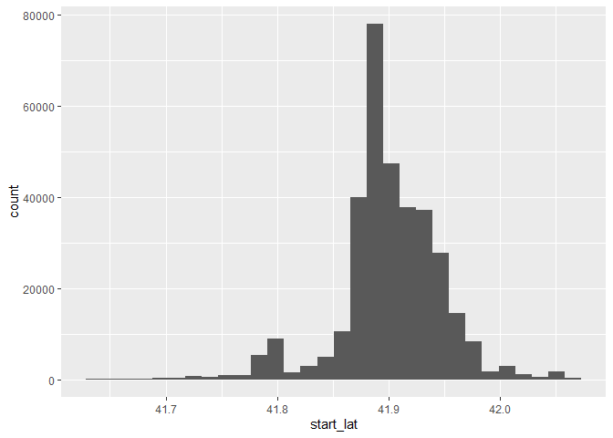
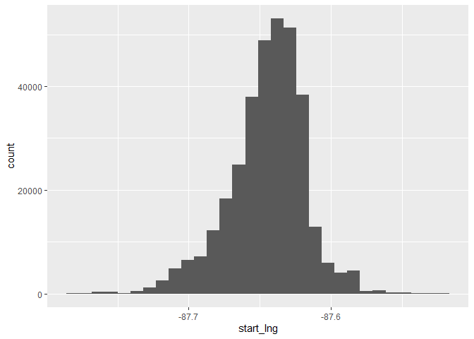
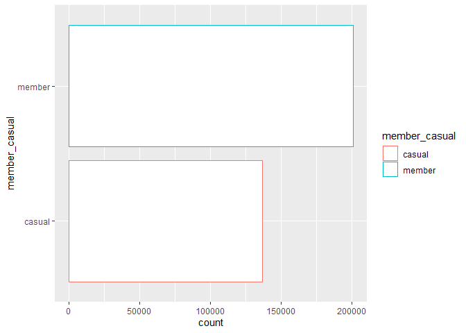
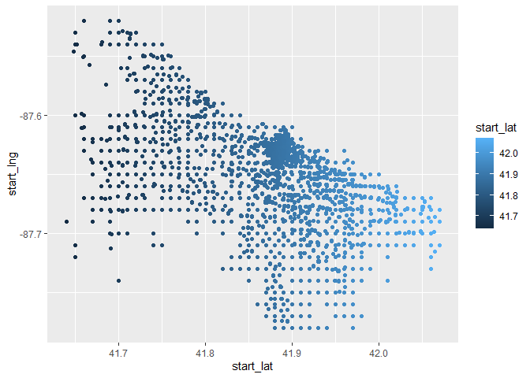
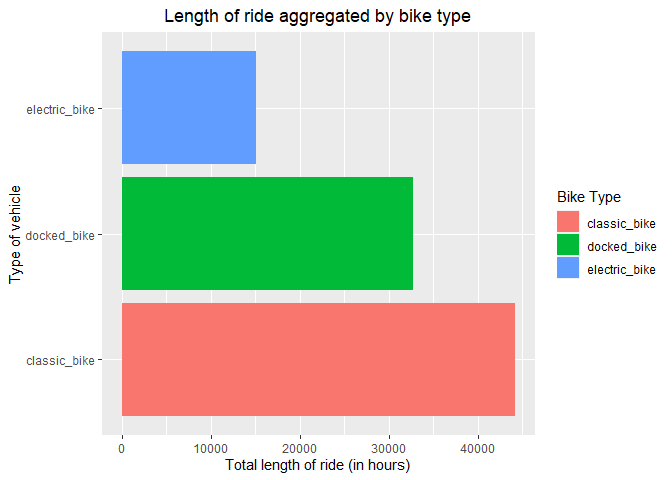
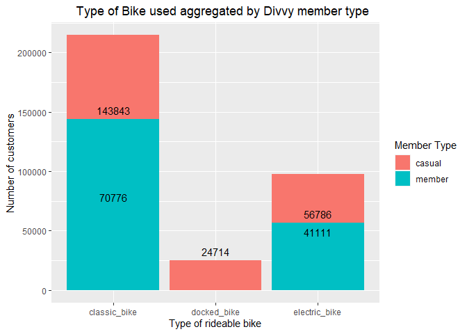

------------------------------------------------------------------------

title: “Data Analytics in R - Assignment 17” author: “Don Smith” output:
github_document

------------------------------------------------------------------------

# Data Visualization Assignment

#### Pick a dataset to import and analyze in R. Plot at least two graphs using ggplot 2; complete your analysis using these graphs.

### Summary

###### I will be using the Divvy system data dataset(<https://divvybikes.com/system-data>), which I loaded into the IDE using the read.csv() function. The data has 337230 observations (rows) and 13 variables (columns), and contains a plethora of different information about rider’s usage of Divvy bikes, including the number of members and casual riders, start and end times for individual rides, latitude and longitude information for each bike station, and station names and IDs. It is primarily used to measure customer behavior, including frequency of bike usage and the duration of bike trips. To make the dataset easier to work with, I converted the columns containing dates and times to the Time format from Char, and added a 14th column that contains the difference between the start time and end time of each ride in hours, essentially reflecting the time it takes to complete each ride.

#### Column names and data types

###### ride_id: chr

###### rideable_type: chr

###### started_at: POSIXct

###### ended_at: POSIXct

###### start_station_name: chr

###### start_station_id: chr

###### end_station_name: chr

###### end_station_id: chr

###### start_lat: num

###### start_lng: num

###### end_lat: num

###### end_lng: num

###### member_casual: chr

###### difference_hours: difftime

### Step 1: Read in data, initialize packages.

``` r
library(tidyverse)
```

    ## ── Attaching packages ─────────────────────────────────────── tidyverse 1.3.2 ──
    ## ✔ ggplot2 3.4.0     ✔ purrr   1.0.1
    ## ✔ tibble  3.1.8     ✔ dplyr   1.1.0
    ## ✔ tidyr   1.3.0     ✔ stringr 1.5.0
    ## ✔ readr   2.1.3     ✔ forcats 1.0.0
    ## ── Conflicts ────────────────────────────────────────── tidyverse_conflicts() ──
    ## ✖ dplyr::filter() masks stats::filter()
    ## ✖ dplyr::lag()    masks stats::lag()

``` r
library(dplyr)
library(lubridate)
```

    ## 
    ## Attaching package: 'lubridate'
    ## 
    ## The following objects are masked from 'package:base':
    ## 
    ##     date, intersect, setdiff, union

``` r
library(ggplot2)

# import dataset
divvy_data <- read.csv("C:\\Users\\Owner\\Documents\\GitHub\\r\\class assignments\\Data Analytics in R\\Assignment 17\\data\\divvy data.csv")
```

### Step 2: Clean data.

``` r
# Change data type from char to time type for started_at and ended_at columns. Also added a 14th column which is the difference between the start time and end time of each ride in hours, essentially reflecting the time it takes to complete each ride.
df <- divvy_data %>% mutate(started_at = ymd_hms(started_at), ended_at = ymd_hms(ended_at), difference_hours = round((ended_at-started_at)/3600, 0))

# print head and info about data                        
head(df)
```

    ##            ride_id rideable_type          started_at            ended_at
    ## 1 6C992BD37A98A63F  classic_bike 2021-04-12 18:25:36 2021-04-12 18:56:55
    ## 2 1E0145613A209000   docked_bike 2021-04-27 17:27:11 2021-04-27 18:31:29
    ## 3 E498E15508A80BAD   docked_bike 2021-04-03 12:42:45 2021-04-07 11:40:24
    ## 4 1887262AD101C604  classic_bike 2021-04-17 09:17:42 2021-04-17 09:42:48
    ## 5 C123548CAB2A32A5   docked_bike 2021-04-03 12:42:25 2021-04-03 14:13:42
    ## 6 097E76F3651B1AC1  classic_bike 2021-04-25 18:43:18 2021-04-25 18:43:59
    ##         start_station_name start_station_id             end_station_name
    ## 1    State St & Pearson St     TA1307000061 Southport Ave & Waveland Ave
    ## 2 Dorchester Ave & 49th St     KA1503000069     Dorchester Ave & 49th St
    ## 3    Loomis Blvd & 84th St            20121        Loomis Blvd & 84th St
    ## 4  Honore St & Division St     TA1305000034 Southport Ave & Waveland Ave
    ## 5    Loomis Blvd & 84th St            20121        Loomis Blvd & 84th St
    ## 6     Clinton St & Polk St            15542         Clinton St & Polk St
    ##   end_station_id start_lat start_lng  end_lat   end_lng member_casual
    ## 1          13235  41.89745 -87.62872 41.94815 -87.66394        member
    ## 2   KA1503000069  41.80577 -87.59246 41.80577 -87.59246        casual
    ## 3          20121  41.74149 -87.65841 41.74149 -87.65841        casual
    ## 4          13235  41.90312 -87.67394 41.94815 -87.66394        member
    ## 5          20121  41.74149 -87.65841 41.74149 -87.65841        casual
    ## 6          15542  41.87147 -87.64095 41.87147 -87.64095        casual
    ##   difference_hours
    ## 1           1 secs
    ## 2           1 secs
    ## 3          95 secs
    ## 4           0 secs
    ## 5           2 secs
    ## 6           0 secs

``` r
str(df)
```

    ## 'data.frame':    337230 obs. of  14 variables:
    ##  $ ride_id           : chr  "6C992BD37A98A63F" "1E0145613A209000" "E498E15508A80BAD" "1887262AD101C604" ...
    ##  $ rideable_type     : chr  "classic_bike" "docked_bike" "docked_bike" "classic_bike" ...
    ##  $ started_at        : POSIXct, format: "2021-04-12 18:25:36" "2021-04-27 17:27:11" ...
    ##  $ ended_at          : POSIXct, format: "2021-04-12 18:56:55" "2021-04-27 18:31:29" ...
    ##  $ start_station_name: chr  "State St & Pearson St" "Dorchester Ave & 49th St" "Loomis Blvd & 84th St" "Honore St & Division St" ...
    ##  $ start_station_id  : chr  "TA1307000061" "KA1503000069" "20121" "TA1305000034" ...
    ##  $ end_station_name  : chr  "Southport Ave & Waveland Ave" "Dorchester Ave & 49th St" "Loomis Blvd & 84th St" "Southport Ave & Waveland Ave" ...
    ##  $ end_station_id    : chr  "13235" "KA1503000069" "20121" "13235" ...
    ##  $ start_lat         : num  41.9 41.8 41.7 41.9 41.7 ...
    ##  $ start_lng         : num  -87.6 -87.6 -87.7 -87.7 -87.7 ...
    ##  $ end_lat           : num  41.9 41.8 41.7 41.9 41.7 ...
    ##  $ end_lng           : num  -87.7 -87.6 -87.7 -87.7 -87.7 ...
    ##  $ member_casual     : chr  "member" "casual" "casual" "member" ...
    ##  $ difference_hours  : 'difftime' num  1 1 95 0 ...
    ##   ..- attr(*, "units")= chr "secs"

``` r
# Check for NAs
cbind(
   lapply(
     lapply(df, is.na)
     , sum)
   )
```

    ##                    [,1]
    ## ride_id            0   
    ## rideable_type      0   
    ## started_at         0   
    ## ended_at           0   
    ## start_station_name 0   
    ## start_station_id   0   
    ## end_station_name   0   
    ## end_station_id     0   
    ## start_lat          0   
    ## start_lng          0   
    ## end_lat            267 
    ## end_lng            267 
    ## member_casual      0   
    ## difference_hours   0

``` r
# NAs are located in end_lat and end_lng columns. This is latitude and longitude data, which cannot be easily deleted or imputed. Since I will not be using these columns in my analysis, and removing the rows will impact the other data, I will leave them intact. (please don't take off points :))
```

### Step 3: Review data distribution and relationships between variables.

``` r
# univariate distributions for two numeric variables
options(scipen=999)
ggplot(df, aes(start_lat)) + geom_histogram()
```

    ## `stat_bin()` using `bins = 30`. Pick better value with `binwidth`.

<!-- -->

``` r
ggplot(df, aes(start_lng)) + geom_histogram()
```

    ## `stat_bin()` using `bins = 30`. Pick better value with `binwidth`.

<!-- -->

``` r
#Show distribution for at least two categorical variables
options(scipen=999)
ggplot(df, aes(member_casual, color = member_casual)) + geom_bar(fill="white") + coord_flip()
```

<!-- -->

``` r
# relationship between two numerical variables.
options(scipen=999)
ggplot(df, aes(start_lat, start_lng, color = start_lat)) + geom_point() 
```

<!-- -->

### Step 4: Main analysis using two graphs.

``` r
ggplot(df, aes(y=rideable_type, x=difference_hours, fill=rideable_type)) +
  geom_bar(stat="identity")  + xlab("Total length of ride (in hours)") + ylab("Type of vehicle") + ggtitle("Length of ride aggregated by bike type") + theme(plot.title = element_text(hjust = 0.5)) + scale_fill_discrete(name = "Bike Type") 
```

    ## Don't know how to automatically pick scale for object of type <difftime>.
    ## Defaulting to continuous.

<!-- -->

###### For this visualization, I used three colors to differentiate each bike type. I went back and forth between deciding on whether I wanted to use minutes or hours for the ride length, but ultimately settled on hours since the total number of hours will be a smaller, easier to digest number than total number of minutes. I used a pleasant pyramid shape to bring balance overall to the visual, with the largest bar being at the bottom, and the shortest at the top. The visual shows that users have clocked the most hours on classic bikes, followed by docked bikes, and the least amount of hours on electric bikes.

``` r
ggplot(df, aes(x= rideable_type, fill = member_casual))+ geom_bar() + xlab("Type of rideable bike") + ylab("Number of customers") + ggtitle("Type of Bike used aggregated by Divvy member type") + theme(plot.title = element_text(hjust = 0.7)) + scale_fill_discrete(name = "Member Type") + geom_text(stat='count', aes(label=..count..),vjust=-.6)
```

    ## Warning: The dot-dot notation (`..count..`) was deprecated in ggplot2 3.4.0.
    ## ℹ Please use `after_stat(count)` instead.

<!-- -->

###### For this visualization, I used two colors to differentiate each user type, Member and Casual. I added totals to each of the bars to make interpreting the graph easier. The visual shows that more customers use classic bikes than the other bikes. It also shows that Members don’t use docked bikes at all, only Casual users. I left the docked bike bar in the center of the image to emphasize this interesting insight.
