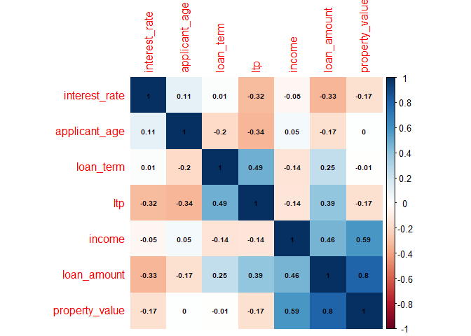
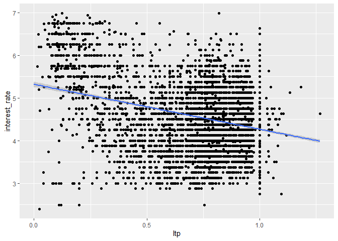
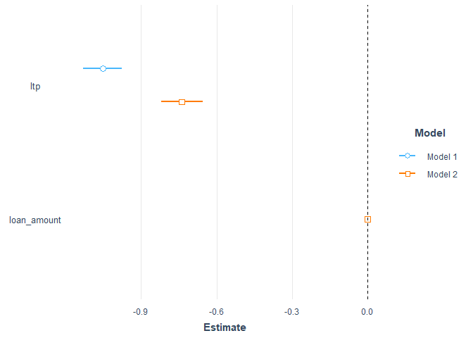
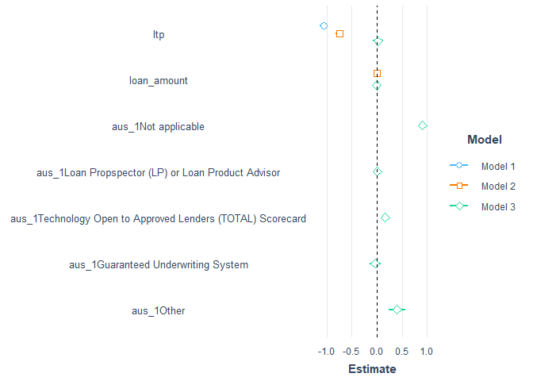

------------------------------------------------------------------------

title: “Data Analytics in R - Assignment 18” author: “Don Smith” output:
github_document

------------------------------------------------------------------------

# Part 1

### 1. Create a code chunk to complete the following tasks:

    Load the following packages: tidyverse, magrittr, lubridate, and corrplot. (You may need to install those packages if you have not already done so.)
    Read in the hmdaInterestRate.rds file.
    Report the structure of the dataframe. (No need to comment on the structure.)

``` r
library(magrittr)
library(tidyverse)
```

    ## ── Attaching packages ─────────────────────────────────────── tidyverse 1.3.2 ──
    ## ✔ ggplot2 3.4.0     ✔ purrr   1.0.1
    ## ✔ tibble  3.1.8     ✔ dplyr   1.1.0
    ## ✔ tidyr   1.3.0     ✔ stringr 1.5.0
    ## ✔ readr   2.1.3     ✔ forcats 1.0.0
    ## ── Conflicts ────────────────────────────────────────── tidyverse_conflicts() ──
    ## ✖ tidyr::extract()   masks magrittr::extract()
    ## ✖ dplyr::filter()    masks stats::filter()
    ## ✖ dplyr::lag()       masks stats::lag()
    ## ✖ purrr::set_names() masks magrittr::set_names()

``` r
library(lubridate)
```

    ## 
    ## Attaching package: 'lubridate'
    ## 
    ## The following objects are masked from 'package:base':
    ## 
    ##     date, intersect, setdiff, union

``` r
library(corrplot)
```

    ## corrplot 0.92 loaded

``` r
library(tidyverse)
library(jtools)
library(ggstance)
```

    ## 
    ## Attaching package: 'ggstance'
    ## 
    ## The following objects are masked from 'package:ggplot2':
    ## 
    ##     geom_errorbarh, GeomErrorbarh

``` r
library(huxtable)
```

    ## 
    ## Attaching package: 'huxtable'
    ## 
    ## The following object is masked from 'package:dplyr':
    ## 
    ##     add_rownames
    ## 
    ## The following object is masked from 'package:ggplot2':
    ## 
    ##     theme_grey

``` r
library(corrplot)
```

### 2. Read in data.

``` r
df<- readRDS('C:\\Users\\Owner\\Documents\\GitHub\\r\\class assignments\\Data Analytics in R\\Assignment 18\\data\\hmdaInterestRate.rds')

str(df)
```

    ## 'data.frame':    6509 obs. of  14 variables:
    ##  $ activity_year            : Factor w/ 2 levels "2019","2018": 2 2 2 2 2 2 2 2 2 2 ...
    ##  $ state_code               : Factor w/ 1 level "IL": 1 1 1 1 1 1 1 1 1 1 ...
    ##  $ county_code              : Factor w/ 3 levels "Missing","Coles",..: 1 1 1 1 2 1 1 1 1 1 ...
    ##  $ aus_1                    : Factor w/ 6 levels "Desktop Underwriter (DU)",..: 2 1 3 4 1 4 1 1 1 1 ...
    ##  $ loan_purpose             : Factor w/ 6 levels "Home purchase",..: 2 3 1 1 3 3 1 1 1 1 ...
    ##  $ applicant_ethnicity_1    : Factor w/ 8 levels "Not Hispanic or Latino",..: 2 1 1 1 2 1 1 1 1 1 ...
    ##  $ applicant_sex            : Factor w/ 4 levels "Male","Female",..: 1 2 1 1 3 1 1 1 2 1 ...
    ##  $ derived_loan_product_type: Factor w/ 6 levels "Conventional:First Lien",..: 1 1 1 2 4 2 1 1 1 1 ...
    ##  $ interest_rate            : num  3.62 4.99 4.12 4.25 3.99 ...
    ##  $ loan_amount              : num  185000 105000 255000 255000 95000 205000 235000 105000 275000 75000 ...
    ##  $ loan_term                : num  180 360 360 360 240 360 360 360 360 360 ...
    ##  $ property_value           : num  235000 215000 265000 255000 105000 265000 335000 265000 285000 85000 ...
    ##  $ income                   : num  154000 88000 66000 89000 81000 61000 84000 76000 160000 35000 ...
    ##  $ applicant_age            : num  50 50 30 50 60 40 30 50 30 30 ...

# Part 2

### Data preparation:

    Replace the values in the following columns with the same value divided by 1,000: loan_amount, property_value, and income. (This will make it easier to see the impact on the interest rate.)
    Create a new column, ltp, that is equal to the values in the loan_amount column divided by the values in the property_value column.
    Filter the data to keep observations for which income is less than 300 (i.e., $300,000).
    Report a summary of all columns. (No need to comment on the summary of the columns.)

``` r
df1<-df%>% mutate(loan_amount= loan_amount/1000, property_value= property_value/1000, income= income/1000, ltp= loan_amount/property_value ) %>% filter(income<300)

summary(df1$income)
```

    ##    Min. 1st Qu.  Median    Mean 3rd Qu.    Max. 
    ##    1.00   51.00   77.00   89.31  114.00  299.00

# Part 3

### Create a correlation plot of the following columns: interest_rate, ltp, income, applicant_age, property_value, and loan_amount.

    Below the plot, identify what variable has the strongest negative correlation with interest_rate. Comment on what might explain why that correlation is negative.

``` r
ctrd<- cor(df1%>% select(where(is.numeric))) 
ctrd
```

    ##                interest_rate loan_amount   loan_term property_value      income
    ## interest_rate     1.00000000  -0.3315022  0.01172133   -0.166590831 -0.04683836
    ## loan_amount      -0.33150222   1.0000000  0.24620789    0.800078124  0.46424427
    ## loan_term         0.01172133   0.2462079  1.00000000   -0.007217110 -0.14293619
    ## property_value   -0.16659083   0.8000781 -0.00721711    1.000000000  0.58661218
    ## income           -0.04683836   0.4642443 -0.14293619    0.586612176  1.00000000
    ## applicant_age     0.10951662  -0.1685192 -0.19839595    0.003786898  0.04508598
    ## ltp              -0.31885873   0.3903140  0.48804566   -0.165825527 -0.13544451
    ##                applicant_age        ltp
    ## interest_rate    0.109516616 -0.3188587
    ## loan_amount     -0.168519166  0.3903140
    ## loan_term       -0.198395945  0.4880457
    ## property_value   0.003786898 -0.1658255
    ## income           0.045085985 -0.1354445
    ## applicant_age    1.000000000 -0.3390765
    ## ltp             -0.339076509  1.0000000

``` r
corrplot(ctrd, method = 'color' , order = 'hclust', addCoef.col = 'black',number.cex = .6)
```

<!-- -->

###### By looking at the plot, the variable that has the strongest negative correlation with interest rate is loan amount. This value (-0.33) represents a moderate negative correlation. This makes sense because higher loan amounts are typically taken by wealthier individuals who are low-risk for the lender, so the lender gives a lower interest rate. It’s worth noting that interest rate and “ltp” also had a moderate negative correlation (-0.32)

# Part 4

### Regress interest rate on ltp. Interpret the coefficient estimate on ltp.

``` r
Model1<- lm(interest_rate~ltp, data=df1) 
summary(Model1)
```

    ## 
    ## Call:
    ## lm(formula = interest_rate ~ ltp, data = df1)
    ## 
    ## Residuals:
    ##     Min      1Q  Median      3Q     Max 
    ## -2.8933 -0.5055  0.0285  0.4834  2.5221 
    ## 
    ## Coefficients:
    ##             Estimate Std. Error t value Pr(>|t|)    
    ## (Intercept)  5.31852    0.03147  168.98   <2e-16 ***
    ## ltp         -1.05188    0.03950  -26.63   <2e-16 ***
    ## ---
    ## Signif. codes:  0 '***' 0.001 '**' 0.01 '*' 0.05 '.' 0.1 ' ' 1
    ## 
    ## Residual standard error: 0.7182 on 6265 degrees of freedom
    ## Multiple R-squared:  0.1017, Adjusted R-squared:  0.1015 
    ## F-statistic: 709.1 on 1 and 6265 DF,  p-value: < 2.2e-16

``` r
ggplot(df1, aes(x = ltp, y = interest_rate)) +
  geom_point() +
  expand_limits(x = c(0,1)) +
  stat_smooth(method = 'lm', fullrange = T)
```

    ## `geom_smooth()` using formula = 'y ~ x'

<!-- -->

###### As ltp increases by one unit, the interest rate decreases by 1.05.

# Part 5

### Regress interest rate on ltp and loan_amount. Comment on the change in the adjusted R-squared, as well as the change in the coefficient on ltp.

``` r
Model2<- lm(interest_rate ~ltp +loan_amount, data=df1)
summary(Model2)
```

    ## 
    ## Call:
    ## lm(formula = interest_rate ~ ltp + loan_amount, data = df1)
    ## 
    ## Residuals:
    ##      Min       1Q   Median       3Q      Max 
    ## -2.93510 -0.47999  0.03926  0.46210  2.29461 
    ## 
    ## Coefficients:
    ##               Estimate Std. Error t value Pr(>|t|)    
    ## (Intercept)  5.3848432  0.0307701  175.00   <2e-16 ***
    ## ltp         -0.7373702  0.0416838  -17.69   <2e-16 ***
    ## loan_amount -0.0021367  0.0001105  -19.33   <2e-16 ***
    ## ---
    ## Signif. codes:  0 '***' 0.001 '**' 0.01 '*' 0.05 '.' 0.1 ' ' 1
    ## 
    ## Residual standard error: 0.6978 on 6264 degrees of freedom
    ## Multiple R-squared:  0.1522, Adjusted R-squared:  0.152 
    ## F-statistic: 562.5 on 2 and 6264 DF,  p-value: < 2.2e-16

``` r
export_summs(Model1, Model2)
```

    ## Warning in knit_print.huxtable(x, ...): Unrecognized output format "gfm+tex". Using `to_screen` to print huxtables.
    ## Set options("huxtable.knitr_output_format") manually to "latex", "html", "rtf", "docx", "pptx", "md" or "screen".

              ────────────────────────────────────────────────────
                                    Model 1          Model 2      
                               ───────────────────────────────────
                (Intercept)            5.32 ***         5.38 ***  
                                      (0.03)           (0.03)     
                ltp                   -1.05 ***        -0.74 ***  
                                      (0.04)           (0.04)     
                loan_amount                            -0.00 ***  
                                                       (0.00)     
                               ───────────────────────────────────
                N                   6267             6267         
                R2                     0.10             0.15      
              ────────────────────────────────────────────────────
                *** p < 0.001; ** p < 0.01; * p < 0.05.           

Column names: names, Model 1, Model 2

``` r
plot_summs(Model1, Model2)
```

<!-- -->

###### The change in coefficient is -1.05 for model 1 and -.74 for model 2 this means that model 1 has a stronger negative correlation than model 2.The difference between the two models in adjusted r squared is .1 for model 1 and .1522 for model 2. Model 2 can now explain more variation in interest rate than it could before. Model 1 can only explain 10% of the variation in interest rate.

# Part 6

### Regress interest rate on ltp, loan_amount, and aus_1. Interpret the new coefficients.

``` r
Model3<- lm(interest_rate~ltp +loan_amount +aus_1, data=df1)
summary(Model3)
```

    ## 
    ## Call:
    ## lm(formula = interest_rate ~ ltp + loan_amount + aus_1, data = df1)
    ## 
    ## Residuals:
    ##      Min       1Q   Median       3Q      Max 
    ## -3.06937 -0.44178  0.04104  0.44611  2.33427 
    ## 
    ## Coefficients:
    ##                                                             Estimate Std. Error
    ## (Intercept)                                                 4.589412   0.039711
    ## ltp                                                         0.025007   0.048639
    ## loan_amount                                                -0.001714   0.000106
    ## aus_1Not applicable                                         0.905072   0.030109
    ## aus_1Loan Propspector (LP) or Loan Product Advisor          0.007257   0.020211
    ## aus_1Technology Open to Approved Lenders (TOTAL) Scorecard  0.166965   0.032965
    ## aus_1Guaranteed Underwriting System                        -0.032727   0.054296
    ## aus_1Other                                                  0.403022   0.085503
    ##                                                            t value Pr(>|t|)    
    ## (Intercept)                                                115.571  < 2e-16 ***
    ## ltp                                                          0.514    0.607    
    ## loan_amount                                                -16.174  < 2e-16 ***
    ## aus_1Not applicable                                         30.060  < 2e-16 ***
    ## aus_1Loan Propspector (LP) or Loan Product Advisor           0.359    0.720    
    ## aus_1Technology Open to Approved Lenders (TOTAL) Scorecard   5.065 4.20e-07 ***
    ## aus_1Guaranteed Underwriting System                         -0.603    0.547    
    ## aus_1Other                                                   4.714 2.49e-06 ***
    ## ---
    ## Signif. codes:  0 '***' 0.001 '**' 0.01 '*' 0.05 '.' 0.1 ' ' 1
    ## 
    ## Residual standard error: 0.6489 on 6259 degrees of freedom
    ## Multiple R-squared:  0.2675, Adjusted R-squared:  0.2667 
    ## F-statistic: 326.6 on 7 and 6259 DF,  p-value: < 2.2e-16

``` r
export_summs(Model1, Model2, Model3)
```

    ## Warning in knit_print.huxtable(x, ...): Unrecognized output format "gfm+tex". Using `to_screen` to print huxtables.
    ## Set options("huxtable.knitr_output_format") manually to "latex", "html", "rtf", "docx", "pptx", "md" or "screen".

         ──────────────────────────────────────────────────────────────
                                Model 1       Model 2       Model 3    
                            ───────────────────────────────────────────
           (Intercept)           5.32 ***      5.38 ***      4.59 ***  
                                (0.03)        (0.03)        (0.04)     
           ltp                  -1.05 ***     -0.74 ***      0.03      
                                (0.04)        (0.04)        (0.05)     
           loan_amount                        -0.00 ***     -0.00 ***  
                                              (0.00)        (0.00)     
           aus_1Not                                          0.91 ***  
           applicable                                                  
                                                            (0.03)     
           aus_1Loan                                         0.01      
           Propspector (LP)                                            
           or Loan Product                                             
           Advisor                                                     
                                                            (0.02)     
           aus_1Technology                                   0.17 ***  
           Open to Approved                                            
           Lenders (TOTAL)                                             
           Scorecard                                                   
                                                            (0.03)     
           aus_1Guaranteed                                  -0.03      
           Underwriting                                                
           System                                                      
                                                            (0.05)     
           aus_1Other                                        0.40 ***  
                                                            (0.09)     
                            ───────────────────────────────────────────
           N                  6267          6267          6267         
           R2                    0.10          0.15          0.27      
         ──────────────────────────────────────────────────────────────
           *** p < 0.001; ** p < 0.01; * p < 0.05.                     

Column names: names, Model 1, Model 2, Model 3

``` r
plot_summs(Model1, Model2, Model3)
```

<!-- -->

###### As we add model 3 to the regression, the r^2 value increased from .1 to .15 to .27. This tells us that model 3 now accounts for 27% of the variation in interest rate. As we add more significant predictive variables, we expect the r^2 value to increase.
