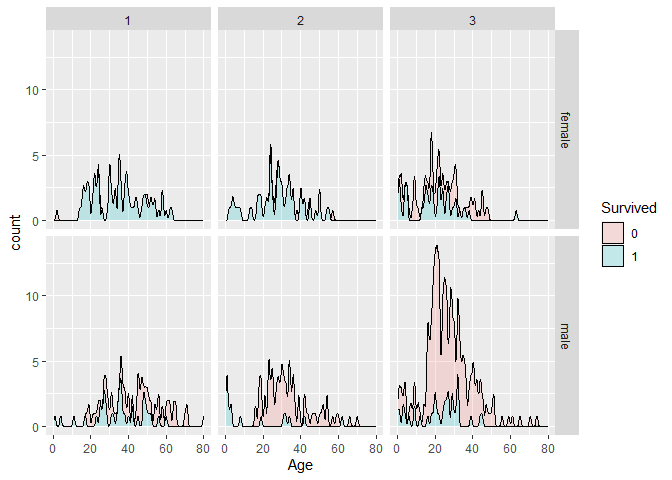
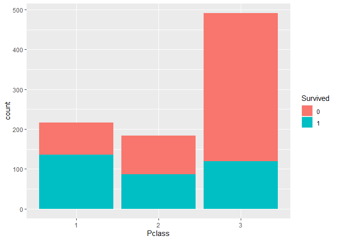
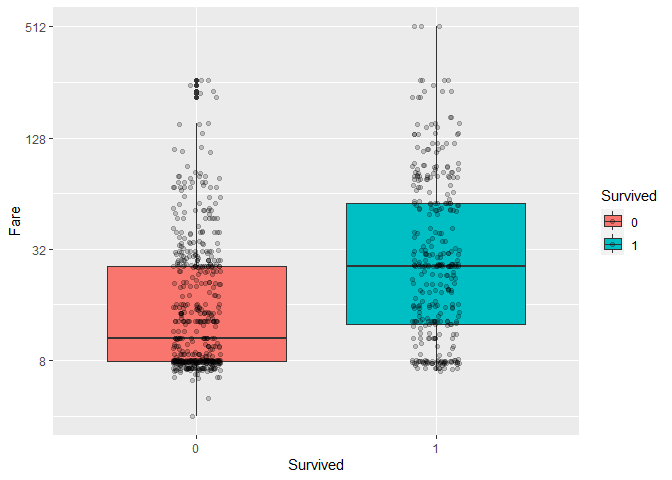

------------------------------------------------------------------------

title: “Data Analytics in R - Assignment 9” author: “Don Smith” output:
github_document

------------------------------------------------------------------------

## Question 1: Read in Titanic data.

``` r
library(dplyr)
```

    ## 
    ## Attaching package: 'dplyr'

    ## The following objects are masked from 'package:stats':
    ## 
    ##     filter, lag

    ## The following objects are masked from 'package:base':
    ## 
    ##     intersect, setdiff, setequal, union

``` r
library(ggplot2)
library(dslabs)
library(tidyverse)
```

    ## ── Attaching packages ─────────────────────────────────────── tidyverse 1.3.2
    ## ──

    ## ✔ tibble  3.1.8     ✔ purrr   1.0.1
    ## ✔ tidyr   1.3.0     ✔ stringr 1.5.0
    ## ✔ readr   2.1.3     ✔ forcats 1.0.0
    ## ── Conflicts ────────────────────────────────────────── tidyverse_conflicts() ──
    ## ✖ dplyr::filter() masks stats::filter()
    ## ✖ dplyr::lag()    masks stats::lag()

``` r
#Read in data
#Note: For the purposes of this assignment, data has been truncated
titanic_train <- read.csv("C:\\Users\\Owner\\Documents\\GitHub\\r\\class assignments\\Data Analytics in R\\Assignment 9\\data\\titanic_data.csv")
head(titanic_train)
```

    ##   PassengerId Survived Pclass
    ## 1           1        0      3
    ## 2           2        1      1
    ## 3           3        1      3
    ## 4           4        1      1
    ## 5           5        0      3
    ## 6           6        0      3
    ##                                                  Name    Sex Age SibSp Parch
    ## 1                             Braund, Mr. Owen Harris   male  22     1     0
    ## 2 Cumings, Mrs. John Bradley (Florence Briggs Thayer) female  38     1     0
    ## 3                              Heikkinen, Miss. Laina female  26     0     0
    ## 4        Futrelle, Mrs. Jacques Heath (Lily May Peel) female  35     1     0
    ## 5                            Allen, Mr. William Henry   male  35     0     0
    ## 6                                    Moran, Mr. James   male  NA     0     0
    ##             Ticket    Fare Cabin Embarked
    ## 1        A/5 21171  7.2500              S
    ## 2         PC 17599 71.2833   C85        C
    ## 3 STON/O2. 3101282  7.9250              S
    ## 4           113803 53.1000  C123        S
    ## 5           373450  8.0500              S
    ## 6           330877  8.4583              Q

## Question 2: Filter data set to isolate columns c(Survived, Pclass, Sex, Age, SibSp, Parch, Fare).

``` r
#Isolated requisite columns, and converted Survived, Pclass and Sex to factors for future use
titanic <- titanic_train %>%
  select(Survived, Pclass, Sex, Age, SibSp, Parch, Fare) %>%
  mutate(Survived = factor(Survived),
         Pclass = factor(Pclass),
         Sex = factor(Sex))

head(titanic)
```

    ##   Survived Pclass    Sex Age SibSp Parch    Fare
    ## 1        0      3   male  22     1     0  7.2500
    ## 2        1      1 female  38     1     0 71.2833
    ## 3        1      3 female  26     0     0  7.9250
    ## 4        1      1 female  35     1     0 53.1000
    ## 5        0      3   male  35     0     0  8.0500
    ## 6        0      3   male  NA     0     0  8.4583

## Question 3: Determine the number of survivers vs non-survivers aggregated by class.

``` r
#Counting number of survived/died by class
survived1 <- count(titanic %>% filter(Pclass == 1, Survived == 1))
died1 <- count(titanic %>% filter(Pclass == 1,Survived == 0))

survived2 <- count(titanic %>% filter(Pclass == 2, Survived == 1))
died2 <- count(titanic %>% filter(Pclass == 2,Survived == 0))

survived3 <- count(titanic %>% filter(Pclass == 3, Survived == 1))
died3 <- count(titanic %>% filter(Pclass == 3,Survived == 0))


# Loading data into data.frame for easier viewing
table_data <- data.frame(
  Row_names = character(),
  FirstClass = integer(),
  SecondClass= integer(),
  Thirdclass= integer())

table_data[1,] <- c('Survived', as.integer(survived1), as.integer(survived2), as.integer(survived3))
table_data[2,] <- c('Died', as.integer(died1), as.integer(died2), as.integer(died3))

table_data
```

    ##   Row_names FirstClass SecondClass Thirdclass
    ## 1  Survived        136          87        119
    ## 2      Died         80          97        372

## Question 4: Create a density plot showing survivers vs non-survivers.

``` r
titanic %>%  ggplot(aes(Age, fill = Survived)) +
  geom_density(aes(y = ..count..), alpha = 0.2, bw = 0.5, position = "stack")
```

    ## Warning: The dot-dot notation (`..count..`) was deprecated in ggplot2 3.4.0.
    ## ℹ Please use `after_stat(count)` instead.

    ## Warning: Removed 177 rows containing non-finite values (`stat_density()`).

<!-- -->

## Question 5: Create a density plot showing survivers vs non-survivers, aggregated by class, gender and age.

``` r
titanic %>%  ggplot(aes(Age, fill = Survived)) +
  geom_density(aes(y = ..count..), alpha = 0.2, bw = 0.5, position = "stack") + facet_grid(Sex~Pclass)
```

    ## Warning: Removed 177 rows containing non-finite values (`stat_density()`).

<!-- -->

## Question 6: Create a bar graph showing the number of survivers vs non-survivers, aggregated by class.

``` r
titanic %>% ggplot(aes(Pclass, fill = Survived)) + geom_bar()
```

<!-- -->

## Question 7: Create a box plot of survivers vs non-survivers, aggregated by fare price.

``` r
titanic %>% filter(Fare >0) %>% 
  ggplot(aes(Survived, Fare, fill = Survived)) + scale_y_continuous(trans = "log2") + geom_boxplot() + geom_jitter(width = 0.1, alpha = 0.2) 
```

<!-- -->
