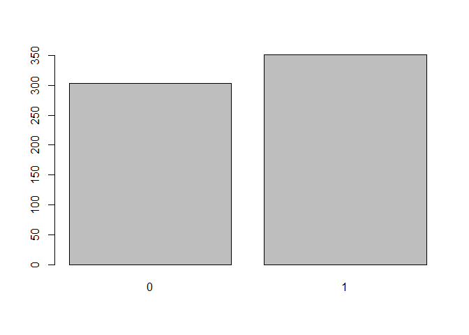
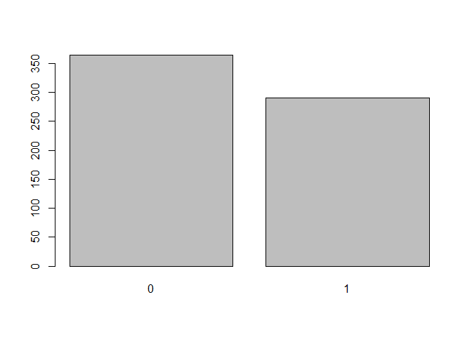

------------------------------------------------------------------------

title: “Introduction to Statistical Modeling - Assignment 1” author:
“Don Smith” output: github_document

------------------------------------------------------------------------

## Question 2.1

###### Describe a situation or problem from your job, everyday life, current events, etc., for which a classification model would be appropriate. List some (up to 5) predictors that you might use.

> ##### 1. A customer service representative determining whether a warranty claim placed by a customer for a defective product for a replacement is valid or invalid, using the following criteria: a. Whether the product is in warranty; b. Whether the product damage or defect is covered under company policy; c. Whether the customer has received more than two replacements within a 6 month period, with two replacements being the cut off for customers.
>
> ##### 2. A financial analyst determining whether or not a stock will go up several dollars after an earnings call, or down several dollars after an earnings call, using data from previous quarters earnings, as well as last year’s earnings to build out their predictive model.
>
> ##### 3. An employer determining which employees to lay off to offset the financial impact of the COVID 19 pandemic, using KPIs to determine productivity and past projects to determine overall impact to the organization during their tenure.

## Question 2.2

###### The files credit_card_data.txt (without headers) and credit_card_data-headers.txt (with headers) contain a dataset with 654 data points, 6 continuous and 4 binary predictor variables. It has anonymized credit card applications with a binary response variable (last column) indicating if the application was positive or negative. The dataset is the “Credit Approval Data Set” from the UCI Machine Learning Repository (<https://archive.ics.uci.edu/ml/datasets/Credit+Approval>) without the categorical variables and without data points that have missing values.

### Question 2.2.1

###### Using the support vector machine function ksvm contained in the R package kernlab, find a good classifier for this data. Show the equation of your classifier, and how well it classifies the data points in the full data set. (Don’t worry about test/validation data yet; we’ll cover that topic soon.)

``` r
library(kernlab)
library(kknn)
library(dplyr)
```

    ## 
    ## Attaching package: 'dplyr'

    ## The following objects are masked from 'package:stats':
    ## 
    ##     filter, lag

    ## The following objects are masked from 'package:base':
    ## 
    ##     intersect, setdiff, setequal, union

``` r
library(readr)
library(rmarkdown)
library(tinytex)
library(knitr)

data <- read.table("C:\\Users\\Owner\\Documents\\Github\\r\\class assignments\\Introduction to Statistical Modeling\\Assignment 1\\data\\data 2.2\\credit_card_data-headers.txt", header=T)

head(data)
```

    ##   A1    A2    A3   A8 A9 A10 A11 A12 A14 A15 R1
    ## 1  1 30.83 0.000 1.25  1   0   1   1 202   0  1
    ## 2  0 58.67 4.460 3.04  1   0   6   1  43 560  1
    ## 3  0 24.50 0.500 1.50  1   1   0   1 280 824  1
    ## 4  1 27.83 1.540 3.75  1   0   5   0 100   3  1
    ## 5  1 20.17 5.625 1.71  1   1   0   1 120   0  1
    ## 6  1 32.08 4.000 2.50  1   1   0   0 360   0  1

``` r
opts_chunk$set(tidy.opts=list(width.cutoff=80), tidy=TRUE)
```

``` r
# Calling ksvm function. Vanilladot is a simple linear kernel will use to model data. Documentation: https://www.rdocumentation.org/packages/kernlab/versions/0.9-29/topics/ksvm

# Using seed to generate reproducible results

set.seed(15)

vanilladot_model <- ksvm(as.matrix(data[ ,1:10]), as.factor(data[,11]), type="C-svc", kernel="vanilladot", C=100, scaled=TRUE)
```

    ##  Setting default kernel parameters

``` r
# calculate a1.am

a <- colSums(vanilladot_model@xmatrix[[1]] * vanilladot_model@coef[[1]])
print(a)
```

    ##            A1            A2            A3            A8            A9 
    ## -0.0010065348 -0.0011729048 -0.0016261967  0.0030064203  1.0049405641 
    ##           A10           A11           A12           A14           A15 
    ## -0.0028259432  0.0002600295 -0.0005349551 -0.0012283758  0.1063633995

``` r
# calculate a0

a0 <- (-vanilladot_model@b)
print(a0)
```

    ## [1] 0.08158492

``` r
# Using predict() function to see what the model predicts

pred <- predict(vanilladot_model,data[,1:10])
print(pred)
```

    ##   [1] 1 1 1 1 1 1 1 1 1 1 0 1 1 0 1 1 1 1 1 1 1 1 1 1 1 1 1 1 1 1 1 1 1 1 1 1 1
    ##  [38] 1 1 1 1 1 1 1 1 1 1 1 0 0 1 1 1 1 1 1 1 1 0 1 1 1 1 1 1 1 1 1 1 1 1 1 1 0
    ##  [75] 1 1 1 1 1 1 1 1 1 1 1 1 1 1 1 1 1 1 1 1 1 1 1 1 1 1 1 1 1 1 1 1 1 1 1 1 1
    ## [112] 1 1 1 1 1 1 1 1 1 1 1 1 1 1 1 1 1 1 1 1 1 1 1 1 1 1 1 1 1 1 1 1 1 1 1 1 1
    ## [149] 1 1 1 1 1 1 1 1 1 1 1 1 1 1 1 1 0 1 1 1 1 1 1 1 1 1 1 1 1 1 1 1 1 1 1 1 1
    ## [186] 1 1 1 1 1 1 1 1 1 1 1 1 1 1 1 1 1 1 1 1 1 1 1 1 1 1 1 1 1 1 1 1 1 1 1 0 1
    ## [223] 1 1 1 1 1 1 1 1 1 1 1 1 1 1 1 1 1 1 1 1 1 1 1 0 0 0 0 0 0 0 0 0 0 0 0 0 1
    ## [260] 0 0 0 0 0 0 0 0 1 0 0 0 0 0 0 0 0 0 0 0 0 0 0 0 0 0 0 0 0 0 0 0 0 1 0 0 0
    ## [297] 0 0 0 0 0 0 1 0 1 0 0 0 0 0 1 0 0 0 0 0 0 0 0 0 0 0 0 0 0 0 0 0 0 0 0 1 0
    ## [334] 0 0 0 0 0 0 0 0 0 0 0 0 0 0 0 0 0 0 0 0 0 0 0 0 0 0 0 0 0 0 0 0 0 0 0 0 0
    ## [371] 0 0 0 0 0 0 0 0 0 0 0 0 0 0 0 0 0 0 0 0 0 0 0 0 0 0 0 0 0 0 0 0 0 0 0 0 0
    ## [408] 0 0 0 0 0 0 0 0 0 0 0 0 0 0 0 0 0 0 0 0 0 0 0 0 0 0 0 0 0 0 0 0 0 0 0 0 0
    ## [445] 0 0 0 0 0 0 0 0 0 0 0 0 0 0 0 0 0 0 0 0 0 1 1 1 1 1 1 1 1 1 1 1 1 1 1 1 1
    ## [482] 1 1 1 1 1 1 1 1 1 1 1 1 1 1 1 1 1 1 1 1 1 1 1 1 1 1 1 1 1 1 1 1 1 1 1 1 1
    ## [519] 1 1 1 1 1 1 1 1 1 1 1 1 1 1 1 1 1 1 1 1 1 1 1 1 1 1 1 1 1 1 1 1 1 1 1 0 1
    ## [556] 1 1 1 1 1 1 1 1 1 0 1 1 1 1 1 1 0 0 1 0 0 0 0 0 0 0 0 0 0 0 0 0 1 0 0 0 0
    ## [593] 0 0 0 0 0 0 0 0 0 0 0 0 0 0 0 0 0 0 0 0 0 0 0 0 0 0 1 0 0 0 0 0 0 0 0 0 0
    ## [630] 0 0 0 0 0 0 0 0 0 0 0 0 0 0 0 0 0 0 0 0 0 0 0 0 0
    ## Levels: 0 1

``` r
pred_1 <- table(pred, data$R1) # Categorical tabulation of predictions compared against the data set column "R1", showing the variable and its frequency.

print(pred_1)
```

    ##     
    ## pred   0   1
    ##    0 286  17
    ##    1  72 279

``` r
# Plotting predictions using bar graph to better visualize outcome

barplot(table(factor(pred, levels=0:1)))
```

<!-- -->

``` r
# see what fraction of the model's predictions match the actual classification

vanilladot_model_match <- sum(pred == data[,11]) / nrow(data)
print(vanilladot_model_match)
```

    ## [1] 0.8639144

> ##### After experimenting with the C value, I’ve determined that any C greater than 600, or less than 0.001, had a decreasing accuracy rate which bottomed out at around 54.74%. Anything within this range hovered around an acceptable 86.39144%. I was unable to achieve an accuracy rate higher than this. **In summation, 0.001≤ C ≤ 600 will return a model accuracy rate of 86.39144%, and any values outside this range have a decreasing rate of accuracy bottoming out at 54.74%.**

> #### The equation of a classifier is y = a0 + a1V1 + a2V2 + … + a10V10

### Question 2.2.2

###### You are welcome, but not required, to try other (nonlinear) kernels as well; we’re not covering them in this course, but they can sometimes be useful and might provide better predictions than vanilladot.

``` r
# call ksvm. Added the rbfdot, or Gaussian Radial Basis kernel to attempt to get a higher accuracy rating

rbfdot_model <- ksvm(as.matrix(data[ ,1:10]), as.factor(data[,11]), type="C-svc", kernel="rbfdot", C=66.55, scaled=TRUE)
```

``` r
# calculate a1.am

a <- colSums(rbfdot_model@xmatrix[[1]] * rbfdot_model@coef[[1]])
print(a)
```

    ##        A1        A2        A3        A8        A9       A10       A11       A12 
    ## -13.45583 -34.77273  -7.49616  50.52958  42.37694 -17.86009  11.82490 -18.71729 
    ##       A14       A15 
    ## -51.35149  46.33728

``` r
# calculate a0

a0 <- (-rbfdot_model@b)
print(a0)
```

    ## [1] 0.773827

``` r
# Using predict() fuction to see what the model predicts

pred <- predict(rbfdot_model,data[,1:10])
print(pred)
```

    ##   [1] 1 1 0 1 1 0 1 1 1 1 0 1 1 1 1 1 1 1 1 1 1 0 1 1 1 1 1 1 1 1 1 1 1 1 1 1 1
    ##  [38] 1 1 1 1 1 1 1 1 1 1 1 0 0 1 0 1 0 1 0 1 1 1 1 1 1 1 1 1 1 1 1 1 1 0 0 0 0
    ##  [75] 0 0 0 1 1 0 0 0 0 0 1 0 0 0 0 0 1 0 0 0 0 0 0 1 0 1 0 0 0 0 0 1 0 0 0 1 0
    ## [112] 0 1 1 1 1 1 1 1 1 1 1 1 1 1 1 1 1 1 1 1 1 1 1 1 1 1 1 1 1 1 1 1 1 1 1 1 1
    ## [149] 1 1 1 1 1 1 1 1 1 1 1 1 1 1 1 1 0 1 1 1 1 1 1 1 1 1 1 1 1 1 1 1 1 1 1 1 1
    ## [186] 1 1 1 1 1 1 1 1 1 1 1 1 1 1 1 1 1 1 1 1 1 1 1 1 1 1 1 1 1 1 1 1 1 0 1 0 1
    ## [223] 1 1 1 1 1 1 1 1 1 1 1 1 1 1 1 1 1 1 1 1 1 1 1 0 0 0 0 0 0 0 0 0 0 0 0 0 1
    ## [260] 0 0 0 0 0 0 0 0 0 0 0 0 0 0 0 0 0 0 0 0 0 0 0 0 0 0 0 0 0 0 0 0 0 0 0 0 0
    ## [297] 0 0 0 0 0 0 1 0 1 1 0 0 1 0 1 0 0 0 0 0 0 0 0 0 0 0 0 0 0 0 0 0 0 0 0 0 0
    ## [334] 0 0 0 0 0 0 0 0 0 0 0 0 0 0 0 0 0 0 0 0 0 0 0 0 0 0 0 0 0 0 0 0 0 0 0 0 0
    ## [371] 0 0 0 0 0 0 0 0 0 0 0 0 0 0 0 0 0 0 0 0 0 0 0 0 0 0 0 0 0 0 0 0 0 0 0 0 0
    ## [408] 0 0 0 0 0 0 0 0 0 0 0 0 0 0 0 0 0 0 0 0 0 0 0 0 0 0 0 0 0 0 0 0 0 0 0 0 0
    ## [445] 0 0 0 0 0 0 0 0 0 0 0 0 0 0 0 0 0 0 0 0 0 1 1 1 1 1 1 1 1 1 1 1 1 1 1 1 1
    ## [482] 1 1 1 1 1 1 1 1 1 1 1 1 1 1 1 0 0 0 0 0 0 0 0 0 0 0 0 1 0 0 0 0 0 0 0 0 0
    ## [519] 1 1 1 1 1 1 1 1 1 1 1 1 1 1 1 1 1 1 1 1 1 1 1 1 1 1 1 1 1 1 1 1 1 1 1 1 1
    ## [556] 1 1 1 1 1 1 1 1 1 0 1 0 1 1 1 1 0 0 0 0 0 0 0 0 0 0 0 0 0 0 0 0 1 0 0 0 0
    ## [593] 0 0 0 0 0 0 0 0 0 0 0 0 0 0 0 0 0 0 0 0 0 0 0 0 0 0 1 0 0 0 0 0 0 0 0 0 0
    ## [630] 0 0 0 0 0 0 0 0 0 0 0 0 0 0 0 0 0 0 0 0 0 0 0 0 0
    ## Levels: 0 1

``` r
pred_1 <- table(pred, data$R1) # Categorical tabulation of predictions compared against the data set column "R1", showing the variable and its frequency.

print(pred_1)
```

    ##     
    ## pred   0   1
    ##    0 344  20
    ##    1  14 276

``` r
# Plotting predictions using bar graph to better visualize outcome

barplot(table(factor(pred, levels=0:1)))
```

<!-- -->

``` r
# see what fraction of the model's predictions match the actual classification

rbfdot_model_match <- sum(pred == data[,11]) / nrow(data)
print(rbfdot_model_match)
```

    ## [1] 0.9480122

> ##### After changing the kernel from “vanilladot” to “rbfdot”, the Gaussian Radial Basis kernel, and tweaking the C value, I’ve determined that any C greater than 66.55, or less than around 60, had a decreasing accuracy rate which bottomed out at around 54.74%. Anything within this range hovered around an acceptable 94.8- 95.3%. I was unable to achieve an accuracy rate higher than this. **In summation, 60≤ C ≤ 66.55 will return a model accuracy rate of between 94.8- 95.3%, and any values outside this range have a decreasing rate of accuracy bottoming out at 54.74%.**

### Question 2.2.3

###### Using the k-nearest-neighbors classification function kknn contained in the R kknn package, suggest a good value of k, and show how well it classifies that data points in the full data set. Don’t forget to scale the data (scale=TRUE in kknn)

``` r
# Documentation: https://www.rdocumentation.org/packages/kknn/versions/1.3.1/topics/kknn

# Using seed to generate reproducible results

set.seed(15)

check_for_accuracy = function(Q){
  
  # Starting with a vector containing all zeros, then for each row estimate based on the count of all other rows
  
  model_pred= rep(0,(nrow(data))) 
  # Loop to iterate through kknn model
  for (i in 1:nrow(data)){
    
    kknn_model = kknn(R1~.,data[-i,],data[i,],k=Q, scale = T) 
    model_pred[i] <- as.integer(fitted(kknn_model)+0.5) # Rounds predictions to either 0 or 1 when prediction is at least 0.5 (round to one) or less than 0.5 (round to zero)
    
  }
  
  # calculate fraction of correct predictions by dividing each prediction element-wise by total number of rows
  model_accuracy = sum(model_pred == data[,11]) / nrow(data)
  return(model_accuracy)
}
```

``` r
# Now call the function for values of k from 1 to 30 

test_vector <- rep(0,30) 

for (Q in 1:30){
  test_vector[Q] = check_for_accuracy(Q) # test knn with Q neighbors
}

# Accuracy of model, loaded into a matrix

kknn_model_accuracy <- as.matrix(test_vector) #accuracy percentages

print(kknn_model_accuracy)
```

    ##            [,1]
    ##  [1,] 0.8149847
    ##  [2,] 0.8149847
    ##  [3,] 0.8149847
    ##  [4,] 0.8149847
    ##  [5,] 0.8516820
    ##  [6,] 0.8455657
    ##  [7,] 0.8470948
    ##  [8,] 0.8486239
    ##  [9,] 0.8470948
    ## [10,] 0.8501529
    ## [11,] 0.8516820
    ## [12,] 0.8532110
    ## [13,] 0.8516820
    ## [14,] 0.8516820
    ## [15,] 0.8532110
    ## [16,] 0.8516820
    ## [17,] 0.8516820
    ## [18,] 0.8516820
    ## [19,] 0.8501529
    ## [20,] 0.8501529
    ## [21,] 0.8486239
    ## [22,] 0.8470948
    ## [23,] 0.8440367
    ## [24,] 0.8455657
    ## [25,] 0.8455657
    ## [26,] 0.8440367
    ## [27,] 0.8409786
    ## [28,] 0.8379205
    ## [29,] 0.8394495
    ## [30,] 0.8409786

``` r
# Graph plotting accuracy

plot(test_vector)
title("K-Nearest-Neighbors")
```

<!-- -->

``` r
# Highest percentage of accuracy

max(kknn_model_accuracy) 
```

    ## [1] 0.853211

``` r
# Using which.max(), was able to determine that 12 is the best value of k

which.max(kknn_model_accuracy)
```

    ## [1] 12

> ##### After running the k-nearest-neighbors classification model to determine the best value of k, I was able to confirm that the model was the most accurate when k = 12, with an accuracy rate of 85.32%

## Question 3.1

###### Using the same data set (credit_card_data.txt or credit_card_data-headers.txt) as in Question 2.2, use the ksvm or kknn function to find a good classifier: a. using cross-validation (do this for the k-nearest-neighbors model; SVM is optional); and b. splitting the data into training, validation, and test data sets (pick either KNN or SVM; the other is optional).

``` r
# Documentation: https://www.rdocumentation.org/packages/kknn/versions/1.3.1/topics/kknn

# Using seed to generate reproducible results

set.seed(15)

# Will use 70% of the data for training, and the rest for testing. 
# First, will set the number of rows in the data set

data_rows <- nrow(data) 

# Randomly selecting 30% of indexes

data_sample <- sample(1:data_rows, size = round(data_rows*3/10), replace = FALSE)
               
# Training data selected by indexing the data set by data_sample, excluding the 30% sample

data_train <- data[-data_sample,]

# Test data seleted by including the 70% sample

data_test <- data[data_sample,]  

# Training of kknn method via leave-one-out (train.kknn) cross-validation to find the optimal value of 'k'

data_test_kknn <- train.kknn(R1 ~ ., data = data_train, kmax = 100, kernel = c("optimal", "rectangular", "inv", "gaussian", "triangular"), scale = TRUE) 

print(data_test_kknn)
```

    ## 
    ## Call:
    ## train.kknn(formula = R1 ~ ., data = data_train, kmax = 100, kernel = c("optimal",     "rectangular", "inv", "gaussian", "triangular"), scale = TRUE)
    ## 
    ## Type of response variable: continuous
    ## minimal mean absolute error: 0.2030568
    ## Minimal mean squared error: 0.1106018
    ## Best kernel: gaussian
    ## Best k: 30

``` r
# Testing the model on test data

test_pred <- predict(data_test_kknn, data_test)
test_pred_rounded <- round(test_pred)
test_pred_accuracy <- table(test_pred_rounded, data_test$R1) # Categorical tabulation of data from predictions compared against the test data set, showing the variable and its frequency.


print(test_pred_rounded)
```

    ##   [1] 1 1 1 0 1 0 1 0 0 0 1 1 0 1 1 1 0 1 0 1 0 1 1 0 0 0 0 1 0 1 1 1 1 0 0 1 0
    ##  [38] 1 0 1 0 1 0 1 1 0 0 1 0 0 0 1 0 1 0 1 0 1 1 0 0 1 0 0 0 1 1 0 0 0 0 1 0 0
    ##  [75] 1 1 1 0 1 1 1 0 1 1 0 0 1 0 0 0 1 0 1 0 0 1 0 1 1 1 0 0 1 0 0 0 0 0 0 1 1
    ## [112] 1 0 0 0 0 1 0 1 1 1 0 0 0 0 0 1 0 1 1 1 0 0 1 1 1 1 0 0 0 1 1 1 1 1 1 1 1
    ## [149] 0 1 1 1 1 1 1 1 0 0 1 0 1 1 1 0 1 1 0 0 0 1 0 1 0 1 0 1 0 1 1 0 1 1 1 1 1
    ## [186] 0 1 0 0 1 0 0 0 1 1 1

``` r
print(test_pred_accuracy)
```

    ##                  
    ## test_pred_rounded  0  1
    ##                 0 84  9
    ##                 1 21 82

``` r
# Plotting predictions using bar graph to better visualize outcome

barplot(table(factor(test_pred_rounded, levels=0:1)))
```

<!-- -->

``` r
# Print kknn model prediction rate of accuracy

sum(test_pred_rounded==data_test$R1)/length(data_test$R1)
```

    ## [1] 0.8469388

> ##### After running the k-nearest-neighbors classification model and splitting the data using the leave-one-out (train.kknn) cross-validation technique to find the optimal value of k, I was able to confirm that the model was the most accurate when k = 30 with the Gaussian kernel, with an accuracy rate of 84.69%
