------------------------------------------------------------------------

title: “Introduction to Statistical Modeling - Assignment 2” author:
“Don Smith” output: github_document

------------------------------------------------------------------------

## Question 4.1

##### **Describe a situation or problem from your job, everyday life, current events, etc., for which a clustering model would be appropriate. List some (up to 5) predictors that you might use.**

> ##### I work at Fitbit in the tech-wearables market. After obtaining sales data showing the demographic breakdown (e.g., sex, race, age, location) of our customers along with their purchasing habits, and organizing them by the most popular product for each group (e.g, women over 40 in the midwestern United States purchase the most Charge 3s), we can use this data in conjunction with clustering to inform decisions regarding product inventory optimization at our regional partner stores, such as Target and Walmart, and marketing strategies for those particular groups.

## Question 4.2

##### **The iris data set iris.txt contains 150 data points, each with four predictor variables and one categorical response. The predictors are the width and length of the sepal and petal of flowers and the response is the type of flower. The data is available from the R library datasets and can be accessed with iris once the library is loaded. It is also available at the UCI Machine Learning Repository (<https://archive.ics.uci.edu/ml/datasets/Iris> ). The response values are only given to see how well a specific method performed and should not be used to build the model.**

##### **Use the R function kmeans to cluster the points as well as possible. Report the best combination of predictors, your suggested value of k, and how well your best clustering predicts flower type.**

``` r
# loading all packages needed for analysis

library(kernlab)
library(kknn)
library(dplyr)
```

    ## 
    ## Attaching package: 'dplyr'

    ## The following objects are masked from 'package:stats':
    ## 
    ##     filter, lag

    ## The following objects are masked from 'package:base':
    ## 
    ##     intersect, setdiff, setequal, union

``` r
library(readr)
library(rmarkdown)
library(tinytex)
library(knitr)
library(MASS)
```

    ## 
    ## Attaching package: 'MASS'

    ## The following object is masked from 'package:dplyr':
    ## 
    ##     select

``` r
library(factoextra)
```

    ## Loading required package: ggplot2

    ## 
    ## Attaching package: 'ggplot2'

    ## The following object is masked from 'package:kernlab':
    ## 
    ##     alpha

    ## Welcome! Want to learn more? See two factoextra-related books at https://goo.gl/ve3WBa

``` r
library(NbClust)
library(outliers)
library(nortest)
library(qcc)
```

    ## Package 'qcc' version 2.7

    ## Type 'citation("qcc")' for citing this R package in publications.

``` r
# Loading iris data set 

data_iris <- read.table("C:\\Users\\Owner\\Documents\\Github\\r\\class assignments\\Introduction to Statistical Modeling\\Assignment 2\\data\\data 4.2\\iris.txt", header=T)

# Scaling data
data_iris_scaled <- data_iris 
ind <- sapply(data_iris_scaled, is.numeric)
data_iris_scaled[ind] <- lapply(data_iris_scaled[ind], scale)


head(data_iris_scaled)
```

    ##   Sepal.Length Sepal.Width Petal.Length Petal.Width Species
    ## 1   -0.8976739  1.01560199    -1.335752   -1.311052  setosa
    ## 2   -1.1392005 -0.13153881    -1.335752   -1.311052  setosa
    ## 3   -1.3807271  0.32731751    -1.392399   -1.311052  setosa
    ## 4   -1.5014904  0.09788935    -1.279104   -1.311052  setosa
    ## 5   -1.0184372  1.24503015    -1.335752   -1.311052  setosa
    ## 6   -0.5353840  1.93331463    -1.165809   -1.048667  setosa

``` r
# Creating graphs showing the spread of the data, using the categorial column "Species" as clustering color

ggplot(data_iris_scaled, aes(Petal.Length, Petal.Width, color= Species)) + geom_point()
```

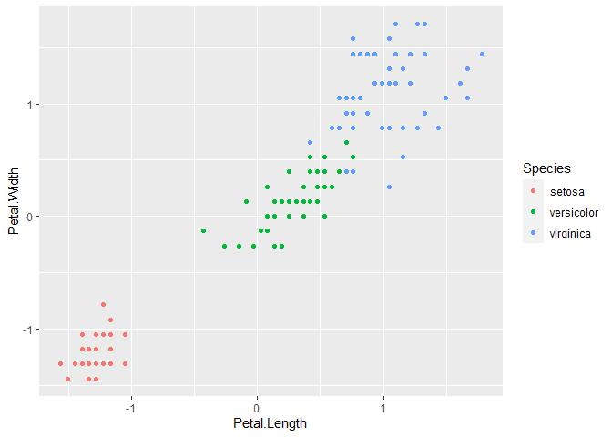<!-- -->

``` r
ggplot(data_iris_scaled, aes(Sepal.Length, Sepal.Width, color= Species)) + geom_point()
```

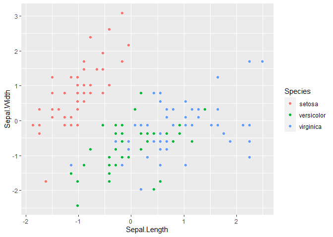<!-- -->

``` r
ggplot(data_iris_scaled, aes(Sepal.Length, Petal.Length, color= Species)) + geom_point()
```

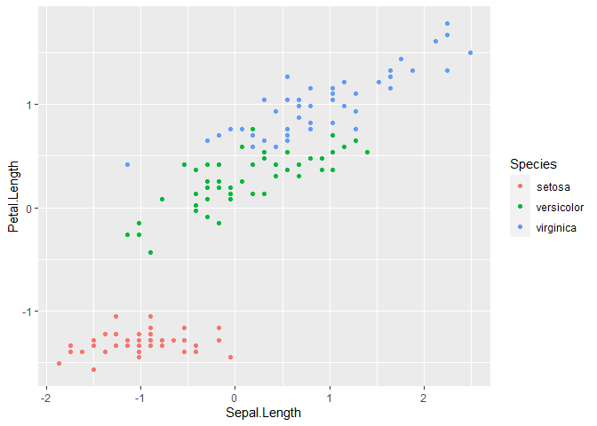<!-- -->

``` r
ggplot(data_iris_scaled, aes(Sepal.Length, Petal.Width, color= Species)) + geom_point()
```

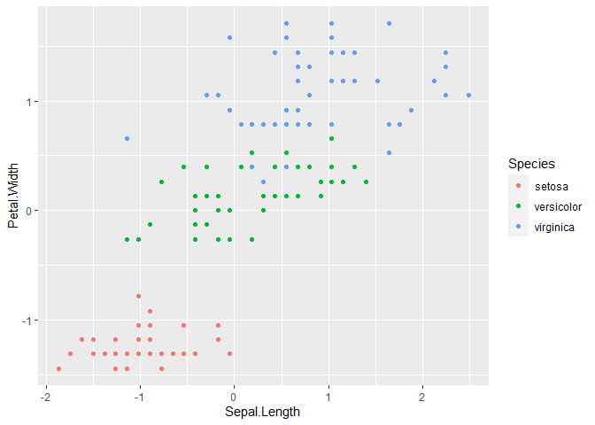<!-- -->

``` r
ggplot(data_iris_scaled, aes(Sepal.Width, Petal.Width, color= Species)) + geom_point()
```

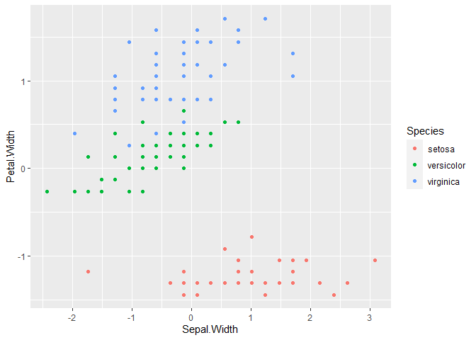<!-- -->

``` r
ggplot(data_iris_scaled, aes(Sepal.Width, Petal.Length, color= Species)) + geom_point()
```

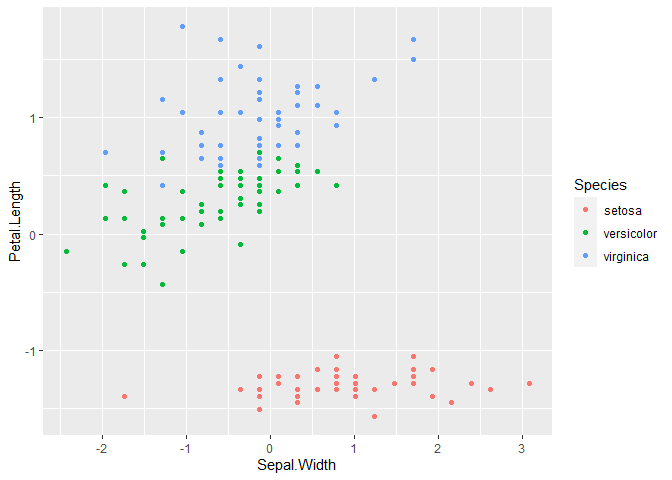<!-- -->

> ##### As is made clear from the above graphs, since we have 3 types of flowers, we should have at least 3 clusters. To further investigate, I will run the k-means model to determine if 3 clusters provide the highest level of accuracy.

``` r
# Using seed to generate reproducible results

set.seed(1533)

# using the kmeans() function to determine the optimal clustering number

kmeans_model_2 <- kmeans(data_iris_scaled[,1:4], centers = 2, nstart = 30, algorithm = "Hartigan-Wong", trace=FALSE)
kmeans_model_3 <- kmeans(data_iris_scaled[,1:4], centers = 3, nstart = 30, algorithm = "Hartigan-Wong", trace=FALSE)
kmeans_model_4 <- kmeans(data_iris_scaled[,1:4], centers = 4, nstart = 30, algorithm = "Hartigan-Wong", trace=FALSE)
kmeans_model_5 <- kmeans(data_iris_scaled[,1:4], centers = 5, nstart = 30, algorithm = "Hartigan-Wong", trace=FALSE)
kmeans_model_6 <- kmeans(data_iris_scaled[,1:4], centers = 6, nstart = 30, algorithm = "Hartigan-Wong", trace=FALSE)
kmeans_model_7 <- kmeans(data_iris_scaled[,1:4], centers = 7, nstart = 30, algorithm = "Hartigan-Wong", trace=FALSE)
kmeans_model_8 <- kmeans(data_iris_scaled[,1:4], centers = 8, nstart = 30, algorithm = "Hartigan-Wong", trace=FALSE)
kmeans_model_9 <- kmeans(data_iris_scaled[,1:4], centers = 9, nstart = 30, algorithm = "Hartigan-Wong", trace=FALSE)

model_when_k_equals_2 <- round(((kmeans_model_2$betweenss / kmeans_model_2$totss)*100), digits = 4)
model_when_k_equals_3 <- round(((kmeans_model_3$betweenss / kmeans_model_3$totss)*100), digits = 4)
model_when_k_equals_4 <- round(((kmeans_model_4$betweenss / kmeans_model_4$totss)*100), digits = 4)
model_when_k_equals_5 <- round(((kmeans_model_5$betweenss / kmeans_model_5$totss)*100), digits = 4)
model_when_k_equals_6 <- round(((kmeans_model_6$betweenss / kmeans_model_6$totss)*100), digits = 4)
model_when_k_equals_7 <- round(((kmeans_model_7$betweenss / kmeans_model_7$totss)*100), digits = 4)
model_when_k_equals_8 <- round(((kmeans_model_8$betweenss / kmeans_model_8$totss)*100), digits = 4)
model_when_k_equals_9 <- round(((kmeans_model_9$betweenss / kmeans_model_9$totss)*100), digits = 4)

accuracy_percentages <- data.frame(model_when_k_equals_2, model_when_k_equals_3, model_when_k_equals_4, model_when_k_equals_5, model_when_k_equals_6, model_when_k_equals_7, model_when_k_equals_8, model_when_k_equals_9)
print(accuracy_percentages)
```

    ##   model_when_k_equals_2 model_when_k_equals_3 model_when_k_equals_4
    ## 1               62.9397               76.6966               80.9846
    ##   model_when_k_equals_5 model_when_k_equals_6 model_when_k_equals_7
    ## 1               84.8655               86.6669               88.2236
    ##   model_when_k_equals_8 model_when_k_equals_9
    ## 1               89.5292               90.9564

> ##### Interestingly, the output shows that model accuracy increases in tandem with the number of clusters, represented by the value k. However, there is an ever shrinking marginal benefit from k = 3 onward. Note that there is only a 4 percent difference from 3 to 4 and from 4 to 5, a 2 percent difference between 5 and 6 and 6 and 7, and a 1 percent difference between 7 and 8 onward. It would appear that the best values for k are between 3 and 5, which is in line with my intuition.

> ##### To further investigate, I will use the elbow method, the silhouette method and the gap statistic method to create visualizations of k values to determine accuracy.

``` r
# Using seed to generate reproducible results
set.seed(4233)

# Elbow method

elbow_method <- fviz_nbclust(data_iris_scaled[,1:4], kmeans, method = "wss") +
  geom_vline(xintercept = 3, linetype = 2) + # add line for better visualisation
  labs(subtitle = "Elbow method") # add subtitle


# Silhouette method

silhouette_method  <- fviz_nbclust(data_iris_scaled[,1:4], FUN = kmeans, method = "silhouette") +
  labs(subtitle = "Silhouette method")

# Gap statistic

gap_stat_method  <- fviz_nbclust(data_iris_scaled[,1:4], kmeans,
  nstart = 30,
  method = "gap_stat",
  nboot = 500
) + # reduce it for lower computation time (but less precise results)
  labs(subtitle = "Gap statistic method")

print(elbow_method)
```

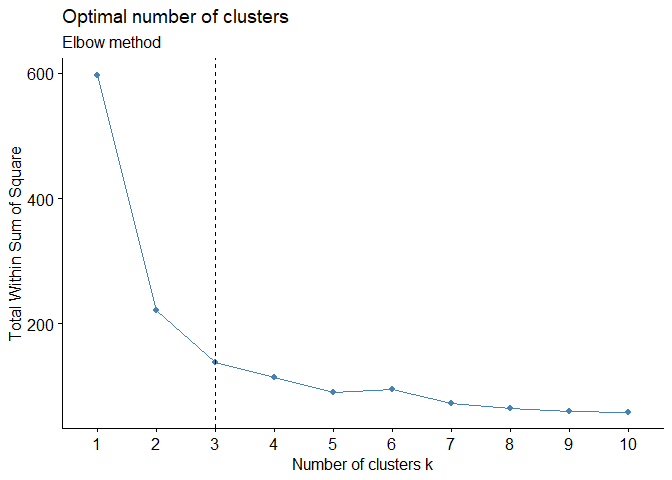<!-- -->

``` r
print(silhouette_method)
```

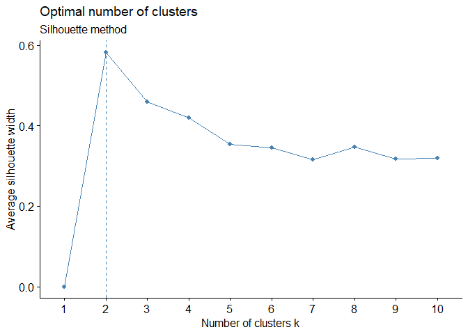<!-- -->

``` r
print(gap_stat_method)
```

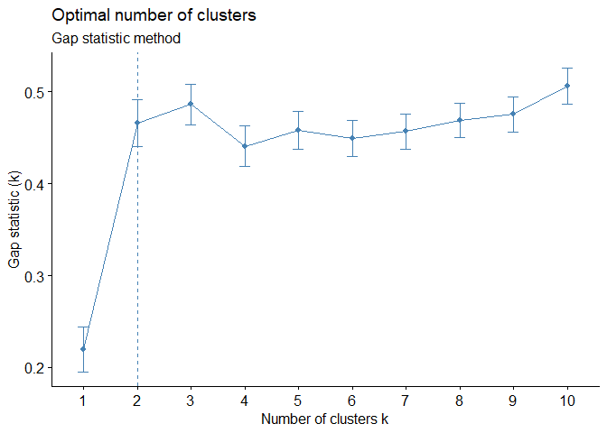<!-- -->

> ##### As we can see from the above graphs, the elbow method recommends 3 clustors, while both the silhouette and gap statistic methods recommend 2. Because the data contains information on three species of flowers, we must have at least 3 categories; consequently, I conclude that the elbow method’s recommendation of 3 clusters is the most sound suggestion.

``` r
# cluster predictions
print(kmeans_model_3$cluster)
```

    ##   1   2   3   4   5   6   7   8   9  10  11  12  13  14  15  16  17  18  19  20 
    ##   1   1   1   1   1   1   1   1   1   1   1   1   1   1   1   1   1   1   1   1 
    ##  21  22  23  24  25  26  27  28  29  30  31  32  33  34  35  36  37  38  39  40 
    ##   1   1   1   1   1   1   1   1   1   1   1   1   1   1   1   1   1   1   1   1 
    ##  41  42  43  44  45  46  47  48  49  50  51  52  53  54  55  56  57  58  59  60 
    ##   1   1   1   1   1   1   1   1   1   1   3   3   3   2   2   2   3   2   2   2 
    ##  61  62  63  64  65  66  67  68  69  70  71  72  73  74  75  76  77  78  79  80 
    ##   2   2   2   2   2   3   2   2   2   2   3   2   2   2   2   3   3   3   2   2 
    ##  81  82  83  84  85  86  87  88  89  90  91  92  93  94  95  96  97  98  99 100 
    ##   2   2   2   2   2   3   3   2   2   2   2   2   2   2   2   2   2   2   2   2 
    ## 101 102 103 104 105 106 107 108 109 110 111 112 113 114 115 116 117 118 119 120 
    ##   3   2   3   3   3   3   2   3   3   3   3   3   3   2   2   3   3   3   3   2 
    ## 121 122 123 124 125 126 127 128 129 130 131 132 133 134 135 136 137 138 139 140 
    ##   3   2   3   2   3   3   2   3   3   3   3   3   3   2   2   3   3   3   2   3 
    ## 141 142 143 144 145 146 147 148 149 150 
    ##   3   3   2   3   3   3   2   3   3   2

``` r
# comparasion of clusters with acutal Species data points

compa_re <- data.frame(kmeans_model_3$cluster,  data_iris$Species)
print(compa_re)
```

    ##     kmeans_model_3.cluster data_iris.Species
    ## 1                        1            setosa
    ## 2                        1            setosa
    ## 3                        1            setosa
    ## 4                        1            setosa
    ## 5                        1            setosa
    ## 6                        1            setosa
    ## 7                        1            setosa
    ## 8                        1            setosa
    ## 9                        1            setosa
    ## 10                       1            setosa
    ## 11                       1            setosa
    ## 12                       1            setosa
    ## 13                       1            setosa
    ## 14                       1            setosa
    ## 15                       1            setosa
    ## 16                       1            setosa
    ## 17                       1            setosa
    ## 18                       1            setosa
    ## 19                       1            setosa
    ## 20                       1            setosa
    ## 21                       1            setosa
    ## 22                       1            setosa
    ## 23                       1            setosa
    ## 24                       1            setosa
    ## 25                       1            setosa
    ## 26                       1            setosa
    ## 27                       1            setosa
    ## 28                       1            setosa
    ## 29                       1            setosa
    ## 30                       1            setosa
    ## 31                       1            setosa
    ## 32                       1            setosa
    ## 33                       1            setosa
    ## 34                       1            setosa
    ## 35                       1            setosa
    ## 36                       1            setosa
    ## 37                       1            setosa
    ## 38                       1            setosa
    ## 39                       1            setosa
    ## 40                       1            setosa
    ## 41                       1            setosa
    ## 42                       1            setosa
    ## 43                       1            setosa
    ## 44                       1            setosa
    ## 45                       1            setosa
    ## 46                       1            setosa
    ## 47                       1            setosa
    ## 48                       1            setosa
    ## 49                       1            setosa
    ## 50                       1            setosa
    ## 51                       3        versicolor
    ## 52                       3        versicolor
    ## 53                       3        versicolor
    ## 54                       2        versicolor
    ## 55                       2        versicolor
    ## 56                       2        versicolor
    ## 57                       3        versicolor
    ## 58                       2        versicolor
    ## 59                       2        versicolor
    ## 60                       2        versicolor
    ## 61                       2        versicolor
    ## 62                       2        versicolor
    ## 63                       2        versicolor
    ## 64                       2        versicolor
    ## 65                       2        versicolor
    ## 66                       3        versicolor
    ## 67                       2        versicolor
    ## 68                       2        versicolor
    ## 69                       2        versicolor
    ## 70                       2        versicolor
    ## 71                       3        versicolor
    ## 72                       2        versicolor
    ## 73                       2        versicolor
    ## 74                       2        versicolor
    ## 75                       2        versicolor
    ## 76                       3        versicolor
    ## 77                       3        versicolor
    ## 78                       3        versicolor
    ## 79                       2        versicolor
    ## 80                       2        versicolor
    ## 81                       2        versicolor
    ## 82                       2        versicolor
    ## 83                       2        versicolor
    ## 84                       2        versicolor
    ## 85                       2        versicolor
    ## 86                       3        versicolor
    ## 87                       3        versicolor
    ## 88                       2        versicolor
    ## 89                       2        versicolor
    ## 90                       2        versicolor
    ## 91                       2        versicolor
    ## 92                       2        versicolor
    ## 93                       2        versicolor
    ## 94                       2        versicolor
    ## 95                       2        versicolor
    ## 96                       2        versicolor
    ## 97                       2        versicolor
    ## 98                       2        versicolor
    ## 99                       2        versicolor
    ## 100                      2        versicolor
    ## 101                      3         virginica
    ## 102                      2         virginica
    ## 103                      3         virginica
    ## 104                      3         virginica
    ## 105                      3         virginica
    ## 106                      3         virginica
    ## 107                      2         virginica
    ## 108                      3         virginica
    ## 109                      3         virginica
    ## 110                      3         virginica
    ## 111                      3         virginica
    ## 112                      3         virginica
    ## 113                      3         virginica
    ## 114                      2         virginica
    ## 115                      2         virginica
    ## 116                      3         virginica
    ## 117                      3         virginica
    ## 118                      3         virginica
    ## 119                      3         virginica
    ## 120                      2         virginica
    ## 121                      3         virginica
    ## 122                      2         virginica
    ## 123                      3         virginica
    ## 124                      2         virginica
    ## 125                      3         virginica
    ## 126                      3         virginica
    ## 127                      2         virginica
    ## 128                      3         virginica
    ## 129                      3         virginica
    ## 130                      3         virginica
    ## 131                      3         virginica
    ## 132                      3         virginica
    ## 133                      3         virginica
    ## 134                      2         virginica
    ## 135                      2         virginica
    ## 136                      3         virginica
    ## 137                      3         virginica
    ## 138                      3         virginica
    ## 139                      2         virginica
    ## 140                      3         virginica
    ## 141                      3         virginica
    ## 142                      3         virginica
    ## 143                      2         virginica
    ## 144                      3         virginica
    ## 145                      3         virginica
    ## 146                      3         virginica
    ## 147                      2         virginica
    ## 148                      3         virginica
    ## 149                      3         virginica
    ## 150                      2         virginica

``` r
# Creating graphs showing the spread of the data, using the generated clusters when k = 3 as the graph color

kmeans_model_3$cluster <-as.factor(kmeans_model_3$cluster)

ggplot(data_iris, aes(Petal.Length, Petal.Width, color= kmeans_model_3$cluster)) + geom_point()
```

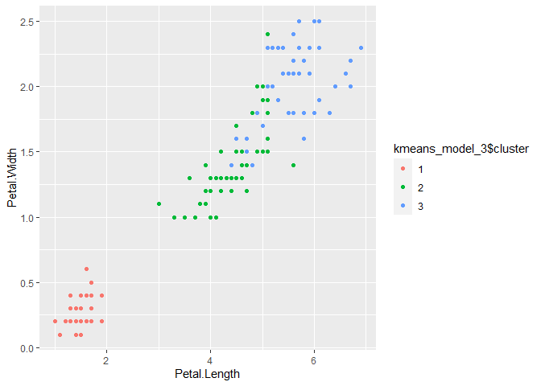<!-- -->

``` r
ggplot(data_iris, aes(Sepal.Length, Sepal.Width, color= kmeans_model_3$cluster)) + geom_point()
```

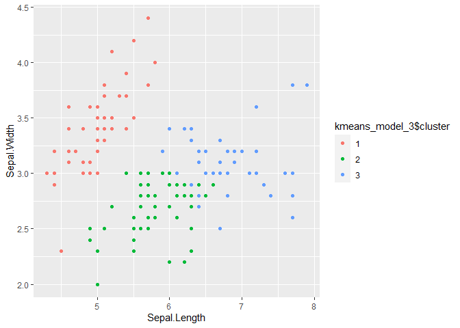<!-- -->

``` r
ggplot(data_iris, aes(Sepal.Length, Petal.Length, color= kmeans_model_3$cluster)) + geom_point()
```

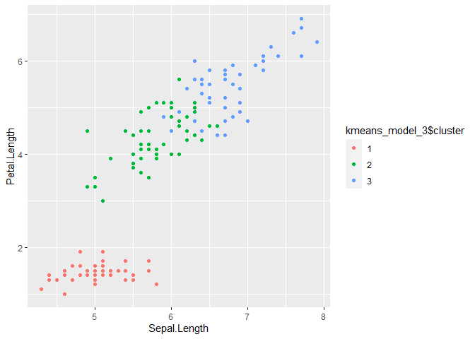<!-- -->

``` r
ggplot(data_iris, aes(Sepal.Length, Petal.Width, color= kmeans_model_3$cluster)) + geom_point()
```

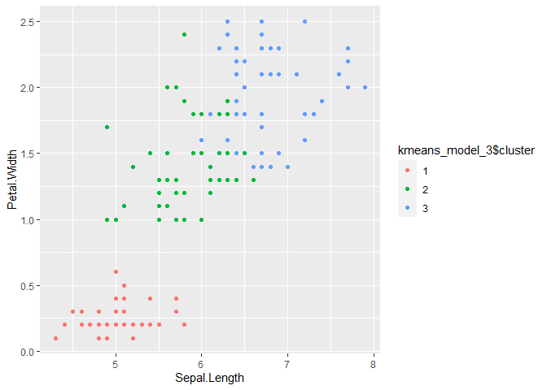<!-- -->

``` r
ggplot(data_iris, aes(Sepal.Width, Petal.Width, color= kmeans_model_3$cluster)) + geom_point()
```

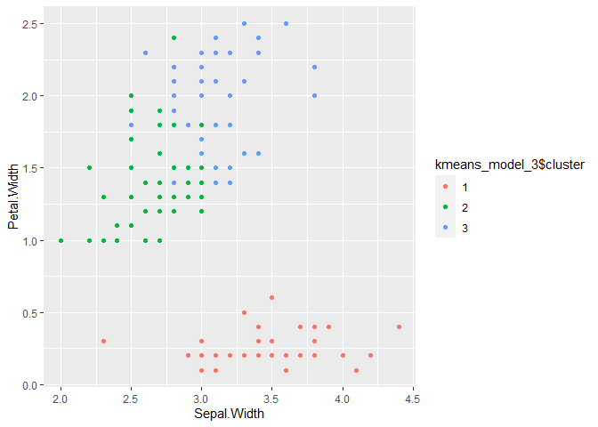<!-- -->

``` r
ggplot(data_iris, aes(Sepal.Width, Petal.Length, color= kmeans_model_3$cluster)) + geom_point()
```

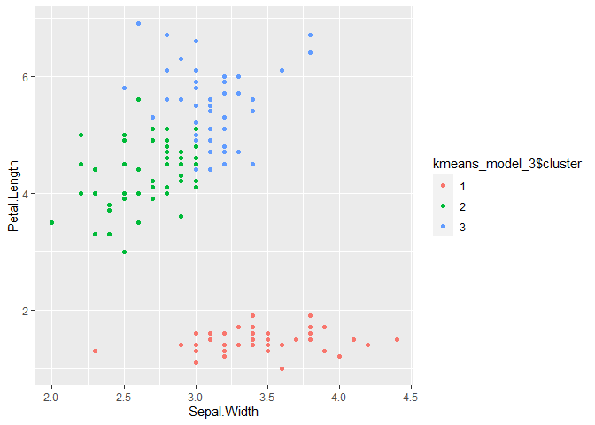<!-- -->

> ##### After plotting the data with the generated clustor, we see that the cluster accuracy is in line with the 77% accuracy rate predicted above, with most of the issues being with the 2nd and 3rd clusters.

## Question 5.1

##### **Using crime data from the file uscrime.txt (<http://www.statsci.org/data/general/uscrime.txt>, description at <http://www.statsci.org/data/general/uscrime.html>), test to see whether there are any outliers in the last column (number of crimes per 100,000 people). Use the grubbs.test function in the outliers package in R.**

``` r
# description: http://www.statsci.org/data/general/uscrime.html

# import data from URL
data_crime <- read.table("http://www.statsci.org/data/general/uscrime.txt", header = TRUE)

# scaled data
data_crime <- scale(data_crime, center = TRUE, scale = TRUE)

# print head
print(data_crime[,16])
```

    ##  [1] -0.29497443  1.88724223 -0.84569972  2.75082086  0.85043076 -0.57680099
    ##  [7]  0.14974271  1.68039705 -0.12691272 -0.51733300  1.98807925 -0.14501167
    ## [13] -1.01893256 -0.62334116 -0.27687548  0.10578811 -0.94653675  0.06183351
    ## [19] -0.40098259  0.82716067 -0.42166710 -1.20509323  0.80389059  0.16267053
    ## [25] -0.98790579  2.81287441 -1.45589301  0.80389059  0.35658789 -0.54060308
    ## [31] -1.37574050 -0.39064033  0.43156927  0.04632012 -0.65178237  0.94868222
    ## [37] -0.19155184 -0.87672650 -0.20447966  0.63582888 -0.06485917 -0.93878006
    ## [43] -0.21223636  0.32297555 -1.16372419 -1.02668926 -0.14501167

``` r
# Before I do the Grubbs test, I will check if column 16 is normally distributed using the Shapiro-Wilk and Anderson-Darling normality tests

set.seed(123)

sha_test <- shapiro.test(data_crime[,16])


ad_test <- ad.test(data_crime[,16])


print(sha_test)
```

    ## 
    ##  Shapiro-Wilk normality test
    ## 
    ## data:  data_crime[, 16]
    ## W = 0.91273, p-value = 0.001882

``` r
print(ad_test)
```

    ## 
    ##  Anderson-Darling normality test
    ## 
    ## data:  data_crime[, 16]
    ## A = 1.1725, p-value = 0.004139

``` r
plot(density(data_crime[,16]))
```

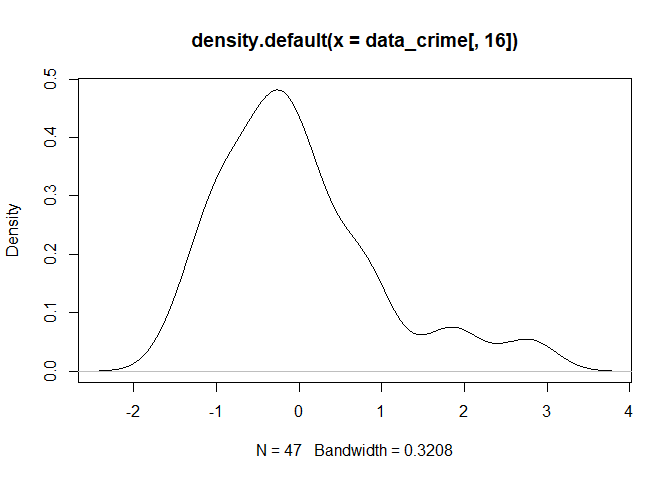<!-- -->

``` r
qqnorm(data_crime[,16]);qqline(data_crime[,16], col = 2)
```

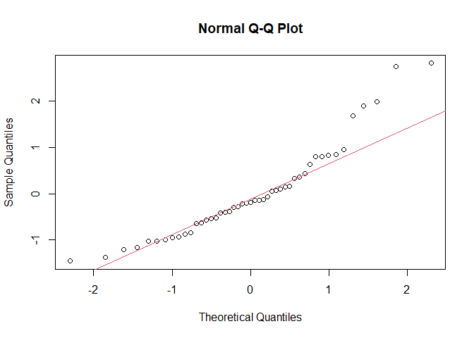<!-- -->

> ##### From the plots, it looks like most of the data is evenly distributed, except for some pretty substantial positive outliers. Since the p values for both tests are \<= .05, and the plots show that the column has a lightly lopsided distribution, I will reject the NULL hypothesis that this data is normally distributed and try removing the offending data points to see if we get a more even distribution.

``` r
set.seed(15)

# Will do the Grubbs test "Crime" column to determine highest and lowest outlier

data_crime_outliers <- grubbs.test(data_crime[,16], type = 11, opposite = FALSE, two.sided = FALSE)
print(data_crime_outliers)
```

    ## 
    ##  Grubbs test for two opposite outliers
    ## 
    ## data:  data_crime[, 16]
    ## G = 4.26877, U = 0.78103, p-value = 1
    ## alternative hypothesis: -1.45589300761895 and 2.81287441018599 are outliers

> ##### After running through several iterations of code, I have determined that 2.81287441018599, 2.75082085595987 and 1.98807925193052 are the largest positive outliers. Will delete these data point and run tests again.

``` r
# deleting largest, second largest, and third largest ourliers, 2.81287441018599, 2.75082085595987 and 1.98807925193052 respectively

column_16 <- data_crime[,16]

column_16_cleaned <- column_16[-c(4,10,26)]


set.seed(123)

sha_test_cleaned <- shapiro.test(column_16_cleaned)


ad_test_cleaned <- ad.test(column_16_cleaned)


print(sha_test_cleaned)
```

    ## 
    ##  Shapiro-Wilk normality test
    ## 
    ## data:  column_16_cleaned
    ## W = 0.95275, p-value = 0.06966

``` r
print(ad_test_cleaned)
```

    ## 
    ##  Anderson-Darling normality test
    ## 
    ## data:  column_16_cleaned
    ## A = 0.53658, p-value = 0.1601

``` r
plot(density(column_16_cleaned))
```

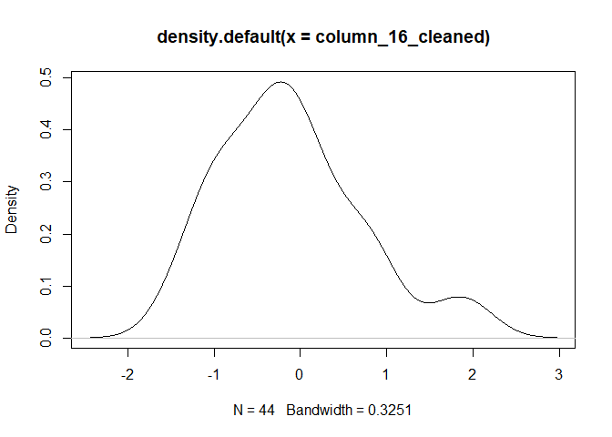<!-- -->

``` r
qqnorm(column_16_cleaned);qqline(column_16_cleaned, col = 2)
```

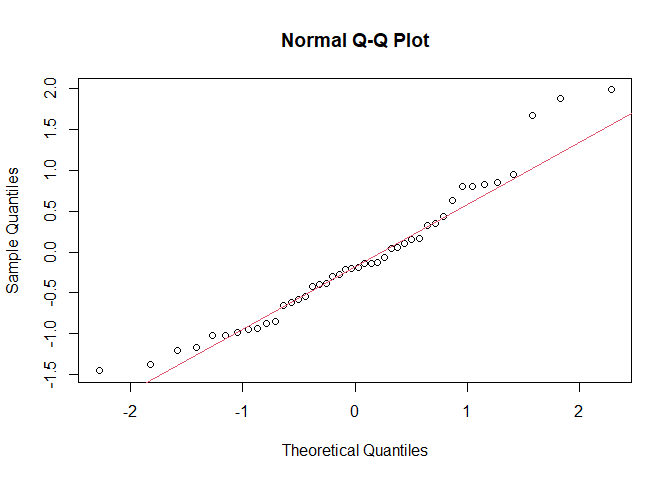<!-- -->

``` r
data_crime_outliers_cleaned <- grubbs.test(column_16_cleaned, type = 11, opposite = FALSE, two.sided = FALSE)
print(data_crime_outliers_cleaned )
```

    ## 
    ##  Grubbs test for two opposite outliers
    ## 
    ## data:  column_16_cleaned
    ## G = 4.14575, U = 0.78991, p-value = 1
    ## alternative hypothesis: -1.45589300761895 and 1.98807925193052 are outliers

> ##### Deleting these points has brought the data more in line with a normal distribution. The p values for both Shapiro-Wilk and Anderson-Darling normality tests are large enough for us to accept the NULL hypothesis that the data is evenly distributed.

## Question 6.1

##### **Describe a situation or problem from your job, everyday life, current events, etc., for which a Change Detection model would be appropriate. Applying the CUSUM technique, how would you choose the critical value and the threshold?**

> ##### We can use a Change Detection model to monitor the internal temperature of a custom-built gaming computer and turn on a liquid cooling system if it rises above 80 degrees. We do this using a series of sensors installed in the unit to monitor temperature change. To build this model, we would first have to record the real-time internal temperature, x(t). We would next need to calculate the mean of the expected internal temperature if no temperature change occurs, μ. To calibrate the model and limit the amount of false data, we can add a constant value, C. (It is important that C is not too large, as it can slow down the model.)
>
> The equation is thus:

> #### s(t) = max{0, S(t-1)+(x(t)-μ)-C}; Is S(t) \>= T?

> ##### where x(t) = observed value at time t; μ = mean of x, if no change; and C = a value acting to pull down the running total, making the method less sensitive to change.

> ##### Using this equation, we would then use x(t) data collected from the sensors to monitor the temperature for any large increases that rise above the critical threshold. If the temperature data consistently reads at or above 80 degrees, this will trigger the liquid cooling system to turn on.

## Question 6.2

##### **1. Using July through October daily-high-temperature data for Atlanta for 1996 through 2015, use a CUSUM approach to identify when unofficial summer ends (i.e., when the weather starts cooling off) each year. You can get the data that you need from the file temps.txt or online, for example at <http://www.iweathernet.com/atlanta-weather-records> or <https://www.wunderground.com/history/airport/KFTY/2015/7/1/CustomHistory.html>. You can use R if you’d like, but it’s straightforward enough that an Excel spreadsheet can easily do the job too.**

``` r
# description: http://www.iweathernet.com/atlanta-weather-records

# import data from URL
data_temp  <- read.table("C:/Users/Owner/Documents/Data Science Masters - GT/ISYE 6501 - Summer 2020/Week 2/HW 2/week 2 data-summer/data 6.2/temps.txt", header=T)


# Scaling data
data_temp_scaled <- data_temp
ind <- sapply(data_temp_scaled, is.numeric)
data_temp_scaled[ind] <- lapply(data_temp_scaled[ind], scale)

# print head
head(data_temp_scaled)
```

    ##     DAY     X1996     X1997     X1998      X1999     X2000     X2001     X2002
    ## 1 1-Jul 1.6710325 0.4641262 1.0515693  0.0660552 0.5218658 0.2975439 0.6805188
    ## 2 2-Jul 1.5540507 0.8933558 0.5835004 -0.1396357 0.7319787 0.6623069 0.6805188
    ## 3 3-Jul 1.5540507 1.2152779 1.0515693  0.3745915 0.9420916 0.6623069 0.3622533
    ## 4 4-Jul 0.7351782 1.0006632 1.0515693  0.4774370 1.1522045 0.2975439 0.5744303
    ## 5 5-Jul 0.6181964 0.2495115 1.0515693  0.6831278 1.2572610 0.5407192 0.9987842
    ## 6 6-Jul 1.0861236 0.2495115 0.7395234  0.7859733 1.2572610 0.6623069 0.9987842
    ##        X2003       X2004      X2005      X2006       X2007       X2008
    ## 1 -1.2082836  0.03538563  0.9882174  1.0160887  1.06290294  0.28486842
    ## 2 -0.0683497 -0.11469825  0.7295988  1.0160887 -0.04410012  0.51388028
    ## 3  0.7866007  0.63572118  0.3416709  1.0160887 -0.37620104  0.97190401
    ## 4  0.6441090  0.93588895  0.3416709  0.8118748  0.06660018  0.85739808
    ## 5 -0.2108414  1.23605673  0.7295988  0.7097678  0.28800080  0.62838621
    ## 6  0.3591255  1.23605673 -0.1755663 -0.2091947  0.17730049 -0.05864938
    ##        X2009      X2010     X2011     X2012       X2013       X2014       X2015
    ## 1  1.5541807 -0.0283919 0.6770185 2.1993933  0.04314133 0.918900513  0.19510095
    ## 2  0.9994383 -0.4313384 0.8784049 0.9024279  0.43141334 1.374033787  0.42474131
    ## 3  0.8884899 -0.5656539 0.9790981 1.5509106 -0.73340267 0.463767239 -0.49382012
    ## 4  1.1103868 -0.2970229 0.6770185 1.4428301 -0.60397867 0.008633965  0.19510095
    ## 5 -0.1100465  0.1059236 0.4756321 1.6589910  0.17256533 0.312056147  0.08028078
    ## 6  0.6665929  0.2402391 0.4756321 1.4428301  0.17256533 0.463767239  0.08028078

> ##### **Link to online spreadsheet containing my analysis: <https://docs.google.com/spreadsheets/d/1YXcTX0ydm9L299bdZuJiRiHdNrLxyUtJ/edit?usp=sharing&ouid=112237753660920597081&rtpof=true&sd=true>**

> ##### To determine the threshold, μ and C for each year, I took the standard deviation (SD) of the first 45 observations, and set the threshold as 3 SD and my C as 1 SD. As for μ, I set it as the mean of the first 45 observations.

#### “End of summer” dates:

> ##### 1996: Somewhere around 2-Sep and 13-Sep
>
> ##### 1997: 26-Sep
>
> ##### 1998: Somewhere around 10-Sep and 18-Sep
>
> ##### 1999: There was a patch between 12-Jul and 17-Jul when the temperature cooled down short term, but general seasonal cooling did not begin until around 19-Sep
>
> ##### 2000: 5-Sep
>
> ##### 2001: 1-Sep
>
> ##### 2002: Between 12-Jul and 13-Jul, and also between around 29-Aug and 31-Aug there was some short-term cooling, but it wasn’t until 13-Sep that seasonal cooling began in earnest.
>
> ##### 2003: 7-Sep
>
> ##### 2004: There was a cooling spell between 12-Aug and 15-Aug, but the expected seasonal cooling did not officially begin until 8-Sep.
>
> ##### 2005: Cooling did not begin until 7-Oct, a very late start.
>
> ##### 2006: There was minor short-term cooling that happened between 6-Jul and 8-Jul, but seasonal cooling did not begin until 6-Sep.
>
> ##### 2007: 18-Sep, with some minor increases between 22-Sep and 25-Sep
>
> ##### 2008: 13-Aug, an early start, with some minor increases between 18-Aug and 20-Aug
>
> ##### 2009: 30-Aug
>
> ##### 2010: 26-Sep
>
> ##### 2011: 5-Sep
>
> ##### 2012: 24-Aug
>
> ##### 2013: There was a cooling spell between 14-Aug and 26-Aug, but the expected seasonal cooling did not officially begin until 21-Sep.
>
> ##### 2014: 24-Sep
>
> ##### 2015: There was a very minor cooling spell between 3-Jul and 6-Jul, but the expected seasonal cooling did not officially begin until 28-Aug. 

##### Note: The following are exceptions to the above: for 1997, I set C to 2 SD to fine tune St; for 1999, 2007 and 2013 I set T to 2 SD to lower the threshold for better accuracy.

##### **2. Use a CUSUM approach to make a judgment of whether Atlanta’s summer climate has gotten warmer in that time (and if so, when).**

> ##### For this problem, I took the average and max temperatures for the summer, which I define as the time from the beginning of July to the “end of summer” cut off point delineated by the CUMSUM function. After reviewing these temperatures (see spreadsheet), I did not discern a general linear increase in temperatures overtime in Atlanta. However, out of the years with average summer temperatures over 90 degrees (2000, 2010, 2011, 2012, 2015), most of them were more recent. Additionally, out of the years whose hottest days broke 100 degrees (2000, 2007, 2012), one of them was fairly recent. One could therefore hypothesize that Atlanta could be in the initial stages of an upward trend towards higher than average summer temperatures in the future.
