------------------------------------------------------------------------

title: “Introduction to Statistical Modeling - Assignment 3” author:
“Don Smith” output: github_document

------------------------------------------------------------------------

## Question 7.1

##### **Describe a situation or problem from your job, everyday life, current events, etc., for which exponential smoothing would be appropriate. What data would you need? Would you expect the value of α (the first smoothing parameter) to be closer to 0 or 1, and why?**

> ##### I work at Fitbit in customer support. We often use analytics to determine our highest case drivers (i.e., the most common reasons customers reach out to customer support for assistance), which include, for example, wristband malfunction, device not charging, dead on arrival, etc. We could use exponential smoothing to measure our most prevalent case drivers to determine customer trends, emerging hardware issues, allocation of engineering resources, and general financial and strategic forecasting on a day-over-day, month-over-month, or even year-over-year basis.

> ##### For example, if we wanted to get the average contact rate per week for the “device not charging” case driver, for a period of three months, but where one or more of the weeks contained a major holiday, for example, Easter or Mother’s Day, we could use exponential smoothing to obtain it. During holidays sales increase, due doubly to customers purchasing gifts for friends and family and special holiday discounts offered by Fitbit. This consequently increases the number of customers reaching out to support for assistance on successive days after the holiday. While there are use cases where we would want to include this holiday uptick in our analysis, for the purposes of getting an accurate average, we can instead re-classify these increases in customer contacts as random outliers, and use exponential smoothing to round out some of the peaks and valleys caused by these spikes. Building our model:

> ##### s(t) = x(t)
>
> ##### -the count of the observed number of contacts for the “device not charging” case driver per day is the real indicator of the baseline

> ##### s(t) = s(t-1)
>
> ##### -The count of the “device not charging” case driver for each successive day after a holiday, which we can define as a period of 7 days after the holiday. Since the count on these days will be larger than the count taken for that case driver in previous weeks within our predetermined 3-month period, it is exchanged with the previous weeks baseline, smoothing out the bump, and eliminating the radical increase

> ##### The model looks like this:

> ##### s(t) = α*x(t) + (1-α)*s(t-1)

> ##### Where 0\<α\<1, with our alpha for this model closer to 0 to account for the “randomness” introduced by the holiday increases.

> ##### After the data has been smoothed out, we can then take the average of the “device not charging” case driver across all days in our 3-month time period to get our contact average, unaffected by increased customer contacts during the holidays.

## Question 7.2

##### **Using the 20 years of daily high temperature data for Atlanta (July through October) from Question 6.2 (file temps.txt), build and use an exponential smoothing model to help make a judgment of whether the unofficial end of summer has gotten later over the 20 years. (Part of the point of this assignment is for you to think about how you might use exponential smoothing to answer this question. Feel free to combine it with other models if you’d like to. There’s certainly more than one reasonable approach.)**

##### **Note: in R, you can use either HoltWinters (simpler to use) or the smooth package’s es function (harder to use, but more general). If you use es, the Holt-Winters model uses model=”AAM” in the function call (the first and second constants are used “A”dditively, and the third (seasonality) is used “M”ultiplicatively; the documentation doesn’t make that clear).**

``` r
# loading all packages needed for analysis

library(kernlab)
library(kknn)
library(dplyr)
```

    ## 
    ## Attaching package: 'dplyr'

    ## The following objects are masked from 'package:stats':
    ## 
    ##     filter, lag

    ## The following objects are masked from 'package:base':
    ## 
    ##     intersect, setdiff, setequal, union

``` r
library(readr)
library(rmarkdown)
library(tinytex)
library(knitr)
library(MASS)
```

    ## 
    ## Attaching package: 'MASS'

    ## The following object is masked from 'package:dplyr':
    ## 
    ##     select

``` r
library(factoextra)
```

    ## Loading required package: ggplot2

    ## 
    ## Attaching package: 'ggplot2'

    ## The following object is masked from 'package:kernlab':
    ## 
    ##     alpha

    ## Welcome! Want to learn more? See two factoextra-related books at https://goo.gl/ve3WBa

``` r
library(NbClust)
library(outliers)
library(nortest)
library(qcc)
```

    ## Package 'qcc' version 2.7

    ## Type 'citation("qcc")' for citing this R package in publications.

``` r
library(smooth)
```

    ## Loading required package: greybox

    ## Package "greybox", v1.0.7 loaded.

    ## This is package "smooth", v3.2.0

``` r
library(greybox)
library(Mcomp)
```

    ## Loading required package: forecast

    ## Registered S3 method overwritten by 'quantmod':
    ##   method            from
    ##   as.zoo.data.frame zoo

``` r
library(DAAG)
```

    ## 
    ## Attaching package: 'DAAG'

    ## The following object is masked from 'package:MASS':
    ## 
    ##     hills

``` r
library(caret)
```

    ## Loading required package: lattice

    ## Registered S3 method overwritten by 'lava':
    ##   method     from   
    ##   print.pcor greybox

    ## 
    ## Attaching package: 'caret'

    ## The following object is masked from 'package:greybox':
    ## 
    ##     MAE

    ## The following object is masked from 'package:kknn':
    ## 
    ##     contr.dummy

``` r
# description: http://www.iweathernet.com/atlanta-weather-records

# importing temperature data
data_temp  <- read.table("C:\\Users\\Owner\\Documents\\Github\\r\\class assignments\\Introduction to Statistical Modeling\\Assignment 3\\data\\data 7.2\\temps.txt", header=T)

# print head
head(data_temp)
```

    ##     DAY X1996 X1997 X1998 X1999 X2000 X2001 X2002 X2003 X2004 X2005 X2006 X2007
    ## 1 1-Jul    98    86    91    84    89    84    90    73    82    91    93    95
    ## 2 2-Jul    97    90    88    82    91    87    90    81    81    89    93    85
    ## 3 3-Jul    97    93    91    87    93    87    87    87    86    86    93    82
    ## 4 4-Jul    90    91    91    88    95    84    89    86    88    86    91    86
    ## 5 5-Jul    89    84    91    90    96    86    93    80    90    89    90    88
    ## 6 6-Jul    93    84    89    91    96    87    93    84    90    82    81    87
    ##   X2008 X2009 X2010 X2011 X2012 X2013 X2014 X2015
    ## 1    85    95    87    92   105    82    90    85
    ## 2    87    90    84    94    93    85    93    87
    ## 3    91    89    83    95    99    76    87    79
    ## 4    90    91    85    92    98    77    84    85
    ## 5    88    80    88    90   100    83    86    84
    ## 6    82    87    89    90    98    83    87    84

``` r
# Converting the data into vector form as a pre-step before 

data_temp_vec <- as.vector(unlist(data_temp[,2:21]))

head(data_temp_vec)
```

    ## [1] 98 97 97 90 89 93

``` r
plot(data_temp_vec)
```

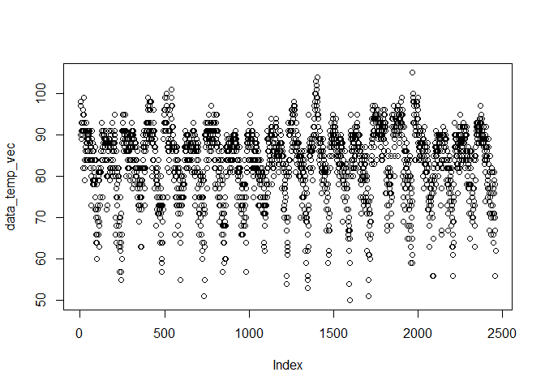<!-- -->

> ##### Plotting the data shows an uneven distribution that it is difficult to extrapolate meaning from. To better visualize the patterns (if any) in the temperatures over time, we will convert the data to a time series and visualize this linearly.

``` r
# Converting the vectored data into a time series

data_temp_ts <- ts(data_temp_vec, start = 1996, frequency = 123)

summary(data_temp_ts)
```

    ##    Min. 1st Qu.  Median    Mean 3rd Qu.    Max. 
    ##   50.00   79.00   85.00   83.34   90.00  105.00

``` r
head(data_temp_ts)
```

    ## Time Series:
    ## Start = c(1996, 1) 
    ## End = c(1996, 6) 
    ## Frequency = 123 
    ## [1] 98 97 97 90 89 93

``` r
plot(data_temp_ts)
```

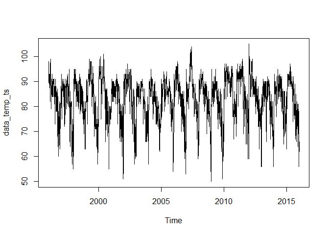<!-- -->

> ##### Our data looks a little better now, insofar as the continuous relationship between each temperature fluctuation can be more readily comprehended. Now our data is ready for the Holt-Winters method.

``` r
# Using seed to generate reproducible results

set.seed(4233)

# Will use the Holt-Winters method to create our time series model

data_temp_holt_wint <- HoltWinters(data_temp_ts, alpha = NULL, beta = NULL, gamma = NULL, seasonal = "multiplicative")
print(data_temp_holt_wint)
```

    ## Holt-Winters exponential smoothing with trend and multiplicative seasonal component.
    ## 
    ## Call:
    ## HoltWinters(x = data_temp_ts, alpha = NULL, beta = NULL, gamma = NULL,     seasonal = "multiplicative")
    ## 
    ## Smoothing parameters:
    ##  alpha: 0.615003
    ##  beta : 0
    ##  gamma: 0.5495256
    ## 
    ## Coefficients:
    ##              [,1]
    ## a    73.679517064
    ## b    -0.004362918
    ## s1    1.239022317
    ## s2    1.234344062
    ## s3    1.159509551
    ## s4    1.175247483
    ## s5    1.171344196
    ## s6    1.151038408
    ## s7    1.139383104
    ## s8    1.130484528
    ## s9    1.110487514
    ## s10   1.076242879
    ## s11   1.041044609
    ## s12   1.058139281
    ## s13   1.032496529
    ## s14   1.036257448
    ## s15   1.019348815
    ## s16   1.026754142
    ## s17   1.071170378
    ## s18   1.054819556
    ## s19   1.084397734
    ## s20   1.064605879
    ## s21   1.109827336
    ## s22   1.112670130
    ## s23   1.103970506
    ## s24   1.102771209
    ## s25   1.091264692
    ## s26   1.084518342
    ## s27   1.077914660
    ## s28   1.077696145
    ## s29   1.053788854
    ## s30   1.079454300
    ## s31   1.053481186
    ## s32   1.054023885
    ## s33   1.078221405
    ## s34   1.070145761
    ## s35   1.054891375
    ## s36   1.044587771
    ## s37   1.023285461
    ## s38   1.025836722
    ## s39   1.031075732
    ## s40   1.031419152
    ## s41   1.021827552
    ## s42   0.998177248
    ## s43   0.996049257
    ## s44   0.981570825
    ## s45   0.976510542
    ## s46   0.967977608
    ## s47   0.985788411
    ## s48   1.004748195
    ## s49   1.050965934
    ## s50   1.072515008
    ## s51   1.086532279
    ## s52   1.098357400
    ## s53   1.097158461
    ## s54   1.054827180
    ## s55   1.022866587
    ## s56   0.987259326
    ## s57   1.016923524
    ## s58   1.016604903
    ## s59   1.004320951
    ## s60   1.019102781
    ## s61   0.983848662
    ## s62   1.055888360
    ## s63   1.056122844
    ## s64   1.043478958
    ## s65   1.039475693
    ## s66   0.991019224
    ## s67   1.001437488
    ## s68   1.002221759
    ## s69   1.003949213
    ## s70   0.999566344
    ## s71   1.018636837
    ## s72   1.026490773
    ## s73   1.042507768
    ## s74   1.022500795
    ## s75   1.002503740
    ## s76   1.004560984
    ## s77   1.025536556
    ## s78   1.015357769
    ## s79   0.992176558
    ## s80   0.979377825
    ## s81   0.998058079
    ## s82   1.002553395
    ## s83   0.955429116
    ## s84   0.970970220
    ## s85   0.975543504
    ## s86   0.931515830
    ## s87   0.926764603
    ## s88   0.958565273
    ## s89   0.963250387
    ## s90   0.951644060
    ## s91   0.937362688
    ## s92   0.954257999
    ## s93   0.892485444
    ## s94   0.879537700
    ## s95   0.879946892
    ## s96   0.890633648
    ## s97   0.917134959
    ## s98   0.925991769
    ## s99   0.884247686
    ## s100  0.846648167
    ## s101  0.833696369
    ## s102  0.800001437
    ## s103  0.807934782
    ## s104  0.819343668
    ## s105  0.828571029
    ## s106  0.795608740
    ## s107  0.796609993
    ## s108  0.815503509
    ## s109  0.830111282
    ## s110  0.829086181
    ## s111  0.818367239
    ## s112  0.863958784
    ## s113  0.912057203
    ## s114  0.898308248
    ## s115  0.878723779
    ## s116  0.848971946
    ## s117  0.813891909
    ## s118  0.846821392
    ## s119  0.819121827
    ## s120  0.851036184
    ## s121  0.820416491
    ## s122  0.851581233
    ## s123  0.874038407

``` r
summary(data_temp_holt_wint)
```

    ##              Length Class  Mode     
    ## fitted       9348   mts    numeric  
    ## x            2460   ts     numeric  
    ## alpha           1   -none- numeric  
    ## beta            1   -none- numeric  
    ## gamma           1   -none- numeric  
    ## coefficients  125   -none- numeric  
    ## seasonal        1   -none- character
    ## SSE             1   -none- numeric  
    ## call            6   -none- call

``` r
plot(data_temp_holt_wint)
```

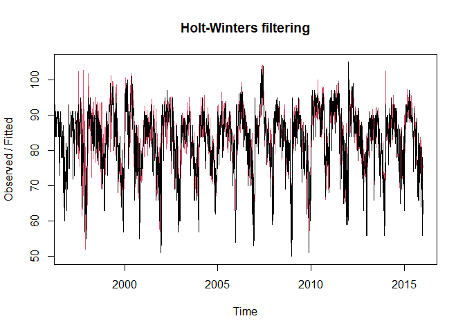<!-- -->

> ##### The black graph is our original time series, while the red graph is forecasted output from the Holt-Winters model. While not a one-to-one correlation point-wise, the graphs appear to be more similar than dissimilar. Consequently, will do further exploratory analysis by examining the fitted column output from the model.

``` r
# Will pull out and graph the fitted common output from the model for further analysis

head(data_temp_holt_wint$fitted)
```

    ## Time Series:
    ## Start = c(1997, 1) 
    ## End = c(1997, 6) 
    ## Frequency = 123 
    ##              xhat    level        trend   season
    ## 1997.000 87.23653 82.87739 -0.004362918 1.052653
    ## 1997.008 90.42182 82.15059 -0.004362918 1.100742
    ## 1997.016 92.99734 81.91055 -0.004362918 1.135413
    ## 1997.024 90.94030 81.90763 -0.004362918 1.110338
    ## 1997.033 83.99917 81.93634 -0.004362918 1.025231
    ## 1997.041 84.04496 81.93247 -0.004362918 1.025838

``` r
plot(data_temp_holt_wint$fitted)
```

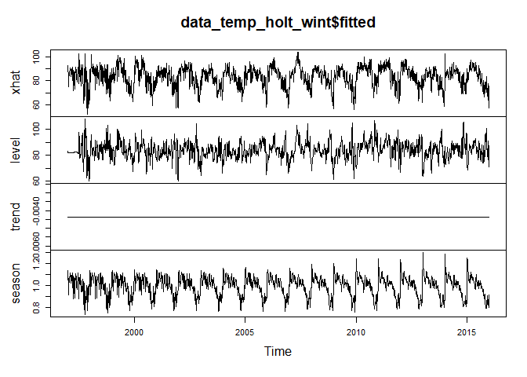<!-- -->

> ##### The flat line in the trend section is of note, pointing to the fact that there is no observable upward or downward relationship with the temperature changes has they progress over time. For further analysis, will pull out the seasonal factors column.

``` r
# Loading the season column into a separate matrix

data_temp_holt_wint_sf <- matrix(data_temp_holt_wint$fitted[,4], nrow=123)
head(data_temp_holt_wint_sf)
```

    ##          [,1]     [,2]     [,3]     [,4]     [,5]     [,6]     [,7]     [,8]
    ## [1,] 1.052653 1.049468 1.120607 1.103336 1.118390 1.108172 1.140906 1.140574
    ## [2,] 1.100742 1.099653 1.108025 1.098323 1.110184 1.116213 1.126827 1.154074
    ## [3,] 1.135413 1.135420 1.139096 1.142831 1.143201 1.138495 1.129678 1.156092
    ## [4,] 1.110338 1.110492 1.117079 1.125774 1.134539 1.126117 1.130758 1.137722
    ## [5,] 1.025231 1.025233 1.044684 1.067291 1.084725 1.097239 1.115055 1.103877
    ## [6,] 1.025838 1.025722 1.028169 1.042340 1.053954 1.067494 1.080203 1.094312
    ##          [,9]    [,10]    [,11]    [,12]    [,13]    [,14]    [,15]    [,16]
    ## [1,] 1.125438 1.122063 1.161415 1.198102 1.198910 1.243012 1.243781 1.238435
    ## [2,] 1.142187 1.131889 1.144549 1.134661 1.153433 1.165431 1.172935 1.190735
    ## [3,] 1.165657 1.147982 1.149459 1.135756 1.153310 1.155197 1.157286 1.169773
    ## [4,] 1.150639 1.146992 1.142497 1.150162 1.151169 1.157751 1.163844 1.159343
    ## [5,] 1.120818 1.133733 1.132167 1.142714 1.139244 1.112909 1.132435 1.132045
    ## [6,] 1.102680 1.092178 1.075766 1.088547 1.082185 1.103092 1.115071 1.118575
    ##         [,17]    [,18]    [,19]
    ## [1,] 1.300204 1.290647 1.254521
    ## [2,] 1.191956 1.219190 1.228826
    ## [3,] 1.189915 1.172309 1.169045
    ## [4,] 1.166605 1.167993 1.158956
    ## [5,] 1.145230 1.168161 1.170449
    ## [6,] 1.121598 1.134962 1.145475

``` r
qqnorm(data_temp_holt_wint_sf)
```

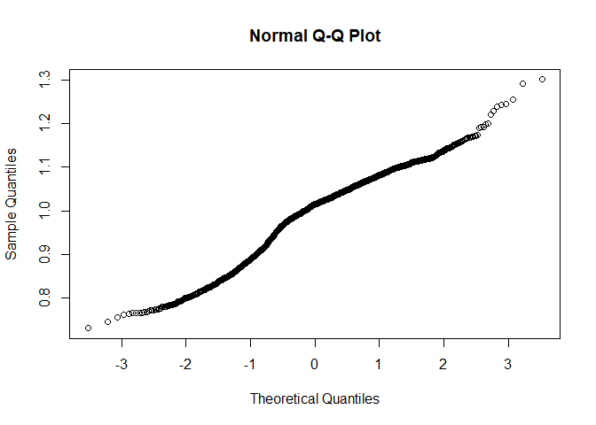<!-- -->

``` r
# To make reviewing the dataset easier, will re-add column names

colnames(data_temp_holt_wint_sf) <- colnames(data_temp[,3:21])
rownames(data_temp_holt_wint_sf) <- data_temp[,1]
```

> ##### Let’s first start with a broad look at the data. Will calculate the average seasonal temperature factor for ranges 1997-2005 and 2006-2015, and for the total dataset.

``` r
# Average seasonal temperature factor between the years 1997-2005

mean_1997_2005 <- (mean(data_temp_holt_wint_sf[,1:9]))

# Average seasonal temperature factor between the years 2006-2015

mean_2006_2015 <- (mean(data_temp_holt_wint_sf[,10:19]))

# One interesting thing we could look at is the average seasonal factor for the dataset as a whole.

total_mean_all_years <- (mean(data_temp_holt_wint_sf))

print(mean_1997_2005)
```

    ## [1] 0.9971068

``` r
print(mean_2006_2015)
```

    ## [1] 0.9940021

``` r
print(total_mean_all_years)
```

    ## [1] 0.9954727

> ##### Interestingly, the average seasonal temperature factor was greater between 1997-2005 than it was between 2006-2015 and for the total range outlined in the dataset. Next, we can explore the mean for each individual year in the dataset in ascending order.

``` r
# Average seasonal temperature factor for each individual year from 1997-2015

mean_by_year <- vector()
for (i in 1:ncol(data_temp_holt_wint_sf)){
  mean_by_year[i] = mean(data_temp_holt_wint_sf[,i])
}

print(mean_by_year)
```

    ##  [1] 1.0000000 0.9981882 0.9980547 0.9975095 0.9971271 0.9961954 0.9955108
    ##  [8] 0.9957393 0.9956360 0.9949667 0.9948162 0.9946495 0.9943300 0.9941211
    ## [15] 0.9940949 0.9933907 0.9932476 0.9935215 0.9928824

> ##### Next, we need to determine when during each month the weather begins to cool down for each year. We can do this by using a seasonal factor value of 1 as our baseline; if a factor falls below 1, we can interpret this as a decreasing seasonal temperature. Will use a CUMSUM iterative loop to achieve this.

``` r
# Using seed to generate reproducible results

set.seed(4233)

# Building CUMSUM iterative loop 

cusum_decrease = function(data, mean, T, C){
  results = list()
  cusum = 0
  rowCounter = 1
  while (rowCounter <= nrow(data)){
    current = data[rowCounter,]
    cusum = max(0, cusum + (mean - current - C))
    # print(cusum)
    if (cusum >= T) {
      results = rowCounter
      break
    }
    rowCounter = rowCounter + 1
    if (rowCounter >= nrow(data)){
      results = NA
      break
    }
  }
  return(results)
}
```

``` r
# Using seed to generate reproducible results

set.seed(4233)

# C is defined as .5 times the standard deviation, and T is defined as 3 times the standard deviation.

C_var = sd(data_temp_holt_wint_sf[,1])*0.5
T_var = sd(data_temp_holt_wint_sf[,1])*3
```

``` r
# Using seed to generate reproducible results

set.seed(4233)

# Running the CUMSUM function over each year to calculate the running average

result_vector = vector()
for (col in 1:ncol(data_temp_holt_wint_sf)){
  result_vector[col] = cusum_decrease(data = as.matrix(data_temp_holt_wint_sf[,col]), mean = 1,T = T_var, C = C_var)
}

result_df = data.frame(Year = colnames(data_temp_holt_wint_sf),Day = data_temp[result_vector,1])

print(result_df)
```

    ##     Year    Day
    ## 1  X1997 30-Sep
    ## 2  X1998  1-Oct
    ## 3  X1999  1-Oct
    ## 4  X2000  1-Oct
    ## 5  X2001  2-Oct
    ## 6  X2002  2-Oct
    ## 7  X2003  3-Oct
    ## 8  X2004  3-Oct
    ## 9  X2005  4-Oct
    ## 10 X2006  4-Oct
    ## 11 X2007  5-Oct
    ## 12 X2008  5-Oct
    ## 13 X2009  5-Oct
    ## 14 X2010  5-Oct
    ## 15 X2011  3-Oct
    ## 16 X2012  3-Oct
    ## 17 X2013  3-Oct
    ## 18 X2014  4-Oct
    ## 19 X2015  4-Oct

> ##### As we can see, fall comes later and later each year, as it takes longer for seasonal summer temperatures to abate into fall.

## Question 8.1

##### **Describe a situation or problem from your job, everyday life, current events, etc., for which a linear regression model would be appropriate. List some (up to 5) predictors that you might use.**

> ##### Again, an example from Fitbit: Say we wanted to measure the age ranges of males who have Fitbit Ionics paired to their accounts. We can set up our 2D Cartesian graph, with our x-axis containing the age ranges 16-25, 26-35, 36-45, etc., set against our y-axis, containing the count of the number of Ionics Bluetooth bonded to accounts with the sex set as “male.” The y-axis, in the hundreds scale, would be set to the ranges 1-10, 11-20, 21-30, etc., with 1 =100, 2=200, etc. Once our data has been plotted we can then trace a regression line, using the sum of squared errors, defined as the distance between the actual data points and the regression model’s estimaxte, to ensure the line’s fit against our data. From there, we can make informed decisions about which male age groups own and use the Ionic the most.

## Question 8.2

##### **Using crime data from <http://www.statsci.org/data/general/uscrime.txt> (file uscrime.txt, description at <http://www.statsci.org/data/general/uscrime.html> ), use regression (a useful R function is lm or glm) to predict the observed crime rate in a city with the following data:**

##### **M = 14.0**

##### **So = 0**

##### **Ed = 10.0**

##### **Po1 = 12.0**

##### **Po2 = 15.5**

##### **LF = 0.640**

##### **M.F = 94.0**

##### **Pop = 150**

##### **NW = 1.1**

##### **U1 = 0.120**

##### **U2 = 3.6**

##### **Wealth = 3200**

##### **Ineq = 20.1**

##### **Prob = 0.04**

##### **Time = 39.0**

##### **Show your model (factors used and their coefficients), the software output, and the quality of fit. Note that because there are only 47 data points and 15 predictors, you’ll probably notice some overfitting. We’ll see ways of dealing with this sort of problem later in the course.**

``` r
# description: http://www.statsci.org/data/general/uscrime.html

# import data from URL

data_crime <- read.table("http://www.statsci.org/data/general/uscrime.txt", stringsAsFactors = FALSE, header = TRUE)

# print head

print(data_crime)
```

    ##       M So   Ed  Po1  Po2    LF   M.F Pop   NW    U1  U2 Wealth Ineq     Prob
    ## 1  15.1  1  9.1  5.8  5.6 0.510  95.0  33 30.1 0.108 4.1   3940 26.1 0.084602
    ## 2  14.3  0 11.3 10.3  9.5 0.583 101.2  13 10.2 0.096 3.6   5570 19.4 0.029599
    ## 3  14.2  1  8.9  4.5  4.4 0.533  96.9  18 21.9 0.094 3.3   3180 25.0 0.083401
    ## 4  13.6  0 12.1 14.9 14.1 0.577  99.4 157  8.0 0.102 3.9   6730 16.7 0.015801
    ## 5  14.1  0 12.1 10.9 10.1 0.591  98.5  18  3.0 0.091 2.0   5780 17.4 0.041399
    ## 6  12.1  0 11.0 11.8 11.5 0.547  96.4  25  4.4 0.084 2.9   6890 12.6 0.034201
    ## 7  12.7  1 11.1  8.2  7.9 0.519  98.2   4 13.9 0.097 3.8   6200 16.8 0.042100
    ## 8  13.1  1 10.9 11.5 10.9 0.542  96.9  50 17.9 0.079 3.5   4720 20.6 0.040099
    ## 9  15.7  1  9.0  6.5  6.2 0.553  95.5  39 28.6 0.081 2.8   4210 23.9 0.071697
    ## 10 14.0  0 11.8  7.1  6.8 0.632 102.9   7  1.5 0.100 2.4   5260 17.4 0.044498
    ## 11 12.4  0 10.5 12.1 11.6 0.580  96.6 101 10.6 0.077 3.5   6570 17.0 0.016201
    ## 12 13.4  0 10.8  7.5  7.1 0.595  97.2  47  5.9 0.083 3.1   5800 17.2 0.031201
    ## 13 12.8  0 11.3  6.7  6.0 0.624  97.2  28  1.0 0.077 2.5   5070 20.6 0.045302
    ## 14 13.5  0 11.7  6.2  6.1 0.595  98.6  22  4.6 0.077 2.7   5290 19.0 0.053200
    ## 15 15.2  1  8.7  5.7  5.3 0.530  98.6  30  7.2 0.092 4.3   4050 26.4 0.069100
    ## 16 14.2  1  8.8  8.1  7.7 0.497  95.6  33 32.1 0.116 4.7   4270 24.7 0.052099
    ## 17 14.3  0 11.0  6.6  6.3 0.537  97.7  10  0.6 0.114 3.5   4870 16.6 0.076299
    ## 18 13.5  1 10.4 12.3 11.5 0.537  97.8  31 17.0 0.089 3.4   6310 16.5 0.119804
    ## 19 13.0  0 11.6 12.8 12.8 0.536  93.4  51  2.4 0.078 3.4   6270 13.5 0.019099
    ## 20 12.5  0 10.8 11.3 10.5 0.567  98.5  78  9.4 0.130 5.8   6260 16.6 0.034801
    ## 21 12.6  0 10.8  7.4  6.7 0.602  98.4  34  1.2 0.102 3.3   5570 19.5 0.022800
    ## 22 15.7  1  8.9  4.7  4.4 0.512  96.2  22 42.3 0.097 3.4   2880 27.6 0.089502
    ## 23 13.2  0  9.6  8.7  8.3 0.564  95.3  43  9.2 0.083 3.2   5130 22.7 0.030700
    ## 24 13.1  0 11.6  7.8  7.3 0.574 103.8   7  3.6 0.142 4.2   5400 17.6 0.041598
    ## 25 13.0  0 11.6  6.3  5.7 0.641  98.4  14  2.6 0.070 2.1   4860 19.6 0.069197
    ## 26 13.1  0 12.1 16.0 14.3 0.631 107.1   3  7.7 0.102 4.1   6740 15.2 0.041698
    ## 27 13.5  0 10.9  6.9  7.1 0.540  96.5   6  0.4 0.080 2.2   5640 13.9 0.036099
    ## 28 15.2  0 11.2  8.2  7.6 0.571 101.8  10  7.9 0.103 2.8   5370 21.5 0.038201
    ## 29 11.9  0 10.7 16.6 15.7 0.521  93.8 168  8.9 0.092 3.6   6370 15.4 0.023400
    ## 30 16.6  1  8.9  5.8  5.4 0.521  97.3  46 25.4 0.072 2.6   3960 23.7 0.075298
    ## 31 14.0  0  9.3  5.5  5.4 0.535 104.5   6  2.0 0.135 4.0   4530 20.0 0.041999
    ## 32 12.5  0 10.9  9.0  8.1 0.586  96.4  97  8.2 0.105 4.3   6170 16.3 0.042698
    ## 33 14.7  1 10.4  6.3  6.4 0.560  97.2  23  9.5 0.076 2.4   4620 23.3 0.049499
    ## 34 12.6  0 11.8  9.7  9.7 0.542  99.0  18  2.1 0.102 3.5   5890 16.6 0.040799
    ## 35 12.3  0 10.2  9.7  8.7 0.526  94.8 113  7.6 0.124 5.0   5720 15.8 0.020700
    ## 36 15.0  0 10.0 10.9  9.8 0.531  96.4   9  2.4 0.087 3.8   5590 15.3 0.006900
    ## 37 17.7  1  8.7  5.8  5.6 0.638  97.4  24 34.9 0.076 2.8   3820 25.4 0.045198
    ## 38 13.3  0 10.4  5.1  4.7 0.599 102.4   7  4.0 0.099 2.7   4250 22.5 0.053998
    ## 39 14.9  1  8.8  6.1  5.4 0.515  95.3  36 16.5 0.086 3.5   3950 25.1 0.047099
    ## 40 14.5  1 10.4  8.2  7.4 0.560  98.1  96 12.6 0.088 3.1   4880 22.8 0.038801
    ## 41 14.8  0 12.2  7.2  6.6 0.601  99.8   9  1.9 0.084 2.0   5900 14.4 0.025100
    ## 42 14.1  0 10.9  5.6  5.4 0.523  96.8   4  0.2 0.107 3.7   4890 17.0 0.088904
    ## 43 16.2  1  9.9  7.5  7.0 0.522  99.6  40 20.8 0.073 2.7   4960 22.4 0.054902
    ## 44 13.6  0 12.1  9.5  9.6 0.574 101.2  29  3.6 0.111 3.7   6220 16.2 0.028100
    ## 45 13.9  1  8.8  4.6  4.1 0.480  96.8  19  4.9 0.135 5.3   4570 24.9 0.056202
    ## 46 12.6  0 10.4 10.6  9.7 0.599  98.9  40  2.4 0.078 2.5   5930 17.1 0.046598
    ## 47 13.0  0 12.1  9.0  9.1 0.623 104.9   3  2.2 0.113 4.0   5880 16.0 0.052802
    ##       Time Crime
    ## 1  26.2011   791
    ## 2  25.2999  1635
    ## 3  24.3006   578
    ## 4  29.9012  1969
    ## 5  21.2998  1234
    ## 6  20.9995   682
    ## 7  20.6993   963
    ## 8  24.5988  1555
    ## 9  29.4001   856
    ## 10 19.5994   705
    ## 11 41.6000  1674
    ## 12 34.2984   849
    ## 13 36.2993   511
    ## 14 21.5010   664
    ## 15 22.7008   798
    ## 16 26.0991   946
    ## 17 19.1002   539
    ## 18 18.1996   929
    ## 19 24.9008   750
    ## 20 26.4010  1225
    ## 21 37.5998   742
    ## 22 37.0994   439
    ## 23 25.1989  1216
    ## 24 17.6000   968
    ## 25 21.9003   523
    ## 26 22.1005  1993
    ## 27 28.4999   342
    ## 28 25.8006  1216
    ## 29 36.7009  1043
    ## 30 28.3011   696
    ## 31 21.7998   373
    ## 32 30.9014   754
    ## 33 25.5005  1072
    ## 34 21.6997   923
    ## 35 37.4011   653
    ## 36 44.0004  1272
    ## 37 31.6995   831
    ## 38 16.6999   566
    ## 39 27.3004   826
    ## 40 29.3004  1151
    ## 41 30.0001   880
    ## 42 12.1996   542
    ## 43 31.9989   823
    ## 44 30.0001  1030
    ## 45 32.5996   455
    ## 46 16.6999   508
    ## 47 16.0997   849

``` r
# Using seed to generate reproducible results

set.seed(4233)

# Create a lnear regression model using the Crime data set

data_crime_linreg <- lm(Crime~., data = data_crime)
plot(data_crime_linreg)
```

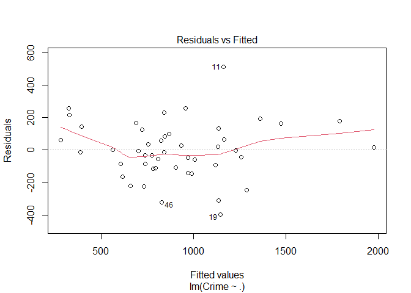<!-- -->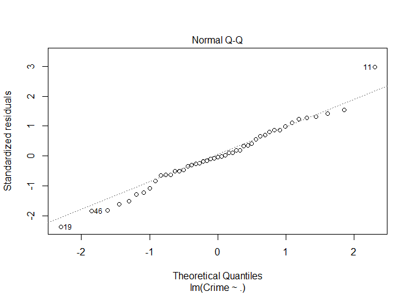<!-- -->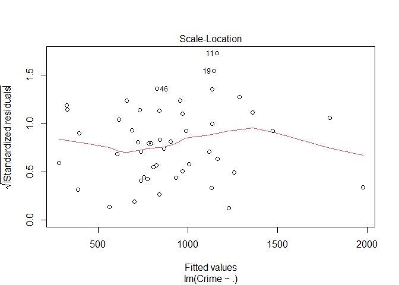<!-- -->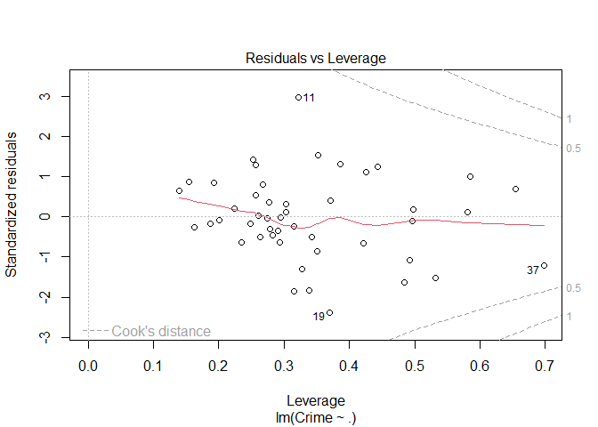<!-- -->

``` r
coeffs <- data.frame(data_crime_linreg$coefficients)
print(coeffs)
```

    ##             data_crime_linreg.coefficients
    ## (Intercept)                  -5.984288e+03
    ## M                             8.783017e+01
    ## So                           -3.803450e+00
    ## Ed                            1.883243e+02
    ## Po1                           1.928043e+02
    ## Po2                          -1.094219e+02
    ## LF                           -6.638261e+02
    ## M.F                           1.740686e+01
    ## Pop                          -7.330081e-01
    ## NW                            4.204461e+00
    ## U1                           -5.827103e+03
    ## U2                            1.677997e+02
    ## Wealth                        9.616624e-02
    ## Ineq                          7.067210e+01
    ## Prob                         -4.855266e+03
    ## Time                         -3.479018e+00

``` r
summary(data_crime_linreg)
```

    ## 
    ## Call:
    ## lm(formula = Crime ~ ., data = data_crime)
    ## 
    ## Residuals:
    ##     Min      1Q  Median      3Q     Max 
    ## -395.74  -98.09   -6.69  112.99  512.67 
    ## 
    ## Coefficients:
    ##               Estimate Std. Error t value Pr(>|t|)    
    ## (Intercept) -5.984e+03  1.628e+03  -3.675 0.000893 ***
    ## M            8.783e+01  4.171e+01   2.106 0.043443 *  
    ## So          -3.803e+00  1.488e+02  -0.026 0.979765    
    ## Ed           1.883e+02  6.209e+01   3.033 0.004861 ** 
    ## Po1          1.928e+02  1.061e+02   1.817 0.078892 .  
    ## Po2         -1.094e+02  1.175e+02  -0.931 0.358830    
    ## LF          -6.638e+02  1.470e+03  -0.452 0.654654    
    ## M.F          1.741e+01  2.035e+01   0.855 0.398995    
    ## Pop         -7.330e-01  1.290e+00  -0.568 0.573845    
    ## NW           4.204e+00  6.481e+00   0.649 0.521279    
    ## U1          -5.827e+03  4.210e+03  -1.384 0.176238    
    ## U2           1.678e+02  8.234e+01   2.038 0.050161 .  
    ## Wealth       9.617e-02  1.037e-01   0.928 0.360754    
    ## Ineq         7.067e+01  2.272e+01   3.111 0.003983 ** 
    ## Prob        -4.855e+03  2.272e+03  -2.137 0.040627 *  
    ## Time        -3.479e+00  7.165e+00  -0.486 0.630708    
    ## ---
    ## Signif. codes:  0 '***' 0.001 '**' 0.01 '*' 0.05 '.' 0.1 ' ' 1
    ## 
    ## Residual standard error: 209.1 on 31 degrees of freedom
    ## Multiple R-squared:  0.8031, Adjusted R-squared:  0.7078 
    ## F-statistic: 8.429 on 15 and 31 DF,  p-value: 3.539e-07

``` r
# setting up test point

test_point <- data.frame(M = 14.0, So = 0 , Ed = 10.0, Po1 = 12.0, Po2 = 15.5, LF = 0.640, M.F = 94.0, Pop = 150, NW = 1.1, U1 = 0.120, U2 = 3.6, Wealth = 3200, Ineq = 20.1, Prob = 0.04, Time = 39.0)

print(test_point)
```

    ##    M So Ed Po1  Po2   LF M.F Pop  NW   U1  U2 Wealth Ineq Prob Time
    ## 1 14  0 10  12 15.5 0.64  94 150 1.1 0.12 3.6   3200 20.1 0.04   39

``` r
# Using seed to generate reproducible results
set.seed(4233)

# Predicted crime rate

pred_model <- predict(data_crime_linreg, test_point)
print(pred_model)
```

    ##        1 
    ## 155.4349

``` r
qqnorm(data_crime$Crime)
```

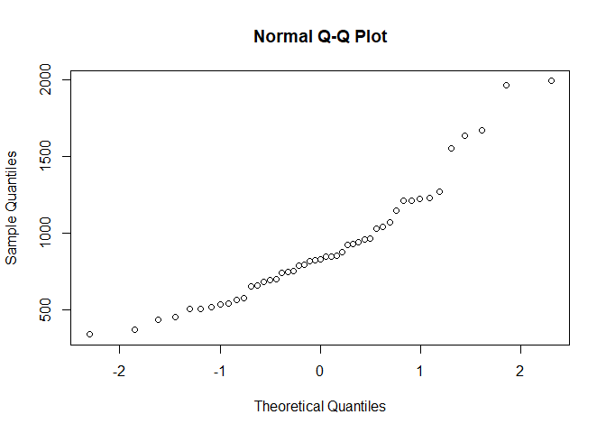<!-- -->

``` r
# The range in the crime data

range(data_crime$Crime)
```

    ## [1]  342 1993

> ##### The predicted crime rate is clearly outside of the range in the data set, which means that we need to go back and rework our regression model.

``` r
# Using seed to generate reproducible results

set.seed(4233)

# Will perform 10-fold Cross-validation to determine optimal regression fit

data_crime_cv <- cv.lm(data_crime, data_crime_linreg, m=10)
```

    ## Warning in cv.lm(data_crime, data_crime_linreg, m = 10): 
    ## 
    ##  As there is >1 explanatory variable, cross-validation
    ##  predicted values for a fold are not a linear function
    ##  of corresponding overall predicted values.  Lines that
    ##  are shown for the different folds are approximate

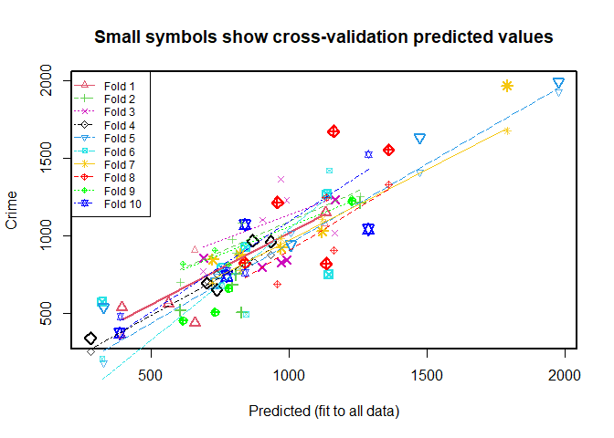<!-- -->

    ## 
    ## fold 1 
    ## Observations in test set: 4 
    ##                   17        22        38        40
    ## Predicted   393.3633  657.2092 562.69340 1131.4533
    ## cvpred      358.7085  909.3373 579.46126 1077.7818
    ## Crime       539.0000  439.0000 566.00000 1151.0000
    ## CV residual 180.2915 -470.3373 -13.46126   73.2182
    ## 
    ## Sum of squares = 259264.4    Mean square = 64816.09    n = 4 
    ## 
    ## fold 2 
    ## Observations in test set: 5 
    ##                     6        25         28        32        46
    ## Predicted    792.9301  605.8824 1258.48423  807.8167  827.3543
    ## cvpred       976.4142  701.7865 1255.05162  892.3939 1082.1212
    ## Crime        682.0000  523.0000 1216.00000  754.0000  508.0000
    ## CV residual -294.4142 -178.7865  -39.05162 -138.3939 -574.1212
    ## 
    ## Sum of squares = 468937.4    Mean square = 93787.49    n = 5 
    ## 
    ## fold 3 
    ## Observations in test set: 5 
    ##                     5         9        15        37        47
    ## Predicted   1166.6840 688.86823  903.3541  971.1513  991.7629
    ## cvpred      1021.8975 772.44017 1104.7676 1365.9933 1229.4432
    ## Crime       1234.0000 856.00000  798.0000  831.0000  849.0000
    ## CV residual  212.1025  83.55983 -306.7676 -534.9933 -380.4432
    ## 
    ## Sum of squares = 577030.9    Mean square = 115406.2    n = 5 
    ## 
    ## fold 4 
    ## Observations in test set: 5 
    ##                     7       24        27        30        35
    ## Predicted   934.16366 868.9805 279.47716 702.69454  737.7888
    ## cvpred      879.70364 838.4215 254.37204 712.42986  756.3837
    ## Crime       963.00000 968.0000 342.00000 696.00000  653.0000
    ## CV residual  83.29636 129.5785  87.62796 -16.42986 -103.3837
    ## 
    ## Sum of squares = 42365.65    Mean square = 8473.13    n = 5 
    ## 
    ## fold 5 
    ## Observations in test set: 5 
    ##                     2       10         16        26       42
    ## Predicted   1473.6764 736.5080 1005.65694 1977.3707 326.3324
    ## cvpred      1411.3911 745.1978 1021.25238 1928.1119 182.9259
    ## Crime       1635.0000 705.0000  946.00000 1993.0000 542.0000
    ## CV residual  223.6089 -40.1978  -75.25238   64.8881 359.0741
    ## 
    ## Sum of squares = 190424.4    Mean square = 38084.88    n = 5 
    ## 
    ## fold 6 
    ## Observations in test set: 5 
    ##                    1        3       18        19         36
    ## Predicted   755.0322 322.2615 843.8072 1145.7379 1137.61711
    ## cvpred      676.8354 207.1106 497.4156 1422.9706 1287.18725
    ## Crime       791.0000 578.0000 929.0000  750.0000 1272.00000
    ## CV residual 114.1646 370.8894 431.5844 -672.9706  -15.18725
    ## 
    ## Sum of squares = 789977.7    Mean square = 157995.5    n = 5 
    ## 
    ## fold 7 
    ## Observations in test set: 5 
    ##                    4       12        34       41         44
    ## Predicted   1791.362 722.0408 971.45581 823.7419 1120.82266
    ## cvpred      1676.774 699.5492 986.59797 778.3783 1108.73878
    ## Crime       1969.000 849.0000 923.00000 880.0000 1030.00000
    ## CV residual  292.226 149.4508 -63.59797 101.6217  -78.73878
    ## 
    ## Sum of squares = 128303.1    Mean square = 25660.61    n = 5 
    ## 
    ## fold 8 
    ## Observations in test set: 5 
    ##                     8        11        23       39        43
    ## Predicted   1361.7468 1161.3291  957.9918 839.2864 1134.4172
    ## cvpred      1333.1974  908.0211  688.7998 843.1841 1249.9103
    ## Crime       1555.0000 1674.0000 1216.0000 826.0000  823.0000
    ## CV residual  221.8026  765.9789  527.2002 -17.1841 -426.9103
    ## 
    ## Sum of squares = 1096408    Mean square = 219281.5    n = 5 
    ## 
    ## fold 9 
    ## Observations in test set: 4 
    ##                    13        14         20        45
    ## Predicted    732.6412  780.0401 1227.83873  616.8983
    ## cvpred       905.3579  813.9276 1244.57029  818.4825
    ## Crime        511.0000  664.0000 1225.00000  455.0000
    ## CV residual -394.3579 -149.9276  -19.57029 -363.4825
    ## 
    ## Sum of squares = 310499    Mean square = 77624.74    n = 4 
    ## 
    ## fold 10 
    ## Observations in test set: 4 
    ##                    21        29        31        33
    ## Predicted   774.85062 1287.3917  388.0334  840.9992
    ## cvpred      776.78912 1526.0769  480.3077  764.8086
    ## Crime       742.00000 1043.0000  373.0000 1072.0000
    ## CV residual -34.78912 -483.0769 -107.3077  307.1914
    ## 
    ## Sum of squares = 340455    Mean square = 85113.76    n = 4 
    ## 
    ## Overall (Sum over all 4 folds) 
    ##       ms 
    ## 89439.68

``` r
final_pred <- mean(data_crime_cv$Predicted) 
print(final_pred)
```

    ## [1] 905.0851

> ##### The above mean is more in line with the range of the Crime column, showing that this model is a good overall fit for the data.
