------------------------------------------------------------------------

title: “Introduction to Statistical Modeling - Assignment 4” author:
“Don Smith” output: github_document

------------------------------------------------------------------------

## Question 9.1

##### **Using the same crime data set uscrime.txt as in Question 8.2, apply Principal Component Analysis and then create a regression model using the first few principal components. Specify your new model in terms of the original variables (not the principal components), and compare its quality to that of your solution to Question 8.2. You can use the R function prcomp for PCA. (Note that to first scale the data, you can include scale. = TRUE to scale as part of the PCA function. Don’t forget that, to make a prediction for the new city, you’ll need to unscale the coefficients (i.e., do the scaling calculation in reverse)!)**

``` r
# loading all packages needed for analysis

library(kernlab)
library(kknn)
library(dplyr)
```

    ## 
    ## Attaching package: 'dplyr'

    ## The following objects are masked from 'package:stats':
    ## 
    ##     filter, lag

    ## The following objects are masked from 'package:base':
    ## 
    ##     intersect, setdiff, setequal, union

``` r
library(readr)
library(rmarkdown)
library(tinytex)
library(knitr)
library(NbClust)
library(outliers)
library(nortest)
library(greybox)
```

    ## Package "greybox", v1.0.7 loaded.

``` r
library(Mcomp)
```

    ## Loading required package: forecast

    ## Registered S3 method overwritten by 'quantmod':
    ##   method            from
    ##   as.zoo.data.frame zoo

``` r
library(DAAG)
library(caret)
```

    ## Loading required package: ggplot2

    ## 
    ## Attaching package: 'ggplot2'

    ## The following object is masked from 'package:kernlab':
    ## 
    ##     alpha

    ## Loading required package: lattice

    ## Registered S3 method overwritten by 'lava':
    ##   method     from   
    ##   print.pcor greybox

    ## 
    ## Attaching package: 'caret'

    ## The following object is masked from 'package:greybox':
    ## 
    ##     MAE

    ## The following object is masked from 'package:kknn':
    ## 
    ##     contr.dummy

``` r
library(randomForest)
```

    ## randomForest 4.7-1.1

    ## Type rfNews() to see new features/changes/bug fixes.

    ## 
    ## Attaching package: 'randomForest'

    ## The following object is masked from 'package:ggplot2':
    ## 
    ##     margin

    ## The following object is masked from 'package:outliers':
    ## 
    ##     outlier

    ## The following object is masked from 'package:dplyr':
    ## 
    ##     combine

``` r
library(tree)
library(pROC)
```

    ## Type 'citation("pROC")' for a citation.

    ## 
    ## Attaching package: 'pROC'

    ## The following objects are masked from 'package:stats':
    ## 
    ##     cov, smooth, var

``` r
# description: http://www.statsci.org/data/general/uscrime.html

# import data from URL
data_crime <- read.table("http://www.statsci.org/data/general/uscrime.txt", stringsAsFactors = FALSE, header = TRUE)

# print head
print(data_crime)
```

    ##       M So   Ed  Po1  Po2    LF   M.F Pop   NW    U1  U2 Wealth Ineq     Prob
    ## 1  15.1  1  9.1  5.8  5.6 0.510  95.0  33 30.1 0.108 4.1   3940 26.1 0.084602
    ## 2  14.3  0 11.3 10.3  9.5 0.583 101.2  13 10.2 0.096 3.6   5570 19.4 0.029599
    ## 3  14.2  1  8.9  4.5  4.4 0.533  96.9  18 21.9 0.094 3.3   3180 25.0 0.083401
    ## 4  13.6  0 12.1 14.9 14.1 0.577  99.4 157  8.0 0.102 3.9   6730 16.7 0.015801
    ## 5  14.1  0 12.1 10.9 10.1 0.591  98.5  18  3.0 0.091 2.0   5780 17.4 0.041399
    ## 6  12.1  0 11.0 11.8 11.5 0.547  96.4  25  4.4 0.084 2.9   6890 12.6 0.034201
    ## 7  12.7  1 11.1  8.2  7.9 0.519  98.2   4 13.9 0.097 3.8   6200 16.8 0.042100
    ## 8  13.1  1 10.9 11.5 10.9 0.542  96.9  50 17.9 0.079 3.5   4720 20.6 0.040099
    ## 9  15.7  1  9.0  6.5  6.2 0.553  95.5  39 28.6 0.081 2.8   4210 23.9 0.071697
    ## 10 14.0  0 11.8  7.1  6.8 0.632 102.9   7  1.5 0.100 2.4   5260 17.4 0.044498
    ## 11 12.4  0 10.5 12.1 11.6 0.580  96.6 101 10.6 0.077 3.5   6570 17.0 0.016201
    ## 12 13.4  0 10.8  7.5  7.1 0.595  97.2  47  5.9 0.083 3.1   5800 17.2 0.031201
    ## 13 12.8  0 11.3  6.7  6.0 0.624  97.2  28  1.0 0.077 2.5   5070 20.6 0.045302
    ## 14 13.5  0 11.7  6.2  6.1 0.595  98.6  22  4.6 0.077 2.7   5290 19.0 0.053200
    ## 15 15.2  1  8.7  5.7  5.3 0.530  98.6  30  7.2 0.092 4.3   4050 26.4 0.069100
    ## 16 14.2  1  8.8  8.1  7.7 0.497  95.6  33 32.1 0.116 4.7   4270 24.7 0.052099
    ## 17 14.3  0 11.0  6.6  6.3 0.537  97.7  10  0.6 0.114 3.5   4870 16.6 0.076299
    ## 18 13.5  1 10.4 12.3 11.5 0.537  97.8  31 17.0 0.089 3.4   6310 16.5 0.119804
    ## 19 13.0  0 11.6 12.8 12.8 0.536  93.4  51  2.4 0.078 3.4   6270 13.5 0.019099
    ## 20 12.5  0 10.8 11.3 10.5 0.567  98.5  78  9.4 0.130 5.8   6260 16.6 0.034801
    ## 21 12.6  0 10.8  7.4  6.7 0.602  98.4  34  1.2 0.102 3.3   5570 19.5 0.022800
    ## 22 15.7  1  8.9  4.7  4.4 0.512  96.2  22 42.3 0.097 3.4   2880 27.6 0.089502
    ## 23 13.2  0  9.6  8.7  8.3 0.564  95.3  43  9.2 0.083 3.2   5130 22.7 0.030700
    ## 24 13.1  0 11.6  7.8  7.3 0.574 103.8   7  3.6 0.142 4.2   5400 17.6 0.041598
    ## 25 13.0  0 11.6  6.3  5.7 0.641  98.4  14  2.6 0.070 2.1   4860 19.6 0.069197
    ## 26 13.1  0 12.1 16.0 14.3 0.631 107.1   3  7.7 0.102 4.1   6740 15.2 0.041698
    ## 27 13.5  0 10.9  6.9  7.1 0.540  96.5   6  0.4 0.080 2.2   5640 13.9 0.036099
    ## 28 15.2  0 11.2  8.2  7.6 0.571 101.8  10  7.9 0.103 2.8   5370 21.5 0.038201
    ## 29 11.9  0 10.7 16.6 15.7 0.521  93.8 168  8.9 0.092 3.6   6370 15.4 0.023400
    ## 30 16.6  1  8.9  5.8  5.4 0.521  97.3  46 25.4 0.072 2.6   3960 23.7 0.075298
    ## 31 14.0  0  9.3  5.5  5.4 0.535 104.5   6  2.0 0.135 4.0   4530 20.0 0.041999
    ## 32 12.5  0 10.9  9.0  8.1 0.586  96.4  97  8.2 0.105 4.3   6170 16.3 0.042698
    ## 33 14.7  1 10.4  6.3  6.4 0.560  97.2  23  9.5 0.076 2.4   4620 23.3 0.049499
    ## 34 12.6  0 11.8  9.7  9.7 0.542  99.0  18  2.1 0.102 3.5   5890 16.6 0.040799
    ## 35 12.3  0 10.2  9.7  8.7 0.526  94.8 113  7.6 0.124 5.0   5720 15.8 0.020700
    ## 36 15.0  0 10.0 10.9  9.8 0.531  96.4   9  2.4 0.087 3.8   5590 15.3 0.006900
    ## 37 17.7  1  8.7  5.8  5.6 0.638  97.4  24 34.9 0.076 2.8   3820 25.4 0.045198
    ## 38 13.3  0 10.4  5.1  4.7 0.599 102.4   7  4.0 0.099 2.7   4250 22.5 0.053998
    ## 39 14.9  1  8.8  6.1  5.4 0.515  95.3  36 16.5 0.086 3.5   3950 25.1 0.047099
    ## 40 14.5  1 10.4  8.2  7.4 0.560  98.1  96 12.6 0.088 3.1   4880 22.8 0.038801
    ## 41 14.8  0 12.2  7.2  6.6 0.601  99.8   9  1.9 0.084 2.0   5900 14.4 0.025100
    ## 42 14.1  0 10.9  5.6  5.4 0.523  96.8   4  0.2 0.107 3.7   4890 17.0 0.088904
    ## 43 16.2  1  9.9  7.5  7.0 0.522  99.6  40 20.8 0.073 2.7   4960 22.4 0.054902
    ## 44 13.6  0 12.1  9.5  9.6 0.574 101.2  29  3.6 0.111 3.7   6220 16.2 0.028100
    ## 45 13.9  1  8.8  4.6  4.1 0.480  96.8  19  4.9 0.135 5.3   4570 24.9 0.056202
    ## 46 12.6  0 10.4 10.6  9.7 0.599  98.9  40  2.4 0.078 2.5   5930 17.1 0.046598
    ## 47 13.0  0 12.1  9.0  9.1 0.623 104.9   3  2.2 0.113 4.0   5880 16.0 0.052802
    ##       Time Crime
    ## 1  26.2011   791
    ## 2  25.2999  1635
    ## 3  24.3006   578
    ## 4  29.9012  1969
    ## 5  21.2998  1234
    ## 6  20.9995   682
    ## 7  20.6993   963
    ## 8  24.5988  1555
    ## 9  29.4001   856
    ## 10 19.5994   705
    ## 11 41.6000  1674
    ## 12 34.2984   849
    ## 13 36.2993   511
    ## 14 21.5010   664
    ## 15 22.7008   798
    ## 16 26.0991   946
    ## 17 19.1002   539
    ## 18 18.1996   929
    ## 19 24.9008   750
    ## 20 26.4010  1225
    ## 21 37.5998   742
    ## 22 37.0994   439
    ## 23 25.1989  1216
    ## 24 17.6000   968
    ## 25 21.9003   523
    ## 26 22.1005  1993
    ## 27 28.4999   342
    ## 28 25.8006  1216
    ## 29 36.7009  1043
    ## 30 28.3011   696
    ## 31 21.7998   373
    ## 32 30.9014   754
    ## 33 25.5005  1072
    ## 34 21.6997   923
    ## 35 37.4011   653
    ## 36 44.0004  1272
    ## 37 31.6995   831
    ## 38 16.6999   566
    ## 39 27.3004   826
    ## 40 29.3004  1151
    ## 41 30.0001   880
    ## 42 12.1996   542
    ## 43 31.9989   823
    ## 44 30.0001  1030
    ## 45 32.5996   455
    ## 46 16.6999   508
    ## 47 16.0997   849

``` r
# Using seed to generate reproducible results
set.seed(4233)

# Principal Component Analysis
pca_analysis <- prcomp(data_crime[,1:15], center=T, scale.=T)
summary(pca_analysis)
```

    ## Importance of components:
    ##                           PC1    PC2    PC3     PC4     PC5     PC6     PC7
    ## Standard deviation     2.4534 1.6739 1.4160 1.07806 0.97893 0.74377 0.56729
    ## Proportion of Variance 0.4013 0.1868 0.1337 0.07748 0.06389 0.03688 0.02145
    ## Cumulative Proportion  0.4013 0.5880 0.7217 0.79920 0.86308 0.89996 0.92142
    ##                            PC8     PC9    PC10    PC11    PC12    PC13   PC14
    ## Standard deviation     0.55444 0.48493 0.44708 0.41915 0.35804 0.26333 0.2418
    ## Proportion of Variance 0.02049 0.01568 0.01333 0.01171 0.00855 0.00462 0.0039
    ## Cumulative Proportion  0.94191 0.95759 0.97091 0.98263 0.99117 0.99579 0.9997
    ##                           PC15
    ## Standard deviation     0.06793
    ## Proportion of Variance 0.00031
    ## Cumulative Proportion  1.00000

``` r
# Printing the matrix of eigenvectors
head(pca_analysis$rotation)
```

    ##            PC1         PC2        PC3         PC4         PC5          PC6
    ## M   -0.3037119  0.06280357 0.17241999 -0.02035537 -0.35832737 -0.449132706
    ## So  -0.3308813 -0.15837219 0.01554331  0.29247181 -0.12061130 -0.100500743
    ## Ed   0.3396215  0.21461152 0.06773962  0.07974375 -0.02442839 -0.008571367
    ## Po1  0.3086341 -0.26981761 0.05064582  0.33325059 -0.23527680 -0.095776709
    ## Po2  0.3109929 -0.26396300 0.05306512  0.35192809 -0.20473383 -0.119524780
    ## LF   0.1761776  0.31943042 0.27153018 -0.14326529 -0.39407588  0.504234275
    ##             PC7         PC8        PC9        PC10       PC11        PC12
    ## M   -0.15707378 -0.55367691  0.1547479 -0.01443093  0.3944666  0.16580189
    ## So   0.19649727  0.22734157 -0.6559987  0.06141452  0.2339787 -0.05753357
    ## Ed  -0.23943629 -0.14644678 -0.4432698  0.51887452 -0.1182195  0.47786536
    ## Po1  0.08011735  0.04613156  0.1942547 -0.14320978 -0.1304200  0.22611207
    ## Po2  0.09518288  0.03168720  0.1951207 -0.05929780 -0.1388591  0.19088461
    ## LF  -0.15931612  0.25513777  0.1439350  0.03077073  0.3853283  0.02705134
    ##            PC13        PC14         PC15
    ## M   -0.05142365  0.04901705  0.005139801
    ## So  -0.29368483 -0.29364512  0.008436923
    ## Ed   0.19441949  0.03964277 -0.028005204
    ## Po1 -0.18592255 -0.09490151 -0.689415513
    ## Po2 -0.13454940 -0.08259642  0.720027010
    ## LF  -0.27742957 -0.15385625  0.033682319

``` r
# Printing list of PCAs
head(pca_analysis$x)
```

    ##            PC1        PC2         PC3         PC4         PC5        PC6
    ## [1,] -4.199284 -1.0938312 -1.11907395  0.67178115  0.05528338  0.3073383
    ## [2,]  1.172663  0.6770136 -0.05244634 -0.08350709 -1.17319982 -0.5832373
    ## [3,] -4.173725  0.2767750 -0.37107658  0.37793995  0.54134525  0.7187223
    ## [4,]  3.834962 -2.5769060  0.22793998  0.38262331 -1.64474650  0.7294884
    ## [5,]  1.839300  1.3309856  1.27882805  0.71814305  0.04159032 -0.3940902
    ## [6,]  2.907234 -0.3305421  0.53288181  1.22140635  1.37436096 -0.6922513
    ##              PC7          PC8         PC9        PC10        PC11        PC12
    ## [1,] -0.56640816 -0.007801727  0.22350995  0.45274365 -0.08474542  0.22096639
    ## [2,]  0.19561119  0.154566472  0.43677720  0.21208589 -0.03391661  0.35686524
    ## [3,]  0.10330693  0.351138883  0.06299232 -0.06719022 -0.48149156 -0.04701948
    ## [4,]  0.26699499 -1.547460841 -0.37954181  0.22922305  0.10984951  0.17727101
    ## [5,]  0.07050766 -0.543237437  0.22463245  0.47769084 -0.32958186  0.41807551
    ## [6,]  0.22648209  0.562323186  0.41772217  0.09100939  0.01022969 -0.70661980
    ##             PC13       PC14        PC15
    ## [1,] -0.11261680  0.3269649  0.02338401
    ## [2,]  0.29751651  0.2523567 -0.06076368
    ## [3,]  0.05216054 -0.4865511  0.04211750
    ## [4,]  0.08838131  0.1496784  0.02917497
    ## [5,] -0.72215224  0.1310272 -0.07514940
    ## [6,] -0.13517271  0.1949257  0.01558610

> ##### After reviewing the output of the summary function above, we can see that PC columns 1-3 have a significant amount of variation when compared to the other columns. Moving forward, let’s review the proportional variance.

``` r
# Square the standard deviation 
std_squar <- pca_analysis$sdev^2

# Then calculate the proportional variance by dividing each eigenvalue by the sum of all eigenvalues
propor_var <- std_squar/sum(std_squar)
plot(propor_var, xlab = "Principal Component", ylab = "Proportion of Variance", ylim = c(0,1) , type= "b")
```

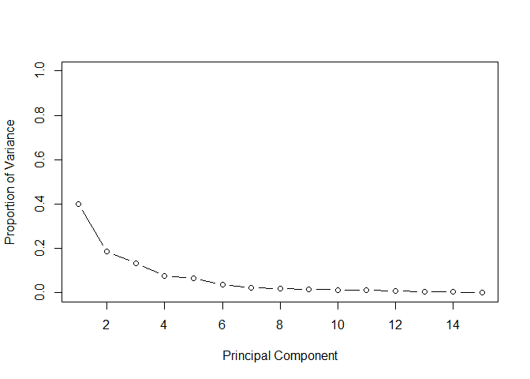<!-- -->

``` r
# To determine which PC variables are the most important, we will use the Kaiser rule, which asserts that any standard deviation listed
# that is greater than 1 is important. 
screeplot(pca_analysis, main = "Scree Plot", type = "line")
abline(h=1, col="red")
```

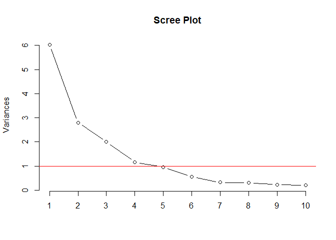<!-- -->

> ##### Per the graph and the Kaiser rule, the first 5 PCs are the most important. However, further analysis is still warranted to determine the most accurate set of PCs, which can be done using k-fold cross validation.

``` r
# Setting r^2 value and 5-fold cross-validated r^2 values
r2 <- numeric(15)
r2cross_val <- numeric(15)

# Using seed to generate reproducible results
set.seed(4233)

# To determine the number of PCs which wil give us the most accurate model, we will run an iterative loop to calculate r^2 and 5-fold cross-validated r^2 values using all PC values from 1 up to 15.
for (i in 1:15){
  pc_list <- pca_analysis$x[,1:i]
  pcc <- cbind(data_crime[,16],pc_list)
  
  # Calculate r^2, and append the values to the appropriate list
  model <- lm(V1~., data = as.data.frame(pcc))
  r2[i] <- 1 -sum(model$residuals^2)/sum((data_crime$Crime - mean(data_crime$Crime))^2)
  
  # Calculate 5-fold cross-validated r^2 values, and append the values to the appropriate list
  par(mfrow = c(3,5))
  c <- cv.lm(as.data.frame(pcc), model, m = 5, plotit = FALSE, printit = FALSE)
  r2cross_val[i] <- 1 - attr(c,"ms")*nrow(data_crime) / sum((data_crime$Crime - mean(data_crime$Crime))^2)
}
```

``` r
#plot the results
plot(r2,xlab = "Principal Component",ylab = "R^2 at x Principal Components", ylim = c(0,1), type = "b", col = "blue")
```

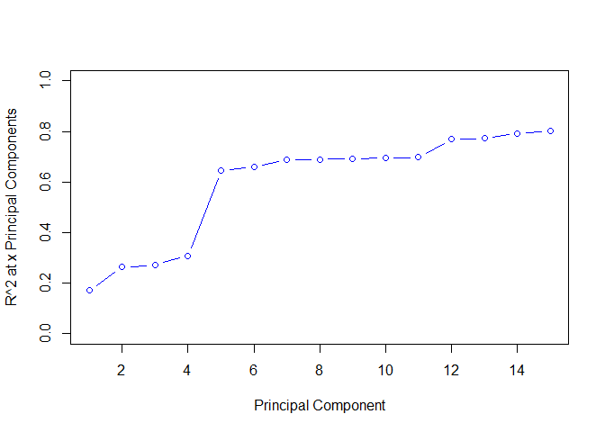<!-- -->

> ##### We see that there is a diminishing rate of return from 5 onwards, with a marginal increase around 14. From the graph, we can conclude that using either 4 or 15 will net the most accurate model.

``` r
# Will store the above data in a data frame for further review.
review_r2 <- data.frame(r2, r2cross_val, c(1:length(r2)))
print(review_r2)
```

    ##           r2 r2cross_val c.1.length.r2..
    ## 1  0.1711351  0.07108770               1
    ## 2  0.2631339  0.12277954               2
    ## 3  0.2716416  0.09633706               3
    ## 4  0.3091121  0.03917870               4
    ## 5  0.6451941  0.50684789               5
    ## 6  0.6586023  0.52176054               6
    ## 7  0.6881819  0.53062411               7
    ## 8  0.6898765  0.47056384               8
    ## 9  0.6920491  0.42989301               9
    ## 10 0.6962873  0.40853328              10
    ## 11 0.6973865  0.27681909              11
    ## 12 0.7692656  0.38084668              12
    ## 13 0.7723664  0.34605680              13
    ## 14 0.7911447  0.41716859              14
    ## 15 0.8030868  0.41975895              15

> ##### To limit the complexity of the model, we will move forward with using k =5.

``` r
# Set k equal to 5.
k  = 5

# Using the cbind(), we will combine 1 through 5 PCs with our original crime data.
pc_crime <- cbind(pca_analysis$x[,1:k], data_crime[,16])

# Using seed to generate reproducible results
set.seed(4233)

# Will create a linear regression model
lm_model <- lm(V6~., data = as.data.frame(pc_crime))
summary(lm_model)
```

    ## 
    ## Call:
    ## lm(formula = V6 ~ ., data = as.data.frame(pc_crime))
    ## 
    ## Residuals:
    ##     Min      1Q  Median      3Q     Max 
    ## -420.79 -185.01   12.21  146.24  447.86 
    ## 
    ## Coefficients:
    ##             Estimate Std. Error t value Pr(>|t|)    
    ## (Intercept)   905.09      35.59  25.428  < 2e-16 ***
    ## PC1            65.22      14.67   4.447 6.51e-05 ***
    ## PC2           -70.08      21.49  -3.261  0.00224 ** 
    ## PC3            25.19      25.41   0.992  0.32725    
    ## PC4            69.45      33.37   2.081  0.04374 *  
    ## PC5          -229.04      36.75  -6.232 2.02e-07 ***
    ## ---
    ## Signif. codes:  0 '***' 0.001 '**' 0.01 '*' 0.05 '.' 0.1 ' ' 1
    ## 
    ## Residual standard error: 244 on 41 degrees of freedom
    ## Multiple R-squared:  0.6452, Adjusted R-squared:  0.6019 
    ## F-statistic: 14.91 on 5 and 41 DF,  p-value: 2.446e-08

``` r
plot(lm_model)
```

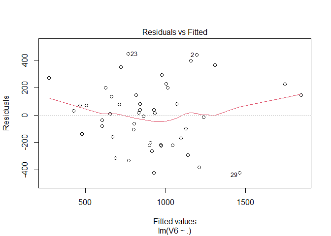<!-- -->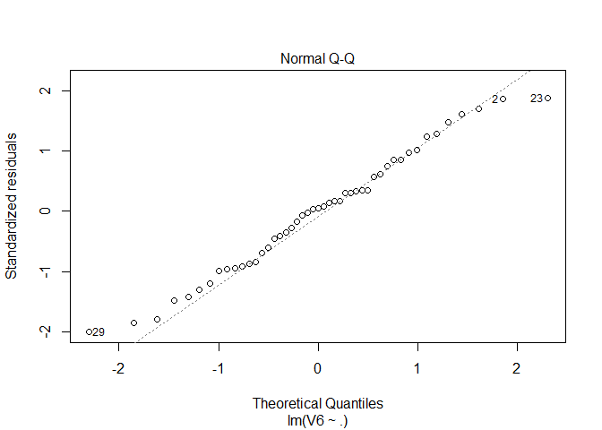<!-- -->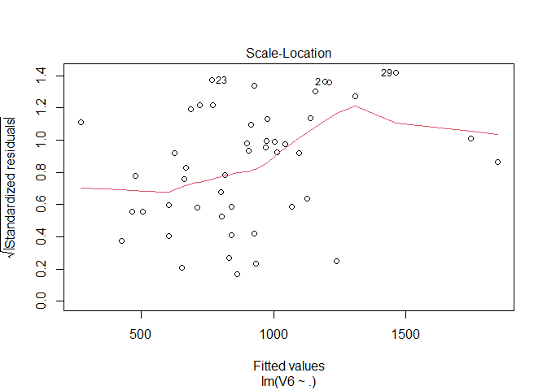<!-- -->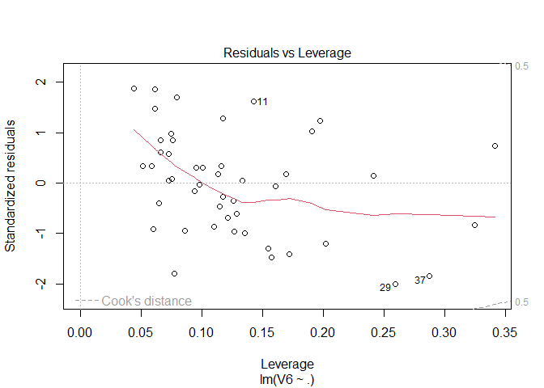<!-- -->

``` r
# Will first obtain intercepts for our transformation
beta0 <- lm_model$coefficients[1]

# Will then pull out our model's coefficients in order to construct the Beta vector
betas <- lm_model$coefficients[2:(k+1)]
```

``` r
# Multiply the coefficients by our rotatation matrix to create the Alpha vector
alpha <- pca_analysis$rotation[,1:k] %*% betas

# We can then obtain the original alpha values by dividing the alpha vector by sigma
mu <- sapply(data_crime[,1:15],mean)
sigma <- sapply(data_crime[,1:15],sd)
origAlpha <- alpha/sigma

# We can then obtain our original beta values by subtracting from the sum of (alpha*mu)/sigma from the intercept
origBeta0 <- beta0 - sum(alpha*mu /sigma)
```

``` r
# We can now create our model in the form of y = ax + b, where a is the scaled alpha value and b is the original intercept
estimates <- as.matrix(data_crime[,1:15]) %*% origAlpha + origBeta0

# To determine the accuracy of this model, we will now calculate our r^2
SSE = sum((estimates - data_crime[,16])^2)
SStot = sum((data_crime[,16] - mean(data_crime[,16]))^2)
R2 <- 1 - SSE/SStot
print(R2)
```

    ## [1] 0.6451941

``` r
# To determine the accuracy of this model, we will now calculate our adjested r^2
R2_adjust <- R2 - (1-R2)*k/(nrow(data_crime)-k-1)
R2_adjust
```

    ## [1] 0.601925

``` r
# Using the data provided last week, we can see how our new model predicts the crime rate 
last_week_city <- data.frame(M= 14.0, So = 0, Ed = 10.0, Po1 = 12.0, Po2 = 15.5,
                    LF = 0.640, M.F = 94.0, Pop = 150, NW = 1.1, U1 = 0.120, U2 = 3.6, Wealth = 3200, Ineq = 20.1, Prob = 0.040,Time = 39.0)

# Using seed to generate reproducible results
set.seed(4233)

# Creating a data frame with PCA data and last week's city data 
pred_df <- data.frame(predict(pca_analysis, last_week_city)) 

# Crime rate prediction
pred <- predict(lm_model, pred_df)

print(pred)
```

    ##        1 
    ## 1388.926

> ##### From the output, it looks like the model constructed last week was slightly more accurate. However, this analysis shows that a PCA model nets nearly the same accuracy as our other model.

## Question 10.1

##### **Using the same crime data set uscrime.txt as in Questions 8.2 and 9.1, find the best model you can using**

##### **(a) a regression tree model, and**

##### **(b) a random forest model.**

##### **In R, you can use the tree package or the rpart package, and the randomForest package. For each model, describe one or two qualitative takeaways you get from analyzing the results (i.e., don’t just stop when you have a good model, but interpret it too).**

``` r
# Using seed to generate reproducible results
set.seed(4233)

# Will first construct a regression tree model using the tree() function
crimeTreeMod <- tree(Crime ~ ., data = data_crime)
summary(crimeTreeMod)
```

    ## 
    ## Regression tree:
    ## tree(formula = Crime ~ ., data = data_crime)
    ## Variables actually used in tree construction:
    ## [1] "Po1" "Pop" "LF"  "NW" 
    ## Number of terminal nodes:  7 
    ## Residual mean deviance:  47390 = 1896000 / 40 
    ## Distribution of residuals:
    ##     Min.  1st Qu.   Median     Mean  3rd Qu.     Max. 
    ## -573.900  -98.300   -1.545    0.000  110.600  490.100

``` r
# Will plot the tree to review model
crimeTreeMod$frame
```

    ##       var  n        dev      yval splits.cutleft splits.cutright
    ## 1     Po1 47 6880927.66  905.0851          <7.65           >7.65
    ## 2     Pop 23  779243.48  669.6087          <22.5           >22.5
    ## 4      LF 12  243811.00  550.5000        <0.5675         >0.5675
    ## 8  <leaf>  7   48518.86  466.8571                               
    ## 9  <leaf>  5   77757.20  667.6000                               
    ## 5  <leaf> 11  179470.73  799.5455                               
    ## 3      NW 24 3604162.50 1130.7500          <7.65           >7.65
    ## 6     Pop 10  557574.90  886.9000          <21.5           >21.5
    ## 12 <leaf>  5  146390.80 1049.2000                               
    ## 13 <leaf>  5  147771.20  724.6000                               
    ## 7     Po1 14 2027224.93 1304.9286          <9.65           >9.65
    ## 14 <leaf>  6  170828.00 1041.0000                               
    ## 15 <leaf>  8 1124984.88 1502.8750

``` r
plot(crimeTreeMod)
text(crimeTreeMod)
title("USCRIME Training Set's Classification Tree")
```

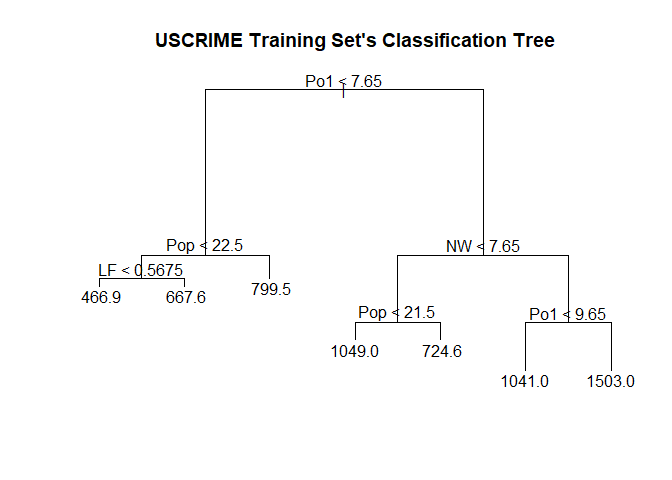<!-- -->

``` r
# Using seed to generate reproducible results
set.seed(4233)

# To further model's accuracy, will prune the tree
termnodes <- 5
prune.crimeTreeMod <- prune.tree(crimeTreeMod, best = termnodes)
plot(prune.crimeTreeMod)
text(prune.crimeTreeMod)
title("Pruned Tree")
```

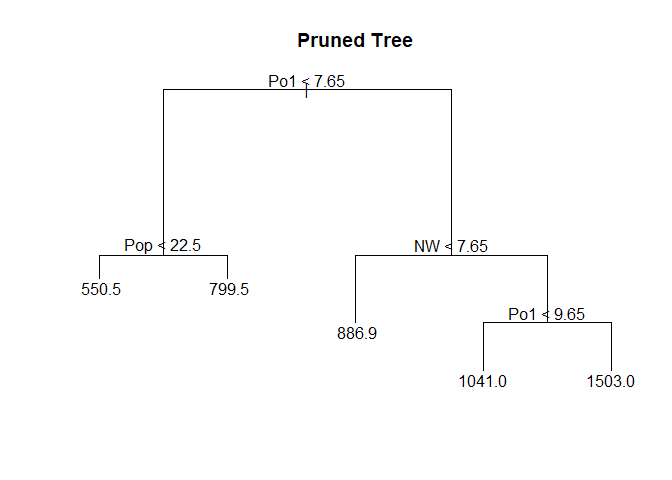<!-- -->

``` r
summary(prune.crimeTreeMod)
```

    ## 
    ## Regression tree:
    ## snip.tree(tree = crimeTreeMod, nodes = c(4L, 6L))
    ## Variables actually used in tree construction:
    ## [1] "Po1" "Pop" "NW" 
    ## Number of terminal nodes:  5 
    ## Residual mean deviance:  54210 = 2277000 / 42 
    ## Distribution of residuals:
    ##    Min. 1st Qu.  Median    Mean 3rd Qu.    Max. 
    ##  -573.9  -107.5    15.5     0.0   122.8   490.1

> ##### Pruning the tree increased the residual mean deviance, which indicates that there is overfitting.

``` r
# Look at the deviation and do cross validation
cv.crime <- cv.tree(crimeTreeMod)
prune.tree(crimeTreeMod)$size
```

    ## [1] 7 6 5 4 3 2 1

``` r
prune.tree(crimeTreeMod)$dev
```

    ## [1] 1895722 2013257 2276670 2632631 3364043 4383406 6880928

``` r
cv.crime$dev
```

    ## [1] 7400381 7558012 7558328 7555736 7534454 6259054 7981582

``` r
# The plot backs up our overfitting suspicion 
plot(cv.crime$size, cv.crime$dev, type = "b")
```

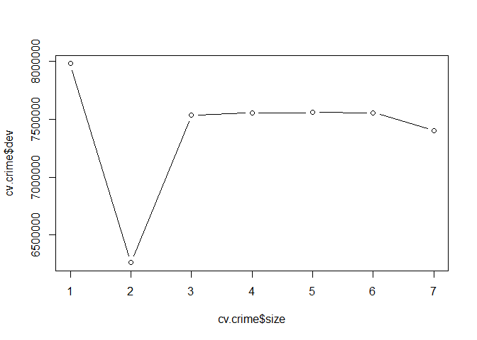<!-- -->

``` r
# Will use the max number of terminal nodes, as it contains the smallest amount of errors
termnodes2 <- 7
prune.crimeTreeMod2 <- prune.tree(crimeTreeMod, best = termnodes2)
plot(prune.crimeTreeMod2)
text(prune.crimeTreeMod2)
title("Pruned Tree")
```

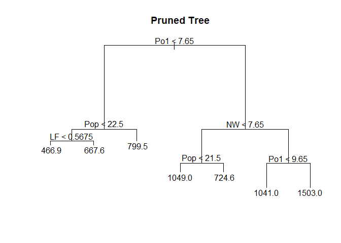<!-- -->

``` r
summary(prune.crimeTreeMod2)
```

    ## 
    ## Regression tree:
    ## tree(formula = Crime ~ ., data = data_crime)
    ## Variables actually used in tree construction:
    ## [1] "Po1" "Pop" "LF"  "NW" 
    ## Number of terminal nodes:  7 
    ## Residual mean deviance:  47390 = 1896000 / 40 
    ## Distribution of residuals:
    ##     Min.  1st Qu.   Median     Mean  3rd Qu.     Max. 
    ## -573.900  -98.300   -1.545    0.000  110.600  490.100

``` r
# Using seed to generate reproducible results
set.seed(4233)

# Will determine fit quality
crimeTreePredict <- predict(prune.crimeTreeMod2, data = uscrime[,1:15])
RSS <- sum((crimeTreePredict - data_crime[,16])^2)
TSS <- sum((data_crime[,16] - mean(data_crime[,16]))^2)
R2 <- 1 - RSS/TSS
R2
```

    ## [1] 0.7244962

``` r
# Will next construct a random forest model using the randomForest() function

# Using seed to generate reproducible results
set.seed(4233)

# Creating baseline randomForest Model
crime.rf <- randomForest(Crime ~ ., data=data_crime, importance = TRUE, nodesize = 5)
crime.rf.predict <- predict(crime.rf, data=data_crime[,-16])
RSS <- sum((crime.rf.predict - data_crime[,16])^2)
R2 <- 1 - RSS/TSS
R2
```

    ## [1] 0.4003257

``` r
# Using seed to generate reproducible results
set.seed(4233)

# Our r^2 is even worse than our previous tree. Will try a value of 9 for mtry and see how this affects accuracy
crime.rf2 <- randomForest(Crime ~ ., data=data_crime, importance = TRUE, nodesize = 5, mtry = 9)
crime.rf.predict2 <- predict(crime.rf2, data=data_crime[,-16])
RSS <- sum((crime.rf.predict2 - data_crime[,16])^2)
R2 <- 1 - RSS/TSS
R2
```

    ## [1] 0.3746302

> ##### The accuracy actually decreased. Will moe forward with trying different values of nodesize and mtry to find optimal values.

``` r
# Using seed to generate reproducible results
set.seed(4233)

# Create iterative loop to plug in different values of nodesize and mtry to find most accurate model, i.e., the model with the smallest r^2 value
result.rf <- data.frame(matrix(nrow=5, ncol=3))
colnames(result.rf) <- c("NodeSize", "mtry", "R2")
i = 1
suppressWarnings(for (nodesize in 2:15) {
  for (m in 1:20) {
    model <- randomForest(Crime ~ ., data=data_crime, importance = TRUE, nodesize = nodesize, mtry = m)
    predict <- predict(model, data=data_crime[,-16])
    RSS <- sum((predict - data_crime[,16])^2)
    TSS <- sum((data_crime[,16] - mean(data_crime[,16]))^2)
    R2 <- 1 - RSS/TSS
    result.rf[i,1] <- nodesize
    result.rf[i,2] <- m
    result.rf[i,3] <- R2
    i = i + 1
  }
})
head(result.rf)
```

    ##   NodeSize mtry        R2
    ## 1        2    1 0.4053864
    ## 2        2    2 0.4188460
    ## 3        2    3 0.4562233
    ## 4        2    4 0.4520691
    ## 5        2    5 0.4144572
    ## 6        2    6 0.4186500

``` r
result.rf[which.max(result.rf[,3]),]
```

    ##   NodeSize mtry        R2
    ## 3        2    3 0.4562233

> ##### A nodesize of 2 and an mtry value of 3 gives us the best randomForest model.

``` r
# Plugged these values into our model
crime.rf.final <- randomForest(Crime ~ ., data=data_crime, importance = TRUE, nodesize = 2, mtry = 3)
```

``` r
# Review the most important variables
importance(crime.rf.final)
```

    ##           %IncMSE IncNodePurity
    ## M       0.7967826     233568.91
    ## So      1.9118206      30535.07
    ## Ed      3.7425002     342937.41
    ## Po1    10.9878206    1062268.58
    ## Po2     9.9119023    1024606.22
    ## LF      2.7918532     363391.49
    ## M.F     0.8863324     416829.42
    ## Pop     0.1779636     464721.00
    ## NW      8.6901105     606774.22
    ## U1      1.9211134     206203.18
    ## U2      0.2038160     236604.94
    ## Wealth  4.3182992     573295.59
    ## Ineq    2.6829882     280540.44
    ## Prob    6.4897995     672748.86
    ## Time    2.3809351     298954.09

``` r
varImpPlot(crime.rf.final)
```

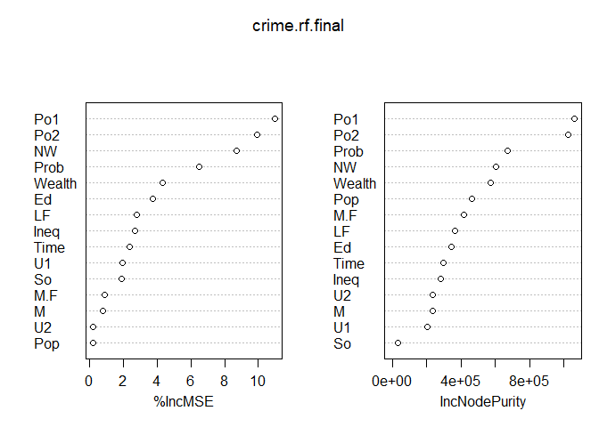<!-- -->

> ##### The random forest model had a 46% accuracy rating to the regression tree model’s 72% accuracy rating. I hypothesize that the larger number of variables used in the randomForest random sampling may decrease the accuracy of this model.

## Question 10.2

##### **Describe a situation or problem from your job, everyday life, current events, etc., for which a logistic regression model would be appropriate. List some (up to 5) predictors that you might use.**

> ##### My employer, Fitbit, offers an optional Premium subscription service that is not required to use our products. The majority of our users are not Premium subscribers. If viewed through the lens of this service, we could parse our customer base into two groups: Premium users (represented as 1) and non-Premium users (represented as 0). Using this classification, and given the amount of people who are current subscribers, we could construct a logistic regression model to predict what percentage of new users who join Fitbit will eventually sign up for our Premium service.

## Question 10.3

##### **1. Using the GermanCredit data set germancredit.txt from <http://archive.ics.uci.edu/ml/machine-learning-databases/statlog/german> / (description at <http://archive.ics.uci.edu/ml/datasets/Statlog+%28German+Credit+Data%29> ), use logistic regression to find a good predictive model for whether credit applicants are good credit risks or not. Show your model (factors used and their coefficients), the software output, and the quality of fit. You can use the glm function in R. To get a logistic regression (logit) model on data where the response is either zero or one, use family=binomial(link=”logit”) in your glm function call.**

##### **2. Because the model gives a result between 0 and 1, it requires setting a threshold probability to separate between “good” and “bad” answers. In this data set, they estimate that incorrectly identifying a bad customer as good, is 5 times worse than incorrectly classifying a good customer as bad. Determine a good threshold probability based on your model.**

\*\*

``` r
# Using seed to generate reproducible results
set.seed(4233)

credit <- read.table("http://archive.ics.uci.edu/ml/machine-learning-databases/statlog/german/german.data", header = FALSE)
str(credit)
```

    ## 'data.frame':    1000 obs. of  21 variables:
    ##  $ V1 : chr  "A11" "A12" "A14" "A11" ...
    ##  $ V2 : int  6 48 12 42 24 36 24 36 12 30 ...
    ##  $ V3 : chr  "A34" "A32" "A34" "A32" ...
    ##  $ V4 : chr  "A43" "A43" "A46" "A42" ...
    ##  $ V5 : int  1169 5951 2096 7882 4870 9055 2835 6948 3059 5234 ...
    ##  $ V6 : chr  "A65" "A61" "A61" "A61" ...
    ##  $ V7 : chr  "A75" "A73" "A74" "A74" ...
    ##  $ V8 : int  4 2 2 2 3 2 3 2 2 4 ...
    ##  $ V9 : chr  "A93" "A92" "A93" "A93" ...
    ##  $ V10: chr  "A101" "A101" "A101" "A103" ...
    ##  $ V11: int  4 2 3 4 4 4 4 2 4 2 ...
    ##  $ V12: chr  "A121" "A121" "A121" "A122" ...
    ##  $ V13: int  67 22 49 45 53 35 53 35 61 28 ...
    ##  $ V14: chr  "A143" "A143" "A143" "A143" ...
    ##  $ V15: chr  "A152" "A152" "A152" "A153" ...
    ##  $ V16: int  2 1 1 1 2 1 1 1 1 2 ...
    ##  $ V17: chr  "A173" "A173" "A172" "A173" ...
    ##  $ V18: int  1 1 2 2 2 2 1 1 1 1 ...
    ##  $ V19: chr  "A192" "A191" "A191" "A191" ...
    ##  $ V20: chr  "A201" "A201" "A201" "A201" ...
    ##  $ V21: int  1 2 1 1 2 1 1 1 1 2 ...

``` r
# Replace 1s and 2s with 0s and 1s
credit$V21[credit$V21==1] <- 0
credit$V21[credit$V21==2] <- 1
```

``` r
# Split data into train and validation set
creditTrain <- credit[1:800,] 
creditTest <- credit[801:1000,]

print(creditTest)
```

    ##       V1 V2  V3   V4    V5  V6  V7 V8  V9  V10 V11  V12 V13  V14  V15 V16  V17
    ## 801  A14 24 A34  A46  1597 A61 A75  4 A93 A101   4 A124  54 A143 A153   2 A173
    ## 802  A12 18 A34  A43  1795 A61 A75  3 A92 A103   4 A121  48 A141 A151   2 A172
    ## 803  A11 20 A34  A42  4272 A61 A75  1 A92 A101   4 A122  24 A143 A152   2 A173
    ## 804  A14 12 A34  A43   976 A65 A75  4 A93 A101   4 A123  35 A143 A152   2 A173
    ## 805  A12 12 A32  A40  7472 A65 A71  1 A92 A101   2 A121  24 A143 A151   1 A171
    ## 806  A11 36 A32  A40  9271 A61 A74  2 A93 A101   1 A123  24 A143 A152   1 A173
    ## 807  A12  6 A32  A43   590 A61 A72  3 A94 A101   3 A121  26 A143 A152   1 A172
    ## 808  A14 12 A34  A43   930 A65 A75  4 A93 A101   4 A121  65 A143 A152   4 A173
    ## 809  A12 42 A31  A41  9283 A61 A71  1 A93 A101   2 A124  55 A141 A153   1 A174
    ## 810  A12 15 A30  A40  1778 A61 A72  2 A92 A101   1 A121  26 A143 A151   2 A171
    ## 811  A12  8 A32  A49   907 A61 A72  3 A94 A101   2 A121  26 A143 A152   1 A173
    ## 812  A12  6 A32  A43   484 A61 A74  3 A94 A103   3 A121  28 A141 A152   1 A172
    ## 813  A11 36 A34  A41  9629 A61 A74  4 A93 A101   4 A123  24 A143 A152   2 A173
    ## 814  A11 48 A32  A44  3051 A61 A73  3 A93 A101   4 A123  54 A143 A152   1 A173
    ## 815  A11 48 A32  A40  3931 A61 A74  4 A93 A101   4 A124  46 A143 A153   1 A173
    ## 816  A12 36 A33  A40  7432 A61 A73  2 A92 A101   2 A122  54 A143 A151   1 A173
    ## 817  A14  6 A32  A44  1338 A63 A73  1 A91 A101   4 A121  62 A143 A152   1 A173
    ## 818  A14  6 A34  A43  1554 A61 A74  1 A92 A101   2 A123  24 A143 A151   2 A173
    ## 819  A11 36 A32 A410 15857 A61 A71  2 A91 A102   3 A123  43 A143 A152   1 A174
    ## 820  A11 18 A32  A43  1345 A61 A73  4 A94 A101   3 A121  26 A141 A152   1 A173
    ## 821  A14 12 A32  A40  1101 A61 A73  3 A94 A101   2 A121  27 A143 A152   2 A173
    ## 822  A13 12 A32  A43  3016 A61 A73  3 A94 A101   1 A123  24 A143 A152   1 A173
    ## 823  A11 36 A32  A42  2712 A61 A75  2 A93 A101   2 A122  41 A141 A152   1 A173
    ## 824  A11  8 A34  A40   731 A61 A75  4 A93 A101   4 A121  47 A143 A152   2 A172
    ## 825  A14 18 A34  A42  3780 A61 A72  3 A91 A101   2 A123  35 A143 A152   2 A174
    ## 826  A11 21 A34  A40  1602 A61 A75  4 A94 A101   3 A123  30 A143 A152   2 A173
    ## 827  A11 18 A34  A40  3966 A61 A75  1 A92 A101   4 A121  33 A141 A151   3 A173
    ## 828  A14 18 A30  A49  4165 A61 A73  2 A93 A101   2 A123  36 A142 A152   2 A173
    ## 829  A11 36 A32  A41  8335 A65 A75  3 A93 A101   4 A124  47 A143 A153   1 A173
    ## 830  A12 48 A33  A49  6681 A65 A73  4 A93 A101   4 A124  38 A143 A153   1 A173
    ## 831  A14 24 A33  A49  2375 A63 A73  4 A93 A101   2 A123  44 A143 A152   2 A173
    ## 832  A11 18 A32  A40  1216 A61 A72  4 A92 A101   3 A123  23 A143 A151   1 A173
    ## 833  A11 45 A30  A49 11816 A61 A75  2 A93 A101   4 A123  29 A143 A151   2 A173
    ## 834  A12 24 A32  A43  5084 A65 A75  2 A92 A101   4 A123  42 A143 A152   1 A173
    ## 835  A13 15 A32  A43  2327 A61 A72  2 A92 A101   3 A121  25 A143 A152   1 A172
    ## 836  A11 12 A30  A40  1082 A61 A73  4 A93 A101   4 A123  48 A141 A152   2 A173
    ## 837  A14 12 A32  A43   886 A65 A73  4 A92 A101   2 A123  21 A143 A152   1 A173
    ## 838  A14  4 A32  A42   601 A61 A72  1 A92 A101   3 A121  23 A143 A151   1 A172
    ## 839  A11 24 A34  A41  2957 A61 A75  4 A93 A101   4 A122  63 A143 A152   2 A173
    ## 840  A14 24 A34  A43  2611 A61 A75  4 A94 A102   3 A121  46 A143 A152   2 A173
    ## 841  A11 36 A32  A42  5179 A61 A74  4 A93 A101   2 A122  29 A143 A152   1 A173
    ## 842  A14 21 A33  A41  2993 A61 A73  3 A93 A101   2 A121  28 A142 A152   2 A172
    ## 843  A14 18 A32  A45  1943 A61 A72  4 A92 A101   4 A121  23 A143 A152   1 A173
    ## 844  A14 24 A31  A49  1559 A61 A74  4 A93 A101   4 A123  50 A141 A152   1 A173
    ## 845  A14 18 A32  A42  3422 A61 A75  4 A93 A101   4 A122  47 A141 A152   3 A173
    ## 846  A12 21 A32  A42  3976 A65 A74  2 A93 A101   3 A123  35 A143 A152   1 A173
    ## 847  A14 18 A32  A40  6761 A65 A73  2 A93 A101   4 A123  68 A143 A151   2 A173
    ## 848  A14 24 A32  A40  1249 A61 A72  4 A94 A101   2 A121  28 A143 A152   1 A173
    ## 849  A11  9 A32  A43  1364 A61 A74  3 A93 A101   4 A121  59 A143 A152   1 A173
    ## 850  A11 12 A32  A43   709 A61 A75  4 A93 A101   4 A121  57 A142 A152   1 A172
    ## 851  A11 20 A34  A40  2235 A61 A73  4 A94 A103   2 A122  33 A141 A151   2 A173
    ## 852  A14 24 A34  A41  4042 A65 A74  3 A93 A101   4 A122  43 A143 A152   2 A173
    ## 853  A14 15 A34  A43  1471 A61 A73  4 A93 A101   4 A124  35 A143 A153   2 A173
    ## 854  A11 18 A31  A40  1442 A61 A74  4 A93 A101   4 A124  32 A143 A153   2 A172
    ## 855  A14 36 A33  A40 10875 A61 A75  2 A93 A101   2 A123  45 A143 A152   2 A173
    ## 856  A14 24 A32  A40  1474 A62 A72  4 A94 A101   3 A121  33 A143 A152   1 A173
    ## 857  A14 10 A32  A48   894 A65 A74  4 A92 A101   3 A122  40 A143 A152   1 A173
    ## 858  A14 15 A34  A42  3343 A61 A73  4 A93 A101   2 A124  28 A143 A153   1 A173
    ## 859  A11 15 A32  A40  3959 A61 A73  3 A92 A101   2 A122  29 A143 A152   1 A173
    ## 860  A14  9 A32  A40  3577 A62 A73  1 A93 A103   2 A121  26 A143 A151   1 A173
    ## 861  A14 24 A34  A41  5804 A64 A73  4 A93 A101   2 A121  27 A143 A152   2 A173
    ## 862  A14 18 A33  A49  2169 A61 A73  4 A94 A101   2 A123  28 A143 A152   1 A173
    ## 863  A11 24 A32  A43  2439 A61 A72  4 A92 A101   4 A121  35 A143 A152   1 A173
    ## 864  A14 27 A34  A42  4526 A64 A72  4 A93 A101   2 A121  32 A142 A152   2 A172
    ## 865  A14 10 A32  A42  2210 A61 A73  2 A93 A101   2 A121  25 A141 A151   1 A172
    ## 866  A14 15 A32  A42  2221 A63 A73  2 A92 A101   4 A123  20 A143 A151   1 A173
    ## 867  A11 18 A32  A43  2389 A61 A72  4 A92 A101   1 A123  27 A142 A152   1 A173
    ## 868  A14 12 A34  A42  3331 A61 A75  2 A93 A101   4 A122  42 A142 A152   1 A173
    ## 869  A14 36 A32  A49  7409 A65 A75  3 A93 A101   2 A122  37 A143 A152   2 A173
    ## 870  A11 12 A32  A42   652 A61 A75  4 A92 A101   4 A122  24 A143 A151   1 A173
    ## 871  A14 36 A33  A42  7678 A63 A74  2 A92 A101   4 A123  40 A143 A152   2 A173
    ## 872  A13  6 A34  A40  1343 A61 A75  1 A93 A101   4 A121  46 A143 A152   2 A173
    ## 873  A11 24 A34  A49  1382 A62 A74  4 A93 A101   1 A121  26 A143 A152   2 A173
    ## 874  A14 15 A32  A44   874 A65 A72  4 A92 A101   1 A121  24 A143 A152   1 A173
    ## 875  A11 12 A32  A42  3590 A61 A73  2 A93 A102   2 A122  29 A143 A152   1 A172
    ## 876  A12 11 A34  A40  1322 A64 A73  4 A92 A101   4 A123  40 A143 A152   2 A173
    ## 877  A11 18 A31  A43  1940 A61 A72  3 A93 A102   4 A124  36 A141 A153   1 A174
    ## 878  A14 36 A32  A43  3595 A61 A75  4 A93 A101   2 A123  28 A143 A152   1 A173
    ## 879  A11  9 A32  A40  1422 A61 A72  3 A93 A101   2 A124  27 A143 A153   1 A174
    ## 880  A14 30 A34  A43  6742 A65 A74  2 A93 A101   3 A122  36 A143 A152   2 A173
    ## 881  A14 24 A32  A41  7814 A61 A74  3 A93 A101   3 A123  38 A143 A152   1 A174
    ## 882  A14 24 A32  A41  9277 A65 A73  2 A91 A101   4 A124  48 A143 A153   1 A173
    ## 883  A12 30 A34  A40  2181 A65 A75  4 A93 A101   4 A121  36 A143 A152   2 A173
    ## 884  A14 18 A34  A43  1098 A61 A71  4 A92 A101   4 A123  65 A143 A152   2 A171
    ## 885  A12 24 A32  A42  4057 A61 A74  3 A91 A101   3 A123  43 A143 A152   1 A173
    ## 886  A11 12 A32  A46   795 A61 A72  4 A92 A101   4 A122  53 A143 A152   1 A173
    ## 887  A12 24 A34  A49  2825 A65 A74  4 A93 A101   3 A124  34 A143 A152   2 A173
    ## 888  A12 48 A32  A49 15672 A61 A73  2 A93 A101   2 A123  23 A143 A152   1 A173
    ## 889  A14 36 A34  A40  6614 A61 A75  4 A93 A101   4 A123  34 A143 A152   2 A174
    ## 890  A14 28 A31  A41  7824 A65 A72  3 A93 A103   4 A121  40 A141 A151   2 A173
    ## 891  A11 27 A34  A49  2442 A61 A75  4 A93 A101   4 A123  43 A142 A152   4 A174
    ## 892  A14 15 A34  A43  1829 A61 A75  4 A93 A101   4 A123  46 A143 A152   2 A173
    ## 893  A11 12 A34  A40  2171 A61 A73  4 A93 A101   4 A122  38 A141 A152   2 A172
    ## 894  A12 36 A34  A41  5800 A61 A73  3 A93 A101   4 A123  34 A143 A152   2 A173
    ## 895  A14 18 A34  A43  1169 A65 A73  4 A93 A101   3 A122  29 A143 A152   2 A173
    ## 896  A14 36 A33  A41  8947 A65 A74  3 A93 A101   2 A123  31 A142 A152   1 A174
    ## 897  A11 21 A32  A43  2606 A61 A72  4 A92 A101   4 A122  28 A143 A151   1 A174
    ## 898  A14 12 A34  A42  1592 A64 A74  3 A92 A101   2 A122  35 A143 A152   1 A173
    ## 899  A14 15 A32  A42  2186 A65 A74  1 A92 A101   4 A121  33 A141 A151   1 A172
    ## 900  A11 18 A32  A42  4153 A61 A73  2 A93 A102   3 A123  42 A143 A152   1 A173
    ## 901  A11 16 A34  A40  2625 A61 A75  2 A93 A103   4 A122  43 A141 A151   1 A173
    ## 902  A14 20 A34  A40  3485 A65 A72  2 A91 A101   4 A121  44 A143 A152   2 A173
    ## 903  A14 36 A34  A41 10477 A65 A75  2 A93 A101   4 A124  42 A143 A153   2 A173
    ## 904  A14 15 A32  A43  1386 A65 A73  4 A94 A101   2 A121  40 A143 A151   1 A173
    ## 905  A14 24 A32  A43  1278 A61 A75  4 A93 A101   1 A121  36 A143 A152   1 A174
    ## 906  A11 12 A32  A43  1107 A61 A73  2 A93 A101   2 A121  20 A143 A151   1 A174
    ## 907  A11 21 A32  A40  3763 A65 A74  2 A93 A102   2 A121  24 A143 A152   1 A172
    ## 908  A12 36 A32  A46  3711 A65 A73  2 A94 A101   2 A123  27 A143 A152   1 A173
    ## 909  A14 15 A33  A41  3594 A61 A72  1 A92 A101   2 A122  46 A143 A152   2 A172
    ## 910  A12  9 A32  A40  3195 A65 A73  1 A92 A101   2 A121  33 A143 A152   1 A172
    ## 911  A14 36 A33  A43  4454 A61 A73  4 A92 A101   4 A121  34 A143 A152   2 A173
    ## 912  A12 24 A34  A42  4736 A61 A72  2 A92 A101   4 A123  25 A141 A152   1 A172
    ## 913  A12 30 A32  A43  2991 A65 A75  2 A92 A101   4 A123  25 A143 A152   1 A173
    ## 914  A14 11 A32  A49  2142 A64 A75  1 A91 A101   2 A121  28 A143 A152   1 A173
    ## 915  A11 24 A31  A49  3161 A61 A73  4 A93 A101   2 A122  31 A143 A151   1 A173
    ## 916  A12 48 A30 A410 18424 A61 A73  1 A92 A101   2 A122  32 A141 A152   1 A174
    ## 917  A14 10 A32  A41  2848 A62 A73  1 A93 A102   2 A121  32 A143 A152   1 A173
    ## 918  A11  6 A32  A40 14896 A61 A75  1 A93 A101   4 A124  68 A141 A152   1 A174
    ## 919  A11 24 A32  A42  2359 A62 A71  1 A91 A101   1 A122  33 A143 A152   1 A173
    ## 920  A11 24 A32  A42  3345 A61 A75  4 A93 A101   2 A122  39 A143 A151   1 A174
    ## 921  A14 18 A34  A42  1817 A61 A73  4 A92 A101   2 A124  28 A143 A152   2 A173
    ## 922  A14 48 A33  A43 12749 A63 A74  4 A93 A101   1 A123  37 A143 A152   1 A174
    ## 923  A11  9 A32  A43  1366 A61 A72  3 A92 A101   4 A122  22 A143 A151   1 A173
    ## 924  A12 12 A32  A40  2002 A61 A74  3 A93 A101   4 A122  30 A143 A151   1 A173
    ## 925  A11 24 A31  A42  6872 A61 A72  2 A91 A101   1 A122  55 A141 A152   1 A173
    ## 926  A11 12 A31  A40   697 A61 A72  4 A93 A101   2 A123  46 A141 A152   2 A173
    ## 927  A11 18 A34  A42  1049 A61 A72  4 A92 A101   4 A122  21 A143 A151   1 A173
    ## 928  A11 48 A32  A41 10297 A61 A74  4 A93 A101   4 A124  39 A142 A153   3 A173
    ## 929  A14 30 A32  A43  1867 A65 A75  4 A93 A101   4 A123  58 A143 A152   1 A173
    ## 930  A11 12 A33  A40  1344 A61 A73  4 A93 A101   2 A121  43 A143 A152   2 A172
    ## 931  A11 24 A32  A42  1747 A61 A72  4 A93 A102   1 A122  24 A143 A152   1 A172
    ## 932  A12  9 A32  A43  1670 A61 A72  4 A92 A101   2 A123  22 A143 A152   1 A173
    ## 933  A14  9 A34  A40  1224 A61 A73  3 A93 A101   1 A121  30 A143 A152   2 A173
    ## 934  A14 12 A34  A43   522 A63 A75  4 A93 A101   4 A122  42 A143 A152   2 A173
    ## 935  A11 12 A32  A43  1498 A61 A73  4 A92 A101   1 A123  23 A141 A152   1 A173
    ## 936  A12 30 A33  A43  1919 A62 A72  4 A93 A101   3 A124  30 A142 A152   2 A174
    ## 937  A13  9 A32  A43   745 A61 A73  3 A92 A101   2 A121  28 A143 A152   1 A172
    ## 938  A12  6 A32  A43  2063 A61 A72  4 A94 A101   3 A123  30 A143 A151   1 A174
    ## 939  A12 60 A32  A46  6288 A61 A73  4 A93 A101   4 A124  42 A143 A153   1 A173
    ## 940  A14 24 A34  A41  6842 A65 A73  2 A93 A101   4 A122  46 A143 A152   2 A174
    ## 941  A14 12 A32  A40  3527 A65 A72  2 A93 A101   3 A122  45 A143 A152   1 A174
    ## 942  A14 10 A32  A40  1546 A61 A73  3 A93 A101   2 A121  31 A143 A152   1 A172
    ## 943  A14 24 A32  A42   929 A65 A74  4 A93 A101   2 A123  31 A142 A152   1 A173
    ## 944  A14  4 A34  A40  1455 A61 A74  2 A93 A101   1 A121  42 A143 A152   3 A172
    ## 945  A11 15 A32  A42  1845 A61 A72  4 A92 A103   1 A122  46 A143 A151   1 A173
    ## 946  A12 48 A30  A40  8358 A63 A72  1 A92 A101   1 A123  30 A143 A152   2 A173
    ## 947  A11 24 A31  A42  3349 A63 A72  4 A93 A101   4 A124  30 A143 A153   1 A173
    ## 948  A14 12 A32  A40  2859 A65 A71  4 A93 A101   4 A124  38 A143 A152   1 A174
    ## 949  A14 18 A32  A42  1533 A61 A72  4 A94 A102   1 A122  43 A143 A152   1 A172
    ## 950  A14 24 A32  A43  3621 A62 A75  2 A93 A101   4 A123  31 A143 A152   2 A173
    ## 951  A12 18 A34  A49  3590 A61 A71  3 A94 A101   3 A123  40 A143 A152   3 A171
    ## 952  A11 36 A33  A49  2145 A61 A74  2 A93 A101   1 A123  24 A143 A152   2 A173
    ## 953  A12 24 A32  A41  4113 A63 A72  3 A92 A101   4 A123  28 A143 A151   1 A173
    ## 954  A14 36 A32  A42 10974 A61 A71  4 A92 A101   2 A123  26 A143 A152   2 A174
    ## 955  A11 12 A32  A40  1893 A61 A73  4 A92 A103   4 A122  29 A143 A152   1 A173
    ## 956  A11 24 A34  A43  1231 A64 A75  4 A92 A101   4 A122  57 A143 A151   2 A174
    ## 957  A13 30 A34  A43  3656 A65 A75  4 A93 A101   4 A122  49 A142 A152   2 A172
    ## 958  A12  9 A34  A43  1154 A61 A75  2 A93 A101   4 A121  37 A143 A152   3 A172
    ## 959  A11 28 A32  A40  4006 A61 A73  3 A93 A101   2 A123  45 A143 A152   1 A172
    ## 960  A12 24 A32  A42  3069 A62 A75  4 A93 A101   4 A124  30 A143 A153   1 A173
    ## 961  A14  6 A34  A43  1740 A61 A75  2 A94 A101   2 A121  30 A143 A151   2 A173
    ## 962  A12 21 A33  A40  2353 A61 A73  1 A91 A101   4 A122  47 A143 A152   2 A173
    ## 963  A14 15 A32  A40  3556 A65 A73  3 A93 A101   2 A124  29 A143 A152   1 A173
    ## 964  A14 24 A32  A43  2397 A63 A75  3 A93 A101   2 A123  35 A141 A152   2 A173
    ## 965  A12  6 A32  A45   454 A61 A72  3 A94 A101   1 A122  22 A143 A152   1 A172
    ## 966  A12 30 A32  A43  1715 A65 A73  4 A92 A101   1 A123  26 A143 A152   1 A173
    ## 967  A12 27 A34  A43  2520 A63 A73  4 A93 A101   2 A122  23 A143 A152   2 A172
    ## 968  A14 15 A32  A43  3568 A61 A75  4 A92 A101   2 A123  54 A141 A151   1 A174
    ## 969  A14 42 A32  A43  7166 A65 A74  2 A94 A101   4 A122  29 A143 A151   1 A173
    ## 970  A11 11 A34  A40  3939 A61 A73  1 A93 A101   2 A121  40 A143 A152   2 A172
    ## 971  A12 15 A32  A45  1514 A62 A73  4 A93 A103   2 A121  22 A143 A152   1 A173
    ## 972  A14 24 A32  A40  7393 A61 A73  1 A93 A101   4 A122  43 A143 A152   1 A172
    ## 973  A11 24 A31  A40  1193 A61 A71  1 A92 A102   4 A124  29 A143 A151   2 A171
    ## 974  A11 60 A32  A49  7297 A61 A75  4 A93 A102   4 A124  36 A143 A151   1 A173
    ## 975  A14 30 A34  A43  2831 A61 A73  4 A92 A101   2 A123  33 A143 A152   1 A173
    ## 976  A13 24 A32  A43  1258 A63 A73  3 A92 A101   3 A123  57 A143 A152   1 A172
    ## 977  A12  6 A32  A43   753 A61 A73  2 A92 A103   3 A121  64 A143 A152   1 A173
    ## 978  A12 18 A33  A49  2427 A65 A75  4 A93 A101   2 A122  42 A143 A152   2 A173
    ## 979  A14 24 A33  A40  2538 A61 A75  4 A93 A101   4 A123  47 A143 A152   2 A172
    ## 980  A12 15 A31  A40  1264 A62 A73  2 A94 A101   2 A122  25 A143 A151   1 A173
    ## 981  A12 30 A34  A42  8386 A61 A74  2 A93 A101   2 A122  49 A143 A152   1 A173
    ## 982  A14 48 A32  A49  4844 A61 A71  3 A93 A101   2 A123  33 A141 A151   1 A174
    ## 983  A13 21 A32  A40  2923 A62 A73  1 A92 A101   1 A123  28 A141 A152   1 A174
    ## 984  A11 36 A32  A41  8229 A61 A73  2 A93 A101   2 A122  26 A143 A152   1 A173
    ## 985  A14 24 A34  A42  2028 A61 A74  2 A93 A101   2 A122  30 A143 A152   2 A172
    ## 986  A11 15 A34  A42  1433 A61 A73  4 A92 A101   3 A122  25 A143 A151   2 A173
    ## 987  A13 42 A30  A49  6289 A61 A72  2 A91 A101   1 A122  33 A143 A152   2 A173
    ## 988  A14 13 A32  A43  1409 A62 A71  2 A92 A101   4 A121  64 A143 A152   1 A173
    ## 989  A11 24 A32  A41  6579 A61 A71  4 A93 A101   2 A124  29 A143 A153   1 A174
    ## 990  A12 24 A34  A43  1743 A61 A75  4 A93 A101   2 A122  48 A143 A152   2 A172
    ## 991  A14 12 A34  A46  3565 A65 A72  2 A93 A101   1 A122  37 A143 A152   2 A172
    ## 992  A14 15 A31  A43  1569 A62 A75  4 A93 A101   4 A123  34 A141 A152   1 A172
    ## 993  A11 18 A32  A43  1936 A65 A74  2 A94 A101   4 A123  23 A143 A151   2 A172
    ## 994  A11 36 A32  A42  3959 A61 A71  4 A93 A101   3 A122  30 A143 A152   1 A174
    ## 995  A14 12 A32  A40  2390 A65 A75  4 A93 A101   3 A123  50 A143 A152   1 A173
    ## 996  A14 12 A32  A42  1736 A61 A74  3 A92 A101   4 A121  31 A143 A152   1 A172
    ## 997  A11 30 A32  A41  3857 A61 A73  4 A91 A101   4 A122  40 A143 A152   1 A174
    ## 998  A14 12 A32  A43   804 A61 A75  4 A93 A101   4 A123  38 A143 A152   1 A173
    ## 999  A11 45 A32  A43  1845 A61 A73  4 A93 A101   4 A124  23 A143 A153   1 A173
    ## 1000 A12 45 A34  A41  4576 A62 A71  3 A93 A101   4 A123  27 A143 A152   1 A173
    ##      V18  V19  V20 V21
    ## 801    2 A191 A201   0
    ## 802    1 A192 A201   0
    ## 803    1 A191 A201   0
    ## 804    1 A191 A201   0
    ## 805    1 A191 A201   0
    ## 806    1 A192 A201   1
    ## 807    1 A191 A202   0
    ## 808    1 A191 A201   0
    ## 809    1 A192 A201   0
    ## 810    1 A191 A201   1
    ## 811    1 A192 A201   0
    ## 812    1 A191 A201   0
    ## 813    1 A192 A201   1
    ## 814    1 A191 A201   1
    ## 815    2 A191 A201   1
    ## 816    1 A191 A201   0
    ## 817    1 A191 A201   0
    ## 818    1 A192 A201   0
    ## 819    1 A191 A201   0
    ## 820    1 A191 A201   1
    ## 821    1 A192 A201   0
    ## 822    1 A191 A201   0
    ## 823    2 A191 A201   1
    ## 824    1 A191 A201   0
    ## 825    1 A192 A201   0
    ## 826    1 A192 A201   0
    ## 827    1 A192 A201   1
    ## 828    2 A191 A201   1
    ## 829    1 A191 A201   1
    ## 830    2 A192 A201   0
    ## 831    2 A192 A201   0
    ## 832    1 A192 A201   1
    ## 833    1 A191 A201   1
    ## 834    1 A192 A201   0
    ## 835    1 A191 A201   1
    ## 836    1 A191 A201   1
    ## 837    1 A191 A201   0
    ## 838    2 A191 A201   0
    ## 839    1 A192 A201   0
    ## 840    1 A191 A201   0
    ## 841    1 A191 A201   1
    ## 842    1 A191 A201   0
    ## 843    1 A191 A201   1
    ## 844    1 A192 A201   0
    ## 845    2 A192 A201   0
    ## 846    1 A192 A201   0
    ## 847    1 A191 A201   1
    ## 848    1 A191 A201   0
    ## 849    1 A191 A201   0
    ## 850    1 A191 A201   1
    ## 851    1 A191 A202   1
    ## 852    1 A192 A201   0
    ## 853    1 A192 A201   0
    ## 854    2 A191 A201   1
    ## 855    2 A192 A201   0
    ## 856    1 A192 A201   0
    ## 857    1 A192 A201   0
    ## 858    1 A192 A201   0
    ## 859    1 A192 A201   1
    ## 860    2 A191 A202   0
    ## 861    1 A191 A201   0
    ## 862    1 A192 A201   1
    ## 863    1 A192 A201   1
    ## 864    2 A192 A201   0
    ## 865    1 A191 A201   1
    ## 866    1 A191 A201   0
    ## 867    1 A191 A201   0
    ## 868    1 A191 A201   0
    ## 869    1 A191 A201   0
    ## 870    1 A191 A201   0
    ## 871    1 A192 A201   0
    ## 872    2 A191 A202   0
    ## 873    1 A192 A201   0
    ## 874    1 A191 A201   0
    ## 875    2 A191 A201   0
    ## 876    1 A191 A201   0
    ## 877    1 A192 A201   0
    ## 878    1 A191 A201   0
    ## 879    1 A192 A201   1
    ## 880    1 A191 A201   0
    ## 881    1 A192 A201   0
    ## 882    1 A192 A201   0
    ## 883    1 A191 A201   0
    ## 884    1 A191 A201   0
    ## 885    1 A192 A201   1
    ## 886    1 A191 A201   1
    ## 887    2 A192 A201   0
    ## 888    1 A192 A201   1
    ## 889    1 A192 A201   0
    ## 890    2 A192 A201   0
    ## 891    2 A192 A201   0
    ## 892    1 A192 A201   0
    ## 893    1 A191 A202   0
    ## 894    1 A192 A201   0
    ## 895    1 A192 A201   0
    ## 896    2 A192 A201   0
    ## 897    1 A192 A201   0
    ## 898    1 A191 A202   0
    ## 899    1 A191 A201   0
    ## 900    1 A191 A201   1
    ## 901    1 A192 A201   1
    ## 902    1 A192 A201   0
    ## 903    1 A191 A201   0
    ## 904    1 A192 A201   0
    ## 905    1 A192 A201   0
    ## 906    2 A192 A201   0
    ## 907    1 A191 A202   0
    ## 908    1 A191 A201   0
    ## 909    1 A191 A201   0
    ## 910    1 A191 A201   0
    ## 911    1 A191 A201   0
    ## 912    1 A191 A201   1
    ## 913    1 A191 A201   0
    ## 914    1 A192 A201   0
    ## 915    1 A192 A201   1
    ## 916    1 A192 A202   1
    ## 917    2 A191 A201   0
    ## 918    1 A192 A201   1
    ## 919    1 A191 A201   1
    ## 920    1 A192 A201   1
    ## 921    1 A191 A201   0
    ## 922    1 A192 A201   0
    ## 923    1 A191 A201   1
    ## 924    2 A192 A201   0
    ## 925    1 A192 A201   1
    ## 926    1 A192 A201   1
    ## 927    1 A191 A201   0
    ## 928    2 A192 A201   1
    ## 929    1 A192 A201   0
    ## 930    2 A191 A201   0
    ## 931    1 A191 A202   0
    ## 932    1 A192 A201   1
    ## 933    1 A191 A201   0
    ## 934    2 A192 A201   0
    ## 935    1 A191 A201   0
    ## 936    1 A191 A201   1
    ## 937    1 A191 A201   1
    ## 938    1 A192 A201   0
    ## 939    1 A191 A201   1
    ## 940    2 A192 A201   0
    ## 941    2 A192 A201   0
    ## 942    2 A191 A202   0
    ## 943    1 A192 A201   0
    ## 944    2 A191 A201   0
    ## 945    1 A191 A201   0
    ## 946    1 A191 A201   0
    ## 947    2 A192 A201   1
    ## 948    1 A192 A201   0
    ## 949    2 A191 A201   1
    ## 950    1 A191 A201   1
    ## 951    2 A192 A201   0
    ## 952    1 A192 A201   1
    ## 953    1 A191 A201   1
    ## 954    1 A192 A201   1
    ## 955    1 A192 A201   0
    ## 956    1 A192 A201   0
    ## 957    1 A191 A201   0
    ## 958    1 A191 A201   0
    ## 959    1 A191 A201   1
    ## 960    1 A191 A201   0
    ## 961    1 A191 A201   0
    ## 962    1 A191 A201   0
    ## 963    1 A191 A201   0
    ## 964    1 A192 A201   1
    ## 965    1 A191 A201   0
    ## 966    1 A191 A201   0
    ## 967    1 A191 A201   1
    ## 968    1 A192 A201   0
    ## 969    1 A192 A201   0
    ## 970    2 A191 A201   0
    ## 971    1 A191 A201   0
    ## 972    2 A191 A201   0
    ## 973    1 A191 A201   1
    ## 974    1 A191 A201   1
    ## 975    1 A192 A201   0
    ## 976    1 A191 A201   0
    ## 977    1 A191 A201   0
    ## 978    1 A191 A201   0
    ## 979    2 A191 A201   1
    ## 980    1 A191 A201   1
    ## 981    1 A191 A201   1
    ## 982    1 A192 A201   1
    ## 983    1 A192 A201   0
    ## 984    2 A191 A201   1
    ## 985    1 A191 A201   0
    ## 986    1 A191 A201   0
    ## 987    1 A191 A201   0
    ## 988    1 A191 A201   0
    ## 989    1 A192 A201   0
    ## 990    1 A191 A201   0
    ## 991    2 A191 A201   0
    ## 992    2 A191 A201   0
    ## 993    1 A191 A201   0
    ## 994    1 A192 A201   0
    ## 995    1 A192 A201   0
    ## 996    1 A191 A201   0
    ## 997    1 A192 A201   0
    ## 998    1 A191 A201   0
    ## 999    1 A192 A201   1
    ## 1000   1 A191 A201   0

``` r
# Using seed to generate reproducible results
set.seed(4233)

creditLogModel <- glm(V21 ~ ., data = creditTrain, family=binomial(link="logit"))
```

``` r
# Using summary function to review predictors
summary(creditLogModel)
```

    ## 
    ## Call:
    ## glm(formula = V21 ~ ., family = binomial(link = "logit"), data = creditTrain)
    ## 
    ## Deviance Residuals: 
    ##     Min       1Q   Median       3Q      Max  
    ## -2.7373  -0.6979  -0.3604   0.6663   2.5591  
    ## 
    ## Coefficients:
    ##               Estimate Std. Error z value Pr(>|z|)    
    ## (Intercept)  3.978e-01  1.249e+00   0.318 0.750139    
    ## V1A12       -2.701e-01  2.437e-01  -1.108 0.267784    
    ## V1A13       -9.306e-01  4.018e-01  -2.316 0.020567 *  
    ## V1A14       -1.737e+00  2.686e-01  -6.465 1.02e-10 ***
    ## V2           2.893e-02  1.042e-02   2.777 0.005479 ** 
    ## V3A31        2.255e-01  6.289e-01   0.359 0.719936    
    ## V3A32       -7.639e-01  4.753e-01  -1.607 0.108022    
    ## V3A33       -9.172e-01  5.233e-01  -1.753 0.079627 .  
    ## V3A34       -1.487e+00  4.907e-01  -3.031 0.002440 ** 
    ## V4A41       -1.832e+00  4.425e-01  -4.141 3.46e-05 ***
    ## V4A410      -1.413e+00  8.263e-01  -1.710 0.087326 .  
    ## V4A42       -9.368e-01  2.990e-01  -3.134 0.001727 ** 
    ## V4A43       -9.044e-01  2.799e-01  -3.230 0.001236 ** 
    ## V4A44       -8.312e-01  8.946e-01  -0.929 0.352807    
    ## V4A45       -3.222e-01  6.092e-01  -0.529 0.596843    
    ## V4A46        1.688e-02  4.255e-01   0.040 0.968354    
    ## V4A48       -2.213e+00  1.219e+00  -1.816 0.069365 .  
    ## V4A49       -8.368e-01  3.850e-01  -2.173 0.029760 *  
    ## V5           1.138e-04  5.166e-05   2.202 0.027682 *  
    ## V6A62       -3.991e-01  3.182e-01  -1.254 0.209771    
    ## V6A63       -4.615e-01  4.762e-01  -0.969 0.332404    
    ## V6A64       -1.222e+00  5.473e-01  -2.232 0.025592 *  
    ## V6A65       -7.093e-01  2.929e-01  -2.421 0.015462 *  
    ## V7A72       -2.017e-01  4.948e-01  -0.408 0.683485    
    ## V7A73       -3.028e-01  4.706e-01  -0.643 0.519975    
    ## V7A74       -1.105e+00  5.113e-01  -2.162 0.030623 *  
    ## V7A75       -4.092e-01  4.712e-01  -0.869 0.385102    
    ## V8           3.602e-01  9.933e-02   3.626 0.000287 ***
    ## V9A92       -4.434e-01  4.300e-01  -1.031 0.302374    
    ## V9A93       -1.230e+00  4.245e-01  -2.897 0.003769 ** 
    ## V9A94       -4.630e-01  5.119e-01  -0.905 0.365705    
    ## V10A102      7.521e-01  4.771e-01   1.576 0.114917    
    ## V10A103     -9.329e-01  4.830e-01  -1.931 0.053423 .  
    ## V11          3.282e-03  9.850e-02   0.033 0.973420    
    ## V12A122      4.101e-01  2.897e-01   1.415 0.156969    
    ## V12A123      1.536e-01  2.649e-01   0.580 0.562115    
    ## V12A124      7.122e-01  4.714e-01   1.511 0.130827    
    ## V13         -1.868e-02  1.055e-02  -1.770 0.076682 .  
    ## V14A142     -1.442e-02  4.733e-01  -0.030 0.975695    
    ## V14A143     -4.354e-01  2.724e-01  -1.599 0.109919    
    ## V15A152     -3.967e-01  2.739e-01  -1.448 0.147576    
    ## V15A153     -5.576e-01  5.303e-01  -1.051 0.293071    
    ## V16          3.297e-01  2.124e-01   1.552 0.120602    
    ## V17A172      5.151e-01  7.807e-01   0.660 0.509351    
    ## V17A173      5.655e-01  7.507e-01   0.753 0.451267    
    ## V17A174      8.202e-01  7.597e-01   1.080 0.280307    
    ## V18          5.065e-01  2.854e-01   1.775 0.075972 .  
    ## V19A192     -3.739e-01  2.323e-01  -1.610 0.107489    
    ## V20A202     -1.498e+00  8.079e-01  -1.854 0.063779 .  
    ## ---
    ## Signif. codes:  0 '***' 0.001 '**' 0.01 '*' 0.05 '.' 0.1 ' ' 1
    ## 
    ## (Dispersion parameter for binomial family taken to be 1)
    ## 
    ##     Null deviance: 975.68  on 799  degrees of freedom
    ## Residual deviance: 705.07  on 751  degrees of freedom
    ## AIC: 803.07
    ## 
    ## Number of Fisher Scoring iterations: 5

``` r
# Using seed to generate reproducible results
set.seed(4233)

#Let's do a baseline prediction.
creditPredict <- predict(creditLogModel, newdata=creditTest, type="response")
print(paste(creditTest$V21, base::round(creditPredict)))
```

    ##   [1] "0 0" "0 0" "0 0" "0 0" "0 0" "1 1" "0 0" "0 0" "0 1" "1 1" "0 0" "0 0"
    ##  [13] "1 0" "1 0" "1 1" "0 1" "0 0" "0 0" "0 1" "1 1" "0 0" "0 0" "1 1" "0 0"
    ##  [25] "0 0" "0 1" "1 1" "1 0" "1 0" "0 1" "0 0" "1 1" "1 1" "0 0" "1 0" "1 1"
    ##  [37] "0 0" "0 0" "0 0" "0 0" "1 0" "0 0" "1 0" "0 0" "0 0" "0 0" "1 0" "0 0"
    ##  [49] "0 0" "1 0" "1 0" "0 0" "0 0" "1 1" "0 0" "0 0" "0 0" "0 0" "1 1" "0 0"
    ##  [61] "0 0" "1 0" "1 1" "0 0" "1 0" "0 0" "0 1" "0 0" "0 0" "0 1" "0 0" "0 0"
    ##  [73] "0 0" "0 0" "0 1" "0 0" "0 1" "0 0" "1 1" "0 0" "0 0" "0 0" "0 0" "0 0"
    ##  [85] "1 0" "1 1" "0 0" "1 1" "0 0" "0 0" "0 1" "0 0" "0 0" "0 0" "0 0" "0 0"
    ##  [97] "0 1" "0 0" "0 0" "1 0" "1 0" "0 0" "0 0" "0 0" "0 0" "0 0" "0 0" "0 1"
    ## [109] "0 0" "0 0" "0 0" "1 0" "0 0" "0 0" "1 1" "1 1" "0 0" "1 1" "1 0" "1 1"
    ## [121] "0 0" "0 0" "1 1" "0 0" "1 1" "1 1" "0 1" "1 1" "0 0" "0 1" "0 0" "1 0"
    ## [133] "0 0" "0 0" "0 1" "1 1" "1 0" "0 1" "1 1" "0 0" "0 0" "0 0" "0 0" "0 0"
    ## [145] "0 0" "0 1" "1 1" "0 0" "1 0" "1 0" "0 0" "1 0" "1 0" "1 1" "0 1" "0 0"
    ## [157] "0 0" "0 0" "1 1" "0 0" "0 0" "0 1" "0 0" "1 0" "0 1" "0 0" "1 0" "0 0"
    ## [169] "0 0" "0 0" "0 0" "0 0" "1 1" "1 1" "0 0" "0 0" "0 0" "0 0" "1 0" "1 1"
    ## [181] "1 0" "1 0" "0 0" "1 0" "0 0" "0 1" "0 1" "0 0" "0 0" "0 0" "0 0" "0 0"
    ## [193] "0 0" "0 1" "0 0" "0 0" "0 1" "0 0" "1 1" "0 0"

> ##### The baseline model would appear to correctly classify most of the good borrowers, but still misclassifies many of the bad borrowers. Since the cost of bad borrowers is 5x that of misclassifying good borrowers, we should minimize misclassifying of bad borrowers as much as possible. Will attempt this by only including variables with a significance of p \<0.1.

``` r
# Manually removing non-significant variables from training data set
creditTrain$V1A14[creditTrain$V1 == "A14"] <- 1
creditTrain$V1A14[creditTrain$V1 != "A14"] <- 0

creditTrain$V3A34[creditTrain$V3 == "A34"] <- 1
creditTrain$V3A34[creditTrain$V3 != "A34"] <- 0

creditTrain$V4A41[creditTrain$V4 == "A41"] <- 1
creditTrain$V4A41[creditTrain$V4 != "A41"] <- 0

creditTrain$V4A43[creditTrain$V4 == "A43"] <- 1
creditTrain$V4A43[creditTrain$V4 != "A43"] <- 0

# Using seed to generate reproducible results
set.seed(4233)

creditLogModel2 <- glm(V21 ~ V1A14+V2+V3A34+V4A41+V4A43, data = creditTrain, family=binomial(link="logit"))
summary(creditLogModel2)
```

    ## 
    ## Call:
    ## glm(formula = V21 ~ V1A14 + V2 + V3A34 + V4A41 + V4A43, family = binomial(link = "logit"), 
    ##     data = creditTrain)
    ## 
    ## Deviance Residuals: 
    ##     Min       1Q   Median       3Q      Max  
    ## -1.6575  -0.8126  -0.4663   1.0271   2.5254  
    ## 
    ## Coefficients:
    ##              Estimate Std. Error z value Pr(>|z|)    
    ## (Intercept) -0.831086   0.187417  -4.434 9.23e-06 ***
    ## V1A14       -1.585628   0.209657  -7.563 3.94e-14 ***
    ## V2           0.039851   0.006979   5.710 1.13e-08 ***
    ## V3A34       -0.585768   0.206409  -2.838 0.004541 ** 
    ## V4A41       -1.154922   0.348128  -3.318 0.000908 ***
    ## V4A43       -0.622530   0.203401  -3.061 0.002209 ** 
    ## ---
    ## Signif. codes:  0 '***' 0.001 '**' 0.01 '*' 0.05 '.' 0.1 ' ' 1
    ## 
    ## (Dispersion parameter for binomial family taken to be 1)
    ## 
    ##     Null deviance: 975.68  on 799  degrees of freedom
    ## Residual deviance: 824.11  on 794  degrees of freedom
    ## AIC: 836.11
    ## 
    ## Number of Fisher Scoring iterations: 4

``` r
# Processing the test data set in the same way
creditTest$V1A14[creditTest$V1 == "A14"] <- 1
creditTest$V1A14[creditTest$V1 != "A14"] <- 0

creditTest$V3A34[creditTest$V3 == "A34"] <- 1
creditTest$V3A34[creditTest$V3 != "A34"] <- 0

creditTest$V4A41[creditTest$V4 == "A41"] <- 1
creditTest$V4A41[creditTest$V4 != "A41"] <- 0

creditTest$V4A43[creditTest$V4 == "A43"] <- 1
creditTest$V4A43[creditTest$V4 != "A43"] <- 0


# Will now create confusion matrix of predicted vs. observed values on the test set
creditPredict2 <- predict(creditLogModel2, newdata=creditTest[,-21], type="response")
t <- as.matrix(base::table(round(creditPredict2), creditTest$V21))
names(dimnames(t)) <- c("Predicted", "Observed")
print(t)
```

    ##          Observed
    ## Predicted   0   1
    ##         0 126  41
    ##         1  13  20

``` r
# Will now calculate both accuracy and specificity, with the goal of maximizing specificity realtive to the effect of a false positive
threshold <- 0.7
t2 <- as.matrix(base::table(round(creditPredict2 > threshold), creditTest$V21))
names(dimnames(t2)) <- c("Predicted", "Observed")
print(t2)
```

    ##          Observed
    ## Predicted   0   1
    ##         0 137  54
    ##         1   2   7

``` r
accuracy <- (t2[1,1]+t2[2,2])/(t2[1,1]+t2[1,2]+t2[2,1]+t2[2,2])
print(accuracy)
```

    ## [1] 0.72

``` r
specificity <- (t2[1,1])/(t2[1,1]+t2[2,1])
print(specificity)
```

    ## [1] 0.9856115

> ##### With a threshold of 0.7, we arrive at a specificity rate of 98.5%, and an accuracy rate of 68%. As this is over 50%, this is an acceptably accurate model.
