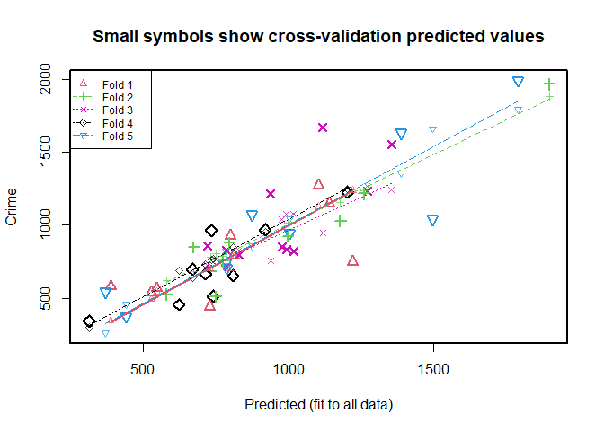
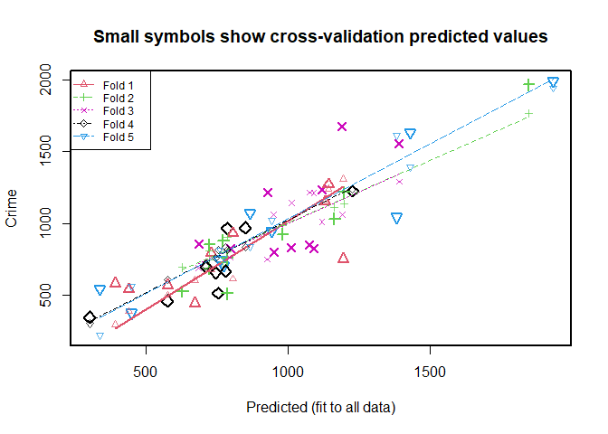
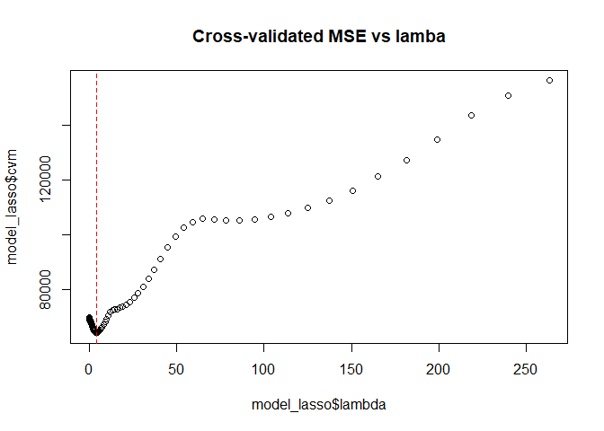
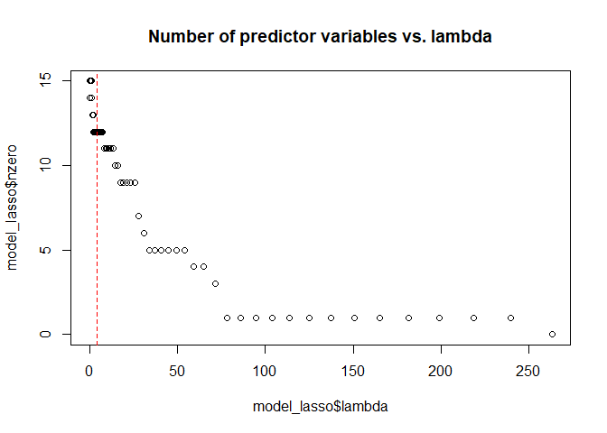
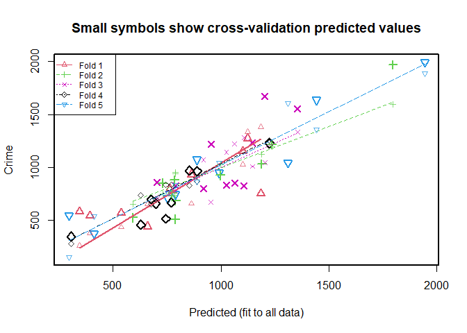
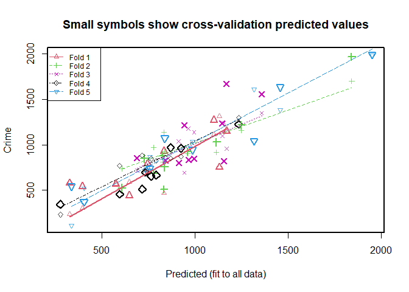
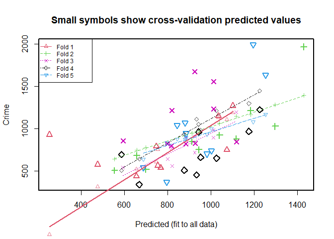

------------------------------------------------------------------------

title: “Introduction to Statistical Modeling - Assignment 5” author:
“Don Smith” output: github_document

------------------------------------------------------------------------

## Question 11.1

##### **Using the crime data set uscrime.txt from Questions 8.2, 9.1, and 10.1, build a regression model using:**

##### **1. Stepwise regression**

##### **2. Lasso**

##### **3. Elastic net**

##### **For Parts 2 and 3, remember to scale the data first – otherwise, the regression coefficients will be on different scales and the constraint won’t have the desired effect.**

##### **For Parts 2 and 3, use the glmnet function in R.**

##### **Notes on R:**

##### **• For the elastic net model, what we called λ in the videos, glmnet calls “alpha”; you can get a range of results by varying alpha from 1 (lasso) to 0 (ridge regression) \[and, of course, other values of alpha in between\].**

##### **• In a function call like glmnet(x,y,family=”mgaussian”,alpha=1) the predictors x need to be in R’s matrix format, rather than data frame format. You can convert a data frame to a matrix using as.matrix – for example, x \<- as.matrix(data\[,1:n-1\])**

##### **• Rather than specifying a value of T, glmnet returns models for a variety of values of T.**

``` r
# loading all packages needed for analysis

library(kernlab)
library(kknn)
library(dplyr)
```

    ## 
    ## Attaching package: 'dplyr'

    ## The following objects are masked from 'package:stats':
    ## 
    ##     filter, lag

    ## The following objects are masked from 'package:base':
    ## 
    ##     intersect, setdiff, setequal, union

``` r
library(readr)
library(rmarkdown)
library(tinytex)
library(knitr)
library(NbClust)
library(outliers)
library(nortest)
library(greybox)
```

    ## Package "greybox", v1.0.7 loaded.

``` r
library(Mcomp)
```

    ## Loading required package: forecast

    ## Registered S3 method overwritten by 'quantmod':
    ##   method            from
    ##   as.zoo.data.frame zoo

``` r
library(DAAG)
library(caret)
```

    ## Loading required package: ggplot2

    ## 
    ## Attaching package: 'ggplot2'

    ## The following object is masked from 'package:kernlab':
    ## 
    ##     alpha

    ## Loading required package: lattice

    ## Registered S3 method overwritten by 'lava':
    ##   method     from   
    ##   print.pcor greybox

    ## 
    ## Attaching package: 'caret'

    ## The following object is masked from 'package:greybox':
    ## 
    ##     MAE

    ## The following object is masked from 'package:kknn':
    ## 
    ##     contr.dummy

``` r
library(randomForest)
```

    ## randomForest 4.7-1.1

    ## Type rfNews() to see new features/changes/bug fixes.

    ## 
    ## Attaching package: 'randomForest'

    ## The following object is masked from 'package:ggplot2':
    ## 
    ##     margin

    ## The following object is masked from 'package:outliers':
    ## 
    ##     outlier

    ## The following object is masked from 'package:dplyr':
    ## 
    ##     combine

``` r
library(tree)
library(pROC)
```

    ## Type 'citation("pROC")' for a citation.

    ## 
    ## Attaching package: 'pROC'

    ## The following objects are masked from 'package:stats':
    ## 
    ##     cov, smooth, var

``` r
library(glmnet)
```

    ## Loading required package: Matrix

    ## Loaded glmnet 4.1-6

``` r
packageurl <- "https://cran.r-project.org/src/contrib/Archive/sme/sme_1.0.2.tar.gz"
install.packages(packageurl, repos=NULL, type="source")
```

    ## Installing package into 'C:/Users/Owner/AppData/Local/R/win-library/4.2'
    ## (as 'lib' is unspecified)

    ## Warning in install.packages(packageurl, repos = NULL, type = "source"):
    ## installation of package
    ## 'C:/Users/Owner/AppData/Local/Temp/RtmpSARfLw/downloaded_packages/sme_1.0.2.tar.gz'
    ## had non-zero exit status

``` r
packageurl2 <- "https://cran.r-project.org/bin/windows/contrib/4.2/gmp_0.6-10.zip"
install.packages(packageurl2, repos=NULL, type="source")
```

    ## Installing package into 'C:/Users/Owner/AppData/Local/R/win-library/4.2'
    ## (as 'lib' is unspecified)

``` r
library(FrF2)
```

    ## Loading required package: DoE.base

    ## Loading required package: grid

    ## Loading required package: conf.design

    ## Registered S3 method overwritten by 'partitions':
    ##   method            from
    ##   print.equivalence lava

    ## Registered S3 method overwritten by 'DoE.base':
    ##   method           from       
    ##   factorize.factor conf.design

    ## 
    ## Attaching package: 'DoE.base'

    ## The following objects are masked from 'package:stats':
    ## 
    ##     aov, lm

    ## The following object is masked from 'package:graphics':
    ## 
    ##     plot.design

    ## The following object is masked from 'package:base':
    ## 
    ##     lengths

``` r
# description: http://www.statsci.org/data/general/uscrime.html

# import data from URL
data_crime <- read.table("http://www.statsci.org/data/general/uscrime.txt", stringsAsFactors = FALSE, header = TRUE)

# print head
print(data_crime)
```

    ##       M So   Ed  Po1  Po2    LF   M.F Pop   NW    U1  U2 Wealth Ineq     Prob
    ## 1  15.1  1  9.1  5.8  5.6 0.510  95.0  33 30.1 0.108 4.1   3940 26.1 0.084602
    ## 2  14.3  0 11.3 10.3  9.5 0.583 101.2  13 10.2 0.096 3.6   5570 19.4 0.029599
    ## 3  14.2  1  8.9  4.5  4.4 0.533  96.9  18 21.9 0.094 3.3   3180 25.0 0.083401
    ## 4  13.6  0 12.1 14.9 14.1 0.577  99.4 157  8.0 0.102 3.9   6730 16.7 0.015801
    ## 5  14.1  0 12.1 10.9 10.1 0.591  98.5  18  3.0 0.091 2.0   5780 17.4 0.041399
    ## 6  12.1  0 11.0 11.8 11.5 0.547  96.4  25  4.4 0.084 2.9   6890 12.6 0.034201
    ## 7  12.7  1 11.1  8.2  7.9 0.519  98.2   4 13.9 0.097 3.8   6200 16.8 0.042100
    ## 8  13.1  1 10.9 11.5 10.9 0.542  96.9  50 17.9 0.079 3.5   4720 20.6 0.040099
    ## 9  15.7  1  9.0  6.5  6.2 0.553  95.5  39 28.6 0.081 2.8   4210 23.9 0.071697
    ## 10 14.0  0 11.8  7.1  6.8 0.632 102.9   7  1.5 0.100 2.4   5260 17.4 0.044498
    ## 11 12.4  0 10.5 12.1 11.6 0.580  96.6 101 10.6 0.077 3.5   6570 17.0 0.016201
    ## 12 13.4  0 10.8  7.5  7.1 0.595  97.2  47  5.9 0.083 3.1   5800 17.2 0.031201
    ## 13 12.8  0 11.3  6.7  6.0 0.624  97.2  28  1.0 0.077 2.5   5070 20.6 0.045302
    ## 14 13.5  0 11.7  6.2  6.1 0.595  98.6  22  4.6 0.077 2.7   5290 19.0 0.053200
    ## 15 15.2  1  8.7  5.7  5.3 0.530  98.6  30  7.2 0.092 4.3   4050 26.4 0.069100
    ## 16 14.2  1  8.8  8.1  7.7 0.497  95.6  33 32.1 0.116 4.7   4270 24.7 0.052099
    ## 17 14.3  0 11.0  6.6  6.3 0.537  97.7  10  0.6 0.114 3.5   4870 16.6 0.076299
    ## 18 13.5  1 10.4 12.3 11.5 0.537  97.8  31 17.0 0.089 3.4   6310 16.5 0.119804
    ## 19 13.0  0 11.6 12.8 12.8 0.536  93.4  51  2.4 0.078 3.4   6270 13.5 0.019099
    ## 20 12.5  0 10.8 11.3 10.5 0.567  98.5  78  9.4 0.130 5.8   6260 16.6 0.034801
    ## 21 12.6  0 10.8  7.4  6.7 0.602  98.4  34  1.2 0.102 3.3   5570 19.5 0.022800
    ## 22 15.7  1  8.9  4.7  4.4 0.512  96.2  22 42.3 0.097 3.4   2880 27.6 0.089502
    ## 23 13.2  0  9.6  8.7  8.3 0.564  95.3  43  9.2 0.083 3.2   5130 22.7 0.030700
    ## 24 13.1  0 11.6  7.8  7.3 0.574 103.8   7  3.6 0.142 4.2   5400 17.6 0.041598
    ## 25 13.0  0 11.6  6.3  5.7 0.641  98.4  14  2.6 0.070 2.1   4860 19.6 0.069197
    ## 26 13.1  0 12.1 16.0 14.3 0.631 107.1   3  7.7 0.102 4.1   6740 15.2 0.041698
    ## 27 13.5  0 10.9  6.9  7.1 0.540  96.5   6  0.4 0.080 2.2   5640 13.9 0.036099
    ## 28 15.2  0 11.2  8.2  7.6 0.571 101.8  10  7.9 0.103 2.8   5370 21.5 0.038201
    ## 29 11.9  0 10.7 16.6 15.7 0.521  93.8 168  8.9 0.092 3.6   6370 15.4 0.023400
    ## 30 16.6  1  8.9  5.8  5.4 0.521  97.3  46 25.4 0.072 2.6   3960 23.7 0.075298
    ## 31 14.0  0  9.3  5.5  5.4 0.535 104.5   6  2.0 0.135 4.0   4530 20.0 0.041999
    ## 32 12.5  0 10.9  9.0  8.1 0.586  96.4  97  8.2 0.105 4.3   6170 16.3 0.042698
    ## 33 14.7  1 10.4  6.3  6.4 0.560  97.2  23  9.5 0.076 2.4   4620 23.3 0.049499
    ## 34 12.6  0 11.8  9.7  9.7 0.542  99.0  18  2.1 0.102 3.5   5890 16.6 0.040799
    ## 35 12.3  0 10.2  9.7  8.7 0.526  94.8 113  7.6 0.124 5.0   5720 15.8 0.020700
    ## 36 15.0  0 10.0 10.9  9.8 0.531  96.4   9  2.4 0.087 3.8   5590 15.3 0.006900
    ## 37 17.7  1  8.7  5.8  5.6 0.638  97.4  24 34.9 0.076 2.8   3820 25.4 0.045198
    ## 38 13.3  0 10.4  5.1  4.7 0.599 102.4   7  4.0 0.099 2.7   4250 22.5 0.053998
    ## 39 14.9  1  8.8  6.1  5.4 0.515  95.3  36 16.5 0.086 3.5   3950 25.1 0.047099
    ## 40 14.5  1 10.4  8.2  7.4 0.560  98.1  96 12.6 0.088 3.1   4880 22.8 0.038801
    ## 41 14.8  0 12.2  7.2  6.6 0.601  99.8   9  1.9 0.084 2.0   5900 14.4 0.025100
    ## 42 14.1  0 10.9  5.6  5.4 0.523  96.8   4  0.2 0.107 3.7   4890 17.0 0.088904
    ## 43 16.2  1  9.9  7.5  7.0 0.522  99.6  40 20.8 0.073 2.7   4960 22.4 0.054902
    ## 44 13.6  0 12.1  9.5  9.6 0.574 101.2  29  3.6 0.111 3.7   6220 16.2 0.028100
    ## 45 13.9  1  8.8  4.6  4.1 0.480  96.8  19  4.9 0.135 5.3   4570 24.9 0.056202
    ## 46 12.6  0 10.4 10.6  9.7 0.599  98.9  40  2.4 0.078 2.5   5930 17.1 0.046598
    ## 47 13.0  0 12.1  9.0  9.1 0.623 104.9   3  2.2 0.113 4.0   5880 16.0 0.052802
    ##       Time Crime
    ## 1  26.2011   791
    ## 2  25.2999  1635
    ## 3  24.3006   578
    ## 4  29.9012  1969
    ## 5  21.2998  1234
    ## 6  20.9995   682
    ## 7  20.6993   963
    ## 8  24.5988  1555
    ## 9  29.4001   856
    ## 10 19.5994   705
    ## 11 41.6000  1674
    ## 12 34.2984   849
    ## 13 36.2993   511
    ## 14 21.5010   664
    ## 15 22.7008   798
    ## 16 26.0991   946
    ## 17 19.1002   539
    ## 18 18.1996   929
    ## 19 24.9008   750
    ## 20 26.4010  1225
    ## 21 37.5998   742
    ## 22 37.0994   439
    ## 23 25.1989  1216
    ## 24 17.6000   968
    ## 25 21.9003   523
    ## 26 22.1005  1993
    ## 27 28.4999   342
    ## 28 25.8006  1216
    ## 29 36.7009  1043
    ## 30 28.3011   696
    ## 31 21.7998   373
    ## 32 30.9014   754
    ## 33 25.5005  1072
    ## 34 21.6997   923
    ## 35 37.4011   653
    ## 36 44.0004  1272
    ## 37 31.6995   831
    ## 38 16.6999   566
    ## 39 27.3004   826
    ## 40 29.3004  1151
    ## 41 30.0001   880
    ## 42 12.1996   542
    ## 43 31.9989   823
    ## 44 30.0001  1030
    ## 45 32.5996   455
    ## 46 16.6999   508
    ## 47 16.0997   849

``` r
# Setting seed
set.seed(123)

# 1. Stepwise regression

# Will scale the data. Note that I am not scaling column 2 since it is binary, 
# and I am not scaling column 16 since it is the response column
step_data = cbind(as.data.frame(scale(data_crime[,1])),
 as.data.frame(data_crime[,2]),
 as.data.frame(scale(data_crime[,c(3,4,5,6,7,8,9,10,11,12,13,14,15)])), as.data.frame(data_crime[,16]))

# Update column names
colnames(step_data) = colnames(data_crime)

stepwise_model_lm = lm(Crime~., data = data_crime)

# AIC model
model_step_aic = step(stepwise_model_lm, direction = 'backward', trace = FALSE)
summary(model_step_aic)
```

    ## 
    ## Call:
    ## lm.default(formula = Crime ~ M + Ed + Po1 + M.F + U1 + U2 + Ineq + 
    ##     Prob, data = data_crime)
    ## 
    ## Residuals:
    ##     Min      1Q  Median      3Q     Max 
    ## -444.70 -111.07    3.03  122.15  483.30 
    ## 
    ## Coefficients:
    ##             Estimate Std. Error t value Pr(>|t|)    
    ## (Intercept) -6426.10    1194.61  -5.379 4.04e-06 ***
    ## M              93.32      33.50   2.786  0.00828 ** 
    ## Ed            180.12      52.75   3.414  0.00153 ** 
    ## Po1           102.65      15.52   6.613 8.26e-08 ***
    ## M.F            22.34      13.60   1.642  0.10874    
    ## U1          -6086.63    3339.27  -1.823  0.07622 .  
    ## U2            187.35      72.48   2.585  0.01371 *  
    ## Ineq           61.33      13.96   4.394 8.63e-05 ***
    ## Prob        -3796.03    1490.65  -2.547  0.01505 *  
    ## ---
    ## Signif. codes:  0 '***' 0.001 '**' 0.01 '*' 0.05 '.' 0.1 ' ' 1
    ## 
    ## Residual standard error: 195.5 on 38 degrees of freedom
    ## Multiple R-squared:  0.7888, Adjusted R-squared:  0.7444 
    ## F-statistic: 17.74 on 8 and 38 DF,  p-value: 1.159e-10

``` r
stepwise_model_lm2 = lm(formula = Crime ~ M + Ed + Po1 + U2 + Ineq + Prob, data = data_crime)
summary(stepwise_model_lm2)
```

    ## 
    ## Call:
    ## lm.default(formula = Crime ~ M + Ed + Po1 + U2 + Ineq + Prob, 
    ##     data = data_crime)
    ## 
    ## Residuals:
    ##     Min      1Q  Median      3Q     Max 
    ## -470.68  -78.41  -19.68  133.12  556.23 
    ## 
    ## Coefficients:
    ##             Estimate Std. Error t value Pr(>|t|)    
    ## (Intercept) -5040.50     899.84  -5.602 1.72e-06 ***
    ## M             105.02      33.30   3.154  0.00305 ** 
    ## Ed            196.47      44.75   4.390 8.07e-05 ***
    ## Po1           115.02      13.75   8.363 2.56e-10 ***
    ## U2             89.37      40.91   2.185  0.03483 *  
    ## Ineq           67.65      13.94   4.855 1.88e-05 ***
    ## Prob        -3801.84    1528.10  -2.488  0.01711 *  
    ## ---
    ## Signif. codes:  0 '***' 0.001 '**' 0.01 '*' 0.05 '.' 0.1 ' ' 1
    ## 
    ## Residual standard error: 200.7 on 40 degrees of freedom
    ## Multiple R-squared:  0.7659, Adjusted R-squared:  0.7307 
    ## F-statistic: 21.81 on 6 and 40 DF,  p-value: 3.418e-11

``` r
# BIC model
model_step_bic = step(stepwise_model_lm, direction = 'backward', k= log(47), trace = FALSE)
summary(model_step_bic)
```

    ## 
    ## Call:
    ## lm.default(formula = Crime ~ M + Ed + Po1 + U2 + Ineq + Prob, 
    ##     data = data_crime)
    ## 
    ## Residuals:
    ##     Min      1Q  Median      3Q     Max 
    ## -470.68  -78.41  -19.68  133.12  556.23 
    ## 
    ## Coefficients:
    ##             Estimate Std. Error t value Pr(>|t|)    
    ## (Intercept) -5040.50     899.84  -5.602 1.72e-06 ***
    ## M             105.02      33.30   3.154  0.00305 ** 
    ## Ed            196.47      44.75   4.390 8.07e-05 ***
    ## Po1           115.02      13.75   8.363 2.56e-10 ***
    ## U2             89.37      40.91   2.185  0.03483 *  
    ## Ineq           67.65      13.94   4.855 1.88e-05 ***
    ## Prob        -3801.84    1528.10  -2.488  0.01711 *  
    ## ---
    ## Signif. codes:  0 '***' 0.001 '**' 0.01 '*' 0.05 '.' 0.1 ' ' 1
    ## 
    ## Residual standard error: 200.7 on 40 degrees of freedom
    ## Multiple R-squared:  0.7659, Adjusted R-squared:  0.7307 
    ## F-statistic: 21.81 on 6 and 40 DF,  p-value: 3.418e-11

``` r
coefficients(model_step_bic)
```

    ## (Intercept)           M          Ed         Po1          U2        Ineq 
    ## -5040.50498   105.01957   196.47120   115.02419    89.36604    67.65322 
    ##        Prob 
    ## -3801.83628

``` r
# 5-fold cross-validation
c_lm2 = cv.lm(data_crime, stepwise_model_lm2, m = 5) 
```

    ## Warning in cv.lm(data_crime, stepwise_model_lm2, m = 5): 
    ## 
    ##  As there is >1 explanatory variable, cross-validation
    ##  predicted values for a fold are not a linear function
    ##  of corresponding overall predicted values.  Lines that
    ##  are shown for the different folds are approximate

<!-- -->

    ## 
    ## fold 1 
    ## Observations in test set: 9 
    ##                      1        3       17       18        19        22        36
    ## Predicted   810.825487 386.1368 527.3659 800.0046 1220.6767  728.3110 1101.7167
    ## cvpred      785.364736 345.3417 492.2016 700.5751 1240.2916  701.5126 1127.3318
    ## Crime       791.000000 578.0000 539.0000 929.0000  750.0000  439.0000 1272.0000
    ## CV residual   5.635264 232.6583  46.7984 228.4249 -490.2916 -262.5126  144.6682
    ##                    38         40
    ## Predicted   544.37325 1140.79061
    ## cvpred      544.69903 1168.21107
    ## Crime       566.00000 1151.00000
    ## CV residual  21.30097  -17.21107
    ## 
    ## Sum of squares = 439507.2    Mean square = 48834.14    n = 9 
    ## 
    ## fold 2 
    ## Observations in test set: 10 
    ##                      4         6       12        25         28        32
    ## Predicted   1897.18657 730.26589 673.3766 579.06379 1259.00338 773.68402
    ## cvpred      1882.73805 781.75573 684.3525 621.37453 1238.31917 788.03429
    ## Crime       1969.00000 682.00000 849.0000 523.00000 1216.00000 754.00000
    ## CV residual   86.26195 -99.75573 164.6475 -98.37453  -22.31917 -34.03429
    ##                     34       41        44        46
    ## Predicted    997.54981 796.4198 1177.5973  748.4256
    ## cvpred      1013.92532 778.0437 1159.3155  807.6968
    ## Crime        923.00000 880.0000 1030.0000  508.0000
    ## CV residual  -90.92532 101.9563 -129.3155 -299.6968
    ## 
    ## Sum of squares = 181038.4    Mean square = 18103.83    n = 10 
    ## 
    ## fold 3 
    ## Observations in test set: 10 
    ##                      5         8        9        11        15        23
    ## Predicted   1269.84196 1353.5532 718.7568 1117.7702 828.34178  937.5703
    ## cvpred      1266.79544 1243.1763 723.5331  946.1309 826.28548  754.2511
    ## Crime       1234.00000 1555.0000 856.0000 1674.0000 798.00000 1216.0000
    ## CV residual  -32.79544  311.8237 132.4669  727.8691 -28.28548  461.7489
    ##                    37       39        43        47
    ## Predicted    991.5623 786.6949 1016.5503  976.4397
    ## cvpred      1076.5799 717.0989 1079.7748 1038.3321
    ## Crime        831.0000 826.0000  823.0000  849.0000
    ## CV residual -245.5799 108.9011 -256.7748 -189.3321
    ## 
    ## Sum of squares = 1033612    Mean square = 103361.1    n = 10 
    ## 
    ## fold 4 
    ## Observations in test set: 9 
    ##                    7        13        14        20        24        27
    ## Predicted   733.3799  739.3727 713.56395 1202.9607 919.39117 312.20470
    ## cvpred      759.9655  770.2015 730.05546 1247.8616 953.72478 297.19321
    ## Crime       963.0000  511.0000 664.00000 1225.0000 968.00000 342.00000
    ## CV residual 203.0345 -259.2015 -66.05546  -22.8616  14.27522  44.80679
    ##                    30        35        45
    ## Predicted   668.01610  808.0296  621.8592
    ## cvpred      638.87118  850.6961  690.6802
    ## Crime       696.00000  653.0000  455.0000
    ## CV residual  57.12882 -197.6961 -235.6802
    ## 
    ## Sum of squares = 213398.5    Mean square = 23710.94    n = 9 
    ## 
    ## fold 5 
    ## Observations in test set: 9 
    ##                     2        10        16        21        26        29
    ## Predicted   1387.8082 787.27124 1004.3984 783.27334 1789.1406 1495.4856
    ## cvpred      1355.7097 723.66781 1046.8197 819.71145 1794.6456 1663.6272
    ## Crime       1635.0000 705.00000  946.0000 742.00000 1993.0000 1043.0000
    ## CV residual  279.2903 -18.66781 -100.8197 -77.71145  198.3544 -620.6272
    ##                   31        33       42
    ## Predicted   440.4394  873.8469 368.7031
    ## cvpred      456.5736  857.7052 260.9211
    ## Crime       373.0000 1072.0000 542.0000
    ## CV residual -83.5736  214.2948 281.0789
    ## 
    ## Sum of squares = 650990    Mean square = 72332.23    n = 9 
    ## 
    ## Overall (Sum over all 9 folds) 
    ##       ms 
    ## 53586.08

``` r
c_step_aic = cv.lm(data_crime, model_step_aic, m = 5) 
```

    ## Warning in cv.lm(data_crime, model_step_aic, m = 5): 
    ## 
    ##  As there is >1 explanatory variable, cross-validation
    ##  predicted values for a fold are not a linear function
    ##  of corresponding overall predicted values.  Lines that
    ##  are shown for the different folds are approximate

<!-- -->

    ## 
    ## fold 1 
    ## Observations in test set: 9 
    ##                    1        3       17       18        19        22         36
    ## Predicted   730.2603 391.6707 440.1808 806.9599 1194.7025  673.3317 1142.00067
    ## cvpred      679.0127 290.2939 383.2790 610.3545 1309.4632  600.5781 1242.07697
    ## Crime       791.0000 578.0000 539.0000 929.0000  750.0000  439.0000 1272.00000
    ## CV residual 111.9873 287.7061 155.7210 318.6455 -559.4632 -161.5781   29.92303
    ##                    38         40
    ## Predicted   577.75909 1129.88862
    ## cvpred      497.03625 1161.30772
    ## Crime       566.00000 1151.00000
    ## CV residual  68.96375  -10.30772
    ## 
    ## Sum of squares = 565964.2    Mean square = 62884.91    n = 9 
    ## 
    ## fold 2 
    ## Observations in test set: 10 
    ##                    4         6       12        25         28        32
    ## Predicted   1846.750  724.2856 723.1273  628.2696 1197.00602 785.32166
    ## cvpred      1770.817  810.3526 746.5187  691.2274 1136.89646 799.99084
    ## Crime       1969.000  682.0000 849.0000  523.0000 1216.00000 754.00000
    ## CV residual  198.183 -128.3526 102.4813 -168.2274   79.10354 -45.99084
    ##                    34       41         44        46
    ## Predicted   980.69542 772.4885 1163.03097  786.0695
    ## cvpred      986.11207 726.5955 1110.31876  900.8041
    ## Crime       923.00000 880.0000 1030.00000  508.0000
    ## CV residual -63.11207 153.4045  -80.31876 -392.8041
    ## 
    ## Sum of squares = 291188.5    Mean square = 29118.85    n = 10 
    ## 
    ## fold 3 
    ## Observations in test set: 10 
    ##                     5         8        9        11        15        23
    ## Predicted   1119.4533 1391.0999 686.1097 1190.7017  949.8039  927.0356
    ## cvpred      1009.5707 1291.4716 689.0080 1059.1424 1062.1736  747.3697
    ## Crime       1234.0000 1555.0000 856.0000 1674.0000  798.0000 1216.0000
    ## CV residual  224.4293  263.5284 166.9920  614.8576 -264.1736  468.6303
    ##                    37        39        43        47
    ## Predicted   1012.3317 797.58435 1090.8352 1076.3622
    ## cvpred      1143.9977 760.39595 1212.4459 1216.0394
    ## Crime        831.0000 826.00000  823.0000  849.0000
    ## CV residual -312.9977  65.60405 -389.4459 -367.0394
    ## 
    ## Sum of squares = 1203811    Mean square = 120381.1    n = 10 
    ## 
    ## fold 4 
    ## Observations in test set: 9 
    ##                    7        13        14        20       24        27
    ## Predicted   786.0570  754.1956  780.8699 1227.5550 849.5001 301.89278
    ## cvpred      813.9482  814.1930  832.3722 1238.1224 831.8379 299.15963
    ## Crime       963.0000  511.0000  664.0000 1225.0000 968.0000 342.00000
    ## CV residual 149.0518 -303.1930 -168.3722  -13.1224 136.1621  42.84037
    ##                     30        35        45
    ## Predicted   711.815576  745.0201  575.9466
    ## cvpred      702.060889  755.8542  604.6124
    ## Crime       696.000000  653.0000  455.0000
    ## CV residual  -6.060889 -102.8542 -149.6124
    ## 
    ## Sum of squares = 196038.9    Mean square = 21782.1    n = 9 
    ## 
    ## fold 5 
    ## Observations in test set: 9 
    ##                    2        10         16        21         26        29
    ## Predicted   1429.529 772.69245  942.96852 759.79628 1932.18459 1381.4244
    ## cvpred      1394.896 757.02235 1019.51683 815.52652 1945.31209 1614.5828
    ## Crime       1635.000 705.00000  946.00000 742.00000 1993.00000 1043.0000
    ## CV residual  240.104 -52.02235  -73.51683 -73.52652   47.68791 -571.5828
    ##                    31        33       42
    ## Predicted    449.5679  865.3617 337.5060
    ## cvpred       558.4878  837.2453 217.7497
    ## Crime        373.0000 1072.0000 542.0000
    ## CV residual -185.4878  234.7547 324.2503
    ## 
    ## Sum of squares = 594801.9    Mean square = 66089.1    n = 9 
    ## 
    ## Overall (Sum over all 9 folds) 
    ##      ms 
    ## 60676.7

``` r
# Calculate the total sum of the squared difference of each datapoint and its mean element-wise
SStot = sum((data_crime$Crime - mean(data_crime$Crime))^2)
SSres_model_lm2 = sum(stepwise_model_lm2$residuals^2)
SSres_model_step_aic = sum(model_step_aic$residuals^2)
SSres_c_lm2 = attr(c_lm2,"ms")*nrow(data_crime)
SSres_c_step_aic = attr(c_step_aic,"ms")*nrow(data_crime)

# Calculate r^2 for each of the above models
r2 = c()
r2[1] = 1 - SSres_model_lm2 / SStot
r2[2] = 1 - SSres_model_step_aic / SStot
r2[3] = 1 - SSres_c_lm2 / SStot 
r2[4] = 1 - SSres_c_step_aic / SStot 

print(r2)
```

    ## [1] 0.7658663 0.7888268 0.6339817 0.5855494

``` r
# Setting seed
set.seed(123)

# 2. Lasso

# Will scale the data. Note that I am not scaling column 2 since it is binary, 
# and I am not scaling column 16 since it is the response column
lasso_data = cbind(as.data.frame(scale(data_crime[,1])), 
  as.data.frame(data_crime[,2]),
  as.data.frame(scale(data_crime[,c(3,4,5,6,7,8,9,10,11,12,13,14,15)])),
  as.data.frame(data_crime[,16]))

# Update column names
colnames(lasso_data) = colnames(data_crime)

# Create lasso model
model_lasso=cv.glmnet(x=as.matrix(lasso_data[,-16]),
 y=as.matrix(lasso_data$Crime),alpha=1,
 nfolds = 5,
 type.measure="mse",
 family="gaussian")

print(model_lasso$lambda)
```

    ##  [1] 263.09539664 239.72272672 218.42642038 199.02201920 181.34145155
    ##  [6] 165.23157679 150.55285890 137.17815786 124.99162839 113.88771662
    ## [11] 103.77024576  94.55158313  86.15188108  78.49838541  71.52480520
    ## [16]  65.17073864  59.38114984  54.10589215  49.29927381  44.91966220
    ## [21]  40.92912321  37.29309271  33.98007714  30.96138074  28.21085701
    ## [26]  25.70468222  23.42114910  21.34047877  19.44464945  17.71724038
    ## [31]  16.14328958  14.70916422  13.40244262  12.21180655  11.12694332
    ## [36]  10.13845634   9.23778382   8.41712457   7.66937042   6.98804469
    ## [41]   6.36724606   5.80159747   5.28619954   4.81658814   4.38869572
    ## [46]   3.99881609   3.64357229   3.31988737   3.02495773   2.75622882
    ## [51]   2.51137305   2.28826959   2.08498602   1.89976161   1.73099203
    ## [56]   1.57721547   1.43709999   1.30943199   1.19310566   1.08711344
    ## [61]   0.99053728   0.90254068   0.82236145   0.74930513   0.68273892
    ## [66]   0.62208628   0.56682185   0.51646696   0.47058546   0.42877994
    ## [71]   0.39068831   0.35598064   0.32435630   0.29554138   0.26928630
    ## [76]   0.24536365   0.22356622   0.20370521   0.18560860   0.16911964
    ## [81]   0.15409552   0.14040610   0.12793281   0.11656761   0.10621207
    ## [86]   0.09677648   0.08817912   0.08034553

``` r
print(model_lasso$cvm)
```

    ##  [1] 156198.35 150830.94 143631.71 134696.42 127281.60 121128.81 116023.48
    ##  [8] 112244.30 109671.76 107733.35 106378.14 105428.41 105076.96 105267.62
    ## [15] 105673.54 105882.96 104561.74 102422.18  99413.86  95380.97  91091.08
    ## [22]  87140.15  83721.05  80865.08  78681.21  76853.05  75406.41  74352.44
    ## [29]  73662.85  73224.91  72817.10  72626.06  72557.35  71708.68  70431.28
    ## [36]  69268.26  68078.71  67103.84  66306.87  65682.29  65322.98  64952.60
    ## [43]  64541.10  64241.68  64085.34  64168.57  64458.95  64717.67  65015.02
    ## [50]  65329.60  65631.36  65913.56  66185.69  66496.16  66823.57  67130.56
    ## [57]  67373.81  67617.92  67857.70  68026.63  68074.94  68148.16  68234.36
    ## [64]  68337.25  68452.99  68566.23  68686.73  68803.57  68916.94  69019.25
    ## [71]  69121.68  69223.87  69314.09  69404.34  69491.79  69551.64  69582.85
    ## [78]  69614.70  69640.56  69669.77  69697.09  69722.75  69748.36  69771.31
    ## [85]  69792.18  69797.75  69809.61  69825.42

``` r
plot(model_lasso$lambda, model_lasso$cvm, main='Cross-validated MSE vs lamba')
abline(v = model_lasso$lambda.min, col = 'red', lty = 2)
```

<!-- -->

``` r
# Determine the value of lamba with the smallest cvm
x = model_lasso$cvm
model_lasso$lambda[which(x == min(x))]
```

    ## [1] 4.388696

``` r
model_lasso$lambda.min
```

    ## [1] 4.388696

``` r
## Create a plot
plot(model_lasso$lambda, model_lasso$nzero, main = 'Number of predictor variables vs. lambda')
abline (v = model_lasso$lambda.min, col = 'red', lty =2)
```

<!-- -->

``` r
coefficients(model_lasso, s=model_lasso$lambda.min)
```

    ## 16 x 1 sparse Matrix of class "dgCMatrix"
    ##                    s1
    ## (Intercept) 893.42791
    ## M           101.81627
    ## So           34.24302
    ## Ed          168.42528
    ## Po1         297.31976
    ## Po2           .      
    ## LF            .      
    ## M.F          53.37330
    ## Pop         -14.40029
    ## NW           12.75189
    ## U1          -64.98287
    ## U2          108.25504
    ## Wealth       44.61329
    ## Ineq        239.05538
    ## Prob        -87.99596
    ## Time          .

``` r
model_lasso_lm = lm(Crime ~M+So+Ed+Po1+M.F+Pop+NW+U1+U2+Wealth+Ineq+Prob, data = lasso_data)
summary(model_lasso_lm)
```

    ## 
    ## Call:
    ## lm.default(formula = Crime ~ M + So + Ed + Po1 + M.F + Pop + 
    ##     NW + U1 + U2 + Wealth + Ineq + Prob, data = lasso_data)
    ## 
    ## Residuals:
    ##     Min      1Q  Median      3Q     Max 
    ## -434.18 -107.01   18.55  115.88  470.32 
    ## 
    ## Coefficients:
    ##             Estimate Std. Error t value Pr(>|t|)    
    ## (Intercept)   897.29      51.91  17.286  < 2e-16 ***
    ## M             112.71      49.35   2.284  0.02876 *  
    ## So             22.89     125.35   0.183  0.85621    
    ## Ed            195.70      62.94   3.109  0.00378 ** 
    ## Po1           293.18      64.99   4.511 7.32e-05 ***
    ## M.F            48.92      48.12   1.017  0.31656    
    ## Pop           -33.25      45.63  -0.729  0.47113    
    ## NW             19.16      57.71   0.332  0.74195    
    ## U1            -89.76      65.68  -1.367  0.18069    
    ## U2            140.78      66.77   2.108  0.04245 *  
    ## Wealth         83.30      95.53   0.872  0.38932    
    ## Ineq          285.77      85.19   3.355  0.00196 ** 
    ## Prob          -92.75      41.12  -2.255  0.03065 *  
    ## ---
    ## Signif. codes:  0 '***' 0.001 '**' 0.01 '*' 0.05 '.' 0.1 ' ' 1
    ## 
    ## Residual standard error: 202.6 on 34 degrees of freedom
    ## Multiple R-squared:  0.7971, Adjusted R-squared:  0.7255 
    ## F-statistic: 11.13 on 12 and 34 DF,  p-value: 1.52e-08

``` r
# Remove factors where p is greater than .05
model_lasso_lm2 = lm(Crime ~M+ Ed+ Po1+ U2+ Ineq+Prob, data = lasso_data)
summary(model_lasso_lm2)
```

    ## 
    ## Call:
    ## lm.default(formula = Crime ~ M + Ed + Po1 + U2 + Ineq + Prob, 
    ##     data = lasso_data)
    ## 
    ## Residuals:
    ##     Min      1Q  Median      3Q     Max 
    ## -470.68  -78.41  -19.68  133.12  556.23 
    ## 
    ## Coefficients:
    ##             Estimate Std. Error t value Pr(>|t|)    
    ## (Intercept)   905.09      29.27  30.918  < 2e-16 ***
    ## M             131.98      41.85   3.154  0.00305 ** 
    ## Ed            219.79      50.07   4.390 8.07e-05 ***
    ## Po1           341.84      40.87   8.363 2.56e-10 ***
    ## U2             75.47      34.55   2.185  0.03483 *  
    ## Ineq          269.91      55.60   4.855 1.88e-05 ***
    ## Prob          -86.44      34.74  -2.488  0.01711 *  
    ## ---
    ## Signif. codes:  0 '***' 0.001 '**' 0.01 '*' 0.05 '.' 0.1 ' ' 1
    ## 
    ## Residual standard error: 200.7 on 40 degrees of freedom
    ## Multiple R-squared:  0.7659, Adjusted R-squared:  0.7307 
    ## F-statistic: 21.81 on 6 and 40 DF,  p-value: 3.418e-11

``` r
# 5-fold cross-validation
c_lasso_lm = cv.lm(lasso_data,model_lasso_lm, m=5) 
```

    ## Warning in cv.lm(lasso_data, model_lasso_lm, m = 5): 
    ## 
    ##  As there is >1 explanatory variable, cross-validation
    ##  predicted values for a fold are not a linear function
    ##  of corresponding overall predicted values.  Lines that
    ##  are shown for the different folds are approximate

<!-- -->

    ## 
    ## fold 1 
    ## Observations in test set: 9 
    ##                     1        3       17       18        19        22         36
    ## Predicted   762.88055 345.1417 393.2891 863.1375 1184.1776  659.4696 1124.55639
    ## cvpred      740.73393 256.2163 375.4229 656.1673 1382.2696  652.9413 1337.15461
    ## Crime       791.00000 578.0000 539.0000 929.0000  750.0000  439.0000 1272.00000
    ## CV residual  50.26607 321.7837 163.5771 272.8327 -632.2696 -213.9413  -65.15461
    ##                   38        40
    ## Predicted   539.0328 1101.5718
    ## cvpred      432.8455 1025.5795
    ## Crime       566.0000 1151.0000
    ## CV residual 133.1545  125.4205
    ## 
    ## Sum of squares = 690507.9    Mean square = 76723.1    n = 9 
    ## 
    ## fold 2 
    ## Observations in test set: 10 
    ##                     4         6       12        25         28        32
    ## Predicted   1796.3119  790.3269 730.5284  592.6041 1236.13712 773.69706
    ## cvpred      1595.1324  952.1680 746.6499  652.6433 1197.71753 728.73303
    ## Crime       1969.0000  682.0000 849.0000  523.0000 1216.00000 754.00000
    ## CV residual  373.8676 -270.1680 102.3501 -129.6433   18.28247  25.26697
    ##                    34       41         44        46
    ## Predicted    996.6047 784.9130 1188.91636  788.5734
    ## cvpred      1025.7787 732.3613 1123.84426  941.1501
    ## Crime        923.0000 880.0000 1030.00000  508.0000
    ## CV residual -102.7787 147.6387  -93.84426 -433.1501
    ## 
    ## Sum of squares = 469809.7    Mean square = 46980.97    n = 10 
    ## 
    ## fold 3 
    ## Observations in test set: 10 
    ##                    5         8        9       11        15        23        37
    ## Predicted   1145.449 1353.9632 704.6090 1203.684  918.9447  953.9849 1025.5824
    ## cvpred      1008.127 1330.3078 704.8357 1044.520 1069.0108  667.0747 1142.7531
    ## Crime       1234.000 1555.0000 856.0000 1674.000  798.0000 1216.0000  831.0000
    ## CV residual  225.873  224.6922 151.1643  629.480 -271.0108  548.9253 -311.7531
    ##                    39        43        47
    ## Predicted   790.81637 1107.1750 1062.9107
    ## cvpred      776.56338 1278.3249 1222.9114
    ## Crime       826.00000  823.0000  849.0000
    ## CV residual  49.43662 -455.3249 -373.9114
    ## 
    ## Sum of squares = 1342131    Mean square = 134213.1    n = 10 
    ## 
    ## fold 4 
    ## Observations in test set: 9 
    ##                     7        13        14         20       24        27
    ## Predicted   889.64385  745.5794  769.6995 1223.84363 854.7153 306.48625
    ## cvpred      868.52629  836.0960  834.8755 1256.15271 826.2200 272.75928
    ## Crime       963.00000  511.0000  664.0000 1225.00000 968.0000 342.00000
    ## CV residual  94.47371 -325.0960 -170.8755  -31.15271 141.7800  69.24072
    ##                    30        35        45
    ## Predicted   677.44791 697.87598  629.4543
    ## cvpred      648.13078 696.79736  733.3559
    ## Crime       696.00000 653.00000  455.0000
    ## CV residual  47.86922 -43.79736 -278.3559
    ## 
    ## Sum of squares = 251369.1    Mean square = 27929.91    n = 9 
    ## 
    ## fold 5 
    ## Observations in test set: 9 
    ##                     2        10        16        21        26       29
    ## Predicted   1441.9324 753.31682  991.2617 789.34290 1942.8842 1310.344
    ## cvpred      1355.3314 759.57844 1045.0245 831.36141 1887.0351 1606.319
    ## Crime       1635.0000 705.00000  946.0000 742.00000 1993.0000 1043.000
    ## CV residual  279.6686 -54.57844  -99.0245 -89.36141  105.9649 -563.319
    ##                    31        33       42
    ## Predicted    412.3731  887.9003 295.9088
    ## cvpred       535.5173  863.5731 148.0904
    ## Crime        373.0000 1072.0000 542.0000
    ## CV residual -162.5173  208.4269 393.9096
    ## 
    ## Sum of squares = 652559.9    Mean square = 72506.66    n = 9 
    ## 
    ## Overall (Sum over all 9 folds) 
    ##       ms 
    ## 72476.12

``` r
# Create r^2 function
r2_function <- function(r2, n, p) {

 return (r2 - (1 - r2) * p / (n - p - 1))
}

c_lasso_lm2 = cv.lm(data_crime,model_lasso_lm2, m=5) 
```

    ## Warning in cv.lm(data_crime, model_lasso_lm2, m = 5): 
    ## 
    ##  As there is >1 explanatory variable, cross-validation
    ##  predicted values for a fold are not a linear function
    ##  of corresponding overall predicted values.  Lines that
    ##  are shown for the different folds are approximate

<!-- -->

    ## 
    ## fold 1 
    ## Observations in test set: 9 
    ##                      1        3       17       18        19        22        36
    ## Predicted   810.825487 386.1368 527.3659 800.0046 1220.6767  728.3110 1101.7167
    ## cvpred      785.364736 345.3417 492.2016 700.5751 1240.2916  701.5126 1127.3318
    ## Crime       791.000000 578.0000 539.0000 929.0000  750.0000  439.0000 1272.0000
    ## CV residual   5.635264 232.6583  46.7984 228.4249 -490.2916 -262.5126  144.6682
    ##                    38         40
    ## Predicted   544.37325 1140.79061
    ## cvpred      544.69903 1168.21107
    ## Crime       566.00000 1151.00000
    ## CV residual  21.30097  -17.21107
    ## 
    ## Sum of squares = 439507.2    Mean square = 48834.14    n = 9 
    ## 
    ## fold 2 
    ## Observations in test set: 10 
    ##                      4         6       12        25         28        32
    ## Predicted   1897.18657 730.26589 673.3766 579.06379 1259.00338 773.68402
    ## cvpred      1882.73805 781.75573 684.3525 621.37453 1238.31917 788.03429
    ## Crime       1969.00000 682.00000 849.0000 523.00000 1216.00000 754.00000
    ## CV residual   86.26195 -99.75573 164.6475 -98.37453  -22.31917 -34.03429
    ##                     34       41        44        46
    ## Predicted    997.54981 796.4198 1177.5973  748.4256
    ## cvpred      1013.92532 778.0437 1159.3155  807.6968
    ## Crime        923.00000 880.0000 1030.0000  508.0000
    ## CV residual  -90.92532 101.9563 -129.3155 -299.6968
    ## 
    ## Sum of squares = 181038.4    Mean square = 18103.83    n = 10 
    ## 
    ## fold 3 
    ## Observations in test set: 10 
    ##                      5         8        9        11        15        23
    ## Predicted   1269.84196 1353.5532 718.7568 1117.7702 828.34178  937.5703
    ## cvpred      1266.79544 1243.1763 723.5331  946.1309 826.28548  754.2511
    ## Crime       1234.00000 1555.0000 856.0000 1674.0000 798.00000 1216.0000
    ## CV residual  -32.79544  311.8237 132.4669  727.8691 -28.28548  461.7489
    ##                    37       39        43        47
    ## Predicted    991.5623 786.6949 1016.5503  976.4397
    ## cvpred      1076.5799 717.0989 1079.7748 1038.3321
    ## Crime        831.0000 826.0000  823.0000  849.0000
    ## CV residual -245.5799 108.9011 -256.7748 -189.3321
    ## 
    ## Sum of squares = 1033612    Mean square = 103361.1    n = 10 
    ## 
    ## fold 4 
    ## Observations in test set: 9 
    ##                    7        13        14        20        24        27
    ## Predicted   733.3799  739.3727 713.56395 1202.9607 919.39117 312.20470
    ## cvpred      759.9655  770.2015 730.05546 1247.8616 953.72478 297.19321
    ## Crime       963.0000  511.0000 664.00000 1225.0000 968.00000 342.00000
    ## CV residual 203.0345 -259.2015 -66.05546  -22.8616  14.27522  44.80679
    ##                    30        35        45
    ## Predicted   668.01610  808.0296  621.8592
    ## cvpred      638.87118  850.6961  690.6802
    ## Crime       696.00000  653.0000  455.0000
    ## CV residual  57.12882 -197.6961 -235.6802
    ## 
    ## Sum of squares = 213398.5    Mean square = 23710.94    n = 9 
    ## 
    ## fold 5 
    ## Observations in test set: 9 
    ##                     2        10        16        21        26        29
    ## Predicted   1387.8082 787.27124 1004.3984 783.27334 1789.1406 1495.4856
    ## cvpred      1355.7097 723.66781 1046.8197 819.71145 1794.6456 1663.6272
    ## Crime       1635.0000 705.00000  946.0000 742.00000 1993.0000 1043.0000
    ## CV residual  279.2903 -18.66781 -100.8197 -77.71145  198.3544 -620.6272
    ##                   31        33       42
    ## Predicted   440.4394  873.8469 368.7031
    ## cvpred      456.5736  857.7052 260.9211
    ## Crime       373.0000 1072.0000 542.0000
    ## CV residual -83.5736  214.2948 281.0789
    ## 
    ## Sum of squares = 650990    Mean square = 72332.23    n = 9 
    ## 
    ## Overall (Sum over all 9 folds) 
    ##       ms 
    ## 53586.08

``` r
# Calculate the total sum of the squared difference of each datapoint and its mean element-wise
SStot_s = sum((lasso_data$Crime - mean(lasso_data$Crime))^2)
SSres_model_lasso_lm = sum(model_lasso_lm$residuals^2)
SSres_model_lasso_lm2 = sum(model_lasso_lm2$residuals^2)
SSres_c_lasso_lm = attr(c_lasso_lm,"ms")*nrow(lasso_data)
SSres_c_lasso_lm2 = attr(c_lasso_lm2,"ms")*nrow(lasso_data)

# Calculate r^2 for each of the above models
r2 = c()
r2[1] = 1 - SSres_model_lasso_lm/SStot_s
r2[2] = 1 - SSres_model_lasso_lm2/SStot_s
r2[3] = 1 - SSres_c_lasso_lm/SStot_s 
r2[4] = 1 - SSres_c_lasso_lm2/SStot_s 
r2
```

    ## [1] 0.7971352 0.7658663 0.5049537 0.6339817

``` r
ar2=c()
ar2[1] = r2_function(r2[1], 47, 12)
ar2[2] = r2_function(r2[2], 47, 6)
ar2[3] = r2_function(r2[3], 47, 12)
ar2[4] = r2_function(r2[4], 47, 6)
ar2
```

    ## [1] 0.7255359 0.7307463 0.3302315 0.5790789

``` r
# Setting seed
set.seed(123)

# 3. Elastic Net

# Will scale the data. Note that I am not scaling column 2 since it is binary, 
# and I am not scaling column 16 since it is the response column
elastic_data = cbind(as.data.frame(scale(data_crime[,1])),
 as.data.frame(data_crime[,2]),
 as.data.frame(scale(data_crime[,c(3,4,5,6,7,8,9,10,11,12,13,14,15)])), 
 as.data.frame(data_crime[,16]))

# Update column names
colnames(elastic_data) = colnames(data_crime)

# Create iterative loop for elastic model
r2=c()
for (i in 0:100) {
 model_elastic = cv.glmnet(x=as.matrix(elastic_data[,-16]),
    y = as.matrix(elastic_data$Crime),
    alpha=i/100,
    nfolds = 5,
    type.measure="mse",
    family="gaussian")
 
 m = which(model_elastic$glmnet.fit$lambda == model_elastic$lambda.min)
 r2 = cbind(r2, model_elastic$glmnet.fit$dev.ratio[m])
}
r2
```

    ##           [,1]      [,2]      [,3]      [,4]      [,5]      [,6]      [,7]
    ## [1,] 0.7743273 0.7213554 0.7155432 0.7525563 0.7994399 0.7745176 0.7624923
    ##           [,8]      [,9]     [,10]     [,11]     [,12]     [,13]     [,14]
    ## [1,] 0.7726215 0.7577756 0.7539533 0.7388067 0.7606615 0.7986258 0.7496381
    ##          [,15]     [,16]     [,17]     [,18]     [,19]     [,20]     [,21]
    ## [1,] 0.7474879 0.7691964 0.7473245 0.7248112 0.8016133 0.7483038 0.7755909
    ##          [,22]     [,23]     [,24]     [,25]     [,26]    [,27]     [,28]
    ## [1,] 0.7607435 0.7691175 0.7807105 0.7766319 0.7840708 0.735277 0.7210996
    ##          [,29]     [,30]    [,31]     [,32]     [,33]     [,34]     [,35]
    ## [1,] 0.7444731 0.7053706 0.775535 0.7181218 0.7740334 0.7497016 0.7609011
    ##          [,36]     [,37]     [,38]     [,39]     [,40]     [,41]     [,42]
    ## [1,] 0.7728548 0.7815459 0.7767433 0.7477348 0.7718258 0.7551427 0.7557859
    ##          [,43]     [,44]     [,45]     [,46]     [,47]     [,48]     [,49]
    ## [1,] 0.7935968 0.7844113 0.7847706 0.7851043 0.7832465 0.8030217 0.7945855
    ##          [,50]    [,51]     [,52]     [,53]     [,54]     [,55]     [,56]
    ## [1,] 0.7486821 0.726231 0.7431365 0.7801354 0.6996203 0.7003652 0.7783367
    ##          [,57]     [,58]     [,59]     [,60]     [,61]     [,62]     [,63]
    ## [1,] 0.7721802 0.7897132 0.7689359 0.7536968 0.7736072 0.7772881 0.7606048
    ##          [,64]     [,65]     [,66]     [,67]     [,68]     [,69]     [,70]
    ## [1,] 0.7834215 0.6945801 0.7344499 0.7755413 0.7353838 0.7880138 0.7842795
    ##          [,71]     [,72]     [,73]     [,74]     [,75]     [,76]     [,77]
    ## [1,] 0.7582144 0.7451031 0.7215227 0.8030251 0.8030258 0.7900525 0.7738986
    ##          [,78]     [,79]     [,80]     [,81]     [,82]     [,83]     [,84]
    ## [1,] 0.7800323 0.7801697 0.7406104 0.7657853 0.7745273 0.7660959 0.7857668
    ##          [,85]     [,86]     [,87]     [,88]    [,89]     [,90]     [,91]
    ## [1,] 0.7892959 0.7749622 0.7423852 0.7426162 0.736089 0.7190325 0.7863184
    ##         [,92]     [,93]     [,94]     [,95]     [,96]     [,97]     [,98]
    ## [1,] 0.728912 0.7756183 0.7920525 0.7440783 0.7951385 0.7884708 0.7511251
    ##          [,99]    [,100]    [,101]
    ## [1,] 0.7885735 0.7937588 0.7515127

``` r
# Determine best value to Alpha
alpha = (which.max(r2)-1)/100
alpha
```

    ## [1] 0.74

``` r
# Obtain model with alpha = .5
model_elastic = cv.glmnet(x = as.matrix(elastic_data[,-16]),
 y=as.matrix(elastic_data$Crime),
 alpha=0.05,
 nfolds = 5,
 type.measure="mse",
 family="gaussian")

model_elastic_lm = lm(Crime ~M+So+Ed+Po1+Po2+LF+M.F+NW+U1+U2+Wealth+Ineq+Prob+Time, data = elastic_data)
summary(model_elastic_lm)
```

    ## 
    ## Call:
    ## lm.default(formula = Crime ~ M + So + Ed + Po1 + Po2 + LF + M.F + 
    ##     NW + U1 + U2 + Wealth + Ineq + Prob + Time, data = elastic_data)
    ## 
    ## Residuals:
    ##     Min      1Q  Median      3Q     Max 
    ## -380.91 -101.89  -14.77  110.87  505.40 
    ## 
    ## Coefficients:
    ##             Estimate Std. Error t value Pr(>|t|)    
    ## (Intercept)  906.483     58.484  15.500  < 2e-16 ***
    ## M            112.837     51.691   2.183  0.03649 *  
    ## So            -4.105    147.172  -0.028  0.97792    
    ## Ed           211.246     68.713   3.074  0.00429 ** 
    ## Po1          563.337    311.541   1.808  0.07998 .  
    ## Po2         -313.824    324.701  -0.966  0.34104    
    ## LF           -31.702     58.147  -0.545  0.58939    
    ## M.F           64.479     54.722   1.178  0.24737    
    ## NW            44.572     65.892   0.676  0.50362    
    ## U1          -112.728     73.902  -1.525  0.13699    
    ## U2           143.186     68.749   2.083  0.04535 *  
    ## Wealth        87.836     98.588   0.891  0.37961    
    ## Ineq         269.086     86.824   3.099  0.00403 ** 
    ## Prob        -110.457     51.117  -2.161  0.03830 *  
    ## Time         -31.582     48.772  -0.648  0.52189    
    ## ---
    ## Signif. codes:  0 '***' 0.001 '**' 0.01 '*' 0.05 '.' 0.1 ' ' 1
    ## 
    ## Residual standard error: 206.8 on 32 degrees of freedom
    ## Multiple R-squared:  0.801,  Adjusted R-squared:  0.714 
    ## F-statistic: 9.202 on 14 and 32 DF,  p-value: 1.301e-07

``` r
model_elastic_lm2 = lm(Crime ~M+Ed+U2+Ineq+Prob, data = elastic_data)
summary(model_elastic_lm2)
```

    ## 
    ## Call:
    ## lm.default(formula = Crime ~ M + Ed + U2 + Ineq + Prob, data = elastic_data)
    ## 
    ## Residuals:
    ##    Min     1Q Median     3Q    Max 
    ## -478.8 -233.6  -46.5  143.2  797.1 
    ## 
    ## Coefficients:
    ##             Estimate Std. Error t value Pr(>|t|)    
    ## (Intercept)   905.09      47.94  18.881  < 2e-16 ***
    ## M             107.25      68.36   1.569  0.12437    
    ## Ed            240.18      81.89   2.933  0.00547 ** 
    ## U2            135.14      55.35   2.441  0.01903 *  
    ## Ineq          117.68      86.03   1.368  0.17880    
    ## Prob         -156.82      55.20  -2.841  0.00697 ** 
    ## ---
    ## Signif. codes:  0 '***' 0.001 '**' 0.01 '*' 0.05 '.' 0.1 ' ' 1
    ## 
    ## Residual standard error: 328.6 on 41 degrees of freedom
    ## Multiple R-squared:  0.3565, Adjusted R-squared:  0.278 
    ## F-statistic: 4.542 on 5 and 41 DF,  p-value: 0.002186

``` r
# 5-fold cross-validation
c_elastic_lm = cv.lm(elastic_data, model_elastic_lm, m=5) 
```

    ## Warning in cv.lm(elastic_data, model_elastic_lm, m = 5): 
    ## 
    ##  As there is >1 explanatory variable, cross-validation
    ##  predicted values for a fold are not a linear function
    ##  of corresponding overall predicted values.  Lines that
    ##  are shown for the different folds are approximate

<!-- -->

    ## 
    ## fold 1 
    ## Observations in test set: 9 
    ##                     1        3       17       18        19        22        36
    ## Predicted   744.77294 325.2829 395.5925 832.8427 1130.9079  647.0254 1099.6565
    ## cvpred      705.46594 237.0781 302.8856 467.2921 1314.4685  591.7526 1114.4898
    ## Crime       791.00000 578.0000 539.0000 929.0000  750.0000  439.0000 1272.0000
    ## CV residual  85.53406 340.9219 236.1144 461.7079 -564.4685 -152.7526  157.5102
    ##                      38          40
    ## Predicted   575.3843742 1169.240164
    ## cvpred      566.9647665 1144.100143
    ## Crime       566.0000000 1151.000000
    ## CV residual  -0.9647665    6.899857
    ## 
    ## Sum of squares = 759284    Mean square = 84364.89    n = 9 
    ## 
    ## fold 2 
    ## Observations in test set: 10 
    ##                     4         6        12        25         28        32
    ## Predicted   1840.9006  776.3081 726.86395  606.2584 1247.55449  834.7210
    ## cvpred      1702.6867  970.5162 772.32963  738.2043 1160.96621  925.2768
    ## Crime       1969.0000  682.0000 849.00000  523.0000 1216.00000  754.0000
    ## CV residual  266.3133 -288.5162  76.67037 -215.2043   55.03379 -171.2768
    ##                    34        41        44        46
    ## Predicted   959.82883 827.31969 1114.5105  832.4560
    ## cvpred      905.31762 807.70847  919.3046 1137.6928
    ## Crime       923.00000 880.00000 1030.0000  508.0000
    ## CV residual  17.68238  72.29153  110.6954 -629.6928
    ## 
    ## Sum of squares = 653025.3    Mean square = 65302.53    n = 10 
    ## 
    ## fold 3 
    ## Observations in test set: 10 
    ##                     5         8        9        11        15        23
    ## Predicted   1145.5233 1357.2925 688.8621 1168.6033  911.8612  942.0464
    ## cvpred      1097.3722 1350.0944 718.2214  956.1176 1037.6662  693.0137
    ## Crime       1234.0000 1555.0000 856.0000 1674.0000  798.0000 1216.0000
    ## CV residual  136.6278  204.9056 137.7786  717.8824 -239.6662  522.9863
    ##                    37        39        43        47
    ## Predicted    964.0525 839.75927 1153.8705  994.2950
    ## cvpred      1178.0576 838.41478 1242.5741 1137.0003
    ## Crime        831.0000 826.00000  823.0000  849.0000
    ## CV residual -347.0576 -12.41478 -419.5741 -288.0003
    ## 
    ## Sum of squares = 1305536    Mean square = 130553.6    n = 10 
    ## 
    ## fold 4 
    ## Observations in test set: 9 
    ##                     7        13        14         20       24       27
    ## Predicted   923.86987  716.4723  791.4404 1233.35040 868.3979 276.0581
    ## cvpred      870.46388  885.6467  824.3004 1296.29474 851.4813 230.2005
    ## Crime       963.00000  511.0000  664.0000 1225.00000 968.0000 342.0000
    ## CV residual  92.53612 -374.6467 -160.3004  -71.29474 116.5187 111.7995
    ##                     30        35        45
    ## Predicted   732.025602  762.4802  595.4544
    ## cvpred      690.025711  846.5581  767.5905
    ## Crime       696.000000  653.0000  455.0000
    ## CV residual   5.974289 -193.5581 -312.5905
    ## 
    ## Sum of squares = 340991.2    Mean square = 37887.91    n = 9 
    ## 
    ## fold 5 
    ## Observations in test set: 9 
    ##                     2        10         16        21          26        29
    ## Predicted   1457.8682 744.30651  985.26975  756.7673 1949.500562 1315.8601
    ## cvpred      1384.7937 741.95694 1035.00192  869.9711 1985.230215 1613.0622
    ## Crime       1635.0000 705.00000  946.00000  742.0000 1993.000000 1043.0000
    ## CV residual  250.2063 -36.95694  -89.00192 -127.9711    7.769785 -570.0622
    ##                    31        33       42
    ## Predicted    403.0091  837.5181 335.7581
    ## cvpred       521.6816  829.4462 110.5964
    ## Crime        373.0000 1072.0000 542.0000
    ## CV residual -148.6816  242.5538 431.4036
    ## 
    ## Sum of squares = 680345.9    Mean square = 75593.98    n = 9 
    ## 
    ## Overall (Sum over all 9 folds) 
    ##       ms 
    ## 79557.07

``` r
c_elastic_lm2 = cv.lm(data_crime, model_elastic_lm2, m=5) 
```

    ## Warning in cv.lm(data_crime, model_elastic_lm2, m = 5): 
    ## 
    ##  As there is >1 explanatory variable, cross-validation
    ##  predicted values for a fold are not a linear function
    ##  of corresponding overall predicted values.  Lines that
    ##  are shown for the different folds are approximate

<!-- -->

    ## 
    ## fold 1 
    ## Observations in test set: 9 
    ##                    1        3          17        18        19        22
    ## Predicted   748.0935 476.1831 768.7950162  252.6968 1073.7603 654.79447
    ## cvpred      612.4064 315.0683 539.8771869 -245.7927 1109.6373 524.78278
    ## Crime       791.0000 578.0000 539.0000000  929.0000  750.0000 439.00000
    ## CV residual 178.5936 262.9317  -0.8771869 1174.7927 -359.6373 -85.78278
    ##                     36        38         40
    ## Predicted   1102.15775  754.4743 1034.54654
    ## cvpred      1189.58725  758.3064 1132.27406
    ## Crime       1272.00000  566.0000 1151.00000
    ## CV residual   82.41275 -192.3064   18.72594
    ## 
    ## Sum of squares = 1661989    Mean square = 184665.5    n = 9 
    ## 
    ## fold 2 
    ## Observations in test set: 10 
    ##                     4         6        12        25         28        32
    ## Predicted   1429.4457 657.42982 913.79967  700.1298 1183.82547  944.6381
    ## cvpred      1394.3116 748.82022 946.90828  776.3047 1165.92023  962.1552
    ## Crime       1969.0000 682.00000 849.00000  523.0000 1216.00000  754.0000
    ## CV residual  574.6884 -66.82022 -97.90828 -253.3047   50.07977 -208.1552
    ##                   34        41        44        46
    ## Predicted   1040.332 1117.3175 1297.8665  554.5017
    ## cvpred      1064.378 1150.8278 1282.9601  645.0661
    ## Crime        923.000  880.0000 1030.0000  508.0000
    ## CV residual -141.378 -270.8278 -252.9601 -137.0661
    ## 
    ## Sum of squares = 630429    Mean square = 63042.9    n = 10 
    ## 
    ## fold 3 
    ## Observations in test set: 10 
    ##                     5         8        9        11        15        23
    ## Predicted   1012.1824 1012.5861 593.9288  925.6214 818.52194  820.7837
    ## cvpred       987.7712  898.6488 543.1831  720.2904 774.18198  562.9396
    ## Crime       1234.0000 1555.0000 856.0000 1674.0000 798.00000 1216.0000
    ## CV residual  246.2288  656.3512 312.8169  953.7096  23.81802  653.0604
    ##                    37       39        43       47
    ## Predicted   927.20365 799.7836 885.41407 1118.394
    ## cvpred      910.31435 645.8964 893.16176 1196.060
    ## Crime       831.00000 826.0000 823.00000  849.000
    ## CV residual -79.31435 180.1036 -70.16176 -347.060
    ## 
    ## Sum of squares = 2089998    Mean square = 208999.9    n = 10 
    ## 
    ## fold 4 
    ## Observations in test set: 9 
    ##                      7        13        14        20        24        27
    ## Predicted    943.50999  876.9648  952.9111 1226.5023 1176.0535  668.6742
    ## cvpred      1052.59888  940.0386  986.9513 1449.0422 1299.4197  645.7997
    ## Crime        963.00000  511.0000  664.0000 1225.0000  968.0000  342.0000
    ## CV residual  -89.59888 -429.0386 -322.9513 -224.0422 -331.4197 -303.7997
    ##                   30        35        45
    ## Predicted   586.5225 1026.2723  933.7850
    ## cvpred      508.9599 1213.1668 1116.2347
    ## Crime       696.0000  653.0000  455.0000
    ## CV residual 187.0401 -560.1668 -661.2347
    ## 
    ## Sum of squares = 1334730    Mean square = 148303.3    n = 9 
    ## 
    ## fold 5 
    ## Observations in test set: 9 
    ##                     2        10        16        21       26        29
    ## Predicted   1253.8923  981.8713 885.77876 1003.3175 1195.920  845.0477
    ## cvpred      1168.7352  934.9503 893.21205 1002.9718 1084.486  878.9675
    ## Crime       1635.0000  705.0000 946.00000  742.0000 1993.000 1043.0000
    ## CV residual  466.2648 -229.9503  52.78795 -260.9718  908.514  164.0325
    ##                    31        33        42
    ## Predicted    795.0833  880.5665  687.1196
    ## cvpred       833.4960  878.7982  643.2108
    ## Crime        373.0000 1072.0000  542.0000
    ## CV residual -460.4960  193.2018 -101.2108
    ## 
    ## Sum of squares = 1453104    Mean square = 161456    n = 9 
    ## 
    ## Overall (Sum over all 9 folds) 
    ##       ms 
    ## 152558.5

``` r
# Calculate the total sum of the squared difference of each datapoint and its mean element-wise
SStot_s = sum((elastic_data$Crime - mean(elastic_data$Crime))^2)
SSres_model_elastic_lm = sum(model_elastic_lm$residuals^2)
SSres_model_elastic_lm2 = sum(model_elastic_lm2$residuals^2)
SSres_c_elastic_lm = attr(c_elastic_lm,"ms")*nrow(elastic_data)
SSres_c_elastic_lm2 = attr(c_elastic_lm2,"ms")*nrow(elastic_data)

# Calculate r^2 for each of the above models
r2 = c()
r2[1] = 1 - SSres_model_elastic_lm/SStot_s 

r2[2] = 1 - SSres_model_elastic_lm2/SStot_s
r2[3] = 1 - SSres_c_elastic_lm/SStot_s 
r2[4] = 1 - SSres_c_elastic_lm2/SStot_s 
r2
```

    ## [1]  0.80103441  0.35646410  0.45658748 -0.04204713

``` r
ar2 = c()
ar2[1] = r2_function(r2[1], 47, 14)
ar2[2] = r2_function(r2[2], 47, 5)
ar2[3] = r2_function(r2[3], 47, 14)
ar2[4] = r2_function(r2[4], 47, 5)
ar2
```

    ## [1]  0.7139870  0.2779841  0.2188445 -0.1691261

## Question 12.1

##### **Describe a situation or problem from your job, everyday life, current events, etc., for which a design of experiments approach would be appropriate.**

> ##### In order to improve a Fitbit device’s accuracy, we could run a research experiment where new or further-refined algorithms for interpreting data from a device’s sensor are tested on a small subsection of our user base. We could then use our results to identify what worked and what didn’t, and use this information for hardware and software improvement.

## Question 12.2

##### **To determine the value of 10 different yes/no features to the market value of a house (large yard, solar roof, etc.), a real estate agent plans to survey 50 potential buyers, showing a fictitious house with different combinations of features. To reduce the survey size, the agent wants to show just 16 fictitious houses. Use R’s FrF2 function (in the FrF2 package) to find a fractional factorial design for this experiment: what set of features should each of the 16 fictitious houses have? Note: the output of FrF2 is “1” (include) or “-1” (don’t include) for each feature.**

``` r
houses <- FrF2(16, 10)
print(houses)
```

    ##     A  B  C  D  E  F  G  H  J  K
    ## 1  -1  1 -1  1 -1  1 -1 -1 -1  1
    ## 2   1  1 -1  1  1 -1 -1  1 -1 -1
    ## 3   1 -1 -1 -1 -1 -1  1 -1 -1 -1
    ## 4   1  1 -1 -1  1 -1 -1 -1  1  1
    ## 5  -1  1 -1 -1 -1  1 -1  1  1 -1
    ## 6  -1 -1 -1 -1  1  1  1  1 -1  1
    ## 7   1 -1 -1  1 -1 -1  1  1  1  1
    ## 8   1 -1  1 -1 -1  1 -1 -1  1  1
    ## 9  -1  1  1  1 -1 -1  1 -1  1 -1
    ## 10  1  1  1 -1  1  1  1 -1 -1 -1
    ## 11  1  1  1  1  1  1  1  1  1  1
    ## 12 -1 -1 -1  1  1  1  1 -1  1 -1
    ## 13 -1  1  1 -1 -1 -1  1  1 -1  1
    ## 14  1 -1  1  1 -1  1 -1  1 -1 -1
    ## 15 -1 -1  1 -1  1 -1 -1  1  1 -1
    ## 16 -1 -1  1  1  1 -1 -1 -1 -1  1
    ## class=design, type= FrF2

## Question 13.1

##### **For each of the following distributions, give an example of data that you would expect to follow this distribution (besides the examples already discussed in class).**

##### **a. Binomial**

##### **b. Geometric**

##### **c. Poisson**

##### **d. Exponential**

##### **e. Weibull**

> ##### Binomial: After a job interview, the number of people who were offered a job versus the number of people who were not offered a job.

> ##### Geometric: The number of run-throughs it would take to achieve the perfect score on an arcade game.

> ##### Poisson: The number of people who file for unemployment per week in the United States.

> ##### Exponential: The time between the unemployment filings discussed above.

> ##### Weibull: Going back to the perfect arcade-game score outlined above, the number of times one plays through the game, the higher the likelihood of a perfect score.
