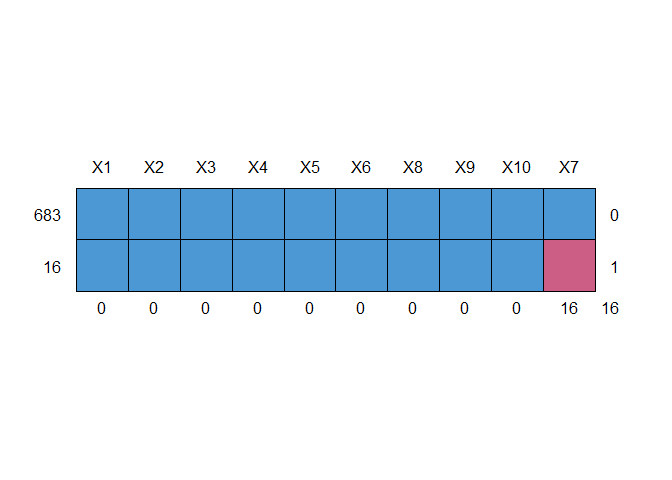
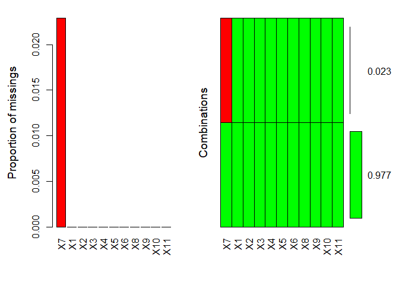

------------------------------------------------------------------------

title: “Introduction to Statistical Modeling - Assignment 6” author:
“Don Smith” output: github_document

------------------------------------------------------------------------

## Question 13.2

##### **In this problem you, can simulate a simplified airport security system at a busy airport. Passengers arrive according to a Poisson distribution with λ1 = 5 per minute (i.e., mean interarrival rate μ1 = 0.2 minutes) to the ID/boarding-pass check queue, where there are several servers who each have exponential service time with mean rate μ2 = 0.75 minutes. \[Hint: model them as one block that has more than one resource.\] After that, the passengers are assigned to the shortest of the several personal-check queues, where they go through the personal scanner (time is uniformly distributed between 0.5 minutes and 1 minute).**

##### **Use the Arena software (PC users) or Python with SimPy (PC or Mac users) to build a simulation of the system, and then vary the number of ID/boarding-pass checkers and personal-check queues to determine how many are needed to keep average wait times below 15 minutes. \[If you’re using SimPy, or if you have access to a non-student version of Arena, you can use λ1 = 50 to simulate a busier airport.\]**

> ##### I used SimPy to generate my simulation. See separate file entitled [Assignment 6 - Question 13.2](https://link-url-here.org).

## Question 14.1

##### **The breast cancer data set breast-cancer-wisconsin.data.txt from <http://archive.ics.uci.edu/ml/machine-learning-databases/breast-cancer-wisconsin/> (description at <http://archive.ics.uci.edu/ml/datasets/Breast+Cancer+Wisconsin+%28Original%29> ) has missing values.**

##### **1. Use the mean/mode imputation method to impute values for the missing data.**

##### **2. Use regression to impute values for the missing data.**

##### **3. Use regression with perturbation to impute values for the missing data.**

##### **4. (Optional) Compare the results and quality of classification models (e.g., SVM, KNN) build using**

##### **(1) the data sets from questions 1,2,3;**

##### **(2) the data that remains after data points with missing values are removed; and**

##### **(3) the data set when a binary variable is introduced to indicate missing values.**

``` r
# Loading all packages needed for analysis

library(kernlab)
library(kknn)
library(dplyr)
```

    ## 
    ## Attaching package: 'dplyr'

    ## The following objects are masked from 'package:stats':
    ## 
    ##     filter, lag

    ## The following objects are masked from 'package:base':
    ## 
    ##     intersect, setdiff, setequal, union

``` r
library(readr)
library(rmarkdown)
library(tinytex)
library(knitr)
library(NbClust)
library(outliers)
library(nortest)
library(mice)
```

    ## 
    ## Attaching package: 'mice'

    ## The following object is masked from 'package:kernlab':
    ## 
    ##     convergence

    ## The following object is masked from 'package:stats':
    ## 
    ##     filter

    ## The following objects are masked from 'package:base':
    ## 
    ##     cbind, rbind

``` r
library(Mcomp)
```

    ## Loading required package: forecast

    ## Registered S3 method overwritten by 'quantmod':
    ##   method            from
    ##   as.zoo.data.frame zoo

``` r
library(DAAG)
library(caret)
```

    ## Loading required package: ggplot2

    ## 
    ## Attaching package: 'ggplot2'

    ## The following object is masked from 'package:kernlab':
    ## 
    ##     alpha

    ## Loading required package: lattice

    ## 
    ## Attaching package: 'caret'

    ## The following object is masked from 'package:kknn':
    ## 
    ##     contr.dummy

``` r
library(randomForest)
```

    ## randomForest 4.7-1.1

    ## Type rfNews() to see new features/changes/bug fixes.

    ## 
    ## Attaching package: 'randomForest'

    ## The following object is masked from 'package:ggplot2':
    ## 
    ##     margin

    ## The following object is masked from 'package:outliers':
    ## 
    ##     outlier

    ## The following object is masked from 'package:dplyr':
    ## 
    ##     combine

``` r
library(tree)
library(pROC)
```

    ## Type 'citation("pROC")' for a citation.

    ## 
    ## Attaching package: 'pROC'

    ## The following objects are masked from 'package:stats':
    ## 
    ##     cov, smooth, var

``` r
library(ggplot2)
library(VIM)
```

    ## Loading required package: colorspace

    ## 
    ## Attaching package: 'colorspace'

    ## The following object is masked from 'package:pROC':
    ## 
    ##     coords

    ## Loading required package: grid

    ## VIM is ready to use.

    ## Suggestions and bug-reports can be submitted at: https://github.com/statistikat/VIM/issues

    ## 
    ## Attaching package: 'VIM'

    ## The following object is masked from 'package:datasets':
    ## 
    ##     sleep

``` r
cancer_data = read_delim("C:\\Users\\Owner\\Documents\\Github\\r\\class assignments\\Introduction to Statistical Modeling\\Assignment 6\\data\\breast-cancer-wisconsin.data.txt", 
                       delim = ',',
                       col_names = F, na = c('?')) %>% 
        as.data.frame() %>% 
        mutate(X11 = ifelse(X11 == 2, 'Benign', 'Malignant'))
```

    ## Rows: 699 Columns: 11

    ## ── Column specification ────────────────────────────────────────────────────────
    ## Delimiter: ","
    ## dbl (11): X1, X2, X3, X4, X5, X6, X7, X8, X9, X10, X11
    ## 
    ## ℹ Use `spec()` to retrieve the full column specification for this data.
    ## ℹ Specify the column types or set `show_col_types = FALSE` to quiet this message.

``` r
head(cancer_data)
```

    ##        X1 X2 X3 X4 X5 X6 X7 X8 X9 X10       X11
    ## 1 1000025  5  1  1  1  2  1  3  1   1    Benign
    ## 2 1002945  5  4  4  5  7 10  3  2   1    Benign
    ## 3 1015425  3  1  1  1  2  2  3  1   1    Benign
    ## 4 1016277  6  8  8  1  3  4  3  7   1    Benign
    ## 5 1017023  4  1  1  3  2  1  3  1   1    Benign
    ## 6 1017122  8 10 10  8  7 10  9  7   1 Malignant

``` r
# Statistical summary of data

summary(cancer_data)
```

    ##        X1                 X2               X3               X4        
    ##  Min.   :   61634   Min.   : 1.000   Min.   : 1.000   Min.   : 1.000  
    ##  1st Qu.:  870688   1st Qu.: 2.000   1st Qu.: 1.000   1st Qu.: 1.000  
    ##  Median : 1171710   Median : 4.000   Median : 1.000   Median : 1.000  
    ##  Mean   : 1071704   Mean   : 4.418   Mean   : 3.134   Mean   : 3.207  
    ##  3rd Qu.: 1238298   3rd Qu.: 6.000   3rd Qu.: 5.000   3rd Qu.: 5.000  
    ##  Max.   :13454352   Max.   :10.000   Max.   :10.000   Max.   :10.000  
    ##                                                                       
    ##        X5               X6               X7               X8        
    ##  Min.   : 1.000   Min.   : 1.000   Min.   : 1.000   Min.   : 1.000  
    ##  1st Qu.: 1.000   1st Qu.: 2.000   1st Qu.: 1.000   1st Qu.: 2.000  
    ##  Median : 1.000   Median : 2.000   Median : 1.000   Median : 3.000  
    ##  Mean   : 2.807   Mean   : 3.216   Mean   : 3.545   Mean   : 3.438  
    ##  3rd Qu.: 4.000   3rd Qu.: 4.000   3rd Qu.: 6.000   3rd Qu.: 5.000  
    ##  Max.   :10.000   Max.   :10.000   Max.   :10.000   Max.   :10.000  
    ##                                    NA's   :16                       
    ##        X9              X10             X11           
    ##  Min.   : 1.000   Min.   : 1.000   Length:699        
    ##  1st Qu.: 1.000   1st Qu.: 1.000   Class :character  
    ##  Median : 1.000   Median : 1.000   Mode  :character  
    ##  Mean   : 2.867   Mean   : 1.589                     
    ##  3rd Qu.: 4.000   3rd Qu.: 1.000                     
    ##  Max.   :10.000   Max.   :10.000                     
    ## 

``` r
# Will use mice() function to locate column with missing data and render visually 

missing_print <- md.pattern(cancer_data[,-11])
```

<!-- -->

``` r
print(missing_print)
```

    ##     X1 X2 X3 X4 X5 X6 X8 X9 X10 X7   
    ## 683  1  1  1  1  1  1  1  1   1  1  0
    ## 16   1  1  1  1  1  1  1  1   1  0  1
    ##      0  0  0  0  0  0  0  0   0 16 16

``` r
# Looks like V7 has missing values.
```

``` r
# Plotting the missing data

plot_missing_values <- aggr(cancer_data, col = c('green', 'red'), numbers = TRUE, sortVars = TRUE)
```

<!-- -->

    ## 
    ##  Variables sorted by number of missings: 
    ##  Variable      Count
    ##        X7 0.02288984
    ##        X1 0.00000000
    ##        X2 0.00000000
    ##        X3 0.00000000
    ##        X4 0.00000000
    ##        X5 0.00000000
    ##        X6 0.00000000
    ##        X8 0.00000000
    ##        X9 0.00000000
    ##       X10 0.00000000
    ##       X11 0.00000000

``` r
# Using seed to generate reproducible results

set.seed(4233)

# Will use mice() function to do mean imputation

cancer_data_mean_impute <- mice(cancer_data, m = 5, meth = 'mean')
```

    ## 
    ##  iter imp variable
    ##   1   1  X7
    ##   1   2  X7
    ##   1   3  X7
    ##   1   4  X7
    ##   1   5  X7
    ##   2   1  X7
    ##   2   2  X7
    ##   2   3  X7
    ##   2   4  X7
    ##   2   5  X7
    ##   3   1  X7
    ##   3   2  X7
    ##   3   3  X7
    ##   3   4  X7
    ##   3   5  X7
    ##   4   1  X7
    ##   4   2  X7
    ##   4   3  X7
    ##   4   4  X7
    ##   4   5  X7
    ##   5   1  X7
    ##   5   2  X7
    ##   5   3  X7
    ##   5   4  X7
    ##   5   5  X7

    ## Warning: Number of logged events: 1

``` r
print(cancer_data_mean_impute$imp)
```

    ## $X1
    ## [1] 1 2 3 4 5
    ## <0 rows> (or 0-length row.names)
    ## 
    ## $X2
    ## [1] 1 2 3 4 5
    ## <0 rows> (or 0-length row.names)
    ## 
    ## $X3
    ## [1] 1 2 3 4 5
    ## <0 rows> (or 0-length row.names)
    ## 
    ## $X4
    ## [1] 1 2 3 4 5
    ## <0 rows> (or 0-length row.names)
    ## 
    ## $X5
    ## [1] 1 2 3 4 5
    ## <0 rows> (or 0-length row.names)
    ## 
    ## $X6
    ## [1] 1 2 3 4 5
    ## <0 rows> (or 0-length row.names)
    ## 
    ## $X7
    ##            1        2        3        4        5
    ## 24  3.544656 3.544656 3.544656 3.544656 3.544656
    ## 41  3.544656 3.544656 3.544656 3.544656 3.544656
    ## 140 3.544656 3.544656 3.544656 3.544656 3.544656
    ## 146 3.544656 3.544656 3.544656 3.544656 3.544656
    ## 159 3.544656 3.544656 3.544656 3.544656 3.544656
    ## 165 3.544656 3.544656 3.544656 3.544656 3.544656
    ## 236 3.544656 3.544656 3.544656 3.544656 3.544656
    ## 250 3.544656 3.544656 3.544656 3.544656 3.544656
    ## 276 3.544656 3.544656 3.544656 3.544656 3.544656
    ## 293 3.544656 3.544656 3.544656 3.544656 3.544656
    ## 295 3.544656 3.544656 3.544656 3.544656 3.544656
    ## 298 3.544656 3.544656 3.544656 3.544656 3.544656
    ## 316 3.544656 3.544656 3.544656 3.544656 3.544656
    ## 322 3.544656 3.544656 3.544656 3.544656 3.544656
    ## 412 3.544656 3.544656 3.544656 3.544656 3.544656
    ## 618 3.544656 3.544656 3.544656 3.544656 3.544656
    ## 
    ## $X8
    ## [1] 1 2 3 4 5
    ## <0 rows> (or 0-length row.names)
    ## 
    ## $X9
    ## [1] 1 2 3 4 5
    ## <0 rows> (or 0-length row.names)
    ## 
    ## $X10
    ## [1] 1 2 3 4 5
    ## <0 rows> (or 0-length row.names)
    ## 
    ## $X11
    ## [1] 1 2 3 4 5
    ## <0 rows> (or 0-length row.names)

``` r
# Using seed to generate reproducible results

set.seed(4233)

# Will impute missing data points using mice() function. Using 'norm.predict', or the linear regression, predicted values method for this

cancer_data_regression_impute <- mice(cancer_data, m = 5, meth = 'norm.predict')
```

    ## 
    ##  iter imp variable
    ##   1   1  X7
    ##   1   2  X7
    ##   1   3  X7
    ##   1   4  X7
    ##   1   5  X7
    ##   2   1  X7
    ##   2   2  X7
    ##   2   3  X7
    ##   2   4  X7
    ##   2   5  X7
    ##   3   1  X7
    ##   3   2  X7
    ##   3   3  X7
    ##   3   4  X7
    ##   3   5  X7
    ##   4   1  X7
    ##   4   2  X7
    ##   4   3  X7
    ##   4   4  X7
    ##   4   5  X7
    ##   5   1  X7
    ##   5   2  X7
    ##   5   3  X7
    ##   5   4  X7
    ##   5   5  X7

    ## Warning: Number of logged events: 1

``` r
print(cancer_data_regression_impute$imp)
```

    ## $X1
    ## [1] 1 2 3 4 5
    ## <0 rows> (or 0-length row.names)
    ## 
    ## $X2
    ## [1] 1 2 3 4 5
    ## <0 rows> (or 0-length row.names)
    ## 
    ## $X3
    ## [1] 1 2 3 4 5
    ## <0 rows> (or 0-length row.names)
    ## 
    ## $X4
    ## [1] 1 2 3 4 5
    ## <0 rows> (or 0-length row.names)
    ## 
    ## $X5
    ## [1] 1 2 3 4 5
    ## <0 rows> (or 0-length row.names)
    ## 
    ## $X6
    ## [1] 1 2 3 4 5
    ## <0 rows> (or 0-length row.names)
    ## 
    ## $X7
    ##             1         2         3         4         5
    ## 24  5.3669508 5.3669508 5.3669508 5.3669508 5.3669508
    ## 41  8.1907122 8.1907122 8.1907122 8.1907122 8.1907122
    ## 140 0.8738591 0.8738591 0.8738591 0.8738591 0.8738591
    ## 146 1.6463893 1.6463893 1.6463893 1.6463893 1.6463893
    ## 159 1.0731978 1.0731978 1.0731978 1.0731978 1.0731978
    ## 165 2.1870186 2.1870186 2.1870186 2.1870186 2.1870186
    ## 236 2.7459168 2.7459168 2.7459168 2.7459168 2.7459168
    ## 250 2.0127161 2.0127161 2.0127161 2.0127161 2.0127161
    ## 276 2.3072038 2.3072038 2.3072038 2.3072038 2.3072038
    ## 293 5.9989744 5.9989744 5.9989744 5.9989744 5.9989744
    ## 295 1.1204527 1.1204527 1.1204527 1.1204527 1.1204527
    ## 298 2.6839366 2.6839366 2.6839366 2.6839366 2.6839366
    ## 316 5.6353059 5.6353059 5.6353059 5.6353059 5.6353059
    ## 322 1.8585015 1.8585015 1.8585015 1.8585015 1.8585015
    ## 412 0.8587684 0.8587684 0.8587684 0.8587684 0.8587684
    ## 618 0.5907393 0.5907393 0.5907393 0.5907393 0.5907393
    ## 
    ## $X8
    ## [1] 1 2 3 4 5
    ## <0 rows> (or 0-length row.names)
    ## 
    ## $X9
    ## [1] 1 2 3 4 5
    ## <0 rows> (or 0-length row.names)
    ## 
    ## $X10
    ## [1] 1 2 3 4 5
    ## <0 rows> (or 0-length row.names)
    ## 
    ## $X11
    ## [1] 1 2 3 4 5
    ## <0 rows> (or 0-length row.names)

``` r
# Using seed to generate reproducible results

set.seed(4233)

# Will impute missing data points using mice() function. Using 'norm.nob', to do perturbation imputation

cancer_data_pertubation_impute <- mice(cancer_data, m = 5, meth = 'norm.nob')
```

    ## 
    ##  iter imp variable
    ##   1   1  X7
    ##   1   2  X7
    ##   1   3  X7
    ##   1   4  X7
    ##   1   5  X7
    ##   2   1  X7
    ##   2   2  X7
    ##   2   3  X7
    ##   2   4  X7
    ##   2   5  X7
    ##   3   1  X7
    ##   3   2  X7
    ##   3   3  X7
    ##   3   4  X7
    ##   3   5  X7
    ##   4   1  X7
    ##   4   2  X7
    ##   4   3  X7
    ##   4   4  X7
    ##   4   5  X7
    ##   5   1  X7
    ##   5   2  X7
    ##   5   3  X7
    ##   5   4  X7
    ##   5   5  X7

    ## Warning: Number of logged events: 1

``` r
print(cancer_data_pertubation_impute$imp)
```

    ## $X1
    ## [1] 1 2 3 4 5
    ## <0 rows> (or 0-length row.names)
    ## 
    ## $X2
    ## [1] 1 2 3 4 5
    ## <0 rows> (or 0-length row.names)
    ## 
    ## $X3
    ## [1] 1 2 3 4 5
    ## <0 rows> (or 0-length row.names)
    ## 
    ## $X4
    ## [1] 1 2 3 4 5
    ## <0 rows> (or 0-length row.names)
    ## 
    ## $X5
    ## [1] 1 2 3 4 5
    ## <0 rows> (or 0-length row.names)
    ## 
    ## $X6
    ## [1] 1 2 3 4 5
    ## <0 rows> (or 0-length row.names)
    ## 
    ## $X7
    ##              1          2          3          4          5
    ## 24   4.6031025  6.6368141  5.6730810  5.6708725  4.6438547
    ## 41   5.5228478 12.2852329 10.4804785  5.5812874  8.4335606
    ## 140  2.0254785  0.5478286  3.9628876  2.4350606  1.9277588
    ## 146  5.4432909  2.3895868  5.0512551 -1.2914454  0.8849607
    ## 159 -3.3958492  4.2840614  2.8351512 -3.2718791 -1.4679206
    ## 165  0.1682913  5.0913729  4.9155055  4.9031850  1.1556263
    ## 236  3.4532778  2.4493562  4.0880162 -3.2558182  5.9482009
    ## 250  0.1122240  4.4230888  1.9844555  0.7095790 -0.9963461
    ## 276  7.8621449  3.8671193  1.8515540  4.8486596  5.2817276
    ## 293  9.1140276  2.6602120  7.0356576  5.7049691  2.9822269
    ## 295 -0.5726776 -2.3734989  0.3425826  4.5154603 -1.3441935
    ## 298  2.6315132  4.3242930  2.4042744  1.4555817  1.0278731
    ## 316  3.6970975  9.8868575  7.8733604  6.9540463  2.5772021
    ## 322  1.7903554  3.2221268  5.8564629  0.7059362  6.4622843
    ## 412  2.1054285  5.8782825 -0.2570610 -3.0065436 -0.3050579
    ## 618  2.3343663  0.9027535 -0.9272567  2.3429863  0.4743681
    ## 
    ## $X8
    ## [1] 1 2 3 4 5
    ## <0 rows> (or 0-length row.names)
    ## 
    ## $X9
    ## [1] 1 2 3 4 5
    ## <0 rows> (or 0-length row.names)
    ## 
    ## $X10
    ## [1] 1 2 3 4 5
    ## <0 rows> (or 0-length row.names)
    ## 
    ## $X11
    ## [1] 1 2 3 4 5
    ## <0 rows> (or 0-length row.names)

``` r
# Converting implicit missing values into explicit missing values with the complete() function for all three imputations

cancer_mean_impute <- complete(cancer_data_mean_impute)

cancer_regression_impute <- complete(cancer_data_regression_impute)

cancer_pertubation_impute <- complete(cancer_data_pertubation_impute)
```

``` r
# Will create list containing datasets, and use random forest method to compare cross validation accuracy of each model

cancer_data_sets = list(cancer_data, cancer_mean_impute, cancer_regression_impute, cancer_pertubation_impute)

# Created list to contain accuracy outputs after iteration

cancer_final_val_output = list(no_imputation = NULL, mean_imputation = NULL, regression_imputation = NULL,
                    pertubation_imputation = NULL)
```

``` r
# Using training method, will iterate loop to fit each model via the random forest method, then print accuracy percentages for each and load into "list" cancer_final_val_output" list above

for (i in seq_along(cancer_data_sets)) {
        
        df = cancer_data_sets[[i]]
        
        # Using seed to generate reproducible results

        set.seed(4233)
        
        # Classification results
        
        in_td <- createDataPartition(df$X11, p = .75, list = FALSE)
        
        # Splitting data for training and test datasets
        
        train <- df[in_td , ] %>% na.omit()
        test <- df[-in_td ,] %>% na.omit()
        
        # Fitting model
        cancer_model_fit <- train(
                X11 ~ ., 
                method = 'rf',
                data = train, 
                metric = 'Accuracy',
                trControl = trainControl(
                        method = 'cv', 
                        number = 10
                )
                )
        
        cancer_final_val_output[[i]] = cancer_model_fit
        
}
```

``` r
# Print and view the results of each model and compare cross validation accuracy of each output

no_imp <- cancer_final_val_output$no_imputation$finalModel
mean_imp <- cancer_final_val_output$mean_imputation$finalModel
regress_imp <- cancer_final_val_output$regression_imputation$finalModel
pert_imp <- cancer_final_val_output$pertubation_imputation$finalModel

print(no_imp)
```

    ## 
    ## Call:
    ##  randomForest(x = x, y = y, mtry = param$mtry) 
    ##                Type of random forest: classification
    ##                      Number of trees: 500
    ## No. of variables tried at each split: 2
    ## 
    ##         OOB estimate of  error rate: 2.53%
    ## Confusion matrix:
    ##           Benign Malignant class.error
    ## Benign       327         8  0.02388060
    ## Malignant      5       174  0.02793296

``` r
print(mean_imp)
```

    ## 
    ## Call:
    ##  randomForest(x = x, y = y, mtry = param$mtry) 
    ##                Type of random forest: classification
    ##                      Number of trees: 500
    ## No. of variables tried at each split: 2
    ## 
    ##         OOB estimate of  error rate: 2.86%
    ## Confusion matrix:
    ##           Benign Malignant class.error
    ## Benign       335         9  0.02616279
    ## Malignant      6       175  0.03314917

``` r
print(regress_imp)
```

    ## 
    ## Call:
    ##  randomForest(x = x, y = y, mtry = param$mtry) 
    ##                Type of random forest: classification
    ##                      Number of trees: 500
    ## No. of variables tried at each split: 2
    ## 
    ##         OOB estimate of  error rate: 2.67%
    ## Confusion matrix:
    ##           Benign Malignant class.error
    ## Benign       335         9  0.02616279
    ## Malignant      5       176  0.02762431

``` r
print(pert_imp)
```

    ## 
    ## Call:
    ##  randomForest(x = x, y = y, mtry = param$mtry) 
    ##                Type of random forest: classification
    ##                      Number of trees: 500
    ## No. of variables tried at each split: 2
    ## 
    ##         OOB estimate of  error rate: 2.67%
    ## Confusion matrix:
    ##           Benign Malignant class.error
    ## Benign       335         9  0.02616279
    ## Malignant      5       176  0.02762431

## Question 15.1

##### **Describe a situation or problem from your job, everyday life, current events, etc., for which optimization would be appropriate. What data would you need?**

> ##### At Fitbit, optimization can be used to determine how many customer support advocates we need at a given time during the day. For example, studies have shown that most people contact support between 11am and 1pm, which is when most people are on their lunch breaks, and between 4:30pm and 7pm when most people are getting off work. We can use optimization to determine the exact budget and the number of advocates we should have available relative to call volume at those particular times during the day. The data we would need is daily, weekly and monthly call/chat/email contact volume, along with customer representative schedules and salaries.
